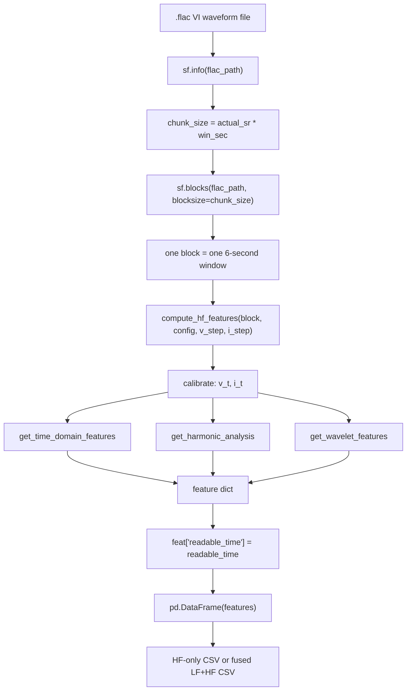
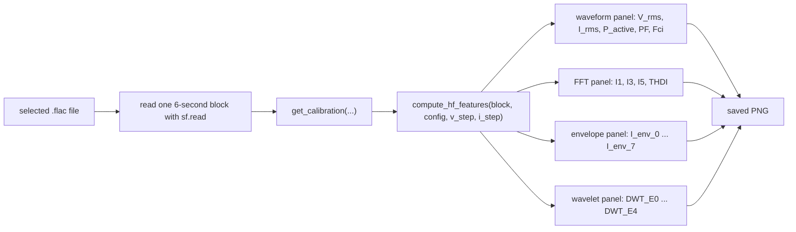

# NILM High-Frequency Feature Engine Reference

This document is the mathematical and implementation reference for `hf_feature.py`.
It is written in a thesis/report style so that the extracted high-frequency features can be described rigorously and safely.

Important interpretation rule:

> The time-domain quantities are standard electrical quantities. The FFT, band-energy, envelope, and wavelet quantities are high-frequency signal descriptors for machine learning; they should not all be interpreted as exact physical power quantities.

---

## 1. Theory

### 1.1 Signal Definition

Let one high-frequency observation window contain calibrated voltage and current samples:

$$
\mathbf{v} = \{v[n]\}_{n=0}^{N-1}, \qquad
\mathbf{i} = \{i[n]\}_{n=0}^{N-1}.
$$

For UK-DALE 16 kHz waveform data, the default settings are:

$$
f_s = 16000\ \mathrm{Hz}, \qquad
T_w = 6\ \mathrm{s}, \qquad
N = f_s T_w = 96000.
$$

The feature extractor maps the raw waveform block into a scalar feature vector:

$$
\phi(\mathbf{v}, \mathbf{i})
=
\left[
\phi_{\mathrm{time}},
\phi_{\mathrm{freq}},
\phi_{\mathrm{tf}}
\right].
$$

where:

* $\phi_{\mathrm{time}}$ contains time-domain electrical and statistical features.
* $\phi_{\mathrm{freq}}$ contains FFT-based harmonic, distortion, band-energy, entropy, and envelope descriptors.
* $\phi_{\mathrm{tf}}$ contains wavelet time-frequency energy descriptors.

### 1.2 Design Motivation

The extractor is designed for real NILM data, where:

* the mains frequency may drift around 50 Hz,
* waveform windows may not start at cycle boundaries,
* aggregate current contains multiple appliance signatures,
* robust descriptors are more useful for downstream learning than overly strict idealized assumptions.

Therefore, harmonic features are computed by integrating a small frequency band around each harmonic rather than using only one FFT bin.

---

## 2. Code

### 2.1 Main Feature Orchestrator

The code first converts raw ADC samples into calibrated voltage and current:

$$
v[n] = x_v[n] \cdot 2^{31} \cdot \Delta_v,
\qquad
i[n] = x_i[n] \cdot 2^{31} \cdot \Delta_i,
$$

where:

* $x_v[n]$ and $x_i[n]$ are raw audio samples from the selected voltage/current channels,
* $\Delta_v$ is `volts_per_adc_step`,
* $\Delta_i$ is `amps_per_adc_step`.

Implemented in `compute_hf_features`:

```python
v_t = block[:, v_idx] * ADC_SCALE * v_step
i_t = block[:, i_idx] * ADC_SCALE * i_step
```

The feature extraction pipeline is:

```python
res = {}
res.update(get_time_domain_features(v_t, i_t, config))
res.update(get_harmonic_analysis(v_t, i_t, config))
res.update(get_wavelet_features(i_t, config['features_to_extract']))
```

### 2.2 Code-to-Feature Map

| Function | Mathematical role | Output examples |
| :--- | :--- | :--- |
| `get_time_domain_features` | Time-domain electrical/statistical mapping $\phi_{\mathrm{time}}$ | `V_rms`, `I_rms`, `P_active`, `PF`, `Fci` |
| `get_harmonic_analysis` | FFT-domain mapping $\phi_{\mathrm{freq}}$ | `I1`, `THDI`, `I_BP_low`, `I_spec_entropy`, `I_env_0` |
| `get_wavelet_features` | DWT time-frequency mapping $\phi_{\mathrm{tf}}$ | `DWT_E0`, ..., `DWT_E4` |

---

## 3. Math Behind

### 3.1 Time-Domain Electrical Quantities

#### 3.1.1 RMS Voltage and Current

For a discrete signal $x[n]$, the RMS value is:

$$
X_{\mathrm{rms}}
=
\sqrt{
\frac{1}{N}
\sum_{n=0}^{N-1} x[n]^2
}.
$$

Therefore:

$$
V_{\mathrm{rms}}
=
\sqrt{
\frac{1}{N}
\sum_{n=0}^{N-1} v[n]^2
},
\qquad
I_{\mathrm{rms}}
=
\sqrt{
\frac{1}{N}
\sum_{n=0}^{N-1} i[n]^2
}.
$$

Code:

```python
v_rms = float(np.sqrt(np.mean(v_t ** 2)))
i_rms = float(np.sqrt(np.mean(i_t ** 2)))
```

#### 3.1.2 Instantaneous and Active Power

Instantaneous power is:

$$
p[n] = v[n]i[n].
$$

Active power over the window is the sample mean:

$$
P
=
\frac{1}{N}
\sum_{n=0}^{N-1} p[n]
=
\frac{1}{N}
\sum_{n=0}^{N-1} v[n]i[n].
$$

Code:

```python
p_active = float(np.mean(v_t * i_t))
```

#### 3.1.3 Apparent Power

The apparent power descriptor is:

$$
S = V_{\mathrm{rms}} I_{\mathrm{rms}}.
$$

Code:

```python
s_apparent = float(v_rms * i_rms)
```

#### 3.1.4 Power Factor

The power factor descriptor is:

$$
\mathrm{PF}
=
\frac{P}{S + \varepsilon},
$$

where $\varepsilon = 10^{-9}$ is used for numerical stability.

Code:

```python
pf = float(p_active / (s_apparent + 1e-9))
```

Interpretation note:

$$
\mathrm{PF} < 0
$$

can occur if the current polarity is reversed by the measurement chain. This is a sign convention issue, not necessarily a formula error.

#### 3.1.5 Crest Factor

For signal $x[n]$, crest factor is:

$$
\mathrm{CF}_x
=
\frac{\max_n |x[n]|}{X_{\mathrm{rms}} + \varepsilon}.
$$

Thus:

$$
\mathrm{Fcv}
=
\frac{\max_n |v[n]|}{V_{\mathrm{rms}} + \varepsilon},
\qquad
\mathrm{Fci}
=
\frac{\max_n |i[n]|}{I_{\mathrm{rms}} + \varepsilon}.
$$

Code:

```python
fcv = float(np.max(np.abs(v_t)) / (v_rms + 1e-9))
fci = float(np.max(np.abs(i_t)) / (i_rms + 1e-9))
```

#### 3.1.6 Shape Statistics

Let:

$$
\mu_x = \frac{1}{N}\sum_{n=0}^{N-1} x[n],
\qquad
\sigma_x =
\sqrt{
\frac{1}{N}
\sum_{n=0}^{N-1} (x[n] - \mu_x)^2
}.
$$

Skewness is:

$$
\operatorname{skew}(x)
=
\frac{1}{N}
\sum_{n=0}^{N-1}
\left(
\frac{x[n] - \mu_x}{\sigma_x + \varepsilon}
\right)^3.
$$

Excess kurtosis is:

$$
\operatorname{kurt}(x)
=
\frac{1}{N}
\sum_{n=0}^{N-1}
\left(
\frac{x[n] - \mu_x}{\sigma_x + \varepsilon}
\right)^4
- 3.
$$

Code:

```python
res['I_skew'] = float(scipy_stats.skew(i_t))
res['I_kurt'] = float(scipy_stats.kurtosis(i_t))
res['V_skew'] = float(scipy_stats.skew(v_t))
```

---

### 3.2 Windowed FFT and RMS-Like Spectrum

Let $w[n]$ be the Hann window:

$$
w[n]
=
\frac{1}{2}
\left(
1 - \cos\frac{2\pi n}{N-1}
\right),
\qquad
0 \le n < N.
$$

The implementation uses coherent-gain normalization:

$$
\widetilde{w}[n]
=
\frac{w[n]}{\frac{1}{N}\sum_{m=0}^{N-1}w[m]}.
$$

The windowed voltage/current signals are:

$$
v_w[n] = v[n]\widetilde{w}[n],
\qquad
i_w[n] = i[n]\widetilde{w}[n].
$$

The one-sided real FFT is:

$$
V[k] = \operatorname{rFFT}\{v_w[n]\},
\qquad
I[k] = \operatorname{rFFT}\{i_w[n]\}.
$$

The corresponding frequency of bin $k$ is:

$$
f_k = \frac{k f_s}{N}.
$$

The code forms an RMS-like one-sided amplitude spectrum:

$$
A_v[k]
=
\frac{2}{N\sqrt{2}} |V[k]|,
\qquad
A_i[k]
=
\frac{2}{N\sqrt{2}} |I[k]|.
$$

Code:

```python
window = np.hanning(N)
window_norm = window / (window.sum() / N)

v_fft = np.fft.rfft(v_t * window_norm)
i_fft = np.fft.rfft(i_t * window_norm)

v_amp = (np.abs(v_fft) * (2.0 / N)) / np.sqrt(2)
i_amp = (np.abs(i_fft) * (2.0 / N)) / np.sqrt(2)
```

Technical note:

> This normalization is appropriate for robust sinusoidal amplitude descriptors. It should not be described as an exact Parseval-preserving decomposition of total waveform energy after Hann windowing.

---

### 3.3 Band-Integrated Harmonic Descriptors

Let the nominal mains frequency be:

$$
f_0 = 50\ \mathrm{Hz}.
$$

For each configured harmonic order:

$$
k \in \mathcal{K},
\qquad
\mathcal{K} = \{1,3,5,7,9,11,13,15\},
$$

the target harmonic frequency is:

$$
f_k^\star = kf_0.
$$

To tolerate grid-frequency drift and FFT leakage, a frequency band is used:

$$
\mathcal{B}_k
=
\left\{
r:
\left| f_r - kf_0 \right| \le B
\right\},
\qquad
B = 15\ \mathrm{Hz}.
$$

The current and voltage harmonic descriptors are:

$$
I_k^{(\mathrm{desc})}
=
\sqrt{
\sum_{r \in \mathcal{B}_k}
A_i[r]^2
},
\qquad
V_k^{(\mathrm{desc})}
=
\sqrt{
\sum_{r \in \mathcal{B}_k}
A_v[r]^2
}.
$$

Code:

```python
hz_bw = h_cfg.get('harmonic_band_hz', 15.0)
bin_bw = max(1, int(round(hz_bw / (fs / N))))

s_idx = max(0, bin_idx - bin_bw)
e_idx = min(len(i_amp), bin_idx + bin_bw + 1)

ik = float(np.sqrt(np.sum(i_amp[s_idx:e_idx] ** 2)))
vk = float(np.sqrt(np.sum(v_amp[s_idx:e_idx] ** 2)))
```

Correct wording:

> $I_k$ and $V_k$ are band-integrated RMS spectral descriptors around the $k$-th harmonic. They are not ideal single-bin harmonic coefficients.

---

### 3.4 Selected-Harmonic Distortion Descriptors

Let:

$$
\mathcal{K}_{H}
=
\mathcal{K} \setminus \{1\}.
$$

The aggregate selected harmonic magnitudes are:

$$
I_H
=
\sqrt{
\sum_{k \in \mathcal{K}_H}
\left(I_k^{(\mathrm{desc})}\right)^2
},
\qquad
V_H
=
\sqrt{
\sum_{k \in \mathcal{K}_H}
\left(V_k^{(\mathrm{desc})}\right)^2
}.
$$

The selected-harmonic THD descriptors are:

$$
\mathrm{THD}_I^{(\mathcal{K})}
=
\frac{I_H}{I_1^{(\mathrm{desc})} + \varepsilon},
\qquad
\mathrm{THD}_V^{(\mathcal{K})}
=
\frac{V_H}{V_1^{(\mathrm{desc})} + \varepsilon}.
$$

Code:

```python
if k >= 2:
    ih_sq += ik ** 2
    vh_sq += vk ** 2

ih_h = float(np.sqrt(ih_sq))
vh_h = float(np.sqrt(vh_sq))

f['THDI'] = float(ih_h / (i1_amp + 1e-9))
f['THDV'] = float(vh_h / (v1_amp + 1e-9))
```

Correct wording:

> `THDI` and `THDV` are selected-harmonic THD descriptors computed from the configured harmonic orders. With the current configuration, they use odd harmonics up to the 15th order and should not be described as full-spectrum THD.

---

### 3.5 Spectral Band-Energy Descriptors

Define broad spectral bands:

$$
\mathcal{L} = [50, 500)\ \mathrm{Hz},
\qquad
\mathcal{M} = [500, 2000)\ \mathrm{Hz},
\qquad
\mathcal{H} = [2000, 8000)\ \mathrm{Hz}.
$$

The current band-energy descriptors are:

$$
E_i(\mathcal{L})
=
\sum_{r: f_r \in \mathcal{L}} A_i[r]^2,
$$

$$
E_i(\mathcal{M})
=
\sum_{r: f_r \in \mathcal{M}} A_i[r]^2,
$$

$$
E_i(\mathcal{H})
=
\sum_{r: f_r \in \mathcal{H}} A_i[r]^2.
$$

The voltage low-band descriptor is:

$$
E_v(\mathcal{L})
=
\sum_{r: f_r \in \mathcal{L}} A_v[r]^2.
$$

Code:

```python
def _band_power(amp_spectrum, f_low, f_high):
    mask = (freqs >= f_low) & (freqs < f_high)
    return float(np.sum(amp_spectrum[mask] ** 2))
```

Correct wording:

> These are spectral band-energy descriptors. They are not active power and should not be interpreted in watts.

---

### 3.6 Spectral Entropy

For entropy, the spectrum is restricted to:

$$
\mathcal{F}_E = \{r: f_r \le 3000\ \mathrm{Hz}\}.
$$

Define normalized spectral energy:

$$
p_r
=
\frac{A_i[r]^2}
{\sum_{q \in \mathcal{F}_E} A_i[q]^2 + \varepsilon},
\qquad
r \in \mathcal{F}_E.
$$

The spectral entropy is:

$$
H_i
=
-
\sum_{r \in \mathcal{F}_E}
p_r \log(p_r + \varepsilon).
$$

Code:

```python
entropy_mask = freqs <= 3000
i_amp_sq_ent = i_amp[entropy_mask] ** 2
total_power_ent = i_amp_sq_ent.sum() + 1e-12
prob = i_amp_sq_ent / total_power_ent
prob = prob[prob > 0]
spec_entropy = float(-np.sum(prob * np.log(prob + 1e-12)))
```

Interpretation:

* Low entropy means the spectral energy is concentrated in a few components.
* High entropy means the spectral energy is spread across many components.

---

### 3.7 Log-Compressed Normalized Spectral Envelope

The implementation defines eight spectral envelope bands:

$$
\mathcal{E}_0=[0,100), \quad
\mathcal{E}_1=[100,200), \quad
\mathcal{E}_2=[200,400), \quad
\mathcal{E}_3=[400,800),
$$

$$
\mathcal{E}_4=[800,1600), \quad
\mathcal{E}_5=[1600,3200), \quad
\mathcal{E}_6=[3200,6400), \quad
\mathcal{E}_7=[6400,8000).
$$

For band $j$, the raw band energy is:

$$
E_j
=
\sum_{r: f_r \in \mathcal{E}_j}
A_i[r]^2.
$$

The log-compressed band value is:

$$
L_j = \log(1 + E_j).
$$

The normalized envelope descriptor is:

$$
\widehat{L}_j
=
\frac{L_j}
{\sum_{m=0}^{7} L_m + \varepsilon}.
$$

Code:

```python
energy = float(np.sum(band_amp ** 2))
f[f'I_env_{i}'] = float(np.log1p(energy))
...
f[k] = float(f[k] / env_total)
```

Correct wording:

> `I_env_0` to `I_env_7` are log-compressed normalized spectral-shape descriptors. Because logarithmic compression is applied before normalization, they are not pure energy ratios.

---

### 3.8 Wavelet Time-Frequency Energy

The implementation applies a level-4 discrete wavelet transform (DWT) using the Daubechies-4 wavelet:

$$
\{cA_4, cD_4, cD_3, cD_2, cD_1\}
=
\operatorname{DWT}_{\mathrm{db4},4}(\mathbf{i}).
$$

PyWavelets returns coefficients in this order:

$$
[cA_4, cD_4, cD_3, cD_2, cD_1].
$$

For coefficient vector $\mathbf{c}_j$ with length $N_j$, the wavelet energy descriptor is:

$$
E^{\mathrm{DWT}}_j
=
\frac{1}{N_j}
\sum_{n=0}^{N_j-1}
c_j[n]^2.
$$

Code:

```python
coeffs = pywt.wavedec(i_t, 'db4', level=cfg['levels'])
for i, c in enumerate(coeffs):
    f[f'DWT_E{i}'] = float(np.mean(np.square(c)))
```

For $f_s = 16000$ Hz, the approximate sub-band interpretation is:

| Feature | Coefficient | Approximate frequency range |
| :--- | :--- | :--- |
| `DWT_E0` | $cA_4$ | 0-500 Hz |
| `DWT_E1` | $cD_4$ | 500-1000 Hz |
| `DWT_E2` | $cD_3$ | 1000-2000 Hz |
| `DWT_E3` | $cD_2$ | 2000-4000 Hz |
| `DWT_E4` | $cD_1$ | 4000-8000 Hz |

Correct wording:

> The previous explanation that `DWT_E1` corresponded to $cD_1$ and 4-8 kHz was incorrect. The implementation is correct, but the coefficient order must follow PyWavelets: `[cA4, cD4, cD3, cD2, cD1]`.

---

## 4. Explanation

### 4.1 Correctness Summary

| Feature group | Mathematical status | Thesis-safe interpretation |
| :--- | :--- | :--- |
| RMS, active power, apparent power, PF, crest factor | Standard formulas | Electrical quantities |
| Skewness, kurtosis, standard deviation | Standard statistical formulas | Waveform morphology descriptors |
| Harmonics | Correct band-integration implementation | Robust harmonic RMS descriptors |
| `THDI`, `THDV` | Correct for configured harmonic set | Selected-harmonic THD descriptors |
| `I_BP_*`, `V_BP_low` | Correct spectral summation | Spectral band-energy descriptors |
| `I_spec_entropy` | Standard entropy formula | Spectral complexity descriptor |
| `I_env_*` | Correct log-compressed normalized envelope | Spectral-shape descriptor |
| `DWT_E*` | Correct mean squared coefficient energy | DWT sub-band energy descriptors |

### 4.2 Terms To Avoid

Avoid saying:

```text
I_BP_low is real power.
THDI is full-spectrum THD.
I_k is the exact kth harmonic coefficient.
DWT_E1 is D1 / 4-8 kHz.
```

Use instead:

```text
I_BP_low is a spectral band-energy descriptor.
THDI is selected-harmonic THD based on configured harmonic orders.
I_k is a band-integrated harmonic RMS descriptor.
DWT_E1 is cD4, approximately 500-1000 Hz at 16 kHz sampling.
```

### 4.3 Physical Meaning Behind Each Feature Group

The purpose of high-frequency NILM features is not only to estimate power. The features also describe how an appliance electrically interacts with the mains supply. Different circuit types leave different signatures in waveform shape, harmonic distortion, and transient energy.

#### 4.3.1 RMS and Active Power: Load Magnitude

`V_rms`, `I_rms`, and `P_active` describe the basic operating magnitude of the load.

Physically:

$$
P = \frac{1}{N}\sum_{n=0}^{N-1} v[n]i[n]
$$

measures the average real energy conversion rate. For a resistive heating load, most electrical energy is converted directly into heat, so active power is highly informative.

Examples:

* Kettle: high `P_active`, high `I_rms`, usually stable during ON state.
* Fridge: lower average power, but with motor cycling behavior.
* Standby electronics: low power but may still show waveform distortion.

NILM value:

```text
These features separate large loads from small loads and help estimate appliance power.
```

#### 4.3.2 Apparent Power and Power Factor: Phase and Energy Conversion Quality

`S_apparent` measures the total RMS voltage-current product:

$$
S = V_{\mathrm{rms}}I_{\mathrm{rms}}.
$$

`PF` compares real power to apparent power:

$$
\mathrm{PF} = \frac{P}{S}.
$$

Physically:

* High PF means current is mostly aligned with voltage and energy is effectively converted into real work.
* Low PF can indicate reactive or nonlinear behavior.
* Inductive devices, such as motors, can shift current phase relative to voltage.
* Nonlinear electronics can distort current, reducing effective power factor.

Examples:

* Kettle/heater: PF usually close to 1.
* Motor/fridge compressor: PF can be lower due to inductive behavior.
* Switch-mode power supply: PF may be affected by nonlinear current draw.

NILM value:

```text
PF helps distinguish resistive, inductive, and nonlinear load behavior even when active power is similar.
```

#### 4.3.3 Crest Factor: Waveform Peakiness

Current crest factor is:

$$
\mathrm{Fci}
=
\frac{\max_n |i[n]|}{I_{\mathrm{rms}}}.
$$

For a pure sinusoid:

$$
\mathrm{Fci} \approx \sqrt{2} \approx 1.414.
$$

Physically:

* A high crest factor means current is drawn in sharp peaks.
* Many electronic devices draw current only near voltage peaks because of rectifiers and capacitors.
* Resistive loads tend to have near-sinusoidal current and lower crest factor.

Examples:

* Kettle: `Fci` often near 1.414.
* Laptop charger / TV / SMPS: `Fci` can be much higher.
* Devices with pulsed current: high `Fci`.

NILM value:

```text
Fci is useful for identifying nonlinear electronic loads and separating them from simple resistive loads.
```

#### 4.3.4 Skewness and Kurtosis: Waveform Asymmetry and Impulsiveness

Skewness measures asymmetry:

$$
\operatorname{skew}(i)
=
\frac{1}{N}
\sum_{n=0}^{N-1}
\left(
\frac{i[n]-\mu_i}{\sigma_i+\varepsilon}
\right)^3.
$$

Kurtosis measures peakedness or impulsiveness:

$$
\operatorname{kurt}(i)
=
\frac{1}{N}
\sum_{n=0}^{N-1}
\left(
\frac{i[n]-\mu_i}{\sigma_i+\varepsilon}
\right)^4
-3.
$$

Physically:

* High skewness suggests asymmetric waveform shape, which can appear in half-wave rectification or asymmetric conduction.
* High kurtosis suggests sharp spikes or impulsive current.

Examples:

* Smooth motor current: lower kurtosis.
* Switching electronics: higher kurtosis.
* Faulty or asymmetric conduction: skewness may increase.

NILM value:

```text
Shape statistics capture waveform morphology without requiring exact harmonic decomposition.
```

#### 4.3.5 Harmonics: Nonlinear Load Fingerprints

For an ideal linear sinusoidal load, most current energy is at the fundamental frequency:

$$
f_0 = 50\ \mathrm{Hz}.
$$

Nonlinear loads create harmonic components:

$$
3f_0,\ 5f_0,\ 7f_0,\ldots
$$

Physically:

* Odd harmonics are common in nonlinear single-phase loads.
* Rectifiers, power electronics, and SMPS devices often generate significant harmonic distortion.
* Motors and appliances with electronic controllers can have distinct harmonic signatures.

Examples:

* Kettle: dominant `I1`, weak higher harmonics.
* Microwave or SMPS: stronger `I3`, `I5`, `I7`.
* Motor-driven load: harmonic pattern may differ from purely resistive load.

NILM value:

```text
Harmonics act like a spectral fingerprint for appliance circuit topology.
```

#### 4.3.6 Selected-Harmonic THD: Distortion Summary

Selected-harmonic THD summarizes the amount of configured harmonic content relative to the fundamental:

$$
\mathrm{THD}_I^{(\mathcal{K})}
=
\frac{
\sqrt{\sum_{k\in\mathcal{K}_H} I_k^2}
}{
I_1+\varepsilon
}.
$$

Physically:

* Low THD means current is close to sinusoidal.
* High THD means current is distorted by nonlinear circuit behavior.

Examples:

* Heater/kettle: low `THDI`.
* Electronic power supply: high `THDI`.
* Motor with drive/control electronics: moderate or high `THDI`.

NILM value:

```text
THDI compresses multiple harmonic features into one distortion descriptor.
```

#### 4.3.7 Spectral Band Energy: Where the Frequency Energy Lives

Band-energy descriptors summarize current spectral energy in broad ranges:

$$
E_i([f_a,f_b))
=
\sum_{r:f_r\in[f_a,f_b)} A_i[r]^2.
$$

Physically:

* Low band energy captures fundamental and low harmonics.
* Mid band energy can capture motor commutation, control electronics, and switching residues.
* High band energy can capture sharper transients, switching noise, or high-frequency components.

Examples:

* Resistive load: energy concentrated in low band.
* SMPS: more mid/high band energy.
* Motor startup or switching events: increased higher-frequency content.

NILM value:

```text
Band energy gives a compact view of whether the appliance signature is low-frequency dominated or contains high-frequency distortion/transients.
```

#### 4.3.8 Spectral Entropy: Frequency Dispersion

Spectral entropy is:

$$
H_i
=
-
\sum_{r\in\mathcal{F}_E}
p_r \log(p_r+\varepsilon).
$$

Physically:

* Low entropy: spectral energy is concentrated in a small number of frequencies.
* High entropy: spectral energy is spread across many frequencies.

Examples:

* Pure sinusoidal current: low entropy.
* Distorted nonlinear current: higher entropy.
* Noisy switching behavior: higher entropy.

NILM value:

```text
Entropy captures spectral complexity without depending on any single harmonic.
```

#### 4.3.9 Spectral Envelope: Shape of the Spectrum

The spectral envelope stores normalized log-band values:

$$
\widehat{L}_j
=
\frac{\log(1+E_j)}
{\sum_{m=0}^{7}\log(1+E_m)+\varepsilon}.
$$

Physically:

* It describes the overall shape of the current spectrum.
* Normalization reduces dependence on total load magnitude.
* Log compression prevents the fundamental component from dominating all other bands.

Examples:

* Two devices may have similar power but different spectral envelopes.
* A heater and an electronic load may both consume hundreds of watts, but the electronic load has more high-frequency spectral content.

NILM value:

```text
The envelope is useful for classification because it captures spectral shape rather than only amplitude.
```

#### 4.3.10 Wavelet Energy: Transient and Time-Frequency Behavior

Wavelet energy features are:

$$
E^{\mathrm{DWT}}_j
=
\frac{1}{N_j}
\sum_{n=0}^{N_j-1} c_j[n]^2.
$$

Physically:

* Wavelets capture localized changes in time and frequency.
* High-frequency detail coefficients can respond to switching edges, startup transients, and abrupt waveform changes.
* Low-frequency approximation coefficients capture slower and more fundamental waveform structure.

Approximate interpretation at 16 kHz:

| Feature | Approximate band | Physical interpretation |
| :--- | :--- | :--- |
| `DWT_E0` | 0-500 Hz | fundamental and low-harmonic energy |
| `DWT_E1` | 500-1000 Hz | low transient/detail energy |
| `DWT_E2` | 1000-2000 Hz | mid transient/detail energy |
| `DWT_E3` | 2000-4000 Hz | high transient/detail energy |
| `DWT_E4` | 4000-8000 Hz | highest detail/switching energy |

Examples:

* Kettle steady operation: high low-frequency energy, weak high-detail energy.
* Fridge compressor startup: transient wavelet bands may increase.
* SMPS or switching electronics: higher-frequency DWT bands may be informative.

NILM value:

```text
Wavelet features help capture transient signatures that FFT-only features may smooth over.
```

---

## 5. Example

### 5.1 Pure Resistive Load

Assume an ideal resistive load:

$$
v(t) = 230\sqrt{2}\sin(2\pi 50t),
\qquad
i(t) = 1\sqrt{2}\sin(2\pi 50t).
$$

Expected time-domain quantities:

$$
V_{\mathrm{rms}} \approx 230\ \mathrm{V},
\qquad
I_{\mathrm{rms}} \approx 1\ \mathrm{A},
$$

$$
P \approx 230\ \mathrm{W},
\qquad
S \approx 230\ \mathrm{VA},
\qquad
\mathrm{PF} \approx 1.
$$

For a pure sinusoid:

$$
\mathrm{Fcv} \approx \sqrt{2},
\qquad
\mathrm{Fci} \approx \sqrt{2}.
$$

Expected spectral behavior:

$$
I_1 \gg I_3, I_5, \ldots, I_{15},
\qquad
\mathrm{THD}_I^{(\mathcal{K})} \approx 0.
$$

Most spectral energy should appear in the low-frequency region:

$$
E_i(\mathcal{L}) \gg E_i(\mathcal{M}), E_i(\mathcal{H}).
$$

Expected wavelet behavior:

$$
DWT\_E0 \text{ should dominate because most energy is below } 500\ \mathrm{Hz}.
$$

### 5.2 Nonlinear SMPS-Like Load

For a nonlinear switching power supply, current is often narrow, peaky, and distorted. A typical expected pattern is:

$$
\mathrm{Fci} > \sqrt{2},
$$

$$
I_3, I_5, I_7 \text{ may be significant},
\qquad
\mathrm{THD}_I^{(\mathcal{K})} \text{ may be high}.
$$

High-frequency descriptors may also increase:

$$
E_i(\mathcal{M}) \text{ or } E_i(\mathcal{H}) \uparrow,
\qquad
H_i \uparrow,
\qquad
DWT\_E3, DWT\_E4 \uparrow.
$$

### 5.3 Feature Selection Interpretation Example

If the selected feature set for a kettle is:

```text
P_active, I_rms, I1, PF, Fci
```

then the model mainly relies on magnitude and resistive-load behavior.

If the selected feature set for a fridge is:

```text
I3, THDI, I_BP_mid, DWT_E2, DWT_E3, I_spec_entropy
```

then the model relies more on harmonic distortion, motor/transient behavior, and spectral complexity.

---

## 6. Window-Level Worked Example and Visualization Guide

This section explains exactly how the current project splits a high-frequency `.flac` file into feature rows, where each calculation happens in code, and how each feature should be visually checked.

### 6.0 Visual First: What One Feature Row Means

One row in the HF feature CSV is not one raw sample. It is one 6-second waveform block compressed into many feature columns.

This is the real code logic:

```python
chunk_size = int(actual_sr * win_sec)

for block in sf.blocks(flac_path, blocksize=chunk_size):
    feat = compute_hf_features(block, config, v_step, i_step)
    feat['readable_time'] = readable_time
    features.append(feat)
```

For this project:

```text
actual_sr = 16000 Hz
win_sec   = 6 s
chunk_size = 16000 * 6 = 96000 samples
```

Visual view:

```text
Raw .flac waveform samples

sample index:
0                95999 96000             191999 192000
|--------------------| |--------------------| |---------
       Window 0               Window 1             Window 2
       6 seconds              6 seconds            6 seconds
       96000 samples          96000 samples        96000 samples

CSV rows:
Window 0 -> row 0 -> readable_time = start_unix + 0 * 6
Window 1 -> row 1 -> readable_time = start_unix + 1 * 6
Window 2 -> row 2 -> readable_time = start_unix + 2 * 6
```

So when you see one CSV row like:

```text
readable_time,V_rms,I_rms,P_active,PF,I1,I3,THDI,I_env_0,DWT_E0,...
2013-07-22 01:00:00,230.12,1.04,226.80,0.947,0.96,0.21,0.245,0.62,0.77,...
```

it means:

```text
All those numbers were calculated from the same 6-second calibrated
voltage/current waveform block.
```

### 6.0.1 Four-Panel Visualization Example

The new script:

```text
data_quality_checking/hf_feature_window_visualize.py
```

generates a figure with this layout for one real 6-second window:

```text
+------------------------------------------------+------------------------------------------------+
| Panel A: calibrated waveform                   | Panel B: current FFT spectrum                 |
|                                                |                                                |
| v_t from:                                      | i_amp from:                                    |
| block[:, v_idx] * ADC_SCALE * v_step           | np.fft.rfft(i_t * window_norm)                |
|                                                |                                                |
| i_t from:                                      | vertical markers at:                           |
| block[:, i_idx] * ADC_SCALE * i_step           | 50, 150, 250, ..., 750 Hz                      |
|                                                |                                                |
| reads: V_rms, I_rms, P_active, PF, Fci         | reads: I1, I3, I5, THDI                       |
+------------------------------------------------+------------------------------------------------+
| Panel C: spectral envelope                     | Panel D: wavelet energy                       |
|                                                |                                                |
| bars: I_env_0 ... I_env_7                      | bars: DWT_E0 ... DWT_E4                       |
|                                                |                                                |
| source: compute_hf_features(...)               | source: compute_hf_features(...)              |
|                                                |                                                |
| reads: low-frequency vs high-frequency shape   | reads: transient/switching band energy        |
+------------------------------------------------+------------------------------------------------+
```

This is based on the real project functions:

```text
Panel A uses the same calibration as compute_hf_features().
Panel B uses the same Hann-window FFT idea as get_harmonic_analysis().
Panel C directly plots I_env_0 ... I_env_7 returned by compute_hf_features().
Panel D directly plots DWT_E0 ... DWT_E4 returned by compute_hf_features().
```

Run example:

```powershell
python data_quality_checking/hf_feature_window_visualize.py `
  --flac dataset_preprocess/UK_DALE_16khz/house_2/2013/wk30/vi-1374451200_031484.flac `
  --window-index 0
```

Expected saved output:

```text
data_quality_checking/visualizations/hf_window_vi-1374451200_031484_w0000.png
```

### 6.0.2 How To Read the Visualization

Use this quick visual rule:

```text
Smooth sine-like current:

current waveform:      ~~~~~     ~~~~~     ~~~~~
FFT spectrum:          big 50 Hz peak, small harmonic peaks
envelope bars:         I_env_0 large, high-frequency bins small
DWT bars:              DWT_E0 large, DWT_E3/DWT_E4 small

Expected features:
Fci near 1.414
THDI low
I_BP_low high
DWT_E0 dominant
```

```text
Peaky nonlinear current:

current waveform:      |  |   |  |   |  |
FFT spectrum:          50 Hz + visible 150 Hz, 250 Hz, 350 Hz peaks
envelope bars:         mid/high frequency bins increase
DWT bars:              DWT_E2/DWT_E3/DWT_E4 may increase

Expected features:
Fci high
THDI high
I3/I5/I7 higher
I_BP_mid or I_BP_high higher
```

This is why the visualizer is useful: it lets you check whether the feature numbers make physical sense before using them for feature selection or model training.

### 6.0.3 Simple Numerical Example: How One 6-Second Row Is Calculated

In the real code, one timestep is 6 seconds:

```text
sampling_rate = 16000 Hz
window_size   = 6 s
N             = 16000 * 6 = 96000 samples
```

So the real calculation uses 96000 voltage values and 96000 current values:

```text
v_t = [v0, v1, v2, ..., v95999]
i_t = [i0, i1, i2, ..., i95999]
```

That is too many numbers to show by hand. So below is a tiny toy example using only 4 samples, just to show the arithmetic. The real code does exactly the same thing, but with 96000 samples.

Toy 6-second window idea:

```text
Voltage samples, v_t = [230, -230, 230, -230]
Current samples, i_t = [1, -1, 1, -1]
```

#### Example A: RMS Voltage and RMS Current

Code:

```python
v_rms = np.sqrt(np.mean(v_t ** 2))
i_rms = np.sqrt(np.mean(i_t ** 2))
```

Hand calculation:

```text
V_rms = sqrt(mean([230^2, (-230)^2, 230^2, (-230)^2]))
      = sqrt(mean([52900, 52900, 52900, 52900]))
      = sqrt(52900)
      = 230 V

I_rms = sqrt(mean([1^2, (-1)^2, 1^2, (-1)^2]))
      = sqrt(mean([1, 1, 1, 1]))
      = 1 A
```

Real 6-second version:

```text
Instead of 4 squared values, the code averages 96000 squared values.
```

Physical meaning:

```text
V_rms tells the effective voltage level.
I_rms tells the effective current level.
If appliance turns ON, I_rms usually increases.
```

#### Example B: Active Power

Code:

```python
p_active = np.mean(v_t * i_t)
```

Hand calculation:

```text
v_t * i_t = [
  230 * 1,
  -230 * -1,
  230 * 1,
  -230 * -1
]

= [230, 230, 230, 230]

P_active = mean([230, 230, 230, 230])
         = 230 W
```

Real 6-second version:

```text
The code multiplies voltage and current sample-by-sample for 96000 samples,
then takes the average.
```

Physical meaning:

```text
P_active is the real power consumed by the appliance/load.
For a heater/kettle-like resistive load, it is high and positive.
```

#### Example C: Apparent Power and Power Factor

Code:

```python
s_apparent = v_rms * i_rms
pf = p_active / (s_apparent + 1e-9)
```

Hand calculation:

```text
S_apparent = 230 * 1
           = 230 VA

PF = 230 / 230
   = 1.0
```

Physical meaning:

```text
PF near 1 means voltage and current are well aligned.
This is common for resistive appliances.
```

Now imagine a motor-like load with the same RMS values:

```text
V_rms = 230 V
I_rms = 1 A
P_active = 150 W

S_apparent = 230 * 1 = 230 VA
PF = 150 / 230 = 0.652
```

This means:

```text
The appliance draws current, but not all current contributes to real power.
This can happen because of phase shift or nonlinear current shape.
```

#### Example D: Crest Factor

Code:

```python
fci = np.max(np.abs(i_t)) / (i_rms + 1e-9)
```

Smooth current example:

```text
i_t = [1, -1, 1, -1]
I_rms = 1
max(abs(i_t)) = 1

Fci = 1 / 1 = 1
```

Peaky current example:

```text
i_t = [0, 0, 0, 4]

I_rms = sqrt(mean([0^2, 0^2, 0^2, 4^2]))
      = sqrt(16 / 4)
      = 2

max(abs(i_t)) = 4

Fci = 4 / 2 = 2
```

Physical meaning:

```text
Higher Fci means the current has sharper peaks.
This often appears in electronic devices with rectifiers or switching power supplies.
```

#### Example E: Harmonic Features and THDI

In real code, harmonic features are calculated from the FFT of the 6-second current waveform:

```python
i_fft = np.fft.rfft(i_t * window_norm)
i_amp = (np.abs(i_fft) * (2.0 / N)) / np.sqrt(2)
```

Then the code integrates energy around each harmonic:

```text
I1  = current magnitude around 50 Hz
I3  = current magnitude around 150 Hz
I5  = current magnitude around 250 Hz
I7  = current magnitude around 350 Hz
...
```

Simple numeric example:

```text
I1 = 1.00 A
I3 = 0.30 A
I5 = 0.10 A
I7 = 0.00 A
```

The non-fundamental harmonic current is:

```text
IH = sqrt(I3^2 + I5^2 + I7^2 + ...)
   = sqrt(0.30^2 + 0.10^2 + 0.00^2)
   = sqrt(0.09 + 0.01)
   = sqrt(0.10)
   = 0.316 A
```

Then:

```text
THDI = IH / I1
     = 0.316 / 1.00
     = 0.316
```

Interpretation:

```text
THDI = 0.316 means the selected harmonic distortion is about 31.6%
of the 50 Hz fundamental current.
```

Physical meaning:

```text
Low THDI:
    current is close to a clean sine wave.

High THDI:
    current is distorted, often because of nonlinear electronics,
    motors, rectifiers, or switching behaviour.
```

#### Example F: Band Power

The code calculates current spectral energy in broad frequency bands:

```text
I_BP_low  = energy from 50 Hz to 500 Hz
I_BP_mid  = energy from 500 Hz to 2000 Hz
I_BP_high = energy from 2000 Hz to 8000 Hz
```

Simple numeric example:

```text
I_BP_low  = 1.20
I_BP_mid  = 0.08
I_BP_high = 0.01
```

Interpretation:

```text
Most current energy is in low frequency.
This looks like a normal mains appliance with little high-frequency switching.
```

Another example:

```text
I_BP_low  = 1.20
I_BP_mid  = 0.55
I_BP_high = 0.30
```

Interpretation:

```text
The appliance has much more mid/high-frequency content.
This may indicate switching electronics, sharp current edges, or noise.
```

#### Example G: Spectral Envelope

The spectral envelope divides the current spectrum into 8 bands:

```text
I_env_0 = 0-100 Hz
I_env_1 = 100-200 Hz
I_env_2 = 200-400 Hz
I_env_3 = 400-800 Hz
I_env_4 = 800-1600 Hz
I_env_5 = 1600-3200 Hz
I_env_6 = 3200-6400 Hz
I_env_7 = 6400-8000 Hz
```

Example after normalization:

```text
I_env_0 = 0.70
I_env_1 = 0.15
I_env_2 = 0.08
I_env_3 = 0.04
I_env_4 = 0.02
I_env_5 = 0.01
I_env_6 = 0.00
I_env_7 = 0.00
```

Interpretation:

```text
The spectral shape is dominated by low frequency.
This is common for smoother loads.
```

More switching-like example:

```text
I_env_0 = 0.40
I_env_1 = 0.12
I_env_2 = 0.10
I_env_3 = 0.10
I_env_4 = 0.09
I_env_5 = 0.08
I_env_6 = 0.07
I_env_7 = 0.04
```

Interpretation:

```text
Energy shape is more spread across frequency.
This usually means the waveform contains sharper or more complex components.
```

#### Example H: Wavelet Energy

The code runs:

```python
coeffs = pywt.wavedec(i_t, 'db4', level=4)
for i, c in enumerate(coeffs):
    DWT_Ei = np.mean(c ** 2)
```

For 16 kHz sampling, the approximate meaning is:

```text
DWT_E0 = low-frequency part, about 0-500 Hz
DWT_E1 = about 500-1000 Hz
DWT_E2 = about 1000-2000 Hz
DWT_E3 = about 2000-4000 Hz
DWT_E4 = about 4000-8000 Hz
```

Smooth appliance example:

```text
DWT_E0 = 0.80
DWT_E1 = 0.05
DWT_E2 = 0.03
DWT_E3 = 0.01
DWT_E4 = 0.01
```

Interpretation:

```text
Most energy is low-frequency.
The current waveform is smooth.
```

Sharp/transient appliance example:

```text
DWT_E0 = 0.50
DWT_E1 = 0.10
DWT_E2 = 0.12
DWT_E3 = 0.15
DWT_E4 = 0.13
```

Interpretation:

```text
More energy appears in high-frequency wavelet bands.
The current may contain switching edges or transient events.
```

#### Example I: Final One-Row Interpretation

Suppose one real 6-second timestep produces:

```text
readable_time = 2013-07-22 01:00:00
V_rms         = 230.1
I_rms         = 1.04
P_active      = 226.8
S_apparent    = 239.3
PF            = 0.947
Fci           = 2.10
I1            = 0.96
I3            = 0.21
I5            = 0.10
THDI          = 0.245
I_BP_low      = 1.13
I_BP_mid      = 0.18
I_BP_high     = 0.04
DWT_E0        = 0.77
DWT_E3        = 0.06
DWT_E4        = 0.03
```

Readable explanation:

```text
This 6-second window has normal voltage, around 1 A current,
and about 227 W active power.

PF is high but not exactly 1, so the load is mostly real-power consuming
but may have phase shift or waveform distortion.

Fci = 2.10 is higher than a clean sine wave, so the current is somewhat peaky.

THDI = 0.245 means selected harmonic distortion is about 24.5%
of the fundamental current.

Most band/wavelet energy is still low-frequency, so it is not extremely
high-frequency noisy, but it is not a perfect resistive sine-wave load either.
```

### 6.1 Window Splitting in This Project

The extraction script uses the sampling rate from the audio file and the configured window length:

```python
actual_sr = info.samplerate
win_sec = config['hyperparameters']['window_size_seconds']
chunk_size = int(actual_sr * win_sec)
```

For the current UK-DALE high-frequency setting:

$$
f_s = 16000\ \mathrm{Hz},
\qquad
T_w = 6\ \mathrm{s}.
$$

Therefore, one feature window contains:

$$
N = f_sT_w = 16000 \times 6 = 96000\ \mathrm{samples}.
$$

Because UK mains frequency is approximately:

$$
f_0 = 50\ \mathrm{Hz},
$$

one electrical cycle is:

$$
T_0 = \frac{1}{50} = 0.02\ \mathrm{s}=20\ \mathrm{ms}.
$$

So one 6-second feature window contains approximately:

$$
\frac{6}{0.02}=300
$$

mains cycles. This is long enough to estimate stable RMS, power, harmonic, spectral, and wavelet descriptors.

In code, the split is performed by:

```python
for block in sf.blocks(flac_path, blocksize=chunk_size):
    current_unix = start_unix + (chunk_idx * win_sec)
    readable_time = decode_unix_time(current_unix, target_tz)
    feat = compute_hf_features(block, config, v_step, i_step)
    feat['readable_time'] = readable_time
```

Therefore, window \(j\) is:

$$
\mathcal{W}_j
=
\left\{
x[n]\mid jN \le n < (j+1)N
\right\}.
$$

Its timestamp is:

$$
t_j = t_{\mathrm{start}} + jT_w.
$$

Example:

```text
Sampling rate       = 16000 Hz
Window length       = 6 s
Samples per window  = 96000
Window 0 samples    = 0 ... 95999
Window 1 samples    = 96000 ... 191999
Window 2 samples    = 192000 ... 287999
```

If the `.flac` file starts at Unix time `1374451200`, then:

```text
row 0 readable_time = decode(1374451200)
row 1 readable_time = decode(1374451206)
row 2 readable_time = decode(1374451212)
```

Each row in the output CSV is one 6-second high-frequency summary.

### 6.2 Where the Calculation Happens

The extraction path is:

```text
high_frequency_data_extract.py
    -> sf.blocks(..., blocksize=chunk_size)
    -> compute_hf_features(block, config, v_step, i_step)
        -> get_time_domain_features(v_t, i_t, config)
        -> get_harmonic_analysis(v_t, i_t, config)
        -> get_wavelet_features(i_t, config['features_to_extract'])
    -> DataFrame(features)
    -> CSV output
```

The same flow can be drawn as a code-based flow chart:



This diagram is not conceptual only. Every node name corresponds to the real function or operation used in `high_frequency_data_extract.py` and `hf_feature.py`.

The calibration from stored audio value to physical units is applied inside `compute_hf_features`:

```python
v_t = block[:, v_idx] * ADC_SCALE * v_step
i_t = block[:, i_idx] * ADC_SCALE * i_step
```

Mathematically:

$$
v[n] = x_v[n]\cdot 2^{31}\cdot c_v,
\qquad
i[n] = x_i[n]\cdot 2^{31}\cdot c_i,
$$

where \(x_v[n]\) and \(x_i[n]\) are the normalized `.flac` samples, \(c_v\) is `volts_per_adc_step`, and \(c_i\) is `amps_per_adc_step`.

### 6.3 Example Output Row

After one 6-second block is processed, the CSV row conceptually looks like:

```text
readable_time,V_rms,I_rms,P_active,S_apparent,PF,Fci,I1,I3,THDI,I_BP_low,I_spec_entropy,DWT_E0,...
2013-07-22 01:00:00,230.12,1.04,226.80,239.32,0.947,2.10,0.96,0.21,0.245,1.13,2.85,0.77,...
```

Interpretation:

```text
This row summarizes the waveform from 2013-07-22 01:00:00
to 2013-07-22 01:00:06.
```

If the file is processed without LF fusion and `save_hf_csv=True`, the HF-only feature matrix is saved as:

```text
features_<flac_basename>.csv
```

If LF fusion is enabled, the fused appliance CSV is saved under:

```text
dataset_preprocess/high_frequency_data_extract/output/
```

with one row per aligned LF/HF timestamp.

### 6.4 Feature-by-Feature Calculation Example

Assume one 6-second window contains calibrated vectors:

$$
\mathbf{v}=[v[0],v[1],\ldots,v[N-1]],
\qquad
\mathbf{i}=[i[0],i[1],\ldots,i[N-1]],
\qquad
N=96000.
$$

For a simple reference load, suppose the current is almost sinusoidal:

$$
v(t)=230\sqrt{2}\sin(2\pi50t),
\qquad
i(t)=1\sqrt{2}\sin(2\pi50t).
$$

Then the expected feature behavior is:

| Feature column | Code location | How it is calculated in one 6 s window | Simple numerical expectation | What to see in visualization |
| :--- | :--- | :--- | :--- | :--- |
| `V_rms` | `get_time_domain_features` | $\sqrt{\frac{1}{N}\sum_n v[n]^2}$ | about `230 V` | Voltage waveform amplitude is stable; RMS is lower than the peak. |
| `I_rms` | `get_time_domain_features` | $\sqrt{\frac{1}{N}\sum_n i[n]^2}$ | about `1 A` | Current waveform magnitude increases when the appliance is ON. |
| `P_active` | `get_time_domain_features` | $\frac{1}{N}\sum_n v[n]i[n]$ | about `230 W` for a 1 A resistive load | If voltage and current have same phase, instantaneous power is mostly positive. |
| `S_apparent` | `get_time_domain_features` | $V_{\mathrm{rms}}I_{\mathrm{rms}}$ | about `230 VA` | Depends only on RMS voltage and RMS current, not phase. |
| `PF` | `get_time_domain_features` | $P/(S+\varepsilon)$ | about `1.0` for resistive load | Current aligns with voltage; phase shift is small. |
| `Fcv` | `get_time_domain_features` | $\max_n \lvert v[n]\rvert/(V_{\mathrm{rms}}+\varepsilon)$ | about `1.414` for sinusoidal voltage | Peak voltage is about $\sqrt{2}$ times RMS. |
| `Fci` | `get_time_domain_features` | $\max_n \lvert i[n]\rvert/(I_{\mathrm{rms}}+\varepsilon)$ | about `1.414` for sinusoidal current; larger for peaky SMPS current | Narrow current spikes give high crest factor. |
| `I_skew` | `get_time_domain_features` | `scipy_stats.skew(i_t)` | near `0` for symmetric AC current | Positive and negative half cycles are balanced. |
| `V_skew` | `get_time_domain_features` | `scipy_stats.skew(v_t)` | near `0` for symmetric AC voltage | Voltage sine wave is symmetric around zero. |
| `I_kurt` | `get_time_domain_features` | `scipy_stats.kurtosis(i_t)` | near sinusoidal baseline; higher for impulsive current | Spiky waveform produces high peakedness. |
| `I_std` | `get_time_domain_features` | $\sqrt{\frac{1}{N}\sum_n(i[n]-\mu_i)^2}$ | close to `I_rms` if current mean is near zero | Measures current spread around zero. |
| `V_std` | `get_time_domain_features` | $\sqrt{\frac{1}{N}\sum_n(v[n]-\mu_v)^2}$ | close to `V_rms` if voltage mean is near zero | Measures voltage spread around zero. |
| `I1`, `V1` | `get_harmonic_analysis` | RMS-like FFT magnitude integrated around 50 Hz | dominant for normal mains waveform | FFT plot has largest peak near 50 Hz. |
| `I3`, `I5`, ..., `I15` | `get_harmonic_analysis` | RMS-like FFT magnitude integrated around \(3f_0,5f_0,\ldots,15f_0\) | small for pure sinusoid; larger for nonlinear loads | FFT plot shows extra peaks at odd harmonics. |
| `V3`, `V5`, ..., `V15` | `get_harmonic_analysis` | same as current harmonics, but on voltage spectrum | usually smaller and more stable than current harmonics | Voltage spectrum is normally cleaner than current spectrum. |
| `IH` | `get_harmonic_analysis` | $\sqrt{\sum_{k\ge2} I_k^2}$ over selected harmonic orders | near `0` for pure sinusoid | Represents total selected non-fundamental current distortion. |
| `VH` | `get_harmonic_analysis` | $\sqrt{\sum_{k\ge2} V_k^2}$ over selected harmonic orders | usually small | Represents selected non-fundamental voltage distortion. |
| `THDI` | `get_harmonic_analysis` | $I_H/(I_1+\varepsilon)$ | near `0` for pure sinusoid | High when harmonic peaks are large compared with 50 Hz peak. |
| `THDV` | `get_harmonic_analysis` | $V_H/(V_1+\varepsilon)$ | usually low | High value may indicate voltage distortion or noisy measurement. |
| `I_BP_low` | `get_harmonic_analysis` | $\sum_{50\le f<500} A_i(f)^2$ | large for ordinary 50 Hz loads | Spectrum energy concentrated near fundamental and low harmonics. |
| `I_BP_mid` | `get_harmonic_analysis` | $\sum_{500\le f<2000} A_i(f)^2$ | low for simple resistive load | Increases with motor commutation, nonlinear distortion, or transients. |
| `I_BP_high` | `get_harmonic_analysis` | $\sum_{2000\le f<8000} A_i(f)^2$ | low for simple resistive load | Increases with fast switching or high-frequency noise. |
| `V_BP_low` | `get_harmonic_analysis` | $\sum_{50\le f<500} A_v(f)^2$ | usually dominant for voltage | Mostly tracks mains voltage energy. |
| `I_spec_entropy` | `get_harmonic_analysis` | $-\sum_r p_r\log(p_r+\varepsilon)$ for current spectrum up to 3000 Hz | lower when spectrum has only one/few peaks; higher when spread out | Spectrum with many active frequencies has higher entropy. |
| `I_env_0` ... `I_env_7` | `get_harmonic_analysis` | log energy in predefined frequency bands, then normalized by total envelope sum | low-frequency bins dominate for simple sinusoid | Bar chart shows spectral shape, not absolute current size. |
| `DWT_E0` | `get_wavelet_features` | mean squared energy of `cA4` | high for 50 Hz and low harmonics | Wavelet low-frequency bar dominates. |
| `DWT_E1` | `get_wavelet_features` | mean squared energy of `cD4`, approx. 500-1000 Hz | small for simple sinusoid | Rises when there is 500-1000 Hz transient content. |
| `DWT_E2` | `get_wavelet_features` | mean squared energy of `cD3`, approx. 1000-2000 Hz | small for simple sinusoid | Rises for stronger transient/high-frequency components. |
| `DWT_E3` | `get_wavelet_features` | mean squared energy of `cD2`, approx. 2000-4000 Hz | small for simple sinusoid | Rises for fast switching or sharp waveform edges. |
| `DWT_E4` | `get_wavelet_features` | mean squared energy of `cD1`, approx. 4000-8000 Hz | small for simple sinusoid | Rises for very fast noise or switching residuals. |

### 6.5 Harmonic Calculation Toy Example

Suppose the current spectrum inside one 6-second window gives:

$$
I_1=1.00\ \mathrm{A},
\qquad
I_3=0.30\ \mathrm{A},
\qquad
I_5=0.10\ \mathrm{A},
$$

and all other selected harmonics are very small. Then:

$$
I_H
=
\sqrt{I_3^2+I_5^2}
=
\sqrt{0.30^2+0.10^2}
=
0.316\ \mathrm{A}.
$$

The selected-harmonic THD is:

$$
\mathrm{THDI}
=
\frac{I_H}{I_1+\varepsilon}
\approx
\frac{0.316}{1.00}
=
0.316.
$$

So:

```text
THDI = 0.316 means selected harmonic distortion is about 31.6%
relative to the fundamental current component.
```

Physically, this is not a pure resistive appliance. The current waveform is distorted, likely because the appliance has power electronics, rectification, motor behavior, or switching behavior.

### 6.6 Band-Power and Envelope Toy Example

Suppose the current spectral energies are:

```text
0-100 Hz      = 0.80
100-200 Hz    = 0.10
200-400 Hz    = 0.05
400-800 Hz    = 0.03
800-1600 Hz   = 0.01
1600-3200 Hz  = 0.005
3200-6400 Hz  = 0.003
6400-8000 Hz  = 0.002
```

The spectral envelope applies log compression:

$$
L_j=\log(1+E_j),
$$

then normalizes:

$$
\widehat{L}_j=\frac{L_j}{\sum_m L_m}.
$$

This means `I_env_0` to `I_env_7` describe the shape of the spectrum. A large appliance current and a small appliance current can have similar envelope values if their frequency distribution shape is similar.

Visual check:

```text
Plot I_env_0 ... I_env_7 as a bar chart.
If I_env_0 dominates, the current is mostly low-frequency.
If I_env_5 or I_env_6 increases, switching/high-frequency content is stronger.
```

### 6.7 Wavelet Toy Example

For a simple heater or kettle, the current is close to a smooth sine wave:

```text
DWT_E0 high
DWT_E1 low
DWT_E2 low
DWT_E3 low
DWT_E4 low
```

For a device with sharp switching edges:

```text
DWT_E0 still present
DWT_E2, DWT_E3, or DWT_E4 may increase
```

This is useful because FFT tells us what frequencies exist globally in the 6-second window, while DWT is more sensitive to short transient bursts inside the window.

### 6.8 How to Visualize and Validate the Features

There are two existing visualization scripts.

First, use the VI waveform viewer:

```text
data_quality_checking/vi_waveform_visualize.py
```

This script loads the `.flac`, applies calibration, and plots voltage and current waveforms. The default view span is:

$$
0.04\ \mathrm{s}=40\ \mathrm{ms}.
$$

At 50 Hz, this is:

$$
\frac{40\ \mathrm{ms}}{20\ \mathrm{ms/cycle}}=2
$$

mains cycles. This is good for checking waveform shape, phase shift, peaks, current spikes, and whether the calibration looks physically reasonable.

Second, use the real-power timeline viewer:

```text
data_quality_checking/real_power_visualize.py
```

This script loads the fused CSV and plots aggregate/appliance power over time. It can highlight `on_off` regions. This is good for checking whether a high-frequency feature row corresponds to an actual appliance ON or OFF period.

Recommended visual validation workflow:

```text
1. Pick one timestamp from the fused CSV.
2. Locate the corresponding 6-second high-frequency window.
3. Use VI waveform visualization to inspect voltage/current shape near that time.
4. Check V_rms, I_rms, P_active, PF, Fci against the waveform.
5. Plot FFT magnitude for the same 6-second window and check I1, I3, I5, THDI.
6. Plot band energy or I_env_0 ... I_env_7 as a bar chart.
7. Plot DWT_E0 ... DWT_E4 as a bar chart.
8. Use real_power_visualize.py to confirm the appliance label and on_off segment.
```

Expected plots:

| Plot | What it validates | Expected visual sign |
| :--- | :--- | :--- |
| Voltage/current waveform | `V_rms`, `I_rms`, `PF`, `Fcv`, `Fci`, skew/kurtosis | Peak height, phase shift, current spikes |
| FFT magnitude spectrum | `I1`, `I3`, `I5`, `THDI`, band power | Peaks at 50 Hz and harmonics |
| Envelope bar chart | `I_env_0` ... `I_env_7` | Low-frequency vs high-frequency spectral shape |
| Wavelet bar chart | `DWT_E0` ... `DWT_E4` | Transient energy distribution |
| Power timeline | `P_active`, appliance power, `on_off` | Feature rows align with appliance events |

The current repository already has waveform and power timeline visualization. For exact feature-window validation, this project now also includes:

```text
data_quality_checking/hf_feature_window_visualize.py
```

This script is intentionally based on the same real code path as feature extraction:



Run example:

```powershell
python data_quality_checking/hf_feature_window_visualize.py `
  --flac dataset_preprocess/UK_DALE_16khz/house_2/2013/wk30/vi-1374451200_031484.flac `
  --window-index 0
```

The default output is:

```text
data_quality_checking/visualizations/hf_window_<flac_name>_w0000.png
```

The produced PNG has four panels:

| Panel | Real code source | How to read it |
| :--- | :--- | :--- |
| Calibrated waveform | `v_t = block[:, v_idx] * ADC_SCALE * v_step`; `i_t = block[:, i_idx] * ADC_SCALE * i_step` | Check whether voltage/current amplitude and phase visually agree with `V_rms`, `I_rms`, `P_active`, `PF`, and `Fci`. |
| Current FFT spectrum | same Hann-window and RMS-like FFT normalization used by `get_harmonic_analysis` | Check whether harmonic peaks near 50, 150, 250 Hz explain `I1`, `I3`, `I5`, and `THDI`. |
| Spectral envelope bar chart | `I_env_0` ... `I_env_7` returned by `compute_hf_features` | Check whether energy shape is low-frequency dominated or high-frequency rich. |
| DWT energy bar chart | `DWT_E0` ... `DWT_E4` returned by `compute_hf_features` | Check whether transient/switching energy appears in higher DWT bands. |

Readable interpretation example:

```text
If waveform panel shows smooth sinusoidal current:
    expect Fci near 1.414, low THDI, high DWT_E0, low DWT_E3/DWT_E4.

If waveform panel shows narrow current spikes:
    expect high Fci, visible harmonic peaks, higher THDI,
    and possibly higher I_BP_mid/I_BP_high or DWT high-band energy.
```

If `matplotlib` is missing in the active Python environment, install or activate the same environment used by the existing visualization scripts, because `vi_waveform_visualize.py`, `real_power_visualize.py`, and this feature-window visualizer all depend on `matplotlib`.

---

## 7. Formula Glossary

| Column | Mathematical definition | Correct interpretation |
| :--- | :--- | :--- |
| `V_rms` | $V_{\mathrm{rms}}=\sqrt{\frac{1}{N}\sum v[n]^2}$ | RMS voltage |
| `I_rms` | $I_{\mathrm{rms}}=\sqrt{\frac{1}{N}\sum i[n]^2}$ | RMS current |
| `P_active` | $P=\frac{1}{N}\sum v[n]i[n]$ | active power |
| `S_apparent` | $S=V_{\mathrm{rms}}I_{\mathrm{rms}}$ | apparent power |
| `PF` | $\mathrm{PF}=P/(S+\varepsilon)$ | power factor descriptor |
| `Fcv` | $\max_n \lvert v[n]\rvert/(V_{\mathrm{rms}}+\varepsilon)$ | voltage crest factor |
| `Fci` | $\max_n \lvert i[n]\rvert/(I_{\mathrm{rms}}+\varepsilon)$ | current crest factor |
| `I_skew`, `V_skew` | $\frac{1}{N}\sum ((x[n]-\mu_x)/(\sigma_x+\varepsilon))^3$ | waveform asymmetry |
| `I_kurt` | $\frac{1}{N}\sum ((i[n]-\mu_i)/(\sigma_i+\varepsilon))^4 - 3$ | current peakedness |
| `I_std`, `V_std` | $\sigma_x$ | waveform spread |
| `I1` ... `I15` | $\sqrt{\sum_{r\in\mathcal{B}_k} A_i[r]^2}$ | band-integrated current harmonic descriptor |
| `V1` ... `V15` | $\sqrt{\sum_{r\in\mathcal{B}_k} A_v[r]^2}$ | band-integrated voltage harmonic descriptor |
| `IH` | $\sqrt{\sum_{k\in\mathcal{K}_H} I_k^2}$ | selected harmonic current aggregate |
| `VH` | $\sqrt{\sum_{k\in\mathcal{K}_H} V_k^2}$ | selected harmonic voltage aggregate |
| `THDI` | $I_H/(I_1+\varepsilon)$ | selected-harmonic current THD |
| `THDV` | $V_H/(V_1+\varepsilon)$ | selected-harmonic voltage THD |
| `I_BP_low` | $\sum_{f_r\in[50,500)} A_i[r]^2$ | current spectral band energy |
| `I_BP_mid` | $\sum_{f_r\in[500,2000)} A_i[r]^2$ | current spectral band energy |
| `I_BP_high` | $\sum_{f_r\in[2000,8000)} A_i[r]^2$ | current spectral band energy |
| `V_BP_low` | $\sum_{f_r\in[50,500)} A_v[r]^2$ | voltage spectral band energy |
| `I_spec_entropy` | $-\sum p_r\log(p_r+\varepsilon)$ | spectral complexity |
| `I_env_j` | $\widehat{L}_j = L_j / \sum_m L_m$, $L_j=\log(1+E_j)$ | log-normalized spectral shape |
| `DWT_E0` | $\frac{1}{N_0}\sum cA_4[n]^2$ | approx. 0-500 Hz |
| `DWT_E1` | $\frac{1}{N_1}\sum cD_4[n]^2$ | approx. 500-1000 Hz |
| `DWT_E2` | $\frac{1}{N_2}\sum cD_3[n]^2$ | approx. 1000-2000 Hz |
| `DWT_E3` | $\frac{1}{N_3}\sum cD_2[n]^2$ | approx. 2000-4000 Hz |
| `DWT_E4` | $\frac{1}{N_4}\sum cD_1[n]^2$ | approx. 4000-8000 Hz |

---

## 8. Thesis-Safe Summary

The high-frequency feature engine extracts time-domain, frequency-domain, and time-frequency descriptors from calibrated voltage-current waveforms. Standard electrical quantities such as RMS, active power, apparent power, power factor, and crest factor are computed directly in the time domain. FFT-based descriptors are computed from a Hann-windowed RMS-like spectrum and should be interpreted as robust spectral signatures rather than exact physical power quantities. Harmonic features integrate spectral magnitude around selected harmonic orders to tolerate grid drift, while THD is computed from the selected configured harmonics. Wavelet features are mean squared DWT coefficients ordered according to PyWavelets output:

$$
[cA_4, cD_4, cD_3, cD_2, cD_1].
$$

These features are suitable for downstream feature selection and NILM modeling, provided the spectral descriptors are interpreted with the correct scope and terminology.
