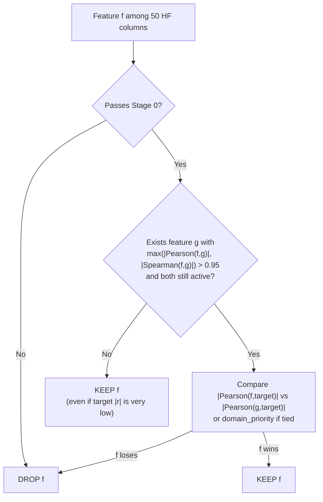

# INSERT BLOCK — paste into feature_selection.md (additive only)

---

## INSERT I — REPLACE §5 "### Step 2 — Redundant pair detection" through line before "### Step 3"

(Replace the short bullet list with the full section below. Keep "### Step 3" unchanged.)

### Step 2 — Redundant pair detection

Step 2 is **target-agnostic**: it only measures whether two HF columns carry **duplicate information** (collinearity). It does **not** use `{appliance}_power` yet. Target correlations from Step 1 are used later in Step 3.

#### 2.1 Inputs and data matrix

After Stage 0 cleaning, let the surviving feature set be \(F = \{f_1, \ldots, f_n\}\) with \(n = 50\) on wk30. Build matrix \(X \in \mathbb{R}^{N \times n}\) where:

- \(N \approx 100{,}780\) rows = all 6-second windows in the fused CSV (not filtered by `on_off`).
- Each column is one HF descriptor (median-filled NaN/Inf from Stage 0).

Implementation: `X = df_clean[feats]` in `run_correlation_filter()` ([`stage01_filter.py`](stage01_filter.py) ~L532).

#### 2.2 Build feature–feature correlation matrices

Compute two full \(n \times n\) matrices on **absolute** correlations:

```python
pearson_matrix = X.corr(method="pearson").abs()
spearman_matrix = X.corr(method="spearman").abs()
```

| Matrix | What it captures |
|--------|------------------|
| **Pearson** | **Linear** co-movement across windows |
| **Spearman** | **Monotonic** co-movement (nonlinear but order-preserving redundancy) |

Matrices are symmetric; diagonal = 1.0. This is **feature–feature** correlation, not feature–target (Step 1).

#### 2.3 Pair enumeration (upper triangle)

For each unordered pair \((f_i, f_j)\), \(i < j\):

```text
r_p  = |Pearson(f_i, f_j)|
r_s  = |Spearman(f_i, f_j)|

IF (r_p > 0.95) OR (r_s > 0.95):    # CORRELATION_THRESHOLD
    record (f_i, f_j) as redundant candidate
    max_abs_corr = max(r_p, r_s)
```

Total pairs tested: \(\binom{50}{2} = 1{,}225\). On wk30: **39** pairs pass (same for all appliances — identical HF columns).

#### 2.4 Output: `stage01_correlation_pairs.csv`

| Column | Meaning |
|--------|---------|
| `feature_a`, `feature_b` | Redundant pair |
| `pearson_abs`, `spearman_abs` | Pairwise \|r\| |
| `max_abs_corr` | max of the two — sorts pairs for Step 3 |

#### 2.5 Worked examples (wk30)

| feature_a | feature_b | pearson | spearman | max | Note |
|-----------|-----------|---------|----------|-----|------|
| `I_rms` | `I_std` | 1.000 | 1.000 | 1.000 | Linear duplicate |
| `I_kurt` | `THDI` | 0.079 | **0.962** | 0.962 | Spearman-only flag |
| `V1` | `V_rms` | 0.826 | **0.987** | 0.987 | Spearman triggers; dropped in Step 3 |

#### 2.6 What Step 2 does NOT do

- Does **not** drop features (Step 3 does).
- Does **not** use target power (Step 1 / Step 3 only).
- Does **not** remove weak-target features like `V11` (not in any pair > 0.95).

#### 2.7 Link to heatmaps

Pre-filter panels in `stage01_corr_matrix_*.png` use the same matrices; black cell = \|r\| ≥ 0.95 = Step 2 flag condition.

---

# INSERT BLOCK — paste into feature_selection.md (additive only)

**Instructions:** Do not delete existing sections. Insert the blocks below at the marked locations.

---

## INSERT A — Table of contents (after item 5, before item 6)

```markdown
   - [5.4 What Stage 01 removes (and does not remove)](#54-what-stage-01-removes-and-does-not-remove)
   - [5.5 Target relevance vs redundancy](#55-target-relevance-vs-redundancy-why-low-target-r-can-still-be-kept)
   - [5.6 Nonlinear and monotonic redundancy](#56-nonlinear-and-monotonic-redundancy-pearson-vs-spearman)
   - [5.7 Position in the full pipeline](#57-position-in-the-full-feature-selection-pipeline)
```

Under item 10:

```markdown
   - [10.5 Literature and method classification](#105-literature-and-method-classification-filter-methods)
```

---

## INSERT B — After §1 Purpose table (before "### Pipeline flow")

```markdown

**Methodological scope (read before Results):** Stage 01 performs **redundancy removal** (collinearity / duplicate measurements), not **relevance selection** (dropping features with low predictive value). A feature with very weak correlation to `{appliance}_power` is **still kept** if it is not redundant with any other surviving feature. Final “usefulness” ranking is deferred to Stage 02 (mRMR) and Stage 03+ (model-based importance). See [§5.4–§5.7](#54-what-stage-01-removes-and-does-not-remove) and [§10.5](#105-literature-and-method-classification-filter-methods).
```

---

## INSERT C — After §5 "### Intent" paragraph (before "### Step 1")

```markdown

**Important clarification:** “More useful” applies **only inside a redundant pair** (two features with |r| > 0.95). Stage 01 does **not** scan all 50 features and delete those with low target |Pearson|. See [§5.4](#54-what-stage-01-removes-and-does-not-remove).
```

---

## INSERT D — After §5 "**Outcome:** 50 → 34..." (before "## 6. Output files")

### 5.4 What Stage 01 removes (and does not remove)

Stage 01 answers one question: **among highly similar HF measurements, which single column should we keep?** It does **not** answer: **which features are informative for NILM?**

| Action | Criterion | Example on wk30 |
|--------|-----------|-----------------|
| **Drop (Stage 0)** | `invalid_ratio > 5%` or `variance < 1e-8` | None (all 50 passed) |
| **Drop (Stage 1)** | Feature is in a pair with \|Pearson\| or \|Spearman\| **> 0.95** **and** loses greedy comparison | `I_std` dropped because `I_std`–`I_rms` Pearson = 1.0 |
| **Keep (default)** | Not in any redundant pair above threshold, **or** wins comparison inside pair | `V11` kept: never appears in `stage01_correlation_report.csv` |

#### Two different notions of “usefulness”

1. **Univariate target relevance** — \|Pearson(f, `{app}_power`)\| over **all** windows (~100k rows). Computed in Step 1 and saved to `stage01_target_correlations.csv`. Used for **tie-breaking inside redundant pairs only**.
2. **Non-redundancy** — feature is **not** almost a duplicate of another column (inter-feature \|r\| ≤ 0.95 for Pearson **and** Spearman, for all partners). This is the **actual keep/drop gate** for Stage 1.

A feature can score **very low** on (1) but pass (2) and remain in the final 34.

#### Worked example: `V11` kept everywhere despite pale target heatmap

| Quantity | Kettle value | Interpretation |
|----------|--------------|----------------|
| `V11` target \|Pearson\| to `kettle_power` | **0.0024** | Rank ~46/50 — essentially no linear co-movement with kettle power |
| `V11` in redundant pairs (kettle) | **No** | Not in `stage01_correlation_pairs.csv` above 0.95 with any partner |
| `V11` in greedy drop log | **No** | Absent from `stage01_correlation_report.csv` (16 drops only) |
| Final status all 5 appliances | **Kept 5/5** | Tier A in `stage01_summary.csv` |

So Fig 3 (target relevance heatmap) shows `V11` as **pale** for every appliance, yet Fig 2 (stability heatmap) shows **green (kept)** — **both are correct** under different rules.

#### Contrast: `V1` dropped everywhere (redundancy, not low rank alone)

| Quantity | Kettle value |
|----------|--------------|
| `V1` target \|Pearson\| | 0.1126 (higher than `V11`) |
| Redundant with | `V_rms` — pair Spearman **0.987** (> 0.95) |
| Greedy decision | Drop `V1`, keep `V_rms` (higher target \|Pearson\|) |

`V1` is removed because it **duplicates** voltage RMS information, not because its target correlation is the weakest in the dataset.

#### Summary rule (implementation-aligned)

```text
FOR each feature f in the 50 HF columns:
  IF f fails Stage 0 cleaning → DROP
  ELIF f never appears in any redundant pair (|r|>0.95) with a still-active partner → KEEP
  ELIF f loses greedy comparison inside at least one such pair → DROP
  ELSE → KEEP
```

There is **no** branch: `IF target_pearson_abs(f) < threshold → DROP`.

---

### 5.5 Target relevance vs redundancy (why low target |r| can still be kept)

#### What Step 1 target table is for

`stage01_target_correlations.csv` and cross-appliance **Fig 3** (`fig03_target_relevance_heatmap.png`) are **diagnostic**:

- They show how each HF column aligns with **this appliance’s** sub-meter power.
- They explain **appliance-specific flips** (e.g. `DWT_E0` dark for kettle, pale for fridge).
- They are used in Stage 1 **only when** two features are already flagged as redundant.

They are **not** a global ranking for deletion.

#### Correlation uses all windows (not ON-only)

Target correlations are computed on the **full** fused CSV (see §7.3 ON rates). For rare-ON loads (kettle ~0.62%, microwave ~0.41%), most rows have `{app}_power ≈ 0`, which **dampens** \|Pearson\| for many features. That affects **tie-breaks** and **Fig 3 appearance**, but does **not** by itself trigger removal.

#### Decision flow (Stage 1 only)



#### Common misreading

| Misreading | Correction |
|------------|------------|
| “Pale in Fig 3 ⇒ should be deleted” | Pale ⇒ weak **univariate** link to sub-meter power, not redundant |
| “Stage 01 keeps the 34 best features for NILM” | Stage 01 keeps 34 **non-redundant** features; relevance pruning is Stage 02+ |
| “High correlation filter = final feature selection” | It is a **standard first-stage collinearity filter** in filter-based pipelines (see §10.5) |

---

### 5.6 Nonlinear and monotonic redundancy (Pearson vs Spearman)

Stage 1 uses **two** correlation types for **feature–feature** pairs:

| Metric | Detects | Role in Stage 01 |
|--------|---------|------------------|
| **Pearson** | Linear co-movement | Pair flagged if \|r\| > 0.95; also used for **target** tie-break |
| **Spearman** | Monotonic (rank) co-movement | Pair flagged if \|r\| > 0.95 even when Pearson is low |

**Why both matter:** Some duplicates are linear (`I_std` vs `I_rms`, r = 1.0). Others are **nonlinear but monotonic** — e.g. kettle `I_kurt` vs `THDI`: pair Pearson ≈ **0.079**, Spearman ≈ **0.962** → still a redundant pair; `I_kurt` is dropped, `THDI` kept (higher target \|Pearson\|).

**Limitation:** Spearman mainly affects **whether a pair is considered redundant**. When choosing the winner inside the pair, the code compares **target |Pearson|** (not target Spearman), unless target Pearson ties within 0.01 → then `DOMAIN_PRIORITY` applies (§5 Step 3).

**Implication for “nonlinear predictive value”:** A feature may carry **nonlinear** information about the label that Pearson does not capture, yet still survive Stage 01 if it is **not** monotonically redundant with another kept column. Conversely, monotonic redundancy can remove a feature even when its **linear** target correlation is tiny (`I_kurt`). **Multivariate and model-based** checks (mRMR, RF) are designed for the next stages.

---

### 5.7 Position in the full feature selection pipeline

Stage 01 output is explicitly a **candidate set** (~34 non-redundant HF features per appliance), not the final thesis feature list.

| Stage | Question | Method family | Typical output |
|-------|----------|---------------|----------------|
| **01 (this doc)** | Which columns are **duplicate measurements**? | Filter: correlation / collinearity | ~34 features, audit CSVs |
| **02** | Which features are **relevant** to the label with **low mutual redundancy**? | Filter: mRMR (MI-based) | Ranked shortlist |
| **03** | Do features help a **nonlinear** predictor? | Embedded: RF importance | Validated subset |
| **04–06** | Stable across time / tasks? Ablation? | Stability + experiments | Final HF schema |

See [`PROJECT_PLANNING_ZH.md`](../PROJECT_PLANNING_ZH.md) §4–§10 for the full pipeline narrative.

**Recommended thesis wording:** “Stage 01 removed invalid and highly collinear HF descriptors; subsequent stages selected features by relevance to appliance power and predictive contribution in nonlinear models.”

---

## INSERT E — After §10.2 (before §10.3 Thesis-safe wording)

### 10.2a Common misreadings (target heatmap vs filter)

1. **Low target \|Pearson\| does not imply removal** — e.g. `V11` (§5.4).
2. **High target \|Pearson\| does not imply retention** — e.g. `I_BP_low` can rank #1 for kettle target \|r\| yet be **dropped** as redundant with `DWT_E0`.
3. **Fig 3 and §8 tables serve different purposes** — Fig 3 = univariate relevance; §8 K/D matrix = redundancy filter outcome.
4. **All-window correlation** — not restricted to ON periods (§5.5); rare-ON appliances need careful interpretation.

---

## INSERT F — After §10.4 (before "---" before §11)

### 10.5 Literature and method classification (filter methods)

Stage 01 is a **filter method** in the taxonomy of Guyon and Elisseeff (2003): it scores features using statistical dependence on the label and/or other features **without** training a predictor. Correlation-based collinearity pruning is widely used as an **early** step before relevance ranking or wrapper search.

| Reference | Contribution | Relevance to this project |
|-----------|--------------|---------------------------|
| **Guyon, I. & Elisseeff, A. (2003).** *An Introduction to Variable and Feature Selection.* JMLR 3, 1157–1182. | Defines **filter / wrapper / embedded** methods; filter = fast preprocessing | Stage 01 = filter; RF stage = embedded |
| **Hall, M. A. & Smith, L. A. (1999).** *Feature subset selection: a correlation based filter approach.* Progress in AI (LNCS 1688). | **Correlation-based** feature selection using feature–feature and feature–class association | Same family as Stage 01 + target tie-break |
| **Peng, H., Long, F., & Ding, C. (2005).** *Feature selection based on mutual information: criteria of max-dependency, max-relevance, and min-redundancy.* IEEE TPAMI 27(8), 1226–1238. (**mRMR**) | **Maximize relevance, minimize redundancy** using MI | Motivates **Stage 02** after correlation pruning |
| **Dormann, C. F. et al. (2013).** *Collinearity: a review of methods to deal with it and a simulation study.* Ecography 36(1), 27–46. | Keep one variable from highly correlated sets; VIF and related tools | Justifies dropping one member of \|r\| > 0.95 pairs |
| **Pearson (linear) vs Spearman (rank)** | Standard practice for linear vs monotonic association | Stage 01 flags pairs with **either** exceeding 0.95 |

**Why correlation filtering is common in NILM feature pipelines:** High-frequency extractors produce **many correlated electrical descriptors** (RMS, band power, harmonics, wavelets). Removing collinearity before model training reduces unstable coefficients, duplicated importance, and overfitting when sample size is limited (e.g. one week, rare ON events). It does **not** replace domain-specific relevance analysis — hence the planned **mRMR → RF → stability → ablation** chain in this repository.

**What the literature does *not* claim:** That correlation filtering alone yields the “best” feature set for prediction. It yields a **non-redundant superset**; relevance and nonlinear utility must be validated downstream (Hall & Smith 1999; Peng et al. 2005; Guyon & Elisseeff 2003).

---

## INSERT G — Extend §10.3 thesis-safe wording (append one sentence)

Add after the existing blockquote:

> Stage 01 did not remove features solely for low univariate correlation with sub-meter power; features such as higher-order voltage harmonics were retained when they were not members of any feature pair exceeding the redundancy threshold.

---

## INSERT H — Footnote in §8.4 (after the 30-feature list paragraph)

Add:

> **Note on voltage harmonics (`V3`, `V5`, …, `V15`, including `V11`):** These appear in the 30-feature intersection because they are **not** redundant with each other or with `V_rms` at the 0.95 threshold on aggregate HF — **not** because they show strong target |Pearson| in Fig 3. See §5.4–§5.5.
