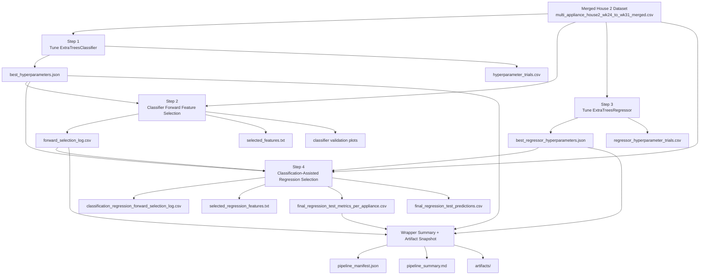

# ExtraTrees Wrapper NILM Pipeline Explained

This document explains the full workflow controlled by
`run_extratrees_wrapper_pipeline.py`.

The pipeline is an end-to-end ExtraTrees feature-selection experiment for NILM
(non-intrusive load monitoring). It starts from one merged multi-appliance
dataset, finds good ON/OFF classifier settings, selects useful classifier
features, tunes a power regressor, then runs classification-assisted regression
feature selection and final held-out testing.

Dataset used by this pipeline:

```text
feature_selection/dataset/multi_appliance_house2_wk24_to_wk31_merged.csv
```

The appliances are:

```text
kettle
fridge
microwave
dishwasher
washingmachine
```

## High-Level Idea

The pipeline separates NILM into two related problems.

First, it treats appliance state detection as a classification problem:

```text
aggregate/high-frequency features -> appliance ON/OFF labels
```

For example:

```text
kettle_on
fridge_on
microwave_on
dishwasher_on
washingmachine_on
```

Then, it treats appliance power estimation as a regression problem:

```text
aggregate/high-frequency features + classifier ON/OFF information -> appliance power
```

For example:

```text
kettle_power
fridge_power
microwave_power
dishwasher_power
washingmachine_power
```

The reason for doing classification first is that appliance ON/OFF state can
help the regression stage. If the model knows an appliance is probably OFF, the
regressor can avoid predicting unnecessary power for that appliance. If the
model knows an appliance is probably ON, the regressor can focus on estimating
the active power level.

## Full Pipeline Flow



## Wrapper Script Role

The wrapper script is:

```text
feature_selection/extratrees_nilm/run_extratrees_wrapper_pipeline.py
```

It does not contain the model training logic itself. Instead, it runs four
other scripts in order and checks whether their required outputs exist.

The four pipeline steps are defined in `PIPELINE_STEPS`:

```text
01_classifier_hyperparameter_tuning
02_classifier_forward_selection
03_regressor_hyperparameter_tuning
04_classification_assisted_regression_selection
```

For each step, the wrapper knows:

```text
step id
human-readable title
script to run
result folder
required output files
freshness inputs
```

The required output files are important because they tell the wrapper whether a
step has successfully produced the minimum outputs needed by later steps.

## Step 1: Classifier Hyperparameter Tuning

Script:

```text
feature_selection/extratrees_nilm/extratrees_hyperparameter_tuning.py
```

Result folder:

```text
feature_selection/results/extratrees_hyperparameter_tuning_onoff_multi_appliance_house2_wk24_to_wk31_merged
```

Purpose:

This step searches for good hyperparameters for `ExtraTreesClassifier`.

The classifier predicts the ON/OFF state of all appliances. It is a
multi-output classification problem because the model predicts several labels
at once:

```text
kettle_on
fridge_on
microwave_on
dishwasher_on
washingmachine_on
```

Typical tuned parameters include things like:

```text
n_estimators
max_depth
min_samples_leaf
min_samples_split
max_features
criterion
class_weight
```

Main required outputs:

```text
best_hyperparameters.json
hyperparameter_trials.csv
```

Important plots may also be generated:

```text
optimization_history_macro_f1.png
per_appliance_f1_by_trial.png
runtime_vs_macro_f1.png
hyperparameter_importance.png
hyperparameter_slice_plots.png
```

The key file for later steps is:

```text
best_hyperparameters.json
```

Step 2 reads this file so that classifier feature selection uses the tuned
classifier settings instead of default settings.

## Step 2: Classifier Forward Feature Selection

Script:

```text
feature_selection/extratrees_nilm/extratrees_nilm_forward_selection_classification.py
```

Result folder:

```text
feature_selection/results/extratrees_forward_selection_onoff_multi_appliance_house2_wk24_to_wk31_merged
```

Purpose:

This step decides which input features are most useful for appliance ON/OFF
classification.

It uses forward selection. The idea is:

1. Start with no selected features.
2. Try each remaining candidate feature.
3. Train an `ExtraTreesClassifier` using the current selected features plus
   that candidate feature.
4. Evaluate validation Macro F1 and Micro F1.
5. Select the candidate that gives the best Macro F1 for that round.
6. Repeat until all features have been ranked.

The classifier is evaluated mainly with Macro F1 because Macro F1 gives each
appliance a more equal voice. This matters because some appliances are active
much less often than others. A metric dominated by frequent OFF states or by
the most common appliance could hide poor performance on rare appliance events.

Main required outputs:

```text
forward_selection_log.csv
selected_features.txt
```

Additional outputs:

```text
forward_selection_macro_micro_f1.png
forward_selection_per_appliance_f1.png
onoff_evidence_plots/
```

### What `forward_selection_log.csv` Contains

This CSV is the most important checkpoint for classifier feature selection.

Each row represents one completed forward-selection round:

```text
round
added_feature
feature_count
macro_f1
micro_f1
improvement
selected_features
per-appliance precision/recall/F1/accuracy
macro/micro averages
```

Example meaning:

```text
round = 8
added_feature = I_skew
selected_features = S_apparent,aggregate,I1,V_skew,P_active,I_env_2,I_kurt,I_skew
```

That means round 8 completed and the eighth selected feature was `I_skew`.

### Resume Behavior Added To Step 2

This script now resumes from `forward_selection_log.csv`.

The resume logic checks whether the existing selection log is usable:

```python
def existing_selection_log_is_current():
    if not FORWARD_SELECTION_LOG.exists():
        return False

    freshness_inputs = [DATASET_PATH]
    if BEST_PARAMS_PATH.exists():
        freshness_inputs.append(BEST_PARAMS_PATH)
    elif LEGACY_BEST_PARAMS_PATH.exists():
        freshness_inputs.append(LEGACY_BEST_PARAMS_PATH)

    newest_input_mtime = max(path.stat().st_mtime for path in freshness_inputs)
    return FORWARD_SELECTION_LOG.stat().st_mtime >= newest_input_mtime
```

In plain language:

```text
If forward_selection_log.csv exists,
and it is newer than the dataset and the classifier hyperparameter file,
then the script trusts it as a valid checkpoint.
```

Then it loads the previous selected features:

```python
def load_existing_selection_log():
    if not existing_selection_log_is_current():
        return [], []

    existing_log = pd.read_csv(FORWARD_SELECTION_LOG)
    existing_features = existing_log["added_feature"].dropna().astype(str).tolist()

    print(f"Resuming forward selection from: {FORWARD_SELECTION_LOG}")
    print(f"Completed rounds found: {len(existing_features)}")
    print(f"Selected so far: {existing_features}")
    return existing_features, existing_log.to_dict("records")
```

Then the main loop starts from the next unfinished round:

```python
selected_features, selection_log = load_existing_selection_log()

for round_number in range(len(selected_features) + 1, len(FEATURE_COLUMNS) + 1):
    ...
```

So if 8 completed rounds are already saved:

```text
len(selected_features) = 8
next round = 8 + 1 = 9
```

The script continues from:

```text
Forward selection round 9/51
```

Important limitation:

```text
The CSV checkpoint is saved after each completed round, not after every tested
candidate inside a round.
```

So if the script stops halfway through round 9, it will rerun round 9 from the
first candidate. That is safe because round 9 was not completed and committed
to the CSV checkpoint yet.

## Step 3: Regressor Hyperparameter Tuning

Script:

```text
feature_selection/extratrees_nilm/extratrees_regressor_hyperparameter_tuning.py
```

Result folder:

```text
feature_selection/results/extratrees_hyperparameter_tuning_regression_multi_appliance_house2_wk24_to_wk31_merged
```

Purpose:

This step tunes `ExtraTreesRegressor` for appliance power prediction.

The regression target columns are:

```text
kettle_power
fridge_power
microwave_power
dishwasher_power
washingmachine_power
```

Instead of predicting whether an appliance is ON or OFF, the regressor predicts
how much power each appliance is using.

Main required outputs:

```text
best_regressor_hyperparameters.json
regressor_hyperparameter_trials.csv
```

Important plots may also be generated:

```text
optimization_history_composite_score.png
regression_metrics_by_trial.png
runtime_vs_composite_score.png
hyperparameter_importance.png
hyperparameter_slice_plots.png
```

The key file for step 4 is:

```text
best_regressor_hyperparameters.json
```

Step 4 uses these tuned regressor settings during regression feature selection.

## Step 4: Classification-Assisted Regression Selection

Script:

```text
feature_selection/extratrees_nilm/extratrees_nilm_forward_selection_classification_regression.py
```

Result folder:

```text
feature_selection/results/extratrees_forward_selection_classification_regression_multi_appliance_house2_wk24_to_wk31_merged
```

Purpose:

This step selects features for appliance power regression and performs the
final held-out test.

It is called "classification-assisted" because it uses information from the
classifier stage. Conceptually, the classifier helps answer:

```text
Which appliances are probably ON?
```

Then the regressor answers:

```text
How much power is each appliance using?
```

Inputs from previous steps:

```text
classifier best hyperparameters
classifier forward-selection log
regressor best hyperparameters
dataset
```

Main required outputs:

```text
classification_regression_forward_selection_log.csv
selected_regression_features.txt
final_regression_test_metrics_per_appliance.csv
```

Additional outputs:

```text
direct_regression_forward_selection_log.csv
final_regression_test_predictions.csv
regression_forward_selection_mae_sae_ea.png
regression_forward_selection_composite_score.png
regression_per_appliance_ea.png
metric_curves/
prediction_waveforms/
```

This stage compares or records regression behavior using metrics such as:

```text
MAE: Mean Absolute Error
SAE: Signal Aggregate Error
EA: Energy Accuracy
```

The final output of the whole machine-learning experiment is mainly:

```text
final_regression_test_metrics_per_appliance.csv
final_regression_test_predictions.csv
selected_regression_features.txt
```

## Train, Validation, And Test Idea

The individual scripts use a time-based split:

```text
first 60%  -> training
next 20%   -> validation
final 20%  -> held-out test
```

This is important for NILM because the data is time-series data. Randomly
shuffling can leak future patterns into training. A time-based split better
simulates the real scenario:

```text
train on earlier time
validate on later time
test on unseen future time
```

The rough purpose of each split is:

```text
training   -> fit models
validation -> choose hyperparameters/features
test       -> final unbiased performance estimate
```

## Wrapper Output Folder

Every wrapper run creates a new timestamped folder:

```text
feature_selection/results/extratrees_wrapper_pipeline_multi_appliance_house2_wk24_to_wk31_merged_YYYYMMDD_HHMMSS
```

Inside it:

```text
logs/
artifacts/
pipeline_manifest.json
pipeline_summary.md
```

The `logs/` folder contains one log file per wrapper step:

```text
01_classifier_hyperparameter_tuning.log
02_classifier_forward_selection.log
03_regressor_hyperparameter_tuning.log
04_classification_assisted_regression_selection.log
```

Important:

```text
A resumed wrapper run does not continue writing to the old timestamped wrapper
log folder.
```

It creates a new wrapper folder, but it reuses the shared step result folders.

For example, an old stopped wrapper log might be:

```text
feature_selection/results/extratrees_wrapper_pipeline_multi_appliance_house2_wk24_to_wk31_merged_20260610_145223/logs/02_classifier_forward_selection.log
```

A new resumed wrapper run writes to a new folder like:

```text
feature_selection/results/extratrees_wrapper_pipeline_multi_appliance_house2_wk24_to_wk31_merged_20260611_083851/logs/02_classifier_forward_selection.log
```

But both runs use the same classifier selection checkpoint:

```text
feature_selection/results/extratrees_forward_selection_onoff_multi_appliance_house2_wk24_to_wk31_merged/forward_selection_log.csv
```

That CSV is the real resume point for classifier forward selection.

## `--skip-existing` Behavior

Run normally:

```powershell
python -u feature_selection\extratrees_nilm\run_extratrees_wrapper_pipeline.py
```

This can rerun earlier steps.

Run with resume/skipping:

```powershell
python -u feature_selection\extratrees_nilm\run_extratrees_wrapper_pipeline.py --skip-existing
```

This tells the wrapper:

```text
If a step's required outputs exist and are newer than its inputs, skip that step.
```

The wrapper checks this using:

```python
def outputs_are_current(step):
    if not required_outputs_exist(step):
        return False

    input_paths = [step["script"], *step.get("freshness_inputs", [])]
    existing_inputs = [path for path in input_paths if path.exists()]
    if not existing_inputs:
        return True

    newest_input_mtime = max(path.stat().st_mtime for path in existing_inputs)
    oldest_output_mtime = min(path.stat().st_mtime for path in step["required_outputs"])
    return oldest_output_mtime >= newest_input_mtime
```

In plain language:

```text
If every required output exists,
and the oldest required output is still newer than the newest important input,
then the step is considered current.
```

For the current resume situation:

```text
Step 1: classifier tuning already completed -> skipped
Step 2: classifier forward selection resumes from CSV checkpoint
Step 3: regressor tuning runs after step 2 finishes
Step 4: classification-assisted regression runs after step 3 finishes
```

## Why Clicking Run Can Be Risky

Clicking a normal Run button may execute:

```powershell
python -u feature_selection\extratrees_nilm\run_extratrees_wrapper_pipeline.py
```

without:

```text
--skip-existing
```

If that happens, the wrapper may rerun earlier steps instead of skipping them.
That can update output timestamps or overwrite files, which can interfere with
clean resume behavior.

For this interrupted experiment, use:

```powershell
python -u feature_selection\extratrees_nilm\run_extratrees_wrapper_pipeline.py --skip-existing
```

## What Happens If It Stops Again

If it stops during classifier forward selection:

```text
Completed rounds remain saved in forward_selection_log.csv.
The current incomplete round will rerun next time.
```

Run the same resume command again:

```powershell
python -u feature_selection\extratrees_nilm\run_extratrees_wrapper_pipeline.py --skip-existing
```

If it stops after classifier forward selection finishes but before regressor
tuning finishes:

```text
Step 1 will be skipped.
Step 2 should be skipped if its required outputs are current.
Step 3 will rerun or continue depending on its own output state.
```

If it stops during regression feature selection:

```text
The behavior depends on whether the regression script itself has checkpoint
resume support. The wrapper can skip fully completed steps, but it cannot
resume inside every individual script unless that script saves and reloads a
checkpoint.
```

## Practical Command To Use

From the repository root:

```powershell
cd "C:\Users\Raymond Tie\Desktop\PhD\Code\multi-domain NILM\high_low_freq_NILM"
python -u feature_selection\extratrees_nilm\run_extratrees_wrapper_pipeline.py --skip-existing
```

Expected resume message during classifier selection:

```text
Resuming forward selection from: ...forward_selection_log.csv
Completed rounds found: 8
Selected so far: ['S_apparent', 'aggregate', 'I1', 'V_skew', 'P_active', 'I_env_2', 'I_kurt', 'I_skew']

Forward selection round 9/51
```

## Summary

The whole pipeline can be understood as:

```text
Tune classifier
-> select classifier features
-> tune regressor
-> use classifier information to select regression features
-> evaluate final NILM power prediction on held-out test data
```

The wrapper manages order, logging, summaries, and artifact snapshots.

The classifier forward-selection script now manages round-level resume using:

```text
forward_selection_log.csv
```

The safest command for continuing the interrupted run is:

```powershell
python -u feature_selection\extratrees_nilm\run_extratrees_wrapper_pipeline.py --skip-existing
```
