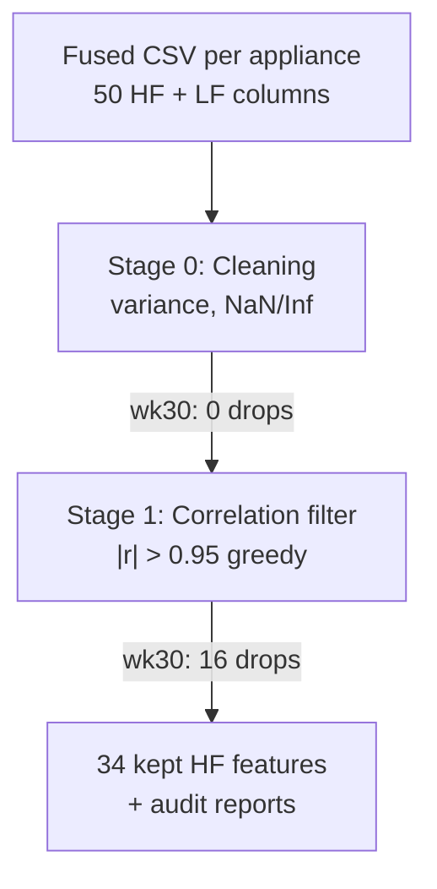
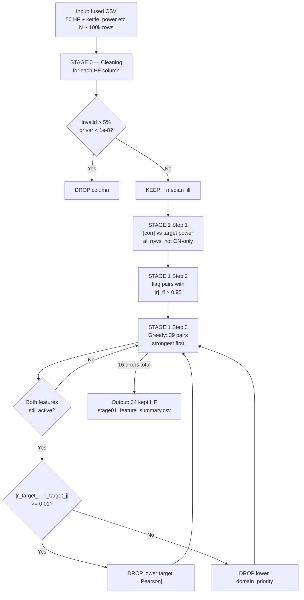

## Feature Selection — Stage 01 Reference

This document describes **Stage 01** of the high-frequency (HF) feature-selection pipeline: **cleaning** plus **correlation filtering**. Implementation lives in [`stage01_filter.py`](stage01_filter.py). Example outputs are under [`feature_selection_outputs/{appliance}/`](../feature_selection_outputs/) for **UK-DALE house 2, week 30** (`house2_wk30`).

### Abstract (experimental results)

We apply a two-stage filter to 50 HF descriptors extracted from 6-second aggregate VI windows on UK-DALE House 2 (week 30). Stage 0 removes invalid or near-constant columns (**0 drops** on wk30). Stage 1 greedily prunes feature pairs with |Pearson| or |Spearman| > 0.95, retaining the member with higher correlation to sub-meter `{appliance}_power` (domain-priority tie-break when |Δr| < 0.01). For each of five appliances, **34 features are retained and 16 are dropped**. **30 features** are kept across all appliances; **10 are dropped universally**; **10 exhibit appliance-specific status** because HF columns are identical but sub-meter targets differ. This report documents the complete drop/keep inventory, greedy elimination logs, and interpretation for thesis use.

## Table of contents

1. [Overview](#1-overview)
2. [How to run](#2-how-to-run)
3. [Input data and feature inventory](#3-input-data-and-feature-inventory)
4. [Stage 0 — Cleaning](#4-stage-0--cleaning)
5. [Stage 1 — Correlation filter](#5-stage-1--correlation-filter)
   - [5.0 End-to-end algorithm (split guide)](#50-end-to-end-algorithm-split-guide) — **start here for full process**
   - [5.4 What Stage 01 removes (and does not remove)](#54-what-stage-01-removes-and-does-not-remove)
   - [5.5 Target relevance vs redundancy](#55-target-relevance-vs-redundancy-why-low-target-r-can-still-be-kept)
   - [5.6 Nonlinear and monotonic redundancy](#56-nonlinear-and-monotonic-redundancy-pearson-vs-spearman)
   - [5.7 Position in the full pipeline](#57-position-in-the-full-feature-selection-pipeline)
6. [Output files](#6-output-files)
7. [Experimental setup (wk30)](#7-experimental-setup-wk30)
8. [Complete results report](#8-complete-results-report)
9. [Per-appliance detailed reports](#9-per-appliance-detailed-reports)
10. [Discussion and limitations](#10-discussion-and-limitations)
   - [10.5 Literature and method classification](#105-literature-and-method-classification-filter-methods)
11. [Next steps](#11-next-steps)

## 1\. Overview

### Purpose

Stage 01 reduces **~50 HF descriptors** extracted from 6-second VI windows to a **non-redundant subset (~34 features per appliance)** before later pipeline stages (e.g. model training or Stage 02 in the project plan).

It does **not** train a model. It applies explicit rules:

| Sub-stage | Name | Target-aware? | Role |
| --- | --- | --- | --- |
| **Stage 0** | Cleaning | No | Remove broken or near-constant columns |
| **Stage 1** | Correlation filter | Yes | Among highly correlated pairs, drop the feature less related to `{appliance}_power` |

**Methodological scope (read before Results):** Stage 01 performs **redundancy removal** (collinearity / duplicate measurements), not **relevance selection** (dropping features with low predictive value). A feature with very weak correlation to `{appliance}_power` is **still kept** if it is not redundant with any other surviving feature. Final “usefulness” ranking is deferred to Stage 02 (mRMR) and Stage 03+ (model-based importance). See [§5.4–§5.7](#54-what-stage-01-removes-and-does-not-remove) and [§10.5](#105-literature-and-method-classification-filter-methods).

### Pipeline flow



### Critical data property (read before interpreting results)

HF features are computed from the **house-level aggregate VI waveform** (same `.flac` for the whole home). When batch fusion runs, **every appliance CSV for the same week contains identical HF columns**; only these differ per file:

*   `{appliance}_power` (sub-meter channel)
*   `on_off` (Algorithm 1 labels)
*   `aggregate` (may match across merges but is LF-derived)

Therefore Stage 01 answers:

> *Given the same aggregate HF matrix, which columns are redundant, and which redundant member best aligns with this appliance’s sub-meter power?*

It does **not** answer:

> *Which HF signature is unique to this appliance’s isolated current waveform?*

That distinction matters for thesis wording and for Stage 02+ design.

## 2\. How to run

From the project root:

```bash
python feature_selection/stage01_filter.py
```

Equivalent with explicit paths:

```bash
python feature_selection/stage01_filter.py \
  --data_dir dataset_preprocess/high_frequency_data_extract/output \
  --output_dir feature_selection_outputs \
  --house house2 \
  --week wk30
```

### Defaults (`get_arguments()`)

| Argument | Default | Meaning |
| --- | --- | --- |
| `--data_dir` | `dataset_preprocess/high_frequency_data_extract/output` | Fused appliance CSVs |
| `--output_dir` | `feature_selection_outputs` | Report root |
| `--appliances` | kettle, fridge, microwave, dishwasher, washingmachine | All five |
| `--house` | `house2` | Filename tag |
| `--week` | `wk30` | Filename tag |
| `--var_threshold` | `1e-8` | Near-constant variance cutoff |
| `--invalid_threshold` | `0.05` | Max allowed NaN+Inf ratio |
| `--corr_threshold` | `0.95` | Redundant pair cutoff |
| `--no_plots` | off | Skip correlation PNG/CSV matrices |

Input filename pattern: `{appliance}_{house}_{week}.csv`  
Example: `kettle_house2_wk30.csv`

## 3\. Input data and feature inventory

### Input columns

Each fused CSV contains:

| Column group | Examples | Used in Stage 01 as |
| --- | --- | --- |
| Timestamp | `readable_time` | Row index only (excluded from HF) |
| HF features | `V_rms`, `I1`, `DWT_E0`, … | Selection candidates (50 cols) |
| LF / labels | `aggregate`, `kettle_power`, `on_off` | Target = `{appliance}_power`; `aggregate`/`on_off` excluded from HF set |

`get_hf_columns()` returns every column except `readable_time`, `aggregate`, `on_off`, and any `*_power` suffix.

### Fifty HF features and domains

Features are grouped for **tie-breaking** when target correlation is ambiguous (`FEATURE_DOMAIN`, `DOMAIN_PRIORITY` in `stage01_filter.py`).

| Domain | Priority | Count | Features |
| --- | --- | --- | --- |
| `time_domain` | 10 | 7 | `V_rms`, `I_rms`, `P_active`, `S_apparent`, `PF`, `Fcv`, `Fci` |
| `distortion` | 9 | 4 | `IH`, `VH`, `THDI`, `THDV` |
| `harmonics` | 8 | 16 | `I1`,`V1`, `I3`,`V3`, …, `I15`,`V15` |
| `wavelet` | 7 | 5 | `DWT_E0` … `DWT_E4` |
| `band_power` | 6 | 4 | `I_BP_low`, `I_BP_mid`, `I_BP_high`, `V_BP_low` |
| `shape_statistics` | 5 | 5 | `I_skew`, `I_kurt`, `V_skew`, `I_std`, `V_std` |
| `spectral_descriptors` | 4 | 1 | `I_spec_entropy` |
| `spectral_envelope` | 3 | 8 | `I_env_0` … `I_env_7` |

**Higher priority wins** when two features have similar |Pearson| to `{appliance}_power` (difference < 0.01).

## 4\. Stage 0 — Cleaning

### Intent

Remove columns that are unusable **before** any correlation analysis. This stage is **target-agnostic**: it does not look at `kettle_power` or other labels.

See [§5.0](#50-end-to-end-algorithm-split-guide) for how Stage 0 fits the full pipeline.

### Algorithm (`run_cleaning`) — per-feature determination

For **each** HF column independently:

| Step | Compute | DROP if | KEEP if |
|------|---------|---------|---------|
| 1 | `invalid_ratio = (n_nan + n_inf) / n_total` | `invalid_ratio > 0.05` | else continue |
| 2 | `variance` on finite values | `variance < 1e-8` | else **KEEP** |
| 3 | (kept only) median-fill remaining NaN/Inf | — | column passes to Stage 1 |

```text
FOR each HF column f:
    IF invalid_ratio(f) > 0.05:     DROP f
    ELIF variance(f) < 1e-8:         DROP f
    ELSE:                            KEEP f, median-fill NaN/Inf
```

Detail steps:

1.  Count `n_nan`, `n_inf`, `invalid_ratio = (n_nan + n_inf) / n_total`
2.  Compute `variance` on finite values only
3. **Drop** if:
   - `invalid_ratio > 0.05`, or
   - `variance < 1e-8` (near-constant)
4.  **Keep** otherwise; median-fill any remaining NaN/Inf in kept columns

```python
# Thresholds (stage01_filter.py)
NEAR_CONSTANT_VAR_THRESHOLD = 1e-8
MAX_INVALID_RATIO = 0.05
```

### Implementation notes

*   Infinite values are treated as invalid; kept columns are filled with the column **median**.
*   Dropped columns are removed from the dataframe passed to Stage 1.
*   Every decision is logged to `stage01_cleaning_report.csv` with `status`, `reason`, `variance`, `invalid_ratio`, and `domain`.

### wk30 results

| Appliance | Rows | HF input | Dropped in cleaning |
| --- | --- | --- | --- |
| kettle | 100,780 | 50 | **0** |
| fridge | 100,779 | 50 | **0** |
| microwave | 100,778 | 50 | **0** |
| dishwasher | 100,779 | 50 | **0** |
| washingmachine | 100,778 | 50 | **0** |

All 50 features passed, including low-magnitude columns such as `I_env_7` (variance ≈ 3.5×10⁻⁸, above 10⁻⁸) and `DWT_E4` (variance ≈ 5.4×10⁻⁵).

**Interpretation:** Stage 0 does **not** remove “small but informative” wavelet or envelope features. Small absolute values are expected for high-frequency bands on aggregate current; Stage 1 handles redundancy, not Stage 0.

## 5\. Stage 1 — Correlation filter

### Intent

Among feature pairs that move together almost linearly (or monotonically), keep the member more useful for predicting `**{appliance}_power**` and drop the other.

**Important clarification:** “More useful” applies **only inside a redundant pair** (two features with |r| > 0.95). Stage 01 does **not** scan all 50 features and delete those with low target |Pearson|. See [§5.4](#54-what-stage-01-removes-and-does-not-remove).

---

### 5.0 End-to-end algorithm (split guide)

Read this section first for the **full selection process** in one place. Details for each step are in §4 (Stage 0), §5 Steps 1–3, and §5.4–§5.7.

#### What problem Stage 01 solves

| Question | Answered by Stage 01? |
|----------|------------------------|
| Is the column broken or constant? | **Yes** (Stage 0) |
| Are two columns measuring the same thing? | **Yes** (Stage 1, Steps 2–3) |
| Which column is better for *this appliance’s* power label? | **Only when breaking ties** in a redundant pair (Step 3) |
| Which features are best for NILM overall? | **No** → Stage 02+ (mRMR, RF, etc.) |

#### Master flow (per appliance CSV)



#### Split summary table (determination rules)

| Step | Uses target power? | Determination rule | Feature removed? |
|------|-------------------|--------------------|------------------|
| **0 — Cleaning** | No | DROP if `invalid_ratio > 0.05` OR `variance < 1e-8` | Yes, immediately |
| **1 — Target table** | Yes (read only) | Compute `target_pearson_abs`, `target_spearman_abs` per feature | **No** — table only |
| **2 — Pair scan** | No | Flag pair if `|Pearson(fi,fj)| > 0.95` OR `|Spearman(fi,fj)| > 0.95` | **No** — list only |
| **3 — Greedy drop** | Yes (tie-break) | For each flagged pair (strongest first): if both active, DROP one member | Yes, **16 total** per appliance |

#### How a single feature gets its final label

```text
FOR each of 50 HF features f:

  Stage 0:
    IF invalid_ratio(f) > 0.05 OR variance(f) < 1e-8:
        final_status = DROPPED (cleaning)
        STOP

  Stage 1 (else):
    IF f never appears in any pair with |r| > 0.95 (Step 2 list):
        final_status = KEPT
        STOP

    IF f loses Step 3 comparison in at least one pair (while still "alive"):
        final_status = DROPPED (correlation)
        STOP

    ELSE:
        final_status = KEPT
```

**Note:** Low `target_pearson_abs` (e.g. `V11` ≈ 0.002) does **not** trigger DROP unless `f` is in a redundant pair and loses Step 3.

#### Counts on wk30 (typical)

| Stage | Kettle example |
|-------|----------------|
| Input | 50 HF |
| After Stage 0 | 50 (0 drops) |
| Redundant pairs flagged (Step 2) | 39 pairs |
| Greedy drops (Step 3) | 16 features |
| **Final kept** | **34** |

#### Full pseudocode (Stage 0 + Stage 1, one appliance)

```text
INPUT: dataframe df, appliance name → target_col = "{appliance}_power"

# --- STAGE 0 ---
feats = all HF column names (50)
FOR f in feats:
    IF invalid_ratio(f) > 0.05 OR variance(f) < 1e-8:
        DROP f from feats
    ELSE:
        median_fill(f)
X = df[feats]   # cleaned matrix

# --- STAGE 1 Step 1: target table (no drops) ---
FOR f in feats:
    target_pearson[f]  = |corr(X[f], df[target_col])|
    target_spearman[f] = |rank_corr(X[f], df[target_col])|

# --- STAGE 1 Step 2: redundant pairs (no drops) ---
pairs = []
FOR each unordered (fi, fj) in feats:
    rp = |corr_pearson(X[fi], X[fj])|
    rs = |corr_spearman(X[fi], X[fj])|
    IF rp > 0.95 OR rs > 0.95:
        pairs.append((fi, fj, max(rp, rs)))
SORT pairs BY max(rp, rs) DESCENDING

# --- STAGE 1 Step 3: greedy drops ---
alive = set(feats)
FOR (fi, fj, _) in pairs:
    IF fi not in alive OR fj not in alive: CONTINUE
    IF |target_pearson[fi] - target_pearson[fj]| >= 0.01:
        drop = argmin(target_pearson among {fi, fj})
    ELSE:
        drop = argmin(domain_priority among {fi, fj})
    alive.remove(drop)

OUTPUT: alive   # 34 features on wk30
```

---

### Step 1 — Target relevance

Step 1 builds a **lookup table** for Step 3. It does **not** remove features.

#### 1.1 Inputs

| Item | Value |
|------|--------|
| Matrix | `X` = all kept HF columns, `N` rows (full week) |
| Target | `y` = `{appliance}_power` (e.g. `kettle_power`) |
| Rows used | **All windows** — not filtered by `on_off` |

#### 1.2 Computation

For each feature column `f` in `X`:

```text
r_pearson  = |corr_pearson(f, y)|
r_spearman = |corr_spearman(f, y)|
```

NaN/Inf in `f` or `y` are cleaned before correlation (`_safe_corrwith` in `stage01_filter.py`).

#### 1.3 Output

File: `stage01_target_correlations.csv`, sorted by `target_pearson_abs` descending.

| Column | Used in |
|--------|---------|
| `target_pearson_abs` | **Step 3** winner selection (primary) |
| `target_spearman_abs` | Logged only (not used to pick winner) |
| `domain_priority` | **Step 3** when target Pearson ties within 0.01 |

#### 1.4 Role in the pipeline

- **Diagnostic:** Fig 3 / target table shows which features align with this appliance’s power.
- **Not a filter:** Pale target correlation does **not** mean drop (see `V11` in §5.4).

**Example (kettle, top of target table):**

| Feature | Domain | |Pearson| to `kettle_power` |
| --- | --- | --- |
| `I_BP_low` | band\_power | 0.662 |
| `DWT_E0` | wavelet | 0.660 |
| `DWT_E4` | wavelet | 0.593 |
| `I_rms` | time\_domain | 0.535 |

Note: the same HF columns correlate much more strongly with `**aggregate**` (e.g. `DWT_E0` vs aggregate ≈ 0.94) because HF is house-level.

### Step 2 — Redundant pair detection

Step 2 is **target-agnostic**: it only measures whether two HF columns carry **duplicate information** (collinearity). It does **not** use `{appliance}_power` yet. Target correlations from Step 1 are used later in Step 3.

#### 2.1 Inputs and data matrix

After Stage 0 cleaning, let the surviving feature set be \(F = \{f_1, \ldots, f_n\}\) with \(n = 50\) on wk30. Build matrix \(X \in \mathbb{R}^{N \times n}\) where:

- \(N \approx 100{,}780\) rows = all 6-second windows in the fused CSV (not filtered by `on_off`).
- Each column is one HF descriptor (median-filled NaN/Inf from Stage 0).

Implementation: `X = df_clean[feats]` in `run_correlation_filter()` ([`stage01_filter.py`](stage01_filter.py) ~L532).

#### 2.2 Build feature–feature correlation matrices

Compute two full \(n \times n\) matrices on **absolute** correlations:

```python
pearson_matrix = X.corr(method="pearson").abs()
spearman_matrix = X.corr(method="spearman").abs()
```

| Matrix | Formula (per pair \(f_i, f_j\)) | What it captures |
|--------|----------------------------------|------------------|
| **Pearson** | \|r\| from standard Pearson correlation of columns | **Linear** co-movement across windows |
| **Spearman** | \|r\| from rank correlation | **Monotonic** co-movement (allows nonlinear but order-preserving redundancy) |

Diagonal entries are 1.0; matrices are symmetric: \(r_{ij} = r_{ji}\).

**Important:** This is **feature–feature** correlation, not feature–target. Step 1 already computed feature–target tables separately.

#### 2.3 Pair enumeration (upper triangle only)

For each unordered pair \((f_i, f_j)\) with \(i < j\) (avoids duplicate \((A,B)\) and \((B,A)\)):

```text
r_p  = pearson_matrix[f_i, f_j]
r_s  = spearman_matrix[f_i, f_j]
max_r = max(r_p, r_s)

IF (r_p > τ) OR (r_s > τ):     # τ = CORRELATION_THRESHOLD = 0.95
    record pair (f_i, f_j) as redundant candidate
```

Logical OR means a pair is flagged if **either** linear **or** monotonic redundancy exceeds the threshold.

**Pseudocode (matches implementation):**

```text
pair_records = []
FOR i = 0 .. n-1:
  FOR j = i+1 .. n-1:
    fi, fj = feats[i], feats[j]
    r_p = |Pearson(fi, fj)|
    r_s = |Spearman(fi, fj)|
    IF r_p > 0.95 OR r_s > 0.95:
       append {feature_a: fi, feature_b: fj,
               pearson_abs: r_p, spearman_abs: r_s,
               max_abs_corr: max(r_p, r_s)}
```

Total pairs tested: \(\binom{50}{2} = 1{,}225\). On wk30, **39** pairs pass the threshold (identical for all five appliances because HF columns are the same).

#### 2.4 Output file and sorting

All flagged pairs are written to `stage01_correlation_pairs.csv` with columns:

| Column | Meaning |
|--------|---------|
| `feature_a`, `feature_b` | The two redundant candidates |
| `domain_a`, `domain_b` | Feature domains (for audit) |
| `pearson_abs`, `spearman_abs` | Pairwise \|r\| values |
| `max_abs_corr` | max(pearson_abs, spearman_abs) — used to **sort** pairs before Step 3 |
| `above_threshold` | Always `True` in this file |

Rows are sorted by `max_abs_corr` **descending** so the **strongest** redundancies are processed first in the greedy Step 3.

#### 2.5 Worked examples from wk30 (kettle file; same pairs for all appliances)

| feature_a | feature_b | pearson_abs | spearman_abs | max_abs_corr | Why flagged |
|-----------|-----------|-------------|--------------|--------------|-------------|
| `I_rms` | `I_std` | **1.000** | **1.000** | 1.000 | Perfect linear duplicate (RMS vs std of current) |
| `V_rms` | `V_std` | **1.000** | **1.000** | 1.000 | Perfect linear duplicate (voltage) |
| `I_rms` | `S_apparent` | 0.99995 | 0.99957 | 0.99995 | Apparent power ≈ RMS current proxy |
| `P_active` | `I1` | 0.99682 | 0.99587 | 0.99682 | Active power vs fundamental harmonic |
| `I_kurt` | `THDI` | **0.079** | **0.962** | **0.962** | Spearman-only redundancy (see below) |

#### 2.6 Why Spearman is required (nonlinear monotonic redundancy)

If only Pearson were used, pairs like `I_kurt`–`THDI` would **not** be flagged (Pearson ≈ 0.08). Spearman ≈ 0.96 still marks them as carrying **redundant information** in rank order. Step 3 then drops `I_kurt` and keeps `THDI` based on target |Pearson| (§Step 3).

This is **not** the same as saying `I_kurt` has nonlinear **predictive** value for the label — only that its **values move monotonically** with `THDI` across windows.

#### 2.7 What Step 2 does *not* do

| Step 2 does NOT | That happens in |
|-----------------|-----------------|
| Drop any feature | Step 3 (greedy elimination) |
| Compare features to `{appliance}_power` | Step 1 (target table) / Step 3 (tie-break) |
| Remove low target \|r\| features (e.g. `V11`) | Never — `V11` is not in any pair above 0.95 |
| Use `on_off` mask | Full CSV rows only |

#### 2.8 Relation to correlation heatmaps (§6)

`stage01_corr_matrix_pearson.png` / `stage01_corr_matrix_spearman.png` visualize the same matrices as Step 2 (pre-filter panel). Black boxes on cells indicate \|r\| ≥ 0.95 — the same condition as Step 2 pair flagging.

---

### Step 3 — Greedy elimination

Step 3 is where features are **actually removed**. It consumes:

- Redundant pair list from **Step 2** (39 pairs on wk30)
- Target table from **Step 1** (for tie-breaking)

#### 3.1 State variables

| Symbol | Meaning |
|--------|---------|
| `alive` | Set of features not yet dropped (starts with all 50) |
| `greedy_pairs` | Step 2 pairs sorted by `max_abs_corr` **descending** |
| `dropped` | List of features removed in Step 3 (ends with 16) |

#### 3.2 Processing order

Process pairs **strongest redundancy first** (e.g. `I_rms`–`I_std` with r = 1.0 before weaker pairs). This greedy order matters: once a feature is dropped, it cannot win a later pair.

#### 3.3 Per-pair decision (core algorithm)

For each pair `(fi, fj)` in sorted list:

```text
IF fi not in alive OR fj not in alive:
    SKIP this pair   # one already removed by an earlier pair

Read from Step 1:
    tc_i = target_pearson_abs[fi]
    tc_j = target_pearson_abs[fj]

IF |tc_i - tc_j| >= 0.01:
    DROP the feature with LOWER tc
    KEEP the feature with HIGHER tc
    reason = "higher |Pearson| to target"
ELSE:
    DROP the feature with LOWER domain_priority
    KEEP the feature with HIGHER domain_priority
    reason = "target |Pearson| tied; domain_priority wins"

Remove DROP from alive; append to dropped list
```

**Domain priority** (higher number wins ties): `time_domain`(10) > `distortion`(9) > `harmonics`(8) > `wavelet`(7) > `band_power`(6) > `shape_statistics`(5) > `spectral_descriptors`(4) > `spectral_envelope`(3).

#### 3.4 Determination examples (kettle)

| Pair (from Step 2) | Target \|r\| (drop vs keep) | Rule | Drop | Keep |
|--------------------|------------------------------|------|------|------|
| `I_std` vs `I_rms` | 0.535 vs 0.535 (tie) | domain_priority | `I_std` | `I_rms` |
| `I_rms` vs `DWT_E0` | 0.535 vs **0.660** | higher target | `I_rms` | `DWT_E0` |
| `I1` vs `P_active` | 0.535 vs 0.541 (tie) | domain_priority | `I1` | `P_active` |
| `V1` vs `V_rms` | 0.113 vs **0.141** | higher target | `V1` | `V_rms` |
| `I_kurt` vs `THDI` | 0.010 vs **0.174** | higher target | `I_kurt` | `THDI` |

Full 16 steps: `stage01_correlation_report.csv` or [appendix](stage01_results_appendix.md).

#### 3.5 Output

| File | Content |
|------|---------|
| `stage01_correlation_report.csv` | One row per greedy drop (16 rows) |
| `stage01_feature_summary.csv` | Final **kept** / **dropped** for all 50 features |
| `df_out` | Dataframe with only 34 kept columns |

#### 3.6 Why exactly 16 drops?

Each greedy step removes **one** feature from one pair. On wk30, **16** independent drop decisions occur before no more pairs have both members active. Features **not** in any Step 2 pair (e.g. `V11`) are never visited and stay **kept**.

Constants:

```python
CORRELATION_THRESHOLD = 0.95
TARGET_CORR_TIE_EPS = 0.01
```

**Outcome:** 50 → **34 kept**, **16 dropped** per appliance (0 cleaning drops on wk30).

Full per-appliance kept/dropped lists, greedy logs, and cross-appliance matrix: **[Section 8–9](#8-complete-results-report)**.

---

### 5.4 What Stage 01 removes (and does not remove)

| Removed by | Criterion | wk30 count (per appliance) |
|------------|-----------|----------------------------|
| Stage 0 | Invalid or near-constant | **0** |
| Stage 1 | Member of redundant pair (Step 2) that **loses** Step 3 | **16** |
| **Not removed** | Low target \|Pearson\| but not redundant | e.g. `V11` (kept 5/5) |

**Two notions of “usefulness”:**

1. **Target relevance** (Step 1 / Fig 3) — univariate alignment with `{app}_power`.
2. **Non-redundancy** (Steps 2–3) — not a near-duplicate of another column (|r| ≤ 0.95).

Stage 01 enforces (2), not (1). Example: `V1` dropped (redundant with `V_rms`, Spearman 0.987) though its target \|r\| > `V11`’s.

---

### 5.5 Target relevance vs redundancy

| View | Meaning | Drives keep/drop? |
|------|---------|-----------------|
| `stage01_target_correlations.csv` / Fig 3 | How each HF tracks sub-meter power | **No** (except inside redundant pairs) |
| `stage01_correlation_pairs.csv` | Which pairs are duplicates | **Lists** candidates only |
| Step 3 greedy log | Which duplicate to remove | **Yes** — final drops |

---

### 5.6 Pearson vs Spearman (split roles)

| Where | Pearson | Spearman |
|-------|---------|----------|
| Step 2 pair flag | \|r\| > 0.95 triggers pair | \|r\| > 0.95 also triggers pair |
| Step 3 winner | **Compares** target \|Pearson\| | Not used for winner |
| Example | `I_rms`–`I_std` r = 1.0 | `I_kurt`–`THDI`: Pearson 0.08, Spearman 0.96 → still flagged |

---

### 5.7 Position in the full feature-selection pipeline

| Stage | Question | Method |
|-------|----------|--------|
| **01 (this doc)** | Remove duplicate HF measurements? | Correlation filter → **~34 candidates** |
| **02** | Which are relevant with low mutual redundancy? | mRMR |
| **03+** | Which help a nonlinear model? | RF importance, stability, ablation |

See [`PROJECT_PLANNING_ZH.md`](../PROJECT_PLANNING_ZH.md) for Stages 02–06.

---

## 6\. Output files

### Per appliance: `feature_selection_outputs/{appliance}/`

| File | Description |
| --- | --- |
| `stage01_cleaning_report.csv` | Stage 0 audit per feature |
| `stage01_target_correlations.csv` | |r| to `{appliance}_power` |
| `stage01_correlation_pairs.csv` | All redundant pairs (pre-greedy) |
| `stage01_correlation_report.csv` | Greedy drop/keep log |
| `stage01_feature_summary.csv` | Final status per feature (`kept` / `dropped` + stage) |
| `stage01_explanation.txt` | Human-readable full run log |
| `stage01_matrix_pearson_pre_filter.csv` | 50×50 Pearson (after cleaning) |
| `stage01_matrix_pearson_post_filter.csv` | 34×34 Pearson (after filter) |
| `stage01_matrix_spearman_pre_filter.csv` | 50×50 Spearman |
| `stage01_matrix_spearman_post_filter.csv` | 34×34 Spearman |
| `stage01_corr_matrix_pearson.png` | Side-by-side pre/post heatmaps (600 dpi) |
| `stage01_corr_matrix_spearman.png` | Same for Spearman |
| `stage01_matrix_README.txt` | How to read the figures |

### Correlation figures (how to read)

From `stage01_matrix_README.txt`:

*   **Left panel:** all features after cleaning (50).
*   **Right panel:** features after correlation filter (34).
*   **Lower triangle only** — matrix is symmetric.
*   **Black box** on a cell: |r| ≥ 0.95 → redundant pair considered in Stage 1.
*   **Red tick labels** (left panel): features removed by the filter.
*   **Color:** diverging map with emphasis at ±0.95.

Two PNGs per appliance (not four): Pearson and Spearman, each showing before/after in one image.

### Cross-appliance

Running all appliances writes `feature_selection_outputs/stage01_summary.csv` (pivot: feature × appliance status, `n_kept`, `globally_kept`). Regenerate by running the full script if missing.

## 7. Experimental setup (wk30)

### 7.1 Dataset and scope

| Item | Value |
|------|--------|
| Dataset | UK-DALE, House 2 |
| Week | `wk30` (2013) |
| HF source | 16 kHz VI `.flac` → 6 s windows → 50 HF descriptors |
| LF fusion | `{appliance}_power`, `aggregate`, `on_off` |
| Appliances | kettle, fridge, microwave, dishwasher, washingmachine |
| Rows per CSV | ~100,778–100,780 (≈ 7 days at 6 s) |

### 7.2 Stage 01 hyperparameters

| Parameter | Value |
|-----------|--------|
| Near-constant variance threshold | `1e-8` |
| Max invalid (NaN+Inf) ratio | `5%` |
| Redundant pair threshold | `|Pearson|` or `|Spearman|` > `0.95` |
| Target tie epsilon | `0.01` (on \|Pearson\| to `{app}_power`) |
| Tie-break | `DOMAIN_PRIORITY` when target \|r\| tied |

### 7.3 Label statistics (affects target correlation only)

HF columns are **identical** across all five CSVs; only labels differ.

| Appliance | Rows | ON windows | ON rate | Target column |
|-----------|------|------------|---------|---------------|
| kettle | 100,780 | 626 | 0.62% | `kettle_power` |
| fridge | 100,779 | 70,668 | 70.1% | `fridge_power` |
| microwave | 100,778 | 418 | 0.41% | `microwave_power` |
| dishwasher | 100,779 | 3,194 | 3.17% | `dishwasher_power` |
| washingmachine | 100,778 | 2,639 | 2.62% | `washingmachine_power` |

### 7.4 Pipeline outcome summary

| Appliance | Input HF | Dropped (cleaning) | Dropped (correlation) | **Kept** | Redundant pairs flagged |
|-----------|----------|--------------------|------------------------|----------|-------------------------|
| kettle | 50 | 0 | 16 | **34** | 39 |
| fridge | 50 | 0 | 16 | **34** | 39 |
| microwave | 50 | 0 | 16 | **34** | 39 |
| dishwasher | 50 | 0 | 16 | **34** | 39 |
| washingmachine | 50 | 0 | 16 | **34** | 39 |

**Stage 0:** all 50 features passed for every appliance (no near-constant or invalid failures on wk30).

**Stage 1 decision rule usage (80 total drops across 5 appliances):**

| Rule | Count | Share |
|------|-------|-------|
| Higher \|Pearson\| to `{app}_power` | 42 | 52.5% |
| Target tie + `domain_priority` | 38 | 47.5% |

---

## 8. Complete results report

### 8.1 Executive summary

Stage 01 reduced **50 → 34** HF features per appliance on UK-DALE House 2, week 30. **No feature failed Stage 0 cleaning.** All 16 removals per appliance occurred in the correlation filter due to redundancy (|r| > 0.95) with a retained feature that was equal or stronger against the sub-meter power target.

- **30 features** were kept for **all five** appliances (stable intersection set).
- **10 features** were dropped for **all five** appliances (structural redundancy on shared aggregate HF).
- **10 features** had **appliance-dependent** status (same HF matrix, different `{app}_power` alignment).

### 8.2 Master feature status matrix (all 50 features)

Legend: **K** = kept, **D** = dropped (correlation stage only on wk30).

| Feature | Domain | Kettle | Fridge | Microwave | Dishwasher | Washing machine | Kept/5 |
|---------|--------|:------:|:------:|:---------:|:----------:|:---------------:|:------:|
| `V_rms` | time_domain | K | K | K | K | K | 5 |
| `I_rms` | time_domain | D | D | K | D | K | 2 |
| `P_active` | time_domain | D | D | D | K | D | 1 |
| `S_apparent` | time_domain | D | D | D | D | D | 0 |
| `PF` | time_domain | K | K | K | K | K | 5 |
| `Fcv` | time_domain | K | K | K | K | K | 5 |
| `Fci` | time_domain | K | K | K | K | K | 5 |
| `I_skew` | shape_statistics | D | K | D | D | D | 1 |
| `I_kurt` | shape_statistics | D | D | D | D | D | 0 |
| `I_std` | shape_statistics | D | D | D | D | D | 0 |
| `V_skew` | shape_statistics | K | K | K | K | K | 5 |
| `V_std` | shape_statistics | D | D | D | D | D | 0 |
| `I1` | harmonics | D | D | D | D | D | 0 |
| `V1` | harmonics | D | D | D | D | D | 0 |
| `I3` | harmonics | D | D | D | D | K | 1 |
| `V3` | harmonics | K | K | K | K | K | 5 |
| `I5` | harmonics | K | K | K | K | K | 5 |
| `V5` | harmonics | K | K | K | K | K | 5 |
| `I7` | harmonics | K | K | K | K | K | 5 |
| `V7` | harmonics | K | K | K | K | K | 5 |
| `I9` | harmonics | K | K | K | K | K | 5 |
| `V9` | harmonics | K | K | K | K | K | 5 |
| `I11` | harmonics | K | K | K | K | K | 5 |
| `V11` | harmonics | K | K | K | K | K | 5 |
| `I13` | harmonics | K | K | K | K | K | 5 |
| `V13` | harmonics | K | K | K | K | K | 5 |
| `I15` | harmonics | K | K | K | K | K | 5 |
| `V15` | harmonics | K | K | K | K | K | 5 |
| `IH` | distortion | K | K | K | K | D | 4 |
| `VH` | distortion | K | K | K | K | K | 5 |
| `THDI` | distortion | K | D | D | K | K | 3 |
| `THDV` | distortion | D | D | D | D | D | 0 |
| `I_BP_low` | band_power | D | D | D | D | D | 0 |
| `I_BP_mid` | band_power | K | K | K | K | K | 5 |
| `I_BP_high` | band_power | D | D | D | D | D | 0 |
| `V_BP_low` | band_power | K | K | K | K | K | 5 |
| `I_spec_entropy` | spectral_descriptors | K | K | K | K | K | 5 |
| `I_env_0` | spectral_envelope | D | K | K | D | D | 2 |
| `I_env_1` | spectral_envelope | K | K | K | K | K | 5 |
| `I_env_2` | spectral_envelope | K | K | K | K | K | 5 |
| `I_env_3` | spectral_envelope | K | K | K | K | K | 5 |
| `I_env_4` | spectral_envelope | K | K | K | K | K | 5 |
| `I_env_5` | spectral_envelope | K | K | K | K | K | 5 |
| `I_env_6` | spectral_envelope | K | K | K | K | K | 5 |
| `I_env_7` | spectral_envelope | D | D | D | D | D | 0 |
| `DWT_E0` | wavelet | K | D | D | D | D | 1 |
| `DWT_E1` | wavelet | K | K | K | K | K | 5 |
| `DWT_E2` | wavelet | K | K | K | K | K | 5 |
| `DWT_E3` | wavelet | D | K | K | D | K | 3 |
| `DWT_E4` | wavelet | K | D | D | K | D | 2 |

### 8.3 Globally dropped features (0/5 appliances kept)

These **10** features were removed for **every** appliance. They are redundant with a sibling that wins on target correlation and/or domain priority in the greedy graph.

| Feature | Domain | Typical winner(s) | Interpretation |
|---------|--------|-------------------|----------------|
| `S_apparent` | time_domain | `I_rms` | r ≈ 1.0 with RMS current |
| `I_std` | shape_statistics | `I_rms` | r = 1.0 (zero-mean AC) |
| `V_std` | shape_statistics | `V_rms` | r = 1.0 |
| `I1` | harmonics | `I_rms` / `P_active` | r ≈ 0.998 with fundamental proxy |
| `V1` | harmonics | `V_rms` | High Spearman redundancy |
| `I_kurt` | shape_statistics | `THDI` / others | Often high Spearman tie |
| `THDV` | distortion | `VH` | Distortion pair redundancy |
| `I_BP_low` | band_power | `DWT_E0` / `I_rms` | Band energy ≈ low-frequency wavelet |
| `I_BP_high` | band_power | `DWT_E4` | High-band redundancy |
| `I_env_7` | spectral_envelope | `I_env_6` | r ≈ 0.98; 6.4–8 kHz envelope fraction |

### 8.4 Globally kept features (5/5 appliances kept)

**30** features survived all five appliance-specific filters (recommended **intersection set** for a shared HF schema):

`V_rms`, `PF`, `Fcv`, `Fci`, `V_skew`, `V3`, `V5`, `V7`, `V9`, `V11`, `V13`, `V15`, `I5`, `I7`, `I9`, `I11`, `I13`, `I15`, `VH`, `I_BP_mid`, `V_BP_low`, `I_spec_entropy`, `I_env_1`, `I_env_2`, `I_env_3`, `I_env_4`, `I_env_5`, `I_env_6`, `DWT_E1`, `DWT_E2`

### 8.5 Appliance-specific features (status flips)

| Feature | Kept for | Dropped for | Role |
|---------|----------|-------------|------|
| `DWT_E0` | kettle | fridge, microwave, dishwasher, washingmachine | Strong aggregate proxy when kettle ON |
| `P_active` | dishwasher | all others | Dishwasher aligns with active power |
| `I_rms` | microwave, washingmachine | kettle, fridge, dishwasher | Rare-ON vs always-on trade-off |
| `I_skew` | fridge | others | Fridge envelope/shape linkage |
| `I3` | washingmachine | others | Harmonic kept only for washing machine |
| `IH` | kettle–dishwasher | washingmachine | Distortion aggregate differs |
| `THDI` | kettle, dishwasher, washingmachine | fridge, microwave | Target-specific distortion winner |
| `I_env_0` | fridge, microwave | kettle, dishwasher, washingmachine | Low-band envelope for always-on loads |
| `DWT_E3` | fridge, microwave, washingmachine | kettle, dishwasher | Mid wavelet band competition |
| `DWT_E4` | kettle, dishwasher | fridge, microwave, washingmachine | High wavelet band competition |

### 8.6 Dropped features by domain (pooled across appliances)

| Domain | Times dropped (of 5×16=80) | Features |
|--------|---------------------------|----------|
| time_domain | 22 | `I_rms`(4), `P_active`(4), `S_apparent`(5) — note some repeat per app |
| shape_statistics | 20 | `I_std`(5), `V_std`(5), `I_skew`(4), `I_kurt`(5) |
| harmonics | 21 | `I1`(5), `V1`(5), `I3`(4) |
| distortion | 11 | `THDV`(5), `THDI`(2), `IH`(1) |
| band_power | 20 | `I_BP_low`(5), `I_BP_high`(5) |
| spectral_envelope | 17 | `I_env_7`(5), `I_env_0`(3) |
| wavelet | 19 | `DWT_E0`(4), `DWT_E3`(2), `DWT_E4`(3) |

---

## 9. Per-appliance detailed reports

Each subsection lists **kept** and **dropped** features by domain, top target correlations, and the full **greedy elimination log** (processing order).

---

### 9.1 Kettle (`kettle_house2_wk30.csv`)

**Rows:** 100,780 | **ON rate:** 0.62% | **Target:** `kettle_power`

#### Kept (34)

| Domain | Features |
|--------|----------|
| time_domain | `V_rms`, `PF`, `Fcv`, `Fci` |
| shape_statistics | `V_skew` |
| harmonics | `V3`, `I5`, `V5`, `I7`, `V7`, `I9`, `V9`, `I11`, `V11`, `I13`, `V13`, `I15`, `V15` |
| distortion | `IH`, `VH`, `THDI` |
| band_power | `I_BP_mid`, `V_BP_low` |
| spectral_descriptors | `I_spec_entropy` |
| spectral_envelope | `I_env_1`, `I_env_2`, `I_env_3`, `I_env_4`, `I_env_5`, `I_env_6` |
| wavelet | `DWT_E0`, `DWT_E1`, `DWT_E2`, `DWT_E4` |

#### Dropped (16)

| Feature | Domain | Superseded by (greedy partner) |
|---------|--------|-------------------------------|
| `I_rms` | time_domain | `DWT_E0` |
| `P_active` | time_domain | `DWT_E0` |
| `S_apparent` | time_domain | `I_rms` → chain to `DWT_E0` |
| `I_std` | shape_statistics | `I_rms` |
| `V_std` | shape_statistics | `V_rms` |
| `I_skew` | shape_statistics | `DWT_E0` |
| `I_kurt` | shape_statistics | `THDI` |
| `I1` | harmonics | `P_active` |
| `V1` | harmonics | `V_rms` |
| `I3` | harmonics | `IH` |
| `THDV` | distortion | `VH` |
| `I_BP_low` | band_power | `DWT_E0` |
| `I_BP_high` | band_power | `DWT_E4` |
| `I_env_0` | spectral_envelope | `THDI` |
| `I_env_7` | spectral_envelope | `I_env_6` |
| `DWT_E3` | wavelet | `DWT_E4` |

#### Top target |Pearson| (pre-filter)

| Rank | Feature | \|r\| to `kettle_power` |
|------|---------|------------------------|
| 1 | `I_BP_low` | 0.6618 |
| 2 | `DWT_E0` | 0.6604 |
| 3 | `DWT_E4` | 0.5928 |
| 4 | `I_BP_high` | 0.5819 |
| 5 | `I_env_6` | 0.5517 |
| 6 | `P_active` | 0.5409 |
| 7 | `I_rms` | 0.5354 |

#### Greedy elimination log (16 steps)

| Step | Dropped | Kept | Pair \|r\| | \|r\| to target (drop vs keep) | Rule |
|------|---------|------|-----------|-------------------------------|------|
| 1 | `I_std` | `I_rms` | 1.000 | 0.535 vs 0.535 | priority |
| 2 | `V_std` | `V_rms` | 1.000 | 0.141 vs 0.141 | priority |
| 3 | `S_apparent` | `I_rms` | 1.000 | 0.535 vs 0.535 | priority |
| 4 | `I_rms` | `DWT_E0` | 0.940 | 0.535 vs **0.660** | target |
| 5 | `I1` | `P_active` | 0.997 | 0.535 vs 0.541 | priority |
| 6 | `I_BP_low` | `DWT_E0` | 0.995 | 0.662 vs 0.660 | priority |
| 7 | `P_active` | `DWT_E0` | 0.943 | 0.541 vs **0.660** | target |
| 8 | `THDV` | `VH` | 0.982 | 0.095 vs **0.108** | target |
| 9 | `I3` | `IH` | 0.990 | 0.015 vs 0.022 | priority |
| 10 | `V1` | `V_rms` | 0.826 | 0.113 vs **0.141** | target |
| 11 | `I_env_7` | `I_env_6` | 0.981 | 0.548 vs 0.552 | priority |
| 12 | `I_BP_high` | `DWT_E4` | 0.970 | 0.582 vs **0.593** | target |
| 13 | `DWT_E3` | `DWT_E4` | 0.965 | 0.568 vs **0.593** | target |
| 14 | `I_kurt` | `THDI` | 0.079* | 0.010 vs **0.174** | target |
| 15 | `I_skew` | `DWT_E0` | 0.267* | 0.111 vs **0.660** | target |
| 16 | `I_env_0` | `THDI` | 0.951 | 0.125 vs **0.174** | target |

\*Pair flagged via Spearman > 0.95 though Pearson is low.

---

### 9.2 Fridge (`fridge_house2_wk30.csv`)

**Rows:** 100,779 | **ON rate:** 70.1% | **Target:** `fridge_power`

#### Kept (34)

| Domain | Features |
|--------|----------|
| time_domain | `V_rms`, `PF`, `Fcv`, `Fci` |
| shape_statistics | `I_skew`, `V_skew` |
| harmonics | `V3`, `I5`, `V5`, `I7`, `V7`, `I9`, `V9`, `I11`, `V11`, `I13`, `V13`, `I15`, `V15` |
| distortion | `IH`, `VH` |
| band_power | `I_BP_mid`, `V_BP_low` |
| spectral_descriptors | `I_spec_entropy` |
| spectral_envelope | `I_env_0`, `I_env_1`, `I_env_2`, `I_env_3`, `I_env_4`, `I_env_5`, `I_env_6` |
| wavelet | `DWT_E1`, `DWT_E2`, `DWT_E3` |

#### Dropped (16)

| Feature | Domain | Notes |
|---------|--------|-------|
| `I_rms`, `P_active`, `S_apparent` | time_domain | Weak fridge target \|r\|; lost to envelope/harmonic winners |
| `I_std`, `V_std`, `I_kurt` | shape_statistics | Redundant with RMS/voltage |
| `I1`, `V1`, `I3` | harmonics | Superseded by `I1`→`P_active` chain and `I3`→`IH` |
| `THDI`, `THDV` | distortion | `THDI` lost to `I_env_0`; `THDV` to `VH` |
| `I_BP_low`, `I_BP_high` | band_power | Lost to `P_active` / `DWT_E4` |
| `I_env_7` | spectral_envelope | Lost to `I_env_6` |
| `DWT_E0`, `DWT_E4` | wavelet | Lost to `I_rms` / `DWT_E3` |

#### Top target |Pearson|

| Rank | Feature | \|r\| to `fridge_power` |
|------|---------|------------------------|
| 1 | `I_env_0` | 0.7115 |
| 2 | `I_env_1` | 0.6994 |
| 3 | `THDI` | 0.6819 |
| 4 | `I_env_2` | 0.6282 |
| 5 | `I_spec_entropy` | 0.6098 |
| 6 | `PF` | 0.5995 |

#### Greedy log: 10 priority / 6 target-driven drops

Notable: final step drops `THDI` in favor of `I_env_0` (0.712 vs 0.682 target \|r\|).

---

### 9.3 Microwave (`microwave_house2_wk30.csv`)

**Rows:** 100,778 | **ON rate:** 0.41% | **Target:** `microwave_power`

#### Kept (34)

| Domain | Features |
|--------|----------|
| time_domain | `V_rms`, `I_rms`, `PF`, `Fcv`, `Fci` |
| shape_statistics | `V_skew` |
| harmonics | `V3`, `I5`, `V5`, `I7`, `V7`, `I9`, `V9`, `I11`, `V11`, `I13`, `V13`, `I15`, `V15` |
| distortion | `IH`, `VH` |
| band_power | `I_BP_mid`, `V_BP_low` |
| spectral_descriptors | `I_spec_entropy` |
| spectral_envelope | `I_env_0`–`I_env_6` |
| wavelet | `DWT_E1`, `DWT_E2`, `DWT_E3` |

#### Dropped (16)

Includes `P_active`, `THDI`, `DWT_E0`, `DWT_E4`, all global drops — **`I_rms` kept** (target \|r\| = 0.202 vs `DWT_E0` = 0.130).

#### Top target |Pearson|

| Rank | Feature | \|r\| to `microwave_power` |
|------|---------|---------------------------|
| 1 | `IH` | 0.6741 |
| 2 | `I3` | 0.6620 |
| 3 | `I5` | 0.5673 |

#### Greedy log: 8 priority / 8 target-driven drops

---

### 9.4 Dishwasher (`dishwasher_house2_wk30.csv`)

**Rows:** 100,779 | **ON rate:** 3.17% | **Target:** `dishwasher_power`

#### Kept (34)

| Domain | Features |
|--------|----------|
| time_domain | `V_rms`, `P_active`, `PF`, `Fcv`, `Fci` |
| shape_statistics | `V_skew` |
| harmonics | `V3`, `I5`, `V5`, `I7`, `V7`, `I9`, `V9`, `I11`, `V11`, `I13`, `V13`, `I15`, `V15` |
| distortion | `IH`, `VH`, `THDI` |
| band_power | `I_BP_mid`, `V_BP_low` |
| spectral_descriptors | `I_spec_entropy` |
| spectral_envelope | `I_env_1`–`I_env_6` |
| wavelet | `DWT_E1`, `DWT_E2`, `DWT_E4` |

#### Dropped (16)

Notable: **`P_active` kept** (only appliance where it survives); `I_rms` dropped in favor of `P_active` (0.707 vs 0.696).

#### Top target |Pearson|

| Rank | Feature | \|r\| to `dishwasher_power` |
|------|---------|----------------------------|
| 1 | `P_active` | 0.7068 |
| 2 | `I1` | 0.6972 |
| 3 | `I_rms` | 0.6955 |
| 4 | `DWT_E0` | 0.6470 |

#### Greedy log: 6 priority / 10 target-driven drops

---

### 9.5 Washing machine (`washingmachine_house2_wk30.csv`)

**Rows:** 100,778 | **ON rate:** 2.62% | **Target:** `washingmachine_power`

#### Kept (34)

| Domain | Features |
|--------|----------|
| time_domain | `V_rms`, `I_rms`, `PF`, `Fcv`, `Fci` |
| shape_statistics | `V_skew` |
| harmonics | `I3`, `V3`, `I5`, `V5`, `I7`, `V7`, `I9`, `V9`, `I11`, `V11`, `I13`, `V13`, `I15`, `V15` |
| distortion | `VH`, `THDI` |
| band_power | `I_BP_mid`, `V_BP_low` |
| spectral_descriptors | `I_spec_entropy` |
| spectral_envelope | `I_env_1`–`I_env_6` |
| wavelet | `DWT_E1`, `DWT_E2`, `DWT_E3` |

#### Dropped (16)

Notable: **`IH` dropped**, `I3` kept; **`I_rms` kept**; `P_active` dropped.

#### Top target |Pearson|

| Rank | Feature | \|r\| to `washingmachine_power` |
|------|---------|--------------------------------|
| 1 | `S_apparent` | 0.3255 |
| 2 | `I_rms` | 0.3252 |
| 3 | `I1` | 0.3231 |
| 4 | `P_active` | 0.3150 |

(All target correlations are relatively low — washing machine is a small fraction of aggregate load.)

#### Greedy log: 7 priority / 9 target-driven drops

---

## 10. Discussion and limitations

### 10.1 Interpretation of drops

1. **Dropped ≠ faulty extraction.** All drops are correlation-stage redundancies; Stage 0 removed zero features.
2. **Global drops reflect aggregate HF structure**, not appliance-specific waveforms.
3. **`I_env_7` universally dropped** because `I_env_6` wins the 3.2–6.4 kHz vs 6.4–8 kHz tie (r ≈ 0.98).
4. **Appliance flips** (`DWT_E0`, `P_active`, `THDI`, etc.) arise from different `{app}_power` ON patterns on the **same** HF matrix.

### 10.2 Method limitations

1. Univariate filter only — no mRMR, RF importance, or multivariate MI (planned in later stages).
2. Greedy order-dependent — pairs processed by descending max \|r\|.
3. Aggregate HF vs sub-meter target — selection identifies co-movement with labeled power, not isolated appliance VI.
4. Pearson-primary tie-break; Spearman triggers pair inclusion but rarely decides winners.
5. Single week (wk30) — rare-ON appliances have few events for stable target correlation.

### 10.3 Thesis-safe wording

> High-frequency features were pruned by a two-stage filter: (i) removal of invalid or near-constant columns, and (ii) greedy elimination of feature pairs with |Pearson| or |Spearman| > 0.95, retaining the member with higher absolute correlation to sub-meter active power, with domain-priority tie-breaking when correlations differed by less than 0.01.

### 10.4 Relation to later pipeline stages

Stage 01 output (`stage01_feature_summary.csv`) is a **candidate set** (~34 features), not the final thesis feature set. [`PROJECT_PLANNING_ZH.md`](../PROJECT_PLANNING_ZH.md) defines subsequent mRMR, RF importance, stability selection, and ablation stages.

---

## 11. Next steps

### Using Stage 01 outputs

| Goal | Action |
|------|--------|
| Per-appliance model | Use **kept** columns from `stage01_feature_summary.csv` for that appliance |
| Shared HF schema | Use the **30-feature intersection** (Section 8.4) |
| Thesis tables | `stage01_matrix_*_pre/post_filter.csv`, `stage01_target_correlations.csv` |
| Full audit trail | `stage01_explanation.txt` per appliance |

### Regenerating results

```bash
python feature_selection/stage01_filter.py --week wk30
# or multiple weeks:
python feature_selection/stage01_filter.py --weeks wk30,wk31
```

### Related artifacts

| Path | Role |
|------|------|
| [`stage01_filter.py`](stage01_filter.py) | Implementation |
| [`feature_selection_outputs/`](../feature_selection_outputs/) | All CSV/PNG/TXT reports |
| [`hf_feature.md`](../dataset_preprocess/high_frequency_data_extract/hf_feature.md) | Feature definitions |

---

*Report generated from Stage 01 runs on UK-DALE House 2, week 30. Source reports: `feature_selection_outputs/{appliance}/stage01_*.csv`.*