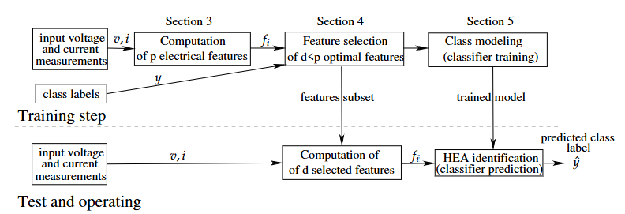
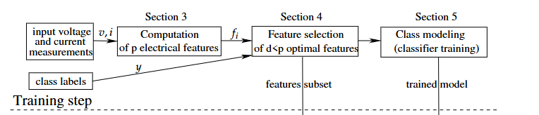

# Explanation of the Paper Pipeline Figure

This note explains the pipeline figure from:

```text
Comparative Evaluation of Non-Intrusive Load Monitoring Methods
Using Relevant Features and Transfer Learning
```

The figure shows a supervised NILM appliance-identification pipeline. It has two main phases:

```text
1. Training step
2. Test and operating step
```

The paper uses this pipeline for **classification**, meaning the final output is an appliance class label, not a continuous appliance power value.

---

## 1. Training Step

The training step is the upper half of the figure.

Its purpose is:

```text
learn which features are useful
and train a classifier using those selected features
```

### 1.1 Input Voltage And Current Measurements

The first block is:

```text
input voltage and current measurements
```

The raw signals are:

```text
v = voltage waveform
i = current waveform
```

These are high-frequency measurements collected from individual home electrical appliances.

In the paper, the authors mainly use the **steady-state** part of the appliance waveform. They do not focus on transient switching behavior.

The idea is:

```text
each appliance has a characteristic electrical signature
when it is operating steadily
```

Examples:

```text
fridge
kettle
lamp
microwave
fan
washing machine
```

---

### 1.2 Computation Of p Electrical Features

The next block is:

```text
Computation of p electrical features
```

This means the raw waveform is converted into numerical descriptors.

Instead of giving the classifier the full waveform directly, the paper computes interpretable electrical features such as:

```text
RMS current
active power
reactive power
apparent power
harmonic powers
total harmonic distortion
power factor
crest factor
```

The notation:

```text
f_i
```

means the computed feature values.

The paper first computes many features, then keeps only the features that satisfy the **additivity criterion**.

The additivity idea is important in NILM:

```text
feature(aggregate signal) should behave like
sum of feature(individual appliances)
```

This matters because NILM eventually deals with aggregate household signals, where multiple appliances may be ON together.

In the paper:

```text
90 electrical features are computed
34 additive features are kept
```

So here:

```text
p = number of candidate features
```

For the paper's selected additive feature pool:

```text
p = 34
```

---

### 1.3 Class Labels

The figure also shows:

```text
class labels
```

These are the known ground-truth appliance classes used during supervised training.

Example class labels:

```text
fridge
kettle
microwave
lamp
fan
```

The paper's target is:

```text
y = appliance class label
```

This is why the paper is a **classification** study.

The class labels are used in both:

```text
feature selection
classifier training
```

For example, Mutual Information feature selection needs the class labels because it asks:

```text
how much information does this feature contain about the appliance class?
```

---

### 1.4 Feature Selection Of d < p Optimal Features

This is the central block:

```text
Feature selection of d < p optimal features
```

This block reduces the full feature set.

The idea is:

```text
start with p candidate features
select only d useful features
where d is smaller than p
```

So:

```text
p = original number of candidate features
d = number of selected features
d < p
```

The purpose is to:

```text
remove weak features
reduce overfitting
reduce computation cost
improve interpretability
improve classifier performance
```

The paper compares several feature-selection methods:

```text
KNN-based sequential forward selection
LDA-based sequential forward selection
Mutual Information
PCA
LDA
DNN-based feature scoring
```

Each method produces a different selected feature subset.

For example, from the paper's Table 2:

```text
MI selects 20 features
KNN-based sequential forward selection selects 12 features
LDA selects 14 features
DNN selects 27 features
```

This means the paper is not testing only one pipeline. It tests several feature-selection pipelines and compares the downstream classification performance.

---

### 1.5 Features Subset

The output of feature selection is:

```text
features subset
```

This is the final selected list of features.

Example from the paper's MI feature selection:

```text
P1, P, P5, Q, Q1, QH, PH, ...
```

These selected features are then used in two places:

```text
1. classifier training
2. test-time feature computation
```

This is important:

The model must be trained and tested using the same selected feature subset.

If the selected subset is:

```text
P1, P, Q, QH
```

then during testing, the system should compute only:

```text
P1, P, Q, QH
```

or at least only pass those selected features into the classifier.

---

### 1.6 Class Modeling / Classifier Training

The next block is:

```text
Class modeling
(classifier training)
```

This is where the selected features are used to train a classifier.

The paper evaluates classifiers such as:

```text
KNN
LDA
DNN
Random Forest
```

The classifier learns the relationship:

```text
selected features -> appliance class
```

For example:

```text
[P1, P, Q, QH, THDI, ...] -> fridge
[P1, P, Q, QH, THDI, ...] -> microwave
```

The output of this stage is:

```text
trained model
```

This trained model is then used during the test and operating step.

---

## 2. Test And Operating Step

The lower half of the figure shows what happens after training.

Its purpose is:

```text
use the trained feature subset and trained classifier
to identify an unknown appliance measurement
```

---

### 2.1 Input Voltage And Current Measurements

At test time, the system receives new voltage and current measurements:

```text
v = new voltage waveform
i = new current waveform
```

These are measurements from an appliance that the model has not seen during training.

The goal is to predict its class.

---

### 2.2 Computation Of d Selected Features

The test-time feature computation block is:

```text
Computation of d selected features
```

This is different from the training feature computation block.

During training, the paper first computes:

```text
p candidate features
```

Then feature selection chooses:

```text
d selected features
```

During testing, the system only needs the selected feature subset:

```text
d features
```

This reduces computation and keeps the test input consistent with the trained classifier.

Example:

If feature selection chose:

```text
P1, Q1, P7, Q3, Q, P
```

then the test pipeline computes or uses only those selected features.

---

### 2.3 HEA Identification / Classifier Prediction

The final block is:

```text
HEA identification
(classifier prediction)
```

HEA means:

```text
Home Electrical Appliance
```

The trained classifier receives the selected feature values and predicts:

```text
predicted class label
```

The figure denotes this as:

```text
ŷ
```

This is the predicted appliance class.

Example:

```text
input selected features -> trained classifier -> predicted label = microwave
```

So the final output is:

```text
appliance identity
```

not:

```text
appliance power value
```

---

## 3. Why The Figure Has Two Horizontal Parts

The dashed line separates:

```text
training
```

from:

```text
testing / operation
```

During training, the model is allowed to use:

```text
raw measurements
computed features
ground-truth labels
feature selection
classifier training
```

During testing, the model only has:

```text
new measurements
selected feature computation
trained classifier
```

It does not know the true class label during testing. The classifier must predict it.

---

## 4. Where Our mRMR Fits In This Figure

Our `mRMR.py` corresponds to this block:

```text
Feature selection of d < p optimal features
```

In other words:

```text
paper feature-selection block = replaceable block
our replacement block = mRMR
```

The paper uses several feature-selection methods in this block:

```text
MI
PCA
LDA
Sequential Forward Selection
DNN feature scoring
```

Our method would insert:

```text
mRMR feature selection
```

So the modified pipeline becomes:

```text
input voltage/current
-> compute p HF features
-> mRMR feature selection
-> selected d features
-> train NILM model
-> predict target
```

---

## 5. Difference Between Paper Pipeline And Our Current Pipeline

The paper's pipeline is mainly:

```text
steady-state individual appliance waveform
-> electrical feature extraction
-> feature selection
-> appliance classification
```

The target is:

```text
y = appliance class
```

Our current pipeline is:

```text
ON-period plus small OFF buffer
-> HF feature extraction
-> feature selection using mRMR
-> downstream NILM model
```

Our current default target in `mRMR.py` is:

```text
y = appliance_power
```

So our current mRMR ranking is mainly for:

```text
power regression feature selection
```

not pure appliance class identification.

However, our script can also support ON/OFF classification if we run:

```text
python feature_selection/mRMR.py --target on_off
```

---

## 6. Conceptual Mapping

| Paper Figure Block | Meaning In Paper | Our Project Equivalent |
|---|---|---|
| input voltage/current measurements | high-frequency appliance waveform | UK-DALE high-frequency voltage/current windows |
| computation of p electrical features | compute candidate electrical descriptors | compute HF features such as RMS, harmonics, THD, DWT, spectral features |
| class labels | appliance identity | `appliance_power` for regression or `on_off` for classification |
| feature selection of d < p optimal features | choose useful feature subset | `mRMR.py` ranking and top-k feature selection |
| class modeling | train classifier | train NILM regressor/classifier |
| trained model | fitted appliance classifier | fitted NILM prediction model |
| computation of d selected features | compute only selected features at test time | use mRMR-selected HF features |
| HEA identification | predict appliance class | predict appliance power or ON/OFF state |

---

## 7. Main Idea In One Sentence

The figure shows that NILM does not need to use every extracted electrical feature. Instead, it first computes many interpretable features, selects a smaller useful subset, trains a model on that subset, and then uses the same selected subset during testing.

For our work, the key contribution is:

```text
replace the paper's feature-selection block with mRMR
so selected HF features are both target-relevant and non-redundant
```

