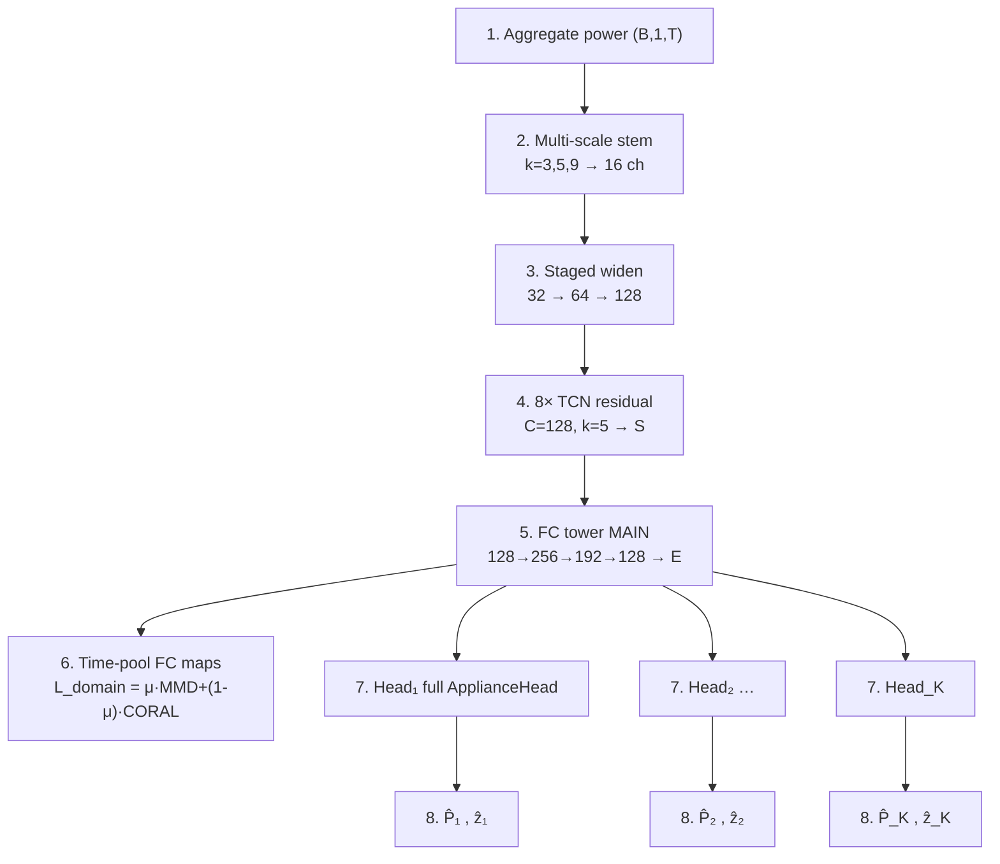
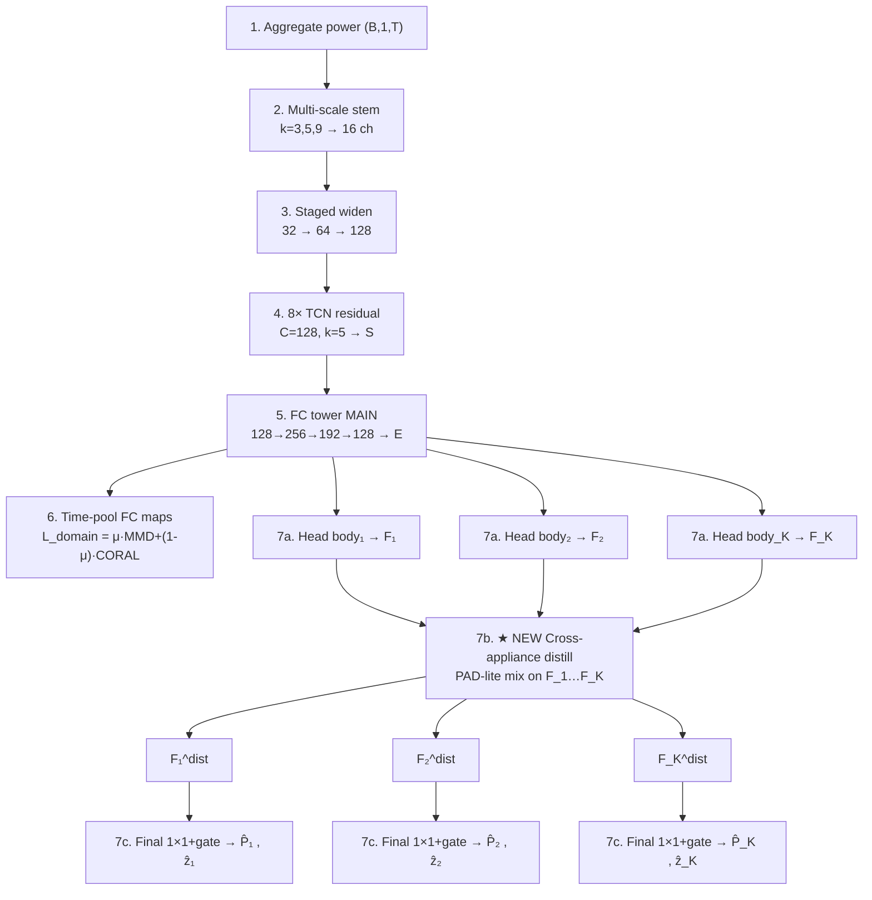
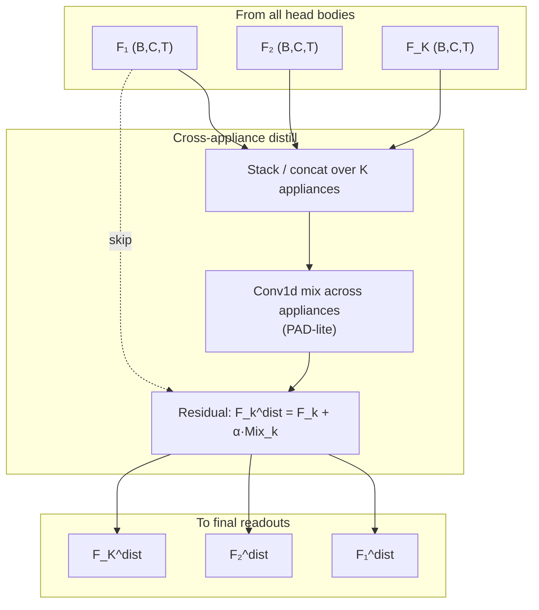
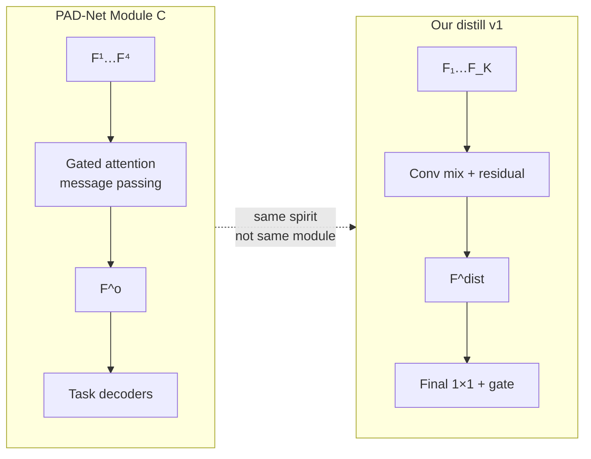

# MATUDA Architecture Upgrade (Before / After)

Design document only — not implemented yet.  
English-only. Idea: **keep the current model**, add a **cross-appliance distill** block (PAD-Net style).

Related: `RELATED_LITERATURE_MTL_UDA.md`, `matuda_vs_multinilm_architecture_params.md`.

---

## Symbols

| Symbol | Meaning |
|--------|---------|
| `S` | Shared TCN features `(B, 128, T)` |
| `E` | Shared embedding after FC tower `(B, 128, T)` (same as today’s last FC map) |
| `F_k` | Appliance-`k` features from head body `(B, C, T)` — **not** a prediction |
| `F_k^dist` | Features after cross-appliance distill |
| `ẑ_k` | ON/OFF logits (**only** prediction stage, after distill) |
| `P̂_k` | Gated power (**only** prediction stage, after distill) |

No coarse readout.

---

## 1. BEFORE — complete current model

Same as `matuda.yaml` / `MATUDA.py` today.

### 1.1 Block list

| # | Block | Detail |
|---|--------|--------|
| 1 | Input | Aggregate `(B, 1, T)`, `T=480` |
| 2 | Stem | Multi-scale `k=3,5,9` → 16 ch each |
| 3 | Widen | `32 → 64 → 128` |
| 4 | TCN | `8×` residual, `C=128`, `k=5` → `S` |
| 5 | FC tower | `128→256→192→128` on **main path** → `E` |
| 6 | DA hooks | Time-pool FC maps → MMD+CORAL (train) |
| 7 | Heads | `5×` full `ApplianceHead` (independent) |
| 8 | Outputs | `(P̂_k, ẑ_k)` directly from each head |

### 1.2 Complete diagram (before)



### 1.3 Data flow (before)

```text
x → stem → widen → TCN(S) → FC(E) → Head_k → (P̂_k, ẑ_k)
                              ↓
                         pool → L_domain
```

Heads do **not** talk to each other.

---

## 2. AFTER — same model + distill

**Only structural add:** split each head into **body → F** and **final 1×1**, insert **distill** between them.  
**Unchanged:** stem, widen, TCN, FC on main path, DA on pooled FC, MultiNILM loss style.

### 2.1 Block list

| # | Block | vs BEFORE |
|---|--------|-----------|
| 1–5 | Aggregate → stem → widen → TCN → FC | **Same** |
| 6 | DA on pooled FC | **Same** |
| 7a | Head **body** (local residual) → `F_k` | Split from old head |
| 7b | **★ NEW Distill** `F → F^dist` | **Added** |
| 7c | Final **1×1 + gate** → `(P̂_k, ẑ_k)` | Was inside old head; now after distill |
| 8 | Outputs | Same meaning; produced after distill |

### 2.2 Complete diagram (after)



### 2.3 Data flow (after) — one line

```text
x → stem → widen → TCN(S) → FC(E) → HeadBody_k → F_k
                                                    ↓
                                         Distill(F_1…F_K)
                                                    ↓
                                              F_k^dist
                                                    ↓
                                         Final 1×1+gate → (P̂_k, ẑ_k)
                              ↓
                         pool FC → L_domain   (unchanged side use of FC maps)
```

Same backbone as BEFORE; **new piece is only Distill (+ exposing F / final readout).**

### 2.4 Where predictions live

```text
F_k          = feature          (no ON/OFF, no watts)
F_k^dist     = mixed feature
(P̂_k, ẑ_k)  = ONLY power + ON/OFF   ← after distill
```

---

## 3. Distill block (complete detail)

### 3.1 Diagram



### 3.2 Pseudo-code

```text
# After FC embedding E feeds each head body:
F[k] = HeadBody_k(E)                  # (B, C, T)

H = stack(F[1..K])                    # (B, K, C, T)
U = ConvMix(reshape H → (B, K*C, T))  # mix across appliances
U = reshape → (B, K, C, T)

for k:
    F_dist[k] = F[k] + alpha * U[:, k]

for k:
    z[k] = Conv1d(C→1)(F_dist[k])     # ON/OFF
    p_raw = Conv1d(C→1)(F_dist[k])
    P[k] = gate(z[k]) * p_raw + (1-gate) * off_norm
```

### 3.3 Inputs / outputs of distill

| | Tensor |
|--|--------|
| In | `F_1 … F_K` only |
| Out | `F_1^dist … F_K^dist` |
| Not in | `P̂`, `ẑ` |

---

## 4. Side-by-side (same backbone)

```text
BEFORE:
  stem → TCN → FC → [Full Head] ──────────────────────→ (P̂, ẑ)

AFTER:
  stem → TCN → FC → [Head body] → F → [Distill] → F^dist → [1×1] → (P̂, ẑ)
                      └──────────── same old Head, split ─────────────┘
```

| Item | BEFORE | AFTER |
|------|--------|-------|
| Stem / TCN / FC main | Yes | **Same** |
| DA on pooled FC | Yes | **Same** |
| Cross-appliance | No | **Distill added** |
| Head | One full head → outs | Body → F → distill → final 1×1 |
| Coarse aux | — | **None** |
| Outputs | `(P̂, ẑ)` | `(P̂, ẑ)` after distill |

---

## 5. Loss (unchanged form)

```text
L_NILM   = MultiNILM MSE+BCE on final (P̂, ẑ)
L_domain = Σ_ℓ [ μ·MMD + (1-μ)·CORAL ] on pooled FC maps
L        = (1-λ) L_NILM + λ L_domain_scaled
```

---

## 6. Implementation (add into old model)

1. Keep stem / TCN / FC / DA as now.  
2. Change `ApplianceHead` to return **`F`** from the residual body (or split module).  
3. Insert `CrossApplianceDistill`.  
4. Add shared or per-app final `1×1` power/state + gate.  
5. Train as today (`matuda.yaml`); then ablate `cross_appliance.enabled`.

```yaml
architecture:
  cross_appliance:
    enabled: true
    mode: pad_lite
    residual_scale: 0.5
```

---

## 7. Experiments

| ID | Distill | Purpose |
|----|---------|---------|
| B0 | off | Current baseline |
| B2 | on | Old model + distill |
| B3 | on + DA tune | Full |

---

## 8. Why we do **not** copy PAD-Net Module C first

PAD-Net paper figure **(c) Multi-modal Distillation Module C** uses **Attention-Guided Message Passing** with gate nodes **G**:

```text
Y_i^1..Y_i^4  →  F_i^1..F_i^4
                    ↓
         Attention-Guided Message Passing (G)
                    ↓
              F_i^{o,1} , F_i^{o,4}  →  Decoder(depth) / Decoder(parsing)
```

That is the **full** PAD-Net distill for vision multi-task (depth + parsing, plus intermediate modalities).

### 8.1 Why not implement Module C as v1

| Reason | Detail |
|--------|--------|
| **Different task geometry** | Module C mixes **vision modalities** (depth / parsing / mid-level maps) on 2D feature grids. We mix **K appliance 1D features** `(B,C,T)`. A literal port of G-gates is non-trivial and easy to get wrong. |
| **Ablation first** | We still need to prove *any* cross-appliance mix helps H2. A tiny Conv mix (PAD-lite) is enough to test the hypothesis; Module C adds many knobs (attention, gates, which pairs talk). |
| **Stability with dual outputs** | Each of our appliances already has ON/OFF + power. Heavy gated message passing on top of Lin DA can amplify negative transfer before we know distill helps. |
| **Engineering cost** | Module C needs careful message routing per “receiver” task. Our K=5 appliances → O(K²) gated paths if done naively; PAD-lite is O(1) Conv on stacked channels. |
| **Paper honesty** | Citing “PAD-Net-inspired” is fine for residual cross-task distill. Claiming “we use Module C” would be false until we actually build G-style attention. |

**Bottom line:** same **idea** (cross-task features help before the decoder), different **first implementation** (simple mix). Module C / CTAL remain **optional v2**.

### 8.2 Mapping: PAD-Net Module C ↔ our blocks

| PAD-Net Module C | Our MATUDA + distill |
|------------------|----------------------|
| Intermediate task maps `F_i^1 … F_i^4` | Appliance features `F_1 … F_K` from head bodies |
| Attention-Guided Message Passing + gate **G** | **Not used in v1** — replaced by Conv channel-mix |
| Refined `F_i^{o,*}` | `F_k^dist = F_k + α·Mix_k` |
| Decoder for depth / parsing | Final `1×1` + hard gate → `(P̂_k, ẑ_k)` |
| Multi-modal RGB/aux tasks | Single aggregate input; “modalities” = appliances |



---

## 9. Our distill design (written clearly)

This section restates **what we actually plan to build** (does not replace §§1–7; it documents the distill choice).

### 9.1 Placement in the old model

```text
x → stem → widen → TCN → FC(E) → HeadBody_k → F_k
                                              ↓
                                   ★ Our distill (PAD-lite)
                                              ↓
                                         F_k^dist
                                              ↓
                                   Final 1×1 + gate → (P̂_k, ẑ_k)
```

- **No Module-C G gates** in this path.  
- **No coarse readout.**  
- FC + Lin DA stay as in the current model.

### 9.2 Algorithm (PAD-lite)

```text
Inputs:  F[k] ∈ R^{B×C×T}  for k = 1..K
Hyper:   alpha (residual_scale), e.g. 0.5

H = stack_k F[k]                         # (B, K, C, T)
H_cat = reshape(H) → (B, K*C, T)
U = Conv1d_{K*C→K*C}(H_cat)              # mix across appliances at each t
U = GELU(U)
U = Conv1d_{K*C→K*C}(U)                  # optional second layer
U = reshape → (B, K, C, T)

for k:
    F_dist[k] = F[k] + alpha * U[:, k]   # residual — keep own signal

for k:
    z[k] = Conv1d_{C→1}(F_dist[k])       # ON/OFF logits
    p_raw = Conv1d_{C→1}(F_dist[k])
    P[k] = gate(z[k]) * p_raw + (1-gate) * off_norm
```

### 9.3 What “message passing” means for us (vs G)

| | Module C | Ours |
|--|----------|------|
| Who talks to whom | Explicit pairs into gate **G** | All appliances mixed jointly via Conv on stacked channels |
| Soft selection | Attention / gate | Learned Conv filters (implicit) |
| Residual | Skip from `F_i` to `F_i^o` | `F_k^dist = F_k + α·Mix_k` |

So we still do **cross-appliance information share**, but as a **single shared mixer**, not per-receiver gated attention.

### 9.4 Future upgrade path (if PAD-lite helps)

If B2 (distill on) beats B0 on H2 F1 without hurting MAE:

1. **v2a — Soft gates:** per-appliance sigmoid gate on Mix (cheap step toward **G**).  
2. **v2b — Module-C-style:** for each receiver `k`, attend over `{F_j}_{j≠k}` then gate (true message passing).  
3. **v2c — CTAL:** affinity matrices over appliances × time (from the CTAL paper).

Do **not** jump to v2b/c until v1 shows a clear gain.

### 9.5 Yaml (unchanged intent)

```yaml
architecture:
  cross_appliance:
    enabled: true
    mode: pad_lite          # future: gated | pad_module_c | ctal
    residual_scale: 0.5
```

---

## 10. Short FAQ

**Q: Does our distill use PAD-Net Module C?**  
**A: No.** We use a PAD-Net-**inspired** residual Conv mix (PAD-lite).

**Q: Why mention PAD-Net at all?**  
**A:** For the high-level recipe: intermediate features → cross-task distill → task readout. That recipe is what we add into the old MATUDA stack.

**Q: Can we follow Module C later?**  
**A: Yes** — see §9.4. It is a deliberate second stage, not deleted from the plan.

---

*Sections 1–7: complete before/after + PAD-lite distill.  
Sections 8–10: why not Module C yet, and exact design of our distill vs the paper figure.*

---

## 11. Implemented in MultiNILM (code)

PAD-lite is now in the **MultiNILM** baseline (not only the upgrade sketch):

| Piece | Location |
|-------|----------|
| Head body / final readout split | `ApplianceHead.encode_features` / `decode_from_features` in `model/MultiNILM.py` |
| Distill module | `CrossApplianceDistill` (bottleneck mix `(K·C)→mid→(K·C)`, default `mid=2·C`) |
| Forward path | `MultiNILM.forward`: encode all → distill → decode |
| Yaml | `config/models/multinilm.yaml` → `architecture.cross_appliance.enabled: true` |
| Ablation | Set `enabled: false` for B0 (independent heads, old behavior) |

MATUDA still uses full `ApplianceHead.forward` (no distill) until the same block is wired there.