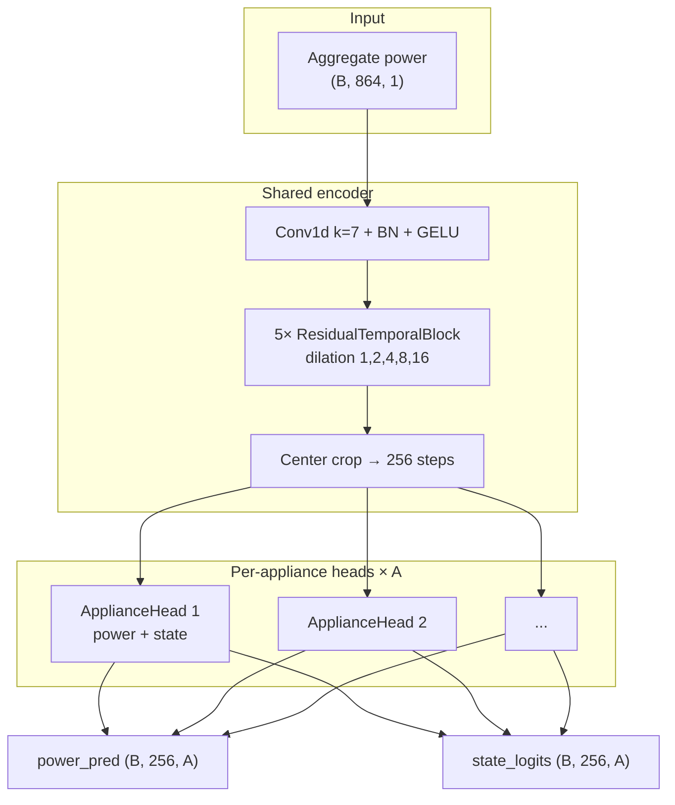

# MultiNILM

MultiNILM is a multi-appliance Non-Intrusive Load Monitoring (NILM) model in `multi_appliances_NILM`. It takes a window of aggregate (mains) power and predicts **per-appliance power** and **ON/OFF state** for every appliance in the experiment.

Implementation: `model/MultiNILM.py`  
Loss: `model/MultiNILM_loss.py`  
Config: `config/models/multinilm.yaml`

---

## Task

| | Description |
|---|-------------|
| **Input** | Z-score normalized aggregate power window |
| **Output** | Appliance power (W, normalized) + ON/OFF state logits per appliance |
| **Appliances** | Dynamic count from experiment YAML (e.g. 5 for UK-DALE, 4 for REDD) |

Tensor shapes:

```
x             : (B, T_in, 1)     aggregate input
power_pred    : (B, T_out, A)    gated appliance power
state_logits  : (B, T_out, A)    raw ON/OFF logits (sigmoid at inference)
```

---

## Windowing

Configured in `config/models/multinilm.yaml` → `windowing`.

### Default (UK-DALE / current pipeline)

| Parameter | Value | Meaning |
|-----------|-------|---------|
| `input_window_length` | **864** | Number of aggregate timesteps fed to the model |
| `output_window_length` | **256** | Number of timesteps predicted per window |
| `output_alignment` | **center** | Targets are the center 256 steps of the 864-step window |
| `input_stride` | **216** | Training sliding-window stride |
| `eval_stride` | **128** | Validation / test stride (overlapping windows) |
| `eval_reconstruction` | **overlap_mean** | Average overlapping window predictions onto the CSV timeline |
| `training_targets` | **output_window** | Train loss uses center 256 labels only |

### Input vs output alignment

For `output_alignment: center` with 864 in / 256 out:

```
Input window (864 samples)
|-------- context --------|==== target 256 ====|-------- context --------|
0                        304                 560                       864
                         ↑ model output index 0 maps to CSV index 304+i
```

The model **center-crops** temporal features to 256 steps. It does **not** interpolate the full 864-step feature map into 256 points, so each output timestep matches the dataloader label at the same CSV index.

### Stride summary

| Split | Stride | Effect |
|-------|--------|--------|
| Train | 216 | Less overlap; faster training |
| Val / test | 128 | More overlap; smoother plots and metrics after `overlap_mean` reconstruction |

---

## Model architecture

High-level flow:

```
Aggregate window (B, 1, T_in)
    → aggregate feature extractor (Conv1d k=7)
    → temporal encoder (5× dilated residual TCN blocks)
    → center-crop to T_out
    → per-appliance heads (× A)
    → power_pred, state_logits  (B, T_out, A)
```

### 1. Input formatting

`_format_input` converts `(B, T, 1)` → `(B, 1, T)` for Conv1d.

### 2. Aggregate feature extractor

| Layer | Details |
|-------|---------|
| Conv1d | 1 → `hidden_channels`, kernel 7, padding 3 |
| BatchNorm1d | over channels |
| GELU | activation |

Output shape: `(B, hidden_channels, T_in)` — time length unchanged.

### 3. Temporal encoder (shared TCN)

Five `ResidualTemporalBlock` layers with dilations **1, 2, 4, 8, 16**.

Each block:

```
Conv1d (dilated) → BatchNorm → GELU → Dropout → residual add
```

Default hyperparameters (`multinilm.yaml`):

| Hyperparameter | Default |
|----------------|---------|
| `hidden_channels` | 128 |
| `num_blocks` | 5 |
| `kernel_size` | 5 |
| `dropout` | 0.1 |

The shared encoder learns patterns from aggregate power once; all appliances share these features.

### 4. Temporal alignment

`_align_output_time` center-crops features from `T_in` to `T_out` (864 → 256). If features are shorter than `T_out`, symmetric padding is applied.

### 5. Per-appliance heads (`ApplianceHead`)

One head per appliance (not a single shared output layer).

Each head:

| Submodule | Role |
|-----------|------|
| `feature_refine` | 1×1 Conv → BN → GELU → Dropout |
| `power_head` | 1×1 Conv → raw power |
| `state_head` | 1×1 Conv → state logits |

**State-gated power** (same idea as the transfer-learning baseline):

```
state_prob = sigmoid(state_logits)
power_pred = power_raw × state_prob
```

Power is suppressed when the model predicts OFF. State logits stay unbounded for `BCEWithLogitsLoss` during training.

### Architecture diagram



---

## Loss function

Defined in `model/MultiNILM_loss.py` (paper-style multitask loss, equation 16).

### Per-appliance terms

For each appliance \(i\):

**Power (regression)**

\[
L_{\text{power}}^{i} = \frac{1}{B \cdot T} \sum_{b,t} \left( \hat{y}_{b,t}^{i} - y_{b,t}^{i} \right)^2
\]

**State (classification)**

\[
L_{\text{state}}^{i} = \text{BCEWithLogits}\!\left(\hat{o}_{b,t}^{i},\; z_{b,t}^{i}\right)
\]

with optional per-appliance `pos_weight` for imbalanced ON/OFF labels.

### Total loss

\[
L = \sum_{i=1}^{A} L_{\text{power}}^{i} + \lambda_{\text{state}} \sum_{i=1}^{A} L_{\text{state}}^{i}
\]

Default from `multinilm.yaml`:

| Setting | Value |
|---------|-------|
| `lambda_state` | 1.0 |
| `pos_weight` | `auto` (computed from training ON rates: \((1-p)/p\) per appliance) |

Power and state targets are **z-score normalized** appliance power and threshold-based ON/OFF labels from the experiment YAML (`state_label_source: threshold`).

### Training vs inference

| Stage | Power | State |
|-------|-------|-------|
| **Loss** | MSE on gated `power_pred` | BCEWithLogits on `state_logits` |
| **Metrics / F1** | Denormalize to watts for MAE | `pred_on_source` in model YAML (`state_head`, `power_threshold`, or `combined`) |

---

## Training defaults

From `config/models/multinilm.yaml`:

| Parameter | Value |
|-----------|-------|
| Batch size | 32 |
| Learning rate | 1×10⁻⁴ |
| Optimizer | Adam |
| Epochs | 100 |
| Checkpoint monitor | `val_f1` |
| Early stopping | 30 epochs |

Run:

```bash
python main.py --mode train_evaluate --model multinilm --experiment config/experiment_ukdale.yaml
```

---

## File map

| File | Purpose |
|------|---------|
| `model/MultiNILM.py` | Model definition |
| `model/MultiNILM_loss.py` | Multitask loss |
| `adapters/multinilm.py` | Pipeline adapter (forward, loss, inference) |
| `config/models/multinilm.yaml` | Windowing, architecture, loss, training |
| `config/experiment_*.yaml` | Dataset paths, normalization, ON thresholds |
