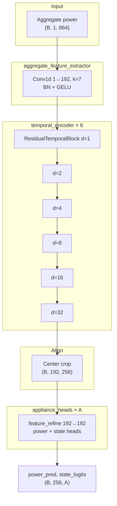
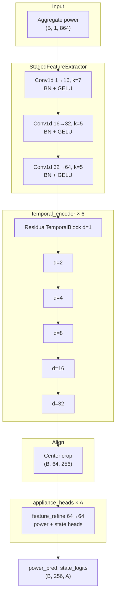
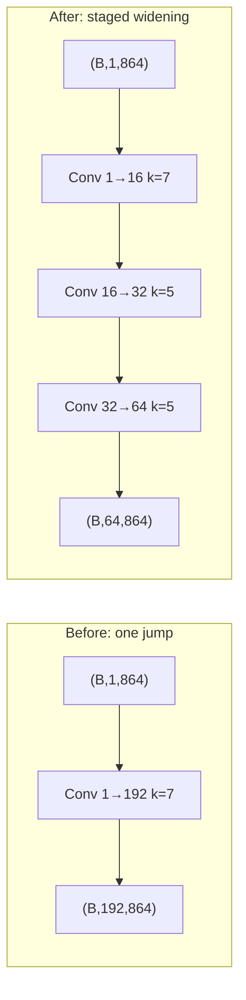

# MultiNILM architecture change: gradual channel expansion

This document records the **before → after** redesign of the shared encoder in MultiNILM. The goal is to match the *seq2point* idea of widening channels gradually (1 → 16 → 32 → 64) instead of jumping from 1 input channel to 192 in a single convolution.

**Implementation:** `model/MultiNILM.py`  
**Config:** `config/models/multinilm.yaml`

---

## Summary

| Item | Before | After |
|------|--------|-------|
| First conv | 1 → **192** (k=7) | 1 → **16** → **32** → **64** (k=7, 5, 5) |
| TCN width | 192 channels | **64** channels |
| TCN depth | 6 blocks | 6 blocks (unchanged) |
| Appliance heads | 192 → 192 refine | **64 → 64** refine |
| Feature-map Y-axis | 192 channels | **64** channels |
| YAML key | `hidden_channels: 192` only | `channel_schedule: [16, 32, 64]` + `hidden_channels: 64` |

---

## Before (single wide jump)

### High-level flow



### Layer shapes (UK-DALE defaults, T_in=864, T_out=256, A=5)

| Stage | Layer | Output shape |
|-------|-------|--------------|
| Input | aggregate window | `(B, 1, 864)` |
| Stem | Conv1d 1→192, k=7 + BN + GELU | `(B, 192, 864)` |
| TCN | 6× ResidualTemporalBlock @ 192 ch | `(B, 192, 864)` |
| Align | center crop | `(B, 192, 256)` |
| Head (each) | feature_refine 192→192 + power/state 1×1 | `(B, 1, 256)` per stream |
| Output | concat + permute | `(B, 256, 5)` |

### Design note

The first layer maps one mains waveform directly into a **192-dimensional** feature space. That is a large capacity jump compared with classic seq2point encoders (e.g. 1→30→30→40→50) and makes early feature maps harder to interpret.

---

## After (gradual channel schedule)

### High-level flow



### Layer shapes (new defaults)

| Stage | Layer | Output shape |
|-------|-------|--------------|
| Input | aggregate window | `(B, 1, 864)` |
| Stage 1 | Conv1d 1→16, k=7 + BN + GELU | `(B, 16, 864)` |
| Stage 2 | Conv1d 16→32, k=5 + BN + GELU | `(B, 32, 864)` |
| Stage 3 | Conv1d 32→64, k=5 + BN + GELU | `(B, 64, 864)` |
| TCN | 6× ResidualTemporalBlock @ 64 ch | `(B, 64, 864)` |
| Align | center crop | `(B, 64, 256)` |
| Head (each) | feature_refine 64→64 + power/state 1×1 | `(B, 1, 256)` per stream |
| Output | concat + permute | `(B, 256, 5)` |

### Side-by-side stem comparison



---

## Config change

### Before (`multinilm.yaml`)

```yaml
architecture:
  input_channels: 1
  hidden_channels: 192
  num_blocks: 6
  kernel_size: 5
  dropout: 0.12
```

### After (`multinilm.yaml`)

```yaml
architecture:
  input_channels: 1
  channel_schedule: [16, 32, 64]
  hidden_channels: 64          # must equal last value in channel_schedule
  stem_kernel_size: 7          # first staged conv only
  stage_kernel_size: 5         # remaining staged convs
  num_blocks: 6
  kernel_size: 5
  dropout: 0.12
```

`hidden_channels` still sets the TCN width and appliance-head width. When `channel_schedule` is set, its **last entry must match** `hidden_channels`.

If `channel_schedule` is omitted, the model falls back to the old single Conv1d jump (`input_channels → hidden_channels`).

---

## What stayed the same

- Input window: **864** samples; output window: **256** (center-aligned).
- Shared TCN with dilations **1, 2, 4, 8, 16, 32** (6 blocks).
- Per-appliance heads with state-gated power: `power = power_raw × sigmoid(state)`.
- Loss, training loop, evaluation, and feature-map hooks (still on `feature_refine` in each head).
- Multi-appliance design: one model, **A** heads (vs seq2point’s one model per appliance).

---

## Feature maps

Feature maps are still taken from each appliance head’s `feature_refine` output (post Conv+BN+GELU):

| | Before | After |
|---|--------|-------|
| Hook location | `appliance_heads[i].feature_refine` | same |
| Channels (Y-axis) | 192 | **64** |
| Time axis | 256 (cropped center window) | 256 |

---

## Retraining note

Checkpoints trained with the **192-channel** stem are **not compatible** with the new **64-channel** staged encoder. Retrain from scratch after syncing these files to your GPU machine:

```bash
python main.py --mode train_evaluate --model multinilm --experiment config/experiment_ukdale.yaml
```

Files to sync:

- `model/MultiNILM.py`
- `adapters/multinilm.py`
- `config/models/multinilm.yaml`
- `docs/MultiNILM_architecture_change.md`
