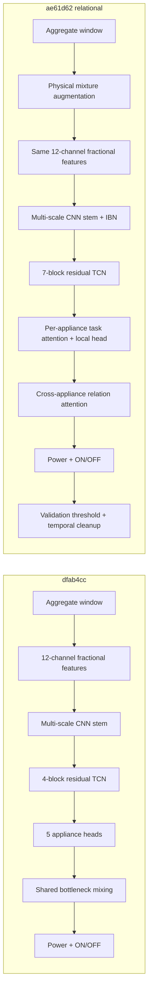

# MultiNILM-Fractional: `dfab4cc` 到 `ae61d62` 升级总结

## 对比范围

- 昨日版本：`dfab4cc2d70662e8516d0795c9e3cafb8ebf3e01`
- 升级版本：`ae61d627f41e20806ac3cbc5c70e9e64918d3a1d`
- 完整升级实验配置：`config/models/multinilm_fractional_relational.yaml`
- 模型仍然是一次同时预测 kettle、fridge、dishwasher、washingmachine 和 microwave，并不是逐个电器扣除 residual 后再预测。
- Domain adaptation 在这个实验中仍然关闭：`lambda_domain: 0.0`、`domain_adaptation.enabled: false`。

> 重要区别：`multinilm_fractional.yaml` 是 precision-guard 基线；`multinilm_fractional_relational.yaml` 才开启 `ae61` 新增的完整 relational + physics 方法。

## 一句话总结

`dfab4cc` 主要依靠共享 TCN、普通跨电器 bottleneck 和每个电器独立的 power/state head；`ae61d62` 在保留原有 12 通道输入的基础上，引入更长时间感受野、早期 IBN、每电器任务注意力、动态跨电器关系注意力、事件边界/相对能量/aggregate 物理约束，以及物理一致的数据增强和 validation 状态校准。

## 整体结构变化

## 保持不变的部分

| 项目 | 两个版本 |
|---|---|
| 输入窗口 | 2048 samples，6 秒采样时约 3.41 小时 |
| train/eval stride | 1024 samples，50% overlap |
| 输入特征 | 12 通道 |
| 通道组成 | raw 1 + fractional 4 + absolute delta 1 + rolling mean 3 + rolling std 3 |
| CNN channel schedule | `32 -> 64 -> 128` |
| Multi-scale kernels | `[3, 5, 9]` |
| 每电器输出 | power regression + ON/OFF state logits |
| Hidden channels | 128 |
| Batch size | 64 |
| Learning rate | `1e-4` |
| Weight decay | `1e-4` |
| Dropout | 0.25 |
| Checkpoint score | `7 * normalized validation MAE - validation macro F1`，越低越好 |

## 1. 模型架构升级

| 部分 | `dfab4cc` | `ae61d62` relational | 目的 |
|---|---|---|---|
| Stem normalization | BatchNorm | 前端 IBN，后续 TCN/head 保留 BatchNorm | 一半 InstanceNorm 减少 house/domain style，一半 BatchNorm 保留功率幅值 |
| TCN blocks | 4 | 7 | 学习更长的 ON duration 和 appliance cycle |
| TCN dilations | `1,2,4,8` | `1,2,4,8,16,32,64` | 从局部变化扩展到长时间上下文 |
| TCN receptive field | 约 121 samples，仅指 TCN | 1017 samples，约 101.7 分钟 | 减少仅记忆固定短波形宽度的问题 |
| Per-appliance head | 两层 local Conv1D + residual | 加入 task/channel attention 后再进入原 local head | 不同电器从共享特征中选择不同通道 |
| Cross-appliance module | 固定 bottleneck mixing | 每个 timestep 的 relation attention + gated message | 动态学习电器共现、混淆和互斥关系 |
| Cross residual scale | 0.5 | 0.25 | 降低其他电器错误特征污染当前 head 的风险 |

### IBN

早期特征通道被分成两半：

\[
F_{stem}=\operatorname{Concat}(\operatorname{IN}(F_{1}),\operatorname{BN}(F_{2})).
\]

InstanceNorm 部分降低不同房屋 baseline/noise style 的影响；BatchNorm 部分保留 NILM 很重要的绝对幅值信息。因此没有把全部层都改成 InstanceNorm。

### 每电器任务注意力

每一个 appliance head 都学习自己的通道权重：

\[
A_i=\sigma\left(W_{2,i}\operatorname{ReLU}(W_{1,i}F)\right),\qquad
F_i^{att}=F\odot A_i.
\]

同一份共享 TCN feature 会被 kettle、fridge、microwave 等以不同方式读取。

### 跨电器关系注意力

旧版将所有 appliance feature 拼接后通过固定 bottleneck 卷积混合。新版在每个时间点把电器视为 5 个 token：

\[
R_{ij,t}=\operatorname{softmax}_{j}\left(\frac{Q_{i,t}K_{j,t}^{T}}{\sqrt d}\right),
\]

\[
F'_{i,t}=F_{i,t}+0.25\,G_{i,t}\odot
\sum_jR_{ij,t}V_{j,t}.
\]

`G` 是 sigmoid message gate。这样 microwave head 可以参考其他 head 当时的证据，但不会无条件接受其他电器的特征。

## 2. Loss 升级

### 旧版本

旧版核心目标较简单：

\[
L_{old}=L_{power}+\lambda_s L_{state}^{balanced},
\]

其中 `power` 主要是所有电器的全时段 MSE，`state` 是带自动 `pos_weight` 的 BCE。`lambda_state=1.0`，没有显式约束事件边界、窗口能量或总功率分配。

### 新版本

新版 relational 配置使用：

\[
L_{new}=L_{power}^{structured}
+L_{state}^{structured,balanced}
+L_{aggregate}.
\]

每个电器的 power loss 近似为：

\[
L_{power,i}=L_{MSE}
+1.0L_{ON-MSE}
+0.5L_{OFF-MSE}
+0.15L_{\Delta power}
+0.25L_{relative-energy}.
\]

- `ON-MSE`：加强真正 ON 区域的幅值学习。
- `OFF-MSE`：抑制 appliance OFF 时仍然输出功率。
- `delta power`：匹配 rise/fall 和局部波形变化，只在 ON/边界附近计算。
- `relative energy`：比较整段窗口预测能量与真实能量，避免只有平均点误差好看。

State loss 变为：

\[
L_{state,i}=L_{BCE,i}+1.0L_{false-positive,i}+0.20L_{transition,i}.
\]

- `pos_weight` 仍由训练 ON rate 自动计算，但上限从无限制改为 12，避免 rare appliance 产生过强的全程 ON 压力。
- `lambda_state` 从 1.0 降为 0.8。
- False-positive loss 在真实 OFF 区域惩罚高 ON probability：

\[
L_{FP}=\operatorname{mean}_{z=0}(p_{on}^{2}).
\]

- Transition loss 监督相邻时刻是否发生 state change，用来改善事件起点、终点、宽度与连续性。

Aggregate consistency 只惩罚“不可能的过度分配”：

\[
L_{aggregate}=\operatorname{mean}\left[
\frac{\operatorname{ReLU}(\sum_i\hat y_i-x-30W)}{1000W}
\right]^2.
\]

它允许 `aggregate - sum(predicted appliances)` 保留为未知电器/背景负载，不强迫 5 个目标电器解释全部 aggregate。

### Loss 平衡方式

Power 与 state 的数值尺度不同，仍使用 stop-gradient 动态尺度：

\[
L_{state}^{balanced}=0.8L_{state}
\operatorname{stopgrad}\left(\frac{L_{power}}{L_{state}}\right).
\]

因此 `lambda_state=0.8` 表示 state 梯度贡献约为 power 的 80%，不是直接把原始 BCE 乘 0.8 后相加。

## 3. 训练与超参数升级

| 参数 | `dfab4cc` | `ae61d62` relational |
|---|---:|---:|
| Maximum epochs | 120 | 200 |
| Early-stop patience | 15 | 55 |
| Minimum epochs before early stop | 无 | 100 |
| ReduceLROnPlateau patience | 5 | 12 |
| State positive-weight cap | 无 | 12 |
| Data augmentation | 无 | 80% batch probability |
| Appliance gain | 无 | `[0.80, 1.25]` |
| Unknown residual gain | 无 | `[0.50, 1.25]` |

旧版容易在 validation 暂时波动时过早停止。新版至少训练 100 epochs，并给 scheduler 和 early stopping 更长观察期。

## 4. 物理一致的数据增强

先从 aggregate 中估算未建模背景负载：

\[
r=\max\left(x-\sum_i y_i,0\right).
\]

然后独立改变每个目标电器和 residual 的幅值，并重新构造 aggregate：

\[
y'_i=g_i y_i,\qquad
x'=g_r r+\sum_i y'_i.
\]

这不是直接给 aggregate 加随机噪声。输入 `x'` 与监督目标 `y'` 始终保持物理一致，目的是模拟不同房屋的 appliance amplitude 和未知背景负载变化。

## 5. Validation 校准与后处理

旧版默认使用统一 `0.5` ON threshold。新版：

1. 只在 validation split 上，对每个电器搜索 `0.05` 到 `0.98` 的 threshold。
2. 选择 sample-level F1 最高的 threshold，并保存到 `state_calibration.json`。
3. Test 只读取 validation 选出的 threshold，避免 test leakage。
4. 删除短于 appliance-specific minimum duration 的 ON event。
5. 合并短于 appliance-specific gap 的相邻 ON event。
6. 最终 power waveform 使用校准后的 ON mask 重新 gate。

Relational 配置中的最短 ON samples 是 `3/20/160/300/3`，最大 merge gaps 是 `0/40/300/160/2`，顺序为 kettle、fridge、dishwasher、washingmachine、microwave。

这部分属于 evaluation/post-processing，不是神经网络内部层；它会改变最终 F1、事件数量和输出波形，但不会反向改善训练得到的 raw state probability。

## 最终结论

这次升级的核心并不是单纯“加深网络”，而是同时处理三个 NILM 问题：

1. **Cross-house feature shift**：使用早期 IBN 和物理 mixture augmentation。
2. **事件宽度与波形不合理**：增加长 TCN、delta loss、transition loss 和 relative-energy loss。
3. **多电器之间互相混淆与总功率不合理**：增加 cross-appliance relation attention、false-positive penalty 和 one-sided aggregate consistency。

同时需要注意：validation threshold 和 duration cleanup 可能通过减少预测事件提高 precision，却牺牲 recall。因此必须同时记录 `predicted_events`、event precision/recall/F1、zero-coverage rate 和 event duration/energy coverage，不能只看最终 sample F1。

## 相关代码

- `model/MultiNILM.py`：IBN、task attention、cross-appliance relation attention。
- `model/MultiNILM_loss.py`：structured power/state loss、relative energy、aggregate consistency。
- `adapters/multinilm.py`：物理 mixture augmentation 及新增 loss 接线。
- `evaluation/state_postprocess.py`：validation threshold calibration 与事件后处理。
- `config/models/multinilm_fractional_relational.yaml`：完整升级实验参数。
