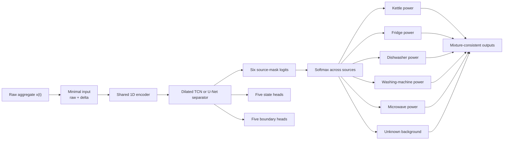
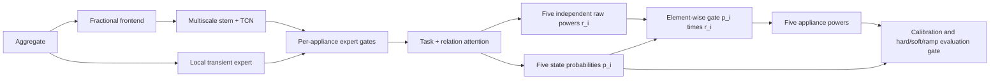
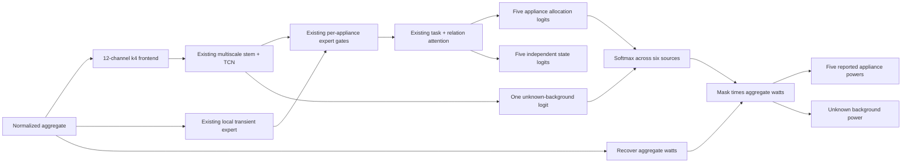

# Event-Aware Mixture-Consistent Multi-Appliance NILM

## 跨领域理论、模型设计与实验计划

## 1. 核心结论

当前问题不应继续被定义为“从 aggregate 独立回归五条 appliance power waveform”。更合适的定义是：

> 在包含未知负载的单通道加性混合信号中，分离五个已知 appliance sources 和一个未知 background source，同时显式学习 appliance state、事件边界和物理一致性。

对应的新研究方向可以命名为：

> **Event-Aware Mixture-Consistent Multi-Appliance Disaggregation under Unknown Background Loads**

该方向主要借鉴四个 NILM 以外的领域：

1. 单通道音频和语音源分离；
2. 未知噪声下的 speech enhancement；
3. Temporal action segmentation；
4. Multi-task learning 和 gradient interference。

这些领域分别回答：

- 为什么 MSE 会产生模糊输出；
- 如何从一个 mixture 分离多个 sources；
- 如何处理没有标签的未知背景；
- 如何显式学习 ON/OFF 边界；
- 如何诊断多个 appliance 之间的梯度冲突。

---

## 2. 为什么 NILM 本质上困难

Aggregate power 可以表示为：

$$
x(t)=\sum_{i=1}^{A}y_i(t)+b(t)+\epsilon(t),
$$

其中：

- $x(t)$：aggregate power；
- $y_i(t)$：第 $i$ 个目标 appliance；
- $b(t)$：所有未建模和未监测负载；
- $\epsilon(t)$：测量误差和时间同步误差。

在本项目中，$A=5$：

- kettle；
- fridge；
- dishwasher；
- washing machine；
- microwave。

同一个 aggregate observation 可以存在多个合理解释。例如：

$$
300\text{ W}
=100\text{ W fridge}+200\text{ W unknown},
$$

也可能是：

$$
300\text{ W}
=0\text{ W fridge}+300\text{ W unknown}.
$$

因此，aggregate-only NILM 是一个欠定的 inverse problem。8 秒采样还会进一步删除 microwave 和 fridge 的部分瞬态信息。

模型不可能从输入中恢复已经不存在的信息。合理目标不是强迫模型始终生成一条 waveform，而是：

- 只在存在足够事件证据时分配目标 appliance power；
- 将无法解释的功率保留给 unknown/background；
- 保证预测满足基本物理约束；
- 对 state、边界和 ON-state amplitude 分别建模。

---

## 3. 为什么当前模型产生模糊、不合理的 waveform

### 3.1 MSE 学习条件平均

使用 MSE 时，最优回归预测倾向于：

$$
\hat y(x)=E[y\mid x].
$$

当一个 aggregate pattern 可能来自多个来源时，模型可能输出多个可能结果的平均值。

真实情况可能是：

```text
Fridge OFF = 0 W
Fridge ON  = 100 W
```

但不确定时，MSE 可能输出：

```text
Fridge prediction = 40–70 W
```

这在数值上可能降低平均误差，但不符合真实 appliance state。

[Mathieu, Couprie and LeCun, *Deep Multi-Scale Video Prediction Beyond Mean Square Error*, ICLR 2016](https://arxiv.org/abs/1511.05440) 在视频预测中明确讨论了标准 MSE 导致模糊预测的问题。该结果来自视觉领域，但“多解回归产生条件平均”的机制同样适用于功率 waveform 回归。

这篇论文在本项目中的用途是解释问题，不表示应该直接引入 GAN。

### 3.2 当前 soft gate 允许状态和幅值互相补偿

当前模型使用：

$$
\hat y_i(t)=p_i(t)a_i(t),
$$

其中 $p_i$ 是 ON probability，$a_i$ 是 raw power amplitude。

例如：

$$
p_i=0.5,\qquad a_i=160\text{ W}
$$

仍然可以得到：

$$
\hat y_i=80\text{ W}.
$$

因此 state head 和 power head 不一定分别学习正确语义。它们可以通过互相补偿得到较低的 gated power loss。

### 3.3 多次平滑和 gating

当前 pipeline 还包含：

- rolling mean/std features；
- soft power/state gate；
- overlap-window averaging；
- threshold calibration；
- temporal filtering；
- calibrated binary state mask 再次应用到 power。

这些步骤可能改善最终指标，但也可能隐藏 raw model output 的问题。特别是 overlap averaging 会进一步平滑窗口之间不一致的边缘。

---

## 4. 跨领域代表性论文

| 主题 | 代表论文 | 核心机制 | 对本项目的直接启发 |
|---|---|---|---|
| MSE 模糊 | Mathieu et al., ICLR 2016 | 标准 MSE 在多解预测中产生模糊平均 | 不把模糊 waveform 简单归因于模型容量不足 |
| Time-domain separation | Wave-U-Net, ISMIR 2018 | 一维 U-Net、长上下文、多源 waveform 输出 | 将 NILM 定义为 time-domain multi-source separation |
| Mask separation | Conv-TasNet, TASLP 2019 | Learned encoder、TCN separator、source masks、decoder | 从 mixture representation 分配来源，而非独立回归 |
| Mixture consistency | Wisdom et al., ICASSP 2019 | Differentiable projection 保证 source sum 与 mixture 一致 | 防止 appliance heads 独立生成不可能功率 |
| Unknown sources | MixIT, NeurIPS 2020 | 从 mixtures 学习可变数量 latent sources | 为未知背景保留 residual source，而非强迫进入五个 appliances |
| Over-separation | Sparse MixIT, WASPAA 2021 | Sparsity 和 covariance losses | 防止一个 appliance 被拆成多个 sources |
| Boundary modelling | ASRF, WACV 2021 | State classification + boundary regression | 显式学习 fridge/microwave ON/OFF 边界 |
| Loss balancing | GradNorm, ICML 2018 | 根据梯度大小和学习速度平衡任务 | 比 loss-value ratio 更符合 multi-task optimization |
| Gradient conflict | PCGrad, NeurIPS 2020 | 投影冲突梯度 | 诊断并缓解不同 appliances 的 shared-gradient interference |

---

## 5. Wave-U-Net：直接 waveform source separation

### 5.1 论文

Daniel Stoller, Sebastian Ewert and Simon Dixon, *Wave-U-Net: A Multi-Scale Neural Network for End-to-End Audio Source Separation*, ISMIR 2018。

- [论文 PDF](https://ismir2018.ircam.fr/doc/pdfs/205_Paper.pdf)
- [官方代码](https://github.com/f90/Wave-U-Net)

### 5.2 核心思想

Wave-U-Net 直接从单条 mixture waveform 重建多个 sources：

```text
Mixture waveform
      ↓
Multi-scale 1D encoder
      ↓
Bottleneck
      ↓
Multi-scale decoder
      ↓
K separated source waveforms
```

论文强调：

- 需要长时间上下文；
- 需要保留局部时间细节；
- window boundary 可能产生 artifact；
- source outputs 应满足 additivity。

Wave-U-Net 的 difference output 将最后一个 source 定义为 mixture 与其他 sources 之差，从结构上增强 source additivity。

### 5.3 对 MultiNILM 的启发

预测对象可以定义为：

```text
Source 1: kettle
Source 2: fridge
Source 3: dishwasher
Source 4: washing machine
Source 5: microwave
Source 6: unknown/background
```

而不是五个互相独立的 regression heads。

---

## 6. Conv-TasNet：mask-based source separation

### 6.1 论文

Yi Luo and Nima Mesgarani, *Conv-TasNet: Surpassing Ideal Time–Frequency Magnitude Masking for Speech Separation*, IEEE/ACM TASLP, 2019。

- [DOI: 10.1109/TASLP.2019.2915167](https://doi.org/10.1109/TASLP.2019.2915167)
- [参考代码](https://github.com/naplab/Conv-TasNet)

### 6.2 核心思想

```text
Mixture
   ↓
Learned waveform encoder
   ↓
Temporal convolutional separator
   ↓
One mask per source
   ↓
Masked source representations
   ↓
Shared decoder
   ↓
Separated waveforms
```

Conv-TasNet 的重点不是简单增加 TCN，而是将问题定义成：

> 从一个共享 mixture representation 中估计每个 source 的 mask。

### 6.3 对当前 MultiNILM 的批评

当前五个 appliance heads 可以独立生成输出，因此可能出现：

$$
\sum_i\hat y_i(t)>x(t).
$$

Mask-based separation 则要求每个 appliance 从有限 mixture 中取得一部分表示，减少多个 heads 同时响应同一个噪声事件的可能性。

---

## 7. Mixture consistency：物理一致性约束

### 7.1 论文

Scott Wisdom et al., *Differentiable Consistency Constraints for Improved Deep Speech Enhancement*, ICASSP 2019。

- [Google Research](https://research.google/pubs/differentiable-consistency-constraints-for-improved-deep-speech-enhancement/)
- [DOI: 10.1109/ICASSP.2019.8682783](https://doi.org/10.1109/ICASSP.2019.8682783)

### 7.2 核心思想

论文指出，如果没有 mixture consistency，多个预测 sources 的总和可能与输入 mixture 不一致。作者加入 differentiable projection layer，使 sources 满足 mixture constraint。

### 7.3 NILM 形式

对五个 appliances 加一个 background source：

$$
\sum_{i=1}^{5}\hat y_i(t)+\hat b(t)=x(t).
$$

一种最简单的正功率 mask 实现是：

$$
[m_1(t),\ldots,m_5(t),m_b(t)]
=\operatorname{softmax}(g(x)_t),
$$

$$
\hat y_i(t)=m_i(t)x(t),
$$

$$
\hat b(t)=m_b(t)x(t).
$$

因此：

$$
m_j(t)\geq0,
\qquad
\sum_{j=1}^{6}m_j(t)=1,
$$

并且自动得到：

$$
\sum_i\hat y_i(t)+\hat b(t)=x(t).
$$

### 7.4 实际注意事项

该约束必须在 watt space 中应用，而不是对各 appliance 独立 z-score 后直接相加。

Aggregate 与 submeters 可能因时间错位或测量误差出现：

$$
\sum_i y_i(t)>x(t).
$$

这些 timestamps 需要：

- 容差；
- robust loss；
- alignment check；
- 或在严格 mixture-consistency loss 中排除。

不能无条件假设所有训练标签都完全满足加法关系。

---

## 8. MixIT：未知背景和真实 mixture

### 8.1 论文

Scott Wisdom et al., *Unsupervised Sound Separation Using Mixture Invariant Training*, NeurIPS 2020。

- [论文](https://proceedings.neurips.cc/paper/2020/hash/28538c394c36e4d5ea8ff5ad60562a93-Abstract.html)
- [Google Research 代码](https://github.com/google-research/sound-separation)

### 8.2 核心思想

MixIT 处理：

- 单通道 mixtures；
- 未知 source 数量；
- 不完整 source labels；
- synthetic mixtures 与真实环境不匹配；
- in-the-wild background noise。

训练时把已有 mixtures 再混合，然后要求网络输出多个 latent sources。这些 sources 可以重新组合，以近似原来的 mixtures。

### 8.3 与 NILM 的对应关系

NILM 的 aggregate 包含五个已知目标，但 unknown background 由许多没有标签的 appliances 构成。

MixIT 最重要的启发是：

> 模型必须允许输入中的一部分能量被分配给没有语义标签的 unknown source。

不能强迫所有 aggregate 变化都由五个目标 appliances 解释。

### 8.4 不应该直接复制完整 MixIT

[Sparse, Efficient, and Semantic MixIT](https://research.google/pubs/sparse-efficient-and-semantic-mixit-taming-in-the-wild-unsupervised-sound-separation/) 指出 MixIT 容易 over-separate，即把一个真实 source 拆成多个输出。

本项目更适合：

- 固定五个有身份的 appliance sources；
- 一个无身份 residual source；
- 不使用可变的大量 latent outputs；
- 使用 supervised appliance targets 保持 source identity。

---

## 9. ASRF：状态分类与边界检测分离

### 9.1 论文

Yuchi Ishikawa et al., *Alleviating Over-Segmentation Errors by Detecting Action Boundaries*, WACV 2021。

- [论文](https://openaccess.thecvf.com/content/WACV2021/html/Ishikawa_Alleviating_Over-Segmentation_Errors_by_Detecting_Action_Boundaries_WACV_2021_paper.html)
- [官方代码](https://github.com/yiskw713/asrf)

### 9.2 核心思想

逐帧分类容易产生：

- rapid state flicker；
- 多余的小 segments；
- 错误的 ON/OFF 边界；
- over-segmentation。

ASRF 将任务分为：

```text
Long-term temporal features
       ├── State/action classification
       └── Boundary regression
```

Boundary prediction 用于修正 frame-level state sequence。

### 9.3 NILM 形式

每个 appliance 预测：

$$
p_i(t)=P(z_i(t)=1\mid x),
$$

以及：

$$
q_i(t)=P(\text{boundary at }t\mid x).
$$

真实边界可以由 state labels 计算：

$$
e_i(t)=|z_i(t)-z_i(t-1)|.
$$

边界损失：

$$
L_{boundary}
=\sum_i\operatorname{BCE}(q_i,e_i).
$$

这比使用 power delta MSE 更直接，因为它明确监督开关边界，而不是要求所有功率变化都被重建。

---

## 10. Multi-task gradient interference

### 10.1 GradNorm

Zhao Chen et al., *GradNorm: Gradient Normalization for Adaptive Loss Balancing in Deep Multitask Networks*, ICML 2018。

- [论文与 PMLR 页面](https://proceedings.mlr.press/v80/chen18a.html)

GradNorm 根据：

- task gradient magnitude；
- 不同任务的相对学习速度；

动态调整任务权重。

当前 MultiNILM 的 `task_balance: equal` 只比较：

$$
\frac{L_{power}}{L_{state}},
$$

它没有检查真实梯度方向和各 appliances 的学习速度。

### 10.2 PCGrad

Tianhe Yu et al., *Gradient Surgery for Multi-Task Learning*, NeurIPS 2020。

- [论文 PDF](https://papers.neurips.cc/paper_files/paper/2020/file/3fe78a8acf5fda99de95303940a2420c-Paper.pdf)

如果两个 task gradients 满足：

$$
g_i^Tg_j<0,
$$

则它们方向冲突。PCGrad 将冲突部分投影掉，减少一个任务更新对另一个任务的损害。

### 10.3 对本项目的正确使用方式

现在不应立即实现 PCGrad 或 GradNorm。第一步是记录每个 appliance 在 shared encoder 上的 gradient：

$$
\cos(g_i,g_j)
=
\frac{g_i^Tg_j}{\|g_i\|\|g_j\|}.
$$

只有当 fridge、microwave 和其他 appliances 长期出现负 cosine similarity，才有证据引入 gradient surgery。

---

## 11. 建议的新模型

## Event-Aware Mixture-Consistent Multi-Appliance Separator



### 11.1 输入

第一版只使用：

$$
X(t)=[x(t),\Delta x(t)].
$$

Raw aggregate 提供 steady-state 和 background level；delta 提供 edge evidence。

先不使用：

- fractional derivatives；
- rolling means；
- rolling standard deviations；
- absolute delta；
- multiscale handcrafted channels。

### 11.2 Shared separator

使用简单的一维 U-Net 或 dilated TCN。第一版只选一个，不同时堆叠多个 backbone。

### 11.3 六个 source masks

输出五个 appliance masks 和一个 unknown mask。Unknown source 没有 appliance identity，只负责吸收不能可靠归因的 aggregate power。

### 11.4 State 和 boundary

State heads 只用于 ON/OFF learning 和 state metrics。第一版不要再次把 calibrated hard state mask 乘回 power，以避免 double gating。

Boundary heads 显式学习 ON/OFF transitions。

### 11.5 Relation attention

第一版不加入 relation attention。先建立可解释的 separator baseline。只有在基础模型稳定后，才将 relation attention 作为单一 ablation 加回，验证 multi-appliance interaction 是否有独立贡献。

---

## 12. 建议的损失函数

第一版建议：

$$
L
=
\lambda_pL_{source}
+\lambda_sL_{state}
+\lambda_bL_{boundary}.
$$

其中：

$$
L_{source}
=
\sum_{i=1}^{5}
\operatorname{Huber}(\hat y_i,y_i),
$$

$$
L_{state}
=
\sum_{i=1}^{5}
\operatorname{BCEWithLogits}(\hat z_i,z_i),
$$

$$
L_{boundary}
=
\sum_{i=1}^{5}
\operatorname{BCEWithLogits}(\hat e_i,e_i).
$$

Mixture consistency 由 mask normalization 直接保证，不需要再增加一个 reconstruction loss。

第一版不要使用：

- dynamic task balance；
- ON-MSE；
- OFF-MSE；
- delta-power loss；
- relative-energy loss；
- FP penalty；
- hard-negative mining；
- background auxiliary loss。

如果 Huber 导致 ON amplitude 不足，再单独测试一个小权重 ON-state Huber，而不是一次恢复所有辅助项。

---

## 13. 与之前 background head 和 background swap 的区别

### 13.1 之前的 background head

```text
Shared features
    ├── Five appliance outputs
    └── Background auxiliary output
```

Background output 不限制 appliance heads。多个 heads 仍然可以同时 hallucinate power。

### 13.2 新 residual source

```text
One aggregate power budget
    ├── Five appliance allocations
    └── One unknown allocation
```

所有 sources 在同一个 normalized allocation 中竞争 aggregate power。

### 13.3 Background swap

Background swap 只改变训练输入分布：

$$
x'=\sum_i y_i+b_{donor}.
$$

它没有改变模型的独立回归形式，也没有保证 sources 与 aggregate 一致。因此即使 augmentation 正常运行，也不能阻止多个 heads 对同一 unknown event 同时响应。

---

## 14. 在实现新模型之前必须完成的诊断

### 14.1 Oracle-state experiment

使用真实 state gate：

$$
\hat y_i=z_i^{true}a_i.
$$

- 如果 waveform 明显改善：主要问题是 state/event detection；
- 如果仍然很差：主要问题是 amplitude decoder、features 或 alignment。

### 14.2 Clean-aggregate experiment

构造：

$$
x_{clean}=\sum_{i=1}^{5}y_i.
$$

- Clean aggregate 好、real aggregate 差：unknown background 是主问题；
- Clean aggregate 仍差：architecture、normalization、alignment 或 objective 有问题。

### 14.3 二乘二诊断矩阵

| Input | State gate | 目的 |
|---|---|---|
| Real aggregate | Predicted state | 当前真实表现 |
| Real aggregate | Oracle state | 分离 state detection 与 amplitude error |
| Clean aggregate | Predicted state | 测试背景是否是主要困难 |
| Clean aggregate | Oracle state | 测试 power reconstruction 上限 |

### 14.4 Small-subset overfit

选择少量 fridge 和 microwave events，确认模型能够近乎完全拟合训练 waveform。

如果无法做到，应优先检查：

- aggregate/target timestamp alignment；
- state label alignment；
- input/output window alignment；
- normalization 和 inverse normalization；
- overlap reconstruction；
- gate semantics。

### 14.5 Single-appliance versus multi-appliance

保持相同 backbone，比较：

```text
Fridge-only
Microwave-only
Five-appliance
```

如果 single-appliance 明显更好，说明问题主要来自 shared-gradient interference，而不只是背景噪声。

---

## 15. 分阶段实验计划

### Phase 0：诊断，不设计新架构

1. Oracle state；
2. Clean aggregate；
3. Small-subset overfit；
4. Single-versus-multi appliance；
5. Gradient cosine audit。

### Phase 1：最小 source-separation baseline

```text
Raw + delta
    → Simple TCN or 1D U-Net
    → Five appliance masks + one unknown mask
    → Mixture-consistent power outputs
```

损失只使用 source Huber。

### Phase 2：加入 state supervision

增加 BCE state head，但不将 state hard mask 应用到 power。

### Phase 3：加入 boundary supervision

增加 boundary head 或 boundary-weighted state loss。

### Phase 4：测试 multi-appliance interaction

最后才单独加入 relation attention。

### Phase 5：只有发现梯度冲突时才测试 PCGrad

不要根据 loss magnitude 推断 gradient conflict。

---

## 16. 核心消融表

| ID | Model | 研究问题 |
|---|---|---|
| S0 | Raw-input TCN independent regression | 最小回归 baseline |
| S1 | S0 + six-source masks | Mask separation 是否减少不合理输出？ |
| S2 | S1 + mixture consistency | 物理一致性是否改善 MAE/FPR/waveform？ |
| S3 | S2 + state head | State supervision 是否改善 appliance identification？ |
| S4 | S3 + boundary head | 边界监督是否改善 edge timing 和 segment quality？ |
| S5 | S4 + relation attention | Appliance interaction 是否有额外贡献？ |
| S6 | S5 + PCGrad，仅在确认冲突后 | Gradient surgery 是否改善 multi-task training？ |

每一步只改变一个组件。

---

## 17. 建议指标

### Source reconstruction

- MAE；
- ON-MAE；
- OFF-MAE；
- SAE / energy ratio；
- aggregate excess violation：

$$
\frac{1}{T}\sum_t
\max\left(\sum_i\hat y_i(t)-x(t),0\right).
$$

### State detection

- AP；
- precision；
- recall；
- F1；
- high-background FPR。

### Boundary quality

- ON-boundary timing error；
- OFF-boundary timing error；
- event-level precision/recall；
- fragment count / over-segmentation rate。

### Cross-house reporting

- 每个 house 分别报告；
- house-macro average；
- fridge 和 microwave 单独报告；
- 不只报告 overall micro metrics。

---

## 18. 研究假设

### H1：Unknown-source allocation

显式 unknown mask 会减少 fridge 和 microwave 在高背景区域的 false positives。

### H2：Mixture consistency

Source allocation 会减少负功率、总预测超过 aggregate，以及多个 appliances 同时响应同一个 unknown event。

### H3：Boundary supervision

显式 boundary learning 会减少模糊边缘、state flicker 和碎片化 segments。

### H4：Multi-appliance interaction

Relation attention 只有在 mixture-consistent baseline 上仍带来稳定增益时，才应被保留为 multi-appliance interaction mechanism。

### H5：Gradient interference

如果不同 appliances 的 gradient cosine 长期为负，PCGrad 可能优于当前 loss-value-based dynamic balance。

---

## 19. 风险和限制

1. **8 秒采样的信息限制**：某些 microwave events 和启动瞬态可能已经丢失。
2. **Submeter alignment**：严格 mixture consistency 依赖 aggregate 与 appliance channels 同步。
3. **Mask ambiguity**：即使保证加法一致，模型仍可能把功率分配给错误 source。
4. **Unknown source collapse**：模型可能把困难目标全部分配给 background。
5. **Background dominance**：unknown mask 可能获得大多数功率，需要监督和监控已知 source recall。
6. **State/power disagreement**：state head 不再直接 gate power 后，需要分别报告两类输出的一致性。
7. **跨领域迁移不是直接证明**：音频、视频和 power signal 的统计结构不同，所有迁移机制必须通过 NILM 消融验证。

---

## 20. 最终建议

最值得实现的新 baseline 不是另一个更复杂的 MultiNILM，而是：

```text
Raw aggregate + delta
        ↓
One simple temporal separator
        ↓
Five fixed appliance masks + one unknown mask
        ↓
Mixture-consistent power reconstruction
        ↓
State and boundary supervision
```

它保留 multi-appliance novelty，同时直接回应当前问题：

- unknown background 有明确的输出位置；
- appliances 不再独立产生不符合 aggregate 的功率；
- ON/OFF edges 被显式学习；
- power、state 和 boundary 的作用可以分别消融；
- architecture 和 loss 比当前系统更容易解释。

在实现之前，优先完成 Oracle state、Clean aggregate 和 Small-subset overfit 三个诊断。它们能够确定新模型应该解决的究竟是背景分离、状态检测、幅值重建，还是数据 pipeline 问题。

---

## 21. References

1. Mathieu, M., Couprie, C., and LeCun, Y. *Deep Multi-Scale Video Prediction Beyond Mean Square Error*. ICLR, 2016. [Paper](https://arxiv.org/abs/1511.05440)
2. Stoller, D., Ewert, S., and Dixon, S. *Wave-U-Net: A Multi-Scale Neural Network for End-to-End Audio Source Separation*. ISMIR, 2018. [Paper](https://ismir2018.ircam.fr/doc/pdfs/205_Paper.pdf) | [Code](https://github.com/f90/Wave-U-Net)
3. Luo, Y., and Mesgarani, N. *Conv-TasNet: Surpassing Ideal Time–Frequency Magnitude Masking for Speech Separation*. IEEE/ACM TASLP, 2019. [DOI](https://doi.org/10.1109/TASLP.2019.2915167) | [Code](https://github.com/naplab/Conv-TasNet)
4. Wisdom, S., Hershey, J. R., Wilson, K., Thorpe, J., Chinen, M., Patton, B., and Saurous, R. A. *Differentiable Consistency Constraints for Improved Deep Speech Enhancement*. ICASSP, 2019. [DOI](https://doi.org/10.1109/ICASSP.2019.8682783)
5. Wisdom, S., Tzinis, E., Erdogan, H., Weiss, R., Wilson, K., and Hershey, J. R. *Unsupervised Sound Separation Using Mixture Invariant Training*. NeurIPS, 2020. [Paper](https://proceedings.neurips.cc/paper/2020/hash/28538c394c36e4d5ea8ff5ad60562a93-Abstract.html) | [Code](https://github.com/google-research/sound-separation)
6. Wisdom, S., Jansen, A., Weiss, R. J., Erdogan, H., and Hershey, J. R. *Sparse, Efficient, and Semantic MixIT: Taming In-the-Wild Unsupervised Sound Separation*. WASPAA, 2021. [Paper](https://research.google/pubs/sparse-efficient-and-semantic-mixit-taming-in-the-wild-unsupervised-sound-separation/)
7. Ishikawa, Y., Kasai, S., Aoki, Y., and Kataoka, H. *Alleviating Over-Segmentation Errors by Detecting Action Boundaries*. WACV, 2021. [Paper](https://openaccess.thecvf.com/content/WACV2021/html/Ishikawa_Alleviating_Over-Segmentation_Errors_by_Detecting_Action_Boundaries_WACV_2021_paper.html) | [Code](https://github.com/yiskw713/asrf)
8. Chen, Z., Badrinarayanan, V., Lee, C.-Y., and Rabinovich, A. *GradNorm: Gradient Normalization for Adaptive Loss Balancing in Deep Multitask Networks*. ICML, 2018. [Paper](https://proceedings.mlr.press/v80/chen18a.html)
9. Yu, T., Kumar, S., Gupta, A., Levine, S., Hausman, K., and Finn, C. *Gradient Surgery for Multi-Task Learning*. NeurIPS, 2020. [Paper](https://papers.neurips.cc/paper_files/paper/2020/file/3fe78a8acf5fda99de95303940a2420c-Paper.pdf)

---

## 22. Implementation round: mixture-consistent output

### 22.1 本轮目标

本轮不再增加第三个复杂 architecture，而是只解决当前输出定义的根本问题：

\[
\hat y_i(t)=p_i(t)r_i(t).
\]

在旧模型中，state probability \(p_i\) 和 raw power \(r_i\) 可以互相补偿。例如：

\[
0.1\times1000\text{ W}=0.5\times200\text{ W}=100\text{ W}.
\]

Loss 只看到乘积，不保证两个分支各自合理。因此 raw power 可以非常大，再被低 state probability 隐藏；hard gate 会截断真实 ON waveform，而 soft/ramp gate 又会暴露隐藏的大脉冲。

本轮采用控制实验原则：

- 保留现有 encoder、multiscale stem、TCN、dual expert、task attention 和 relation attention；
- 保留现有 training loss；
- 只替换最终 power parameterization；
- state prediction 继续训练和报告，但不再修改 power；
- 已失败的 local contrast 不进入本轮训练。

这样本轮结果可以回答一个明确问题：

> 将五个独立 gated regressors 改为六源联合功率分配，是否能减少不符合物理规律的 waveform、microwave 大脉冲和高背景 fridge false power？

### 22.2 本轮原计划与完成情况

| 工作 | 状态 | 实际完成内容 |
|---|---|---|
| 审查 normalization 路径 | 已完成 | 模型在 watt space 分配总表功率，再转换回现有 appliance-wise z-score 输出 |
| 审查 evaluation gate | 已完成 | state calibration 只用于状态指标，不再 gate power |
| 增加 unknown source | 已完成 | 五个 appliance logits 加一个 unknown-background logit |
| 加入 mixture consistency | 已完成 | 六个 masks 经 source-wise softmax 后共同分配 aggregate watts |
| 保持旧 encoder 与 loss | 已完成 | 本轮不同时测试 loss simplification 或删除 attention/expert |
| 移除 local contrast | 已完成 | 恢复 pre-local-contrast 的 12-channel k4 frontend |
| 增加 collapse diagnostics | 已完成 | 记录五个 appliance masks、unknown mask 和 unknown watts |
| 增加自动测试 | 已完成 | 添加 shape、mask sum、功率守恒、state/power 解耦和 gradient 测试 |
| 静态验证 | 已完成 | Python compilation、YAML parsing 和 config assertions 通过 |
| PyTorch 动态测试 | 待训练机执行 | 当前 C 盘 conda environments 没有安装 PyTorch |
| 完整训练 | 尚未执行 | 必须在训练机从头训练，旧 checkpoint 不兼容 |

### 22.3 Architecture before



旧设计存在两个问题：

1. 五个 appliance heads 可以独立生成互相重复或超过 aggregate 的功率；
2. training gate 与 evaluation gate 使 waveform quality 依赖 state threshold，而不是依赖 power head 本身正确。

### 22.4 Architecture implemented in this round



本轮没有新建另一套 backbone。五个现有 `power_head` 的语义由“normalized power”改为“allocation logit”；只增加一个简单的 `1 x 1 Conv1d` unknown head。

实现文件：

- [`model/MultiNILM.py`](../model/MultiNILM.py)
- [`config/models/multinilm_k4.yaml`](../config/models/multinilm_k4.yaml)
- [`tests/test_multinilm_dual_expert.py`](../tests/test_multinilm_dual_expert.py)

### 22.5 六源分配公式

对五个目标 appliances 和一个 unknown source，模型输出：

\[
a_s(t),\qquad s\in\{1,\ldots,6\}.
\]

Source masks 为：

\[
m_s(t)=\frac{\exp(a_s(t))}{\sum_{j=1}^{6}\exp(a_j(t))}.
\]

输入首先从 normalized space 恢复到 watts：

\[
x_{W}(t)=\max\left(x_{norm}(t)\sigma_x+\mu_x,0\right).
\]

每个 source 获得：

\[
\hat y_s^{W}(t)=m_s(t)x_W(t).
\]

因此在每个 time step：

\[
\sum_{s=1}^{6}\hat y_s^{W}(t)=x_W(t),
\]

并且：

\[
\hat y_s^{W}(t)\ge 0.
\]

训练 pipeline 仍使用 appliance-wise normalized targets，因此前五个输出会转换回：

\[
\hat y_{i,norm}(t)=
\frac{\hat y_i^W(t)-\mu_i}{\sigma_i}.
\]

第六个 unknown source 不作为论文中的目标 appliance 报告，只用于吸收未建模 household loads。

### 22.6 为什么 source softmax 不违反 multi-label 定义

State output 仍是五个独立 sigmoid：

\[
q_i(t)=\sigma(s_i(t)).
\]

因为多个 appliances 可以同时 ON，所以 state labels 不能使用 class softmax。

Source softmax 的含义不同。它分配的是同一个 time step 的 aggregate power fraction，而不是选择唯一的 appliance class。多个 appliance masks 可以同时大于零，因此多个 appliances 仍可同时获得功率。

State head 只通过 BCE 和 shared features 辅助 representation learning：

\[
\hat y_i(t)\ne q_i(t)r_i(t).
\]

### 22.7 Normalization implementation

模型构建时从现有 `NILMDataLoader.norm` 读取：

- aggregate mean 和 standard deviation；
- 五个 appliance means 和 standard deviations；
- legacy scale fallback。

这些统计量作为 non-trainable buffers 放入模型。代码没有把当前数据集的数值写死，因此其他正确配置 normalization 的 datasets 仍可使用同一结构。

### 22.8 Source-prior initialization

如果六个 logits 随机初始化为接近相同，训练开始时每个 appliance 会获得约六分之一的 aggregate。这对稀有 appliances 不合理，也会产生很大的初始 OFF error。

本轮只使用 train-set mean powers 初始化各 source-head bias：

\[
\pi_i=\frac{\mu_i}{\mu_x},
\qquad
\pi_{unknown}=\frac{\mu_x-\sum_i\mu_i}{\mu_x}.
\]

初始 bias 为：

\[
b_s=\log \pi_s.
\]

这只是合理的初始 allocation prior；所有 convolution weights 和 biases 仍然可以正常训练。

### 22.9 本轮明确保持不变的部分

为了避免再次产生无法解释的多变量实验，以下内容本轮没有修改：

- multiscale stem；
- IBN / BatchNorm choices；
- dilated TCN；
- dual expert；
- task attention；
- relation attention；
- head local decoder；
- dynamic task balance；
- ON-MSE / OFF-MSE；
- power delta loss；
- relative-energy loss；
- BCE `pos_weight`；
- FP state penalty；
- background swap；
- optimizer、scheduler、window length 和 stride；
- dataset split 和 state labels。

这些保留不表示它们最终都有用，只表示本轮不同时改变它们。

### 22.10 本轮关闭的部分

以下行为已经关闭：

- `include_local_contrast: false`；
- model 内部 state-to-power gate；
- evaluation `gate_power_by_state`；
- calibrated hard/ramp power gate；
- evaluation 5 W minimum-power postprocessing。

State calibration 和 temporal state postprocessing 仍保留，但只影响 precision、recall、F1 和 event state，不再改变 power waveform。

### 22.11 当前 experiment configuration

```yaml
experiment_id: k4_alpha1_mixture_consistent_output

evaluation:
  gate_power_by_state: false
  power_postprocess: false
  state_calibration:
    enabled: true
    apply_to_power: false
    power_gate:
      mode: none

fractional:
  k: 4
  include_local_contrast: false

architecture:
  gate_mode: none
  mixture_consistent_output:
    enabled: true
```

### 22.12 新增训练诊断

`loss_detail.csv` 会增加：

```text
source_mask_kettle
source_mask_fridge
source_mask_dishwasher
source_mask_washingmachine
source_mask_microwave
source_mask_unknown
unknown_power_watts
```

这些列用于检测 unknown-source collapse。

危险信号包括：

- `source_mask_unknown` 很快接近 1；
- target appliance masks 长期接近 0；
- training power loss 无法下降；
- ON-MAE 显著恶化，但 aggregate consistency 看起来很好。

Mixture consistency 可以保证物理守恒，但不能单独保证 source identity 正确，所以这些 diagnostics 必须与 per-appliance waveform 一起检查。

### 22.13 新增自动测试

新增测试覆盖：

1. 输出 shape 为 `(B, T, A)`；
2. 六个 source masks 在 source dimension 上总和为 1；
3. 五个 known powers 加 unknown power 等于 aggregate watts；
4. 当 state logits 被强制设为极低时，power 仍不会被 state gate 截断；
5. unknown head 可以接收来自 power loss 的 gradient；
6. 旧 configuration 默认不启用 mixture-consistent output；
7. 新 YAML configuration 能正确启用该模式。

本轮已通过：

- `py_compile`；
- YAML parsing；
- mixture-consistent configuration assertions；
- `git diff --check`。

本轮未在当前 C 盘环境执行 PyTorch unit test，因为可用 conda environments 均未安装 `torch`。这不代表动态测试通过，必须在训练机执行下一节命令。

### 22.14 训练机测试与训练命令

先运行定向测试：

```powershell
cd "D:\Raymond\high_low_freq_NILM\multi_appliances_NILM"

python -m unittest tests.test_multinilm_dual_expert
```

只有测试通过后，才从头训练：

```powershell
python main.py `
  --mode train_evaluate `
  --model multinilm_fractional `
  --experiment config/experiment_mixed_ukdale_refit_8w.yaml `
  --model-config config/models/multinilm_k4.yaml
```

预期结果目录：

```text
runs/k4_alpha1_mixture_consistent_output/multinilm_fractional
```

旧 checkpoint 不能用于这个实验，因为原来的 `power_head` 输出 normalized power，现在输出 allocation logit。

### 22.15 本轮 success criteria

不能只用 overall MAE 判断。至少同时检查：

1. source masks 是否保持有限且 unknown 没有 collapse；
2. 五个 appliance predictions 的和是否不超过 aggregate；
3. microwave 是否减少孤立的大功率 false spikes；
4. fridge 在高 residual-background 区间的 FPR 和 OFF-MAE 是否下降；
5. true-OFF power leakage 是否下降；
6. microwave 和 fridge ON-MAE 是否没有明显恶化；
7. validation appliance-macro AP / MAE 是否不低于 retained reference；
8. REFIT 20 和 UK-DALE 2 的 waveform 是否同时改善，而不是只改善一个 house；
9. 至少两个 seeds 给出相同方向。

### 22.16 结果出来后的决策规则

#### 情况 A：波形明显合理，metrics 不下降

说明 independent gated output 是主要问题。下一轮才测试简单 head：

```text
Existing frontend
    -> multiscale stem
    -> TCN
    -> one 6-channel source head
    -> one 5-channel state head
```

逐步删除：

1. dual expert；
2. task attention；
3. relation attention；
4. rolling statistics 和 separate absolute delta。

每次只删除一个机制。

#### 情况 B：unknown collapse

不要马上增加 attention。首先检查：

- target normalization 是否正确；
- source-prior biases 是否按 train stats 初始化；
- ON events 是否在 training windows 中足够出现；
- 当前 loss 是否过度奖励把困难目标交给 unknown。

之后才测试 active-aware Huber，而不是恢复全部复杂 losses。

#### 情况 C：物理波形改善，但 ON-MAE 下降

说明 mixture constraint 有效，但稀有 ON samples 的训练信号不足。下一轮只修改 power loss：

\[
L_{power}
=
\frac{1}{5}\sum_i
\mathbb{E}_t
\left[
(1+\beta z_i(t))
\operatorname{Huber}
\left(
\frac{\hat y_i(t)-y_i(t)}{\sigma_i}
\right)
\right].
\]

先测试 \(\beta=1\)，而不是恢复当前对 microwave 产生巨大隐式权重的 separately averaged ON-MSE。

#### 情况 D：仍然记忆 background

只有在 source allocation 正常后，才加入 paired background consistency：

\[
L_{inv}
=
\frac{1}{5}\sum_i
\operatorname{Huber}
\left(
\frac{\hat y_i(x_{real})-\hat y_i(x_{swap})}{\sigma_i}
\right).
\]

必须比较：

1. real only；
2. real + swapped、无 consistency；
3. real + swapped + consistency。

这样才能区分额外 synthetic samples 与 invariance constraint 的贡献。

### 22.17 本轮没有宣称已经解决的问题

本轮完成的是一个可检验的 architecture correction，不是最终性能结论。尚未证明：

- microwave identification 已解决；
- fridge high-background failure 已解决；
- validation loss 会持续下降；
- relation attention 或 dual expert 有必要；
- 当前复杂 loss 有必要；
- background swap 有稳定收益。

只有完整训练、两个 seeds、per-appliance metrics 和 event-focused waveform 都出来后，才能接受或拒绝这一 architecture。

## 23. State-conditioned conservative mixture（当前实现）

### 23.1 为什么不能直接接受上一轮结果

上一轮 `k4_alpha1_mixture_consistent_output` 证明了两个不同结论：

1. mixture allocation 明显改善 true-ON power regression；
2. 完全解耦的 state/power 输出产生了不可接受的 true-OFF power leakage。

相对 `k4_alpha1_tower`，上一轮的 overall 变化如下：

| Split | ON-MAE | OFF-MAE | MAE | AP |
|---|---:|---:|---:|---:|
| Validation | 315.0 → 248.0 W | 7.9 → 17.5 W | 15.0 → 23.7 W | 0.790 → 0.790 |
| REFIT 20 | 306.7 → 258.8 W | 8.5 → 14.4 W | 11.0 → 16.3 W | 0.723 → 0.667 |
| UK-DALE 2 | 280.9 → 188.1 W | 4.0 → 6.1 W | 7.7 → 9.3 W | 0.915 → 0.933 |

最严重的矛盾不是普通小误差，而是 state 判为 OFF 时仍然输出很大的功率：

| Split | Appliance | 最大 OFF-state power | OFF-state predicted-energy share |
|---|---|---:|---:|
| Validation | fridge | 1029 W | 16.1% |
| Validation | microwave | 2248 W | 71.9% |
| REFIT 20 | fridge | 837 W | 10.5% |
| REFIT 20 | microwave | 2163 W | 64.0% |
| UK-DALE 2 | microwave | 1669 W | 44.3% |

因此上一轮不能作为最终模型。它是一个有用的 ablation：conservation 有助于 ON power，但 conservation 本身不能识别 source identity。

### 23.2 上一轮公式及其缺陷

上一轮使用：

\[
(m_1,\ldots,m_5,m_u)=\operatorname{softmax}(a_1,\ldots,a_5,a_u),
\]

\[
\hat y_i=xm_i,
\qquad
p_i=\sigma(s_i).
\]

`power` 和 `state` 在输出层完全独立，所以：

\[
p_i < \text{state threshold}
\quad\not\Rightarrow\quad
\hat y_i \approx 0.
\]

此外，aggregate 很大时，小的 mask identity error 会被 aggregate 直接放大。例如 `m_i=0.2`、`x=3000 W` 已经会产生 `600 W` 的错误 appliance power。

### 23.3 当前公式

当前实验保留同一个六路 base allocation，但加入 state feasibility：

\[
p_i=\sigma(s_i),
\]

\[
\tilde m_i=m_i p_i,
\]

\[
\tilde m_u=m_u+\sum_i m_i(1-p_i).
\]

最终功率为：

\[
\hat y_i=x\tilde m_i,
\qquad
\hat y_u=x\tilde m_u.
\]

因此：

\[
\sum_i\tilde m_i+\tilde m_u=1,
\]

\[
\sum_i\hat y_i+\hat y_u=x.
\]

与普通 state gate 不同，被 gate 拒绝的功率不会消失，而是返回 unknown/background source。Power loss 也会通过 `p_i` 向 state head 传播梯度，让 classification 与 regression 学习同一个 appliance-presence 决策。

### 23.4 最终 evaluation waveform

Training forward 使用连续概率 `p_i`，保持可微。Validation calibration 完成后，最终保存的 metrics 和 waveform 使用 calibrated hard state gate：

```yaml
evaluation:
  gate_power_by_state: true
  state_calibration:
    apply_to_power: true
    power_gate:
      mode: hard
```

因此最终报告中，state 判定为 OFF 的位置不会再保留千瓦级 appliance power。被清除的已知电器功率在物理解释上属于 unknown residual；当前 prediction bundle 只保存五个已知 appliances，不另外输出 unknown waveform。

### 23.5 本轮唯一 architecture 变化

```yaml
experiment_id: k4_alpha1_state_conditioned_mixture

architecture:
  mixture_consistent_output:
    enabled: true
    state_conditioned: true
```

以下内容全部保持不变：

- k=4 fractional frontend；
- multiscale stem；
- IBN / BatchNorm；
- dilated TCN；
- dual expert；
- task attention；
- relation attention；
- 所有 power/state loss weights；
- dynamic task balance；
- background swap；
- optimizer、scheduler、window、stride、dataset splits。

本轮没有加入 paired background consistency，也没有删除任何 attention。这样新结果只能归因于 state-conditioned allocation 与最终一致性 gate。

### 23.6 新增诊断

`loss_detail.csv` 现在会真正保存：

```text
train/val_source_mask_<appliance>
train/val_source_mask_unknown
train/val_unknown_power_watts
train/val_state_off_energy_ratio_<appliance>
train/val_state_off_power_watts_<appliance>
```

其中 `state_off_*` 在训练期间使用未校准的 `p_i < 0.5`，用于观察 soft state/power coupling；最终 test CSV 和 waveform 仍使用 validation-calibrated threshold。

### 23.7 训练与判断规则

这一结构不增加 trainable parameters，但必须从头训练。旧 checkpoint 的 tensor shape 虽然兼容，其 state head 从未接受 power loss 的耦合梯度，不能用于正式比较。

```powershell
cd "D:\Raymond\high_low_freq_NILM\multi_appliances_NILM"

python main.py `
  --mode train_evaluate `
  --model multinilm_fractional `
  --experiment config/experiment_mixed_ukdale_refit_8w.yaml `
  --model-config config/models/multinilm_k4.yaml
```

预期目录：

```text
runs/k4_alpha1_state_conditioned_mixture/multinilm_fractional
```

首先只跑一个 seed。接受条件必须同时包括：

1. 最终 prediction 中 state-OFF power 为 0；
2. raw soft-output 的 microwave `state_off_energy_ratio` 明显低于上一轮；
3. REFIT microwave AP 至少恢复到 `k4_alpha1_tower` 附近（约 0.45）；
4. validation 和 REFIT overall MAE 不再明显高于 tower；
5. fridge 在高背景区间的 FPR 有明确下降；
6. ON-MAE 的改善在 calibrated hard gate 后仍然存在；
7. REFIT 和 UK-DALE 不再出现一边改善、另一边明显恶化。

如果这些条件仍未满足，就停止继续修改 mixture head，恢复 `k4_alpha1_tower` 输出，再单独测试 paired background consistency。不要在失败的 mixture output 上继续叠加 expert、adapter 或新 feature。

---

## 24. State-conditioned mixture 结果与下一轮修改

### 24.1 为什么停止 mixture output

`k4_alpha1_state_conditioned_mixture` 没有通过上面的停止条件。与
`k4_alpha1_tower` 相比，REFIT overall AP 从约 0.723 降至 0.658，F1 从
约 0.705 降至 0.663。Microwave recall 提高到 0.850、ON-MAE 降至约
392 W，但 precision 降至 0.308，并产生 512 个 false events。

这表示该结构主要通过增加 ON 预测换取较低 ON-MAE，并没有提高 source
identity。当前实验因此作为失败消融保留，不再继续调整 mixture head。

### 24.2 Architecture 恢复

修改前：

```text
Shared/relational features
        ↓
5 appliance allocation logits + 1 unknown logit
        ↓ softmax
allocation masks × state probabilities × aggregate power
```

修改后：

```text
Paired aggregates with identical appliance targets
        ↓
Retained k4 multiscale + dual-expert shared encoder
        ↓
Relation attention
        ↓
5 independent appliance power/state heads
        ↓
Validation-calibrated state gate
```

恢复的关键配置是：

```yaml
experiment_id: k4_alpha1_paired_background_consistency

architecture:
  gate_mode: soft
  # mixture_consistent_output is absent/disabled
```

这会同时移除本轮 forward 中的 six-way softmax allocation、unknown-source
head 和 state-conditioned allocation。模型的 k=4 frontend、multiscale stem、
dual expert、task attention 与 relation attention 均保持不变。

### 24.3 Paired background consistency

对每个真实训练窗口构造：

\[
x_{real}=\sum_i y_i+b_{real},
\qquad
x_{swap}=\sum_i y_i+b_{swap}.
\]

两个输入具有完全相同的五个 appliance power 和 ON/OFF labels，只有 residual
background 不同。训练目标为：

\[
L=\frac{L_{sup}(x_{real})+L_{sup}(x_{swap})}{2}
+0.1\left[
\operatorname{MSE}(p_{real},p_{swap})
+\operatorname{SmoothL1}(\hat y_{real},\hat y_{swap})
\right].
\]

普通 background swap 只是让模型看到一个随机背景；这个新实验明确要求模型在
背景改变后保持相同 state probability 和 appliance power prediction。Validation
和 test 不进行任何混合。

配置为：

```yaml
training:
  batch_size: 32
  random_mix:
    enabled: false
  background_consistency:
    enabled: true
    weight: 0.1
```

batch size 从 64 降至 32，是因为每个 anchor 需要保留两个 forward graph；不是
为了改变优化策略。Supervised loss、optimizer、scheduler、epoch、window 和
evaluation 全部保持不变。

### 24.4 新增训练记录

`loss_detail.csv` / history 会额外记录：

```text
train_loss_supervised
train_loss_background_consistency
train_loss_background_consistency_state
train_loss_background_consistency_power
```

如果 consistency loss 很快接近零，但 validation AP、高背景 FPR 和 false-event
count 没有改善，则主要问题更可能是跨房屋 appliance signature shift，而不只是
residual background。此时应停止 background architecture 实验，转向增加 appliance
实例多样性或只微调 appliance-specific heads。

### 24.5 训练命令

```powershell
cd "D:\Raymond\high_low_freq_NILM\multi_appliances_NILM"

python main.py `
  --mode train_evaluate `
  --model multinilm_fractional `
  --experiment config/experiment_mixed_ukdale_refit_8w.yaml `
  --model-config config/models/multinilm_k4.yaml
```

预期目录：

```text
runs/k4_alpha1_paired_background_consistency/multinilm_fractional
```

第一轮仍然只跑一个 seed。是否继续的首要依据是 validation AP，其次才是 REFIT
microwave precision/false events、fridge high-background FPR、overall MAE 和波形。
