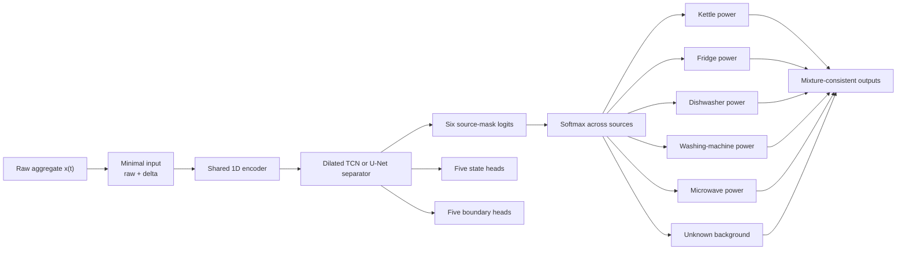

# Event-Aware Mixture-Consistent Multi-Appliance NILM

## 跨领域理论、模型设计与实验计划

## 1. 核心结论

当前问题不应继续被定义为“从 aggregate 独立回归五条 appliance power waveform”。更合适的定义是：

> 在包含未知负载的单通道加性混合信号中，分离五个已知 appliance sources 和一个未知 background source，同时显式学习 appliance state、事件边界和物理一致性。

对应的新研究方向可以命名为：

> **Event-Aware Mixture-Consistent Multi-Appliance Disaggregation under Unknown Background Loads**

该方向主要借鉴四个 NILM 以外的领域：

1. 单通道音频和语音源分离；
2. 未知噪声下的 speech enhancement；
3. Temporal action segmentation；
4. Multi-task learning 和 gradient interference。

这些领域分别回答：

- 为什么 MSE 会产生模糊输出；
- 如何从一个 mixture 分离多个 sources；
- 如何处理没有标签的未知背景；
- 如何显式学习 ON/OFF 边界；
- 如何诊断多个 appliance 之间的梯度冲突。

---

## 2. 为什么 NILM 本质上困难

Aggregate power 可以表示为：

$$
x(t)=\sum_{i=1}^{A}y_i(t)+b(t)+\epsilon(t),
$$

其中：

- $x(t)$：aggregate power；
- $y_i(t)$：第 $i$ 个目标 appliance；
- $b(t)$：所有未建模和未监测负载；
- $\epsilon(t)$：测量误差和时间同步误差。

在本项目中，$A=5$：

- kettle；
- fridge；
- dishwasher；
- washing machine；
- microwave。

同一个 aggregate observation 可以存在多个合理解释。例如：

$$
300\text{ W}
=100\text{ W fridge}+200\text{ W unknown},
$$

也可能是：

$$
300\text{ W}
=0\text{ W fridge}+300\text{ W unknown}.
$$

因此，aggregate-only NILM 是一个欠定的 inverse problem。8 秒采样还会进一步删除 microwave 和 fridge 的部分瞬态信息。

模型不可能从输入中恢复已经不存在的信息。合理目标不是强迫模型始终生成一条 waveform，而是：

- 只在存在足够事件证据时分配目标 appliance power；
- 将无法解释的功率保留给 unknown/background；
- 保证预测满足基本物理约束；
- 对 state、边界和 ON-state amplitude 分别建模。

---

## 3. 为什么当前模型产生模糊、不合理的 waveform

### 3.1 MSE 学习条件平均

使用 MSE 时，最优回归预测倾向于：

$$
\hat y(x)=E[y\mid x].
$$

当一个 aggregate pattern 可能来自多个来源时，模型可能输出多个可能结果的平均值。

真实情况可能是：

```text
Fridge OFF = 0 W
Fridge ON  = 100 W
```

但不确定时，MSE 可能输出：

```text
Fridge prediction = 40–70 W
```

这在数值上可能降低平均误差，但不符合真实 appliance state。

[Mathieu, Couprie and LeCun, *Deep Multi-Scale Video Prediction Beyond Mean Square Error*, ICLR 2016](https://arxiv.org/abs/1511.05440) 在视频预测中明确讨论了标准 MSE 导致模糊预测的问题。该结果来自视觉领域，但“多解回归产生条件平均”的机制同样适用于功率 waveform 回归。

这篇论文在本项目中的用途是解释问题，不表示应该直接引入 GAN。

### 3.2 当前 soft gate 允许状态和幅值互相补偿

当前模型使用：

$$
\hat y_i(t)=p_i(t)a_i(t),
$$

其中 $p_i$ 是 ON probability，$a_i$ 是 raw power amplitude。

例如：

$$
p_i=0.5,\qquad a_i=160\text{ W}
$$

仍然可以得到：

$$
\hat y_i=80\text{ W}.
$$

因此 state head 和 power head 不一定分别学习正确语义。它们可以通过互相补偿得到较低的 gated power loss。

### 3.3 多次平滑和 gating

当前 pipeline 还包含：

- rolling mean/std features；
- soft power/state gate；
- overlap-window averaging；
- threshold calibration；
- temporal filtering；
- calibrated binary state mask 再次应用到 power。

这些步骤可能改善最终指标，但也可能隐藏 raw model output 的问题。特别是 overlap averaging 会进一步平滑窗口之间不一致的边缘。

---

## 4. 跨领域代表性论文

| 主题 | 代表论文 | 核心机制 | 对本项目的直接启发 |
|---|---|---|---|
| MSE 模糊 | Mathieu et al., ICLR 2016 | 标准 MSE 在多解预测中产生模糊平均 | 不把模糊 waveform 简单归因于模型容量不足 |
| Time-domain separation | Wave-U-Net, ISMIR 2018 | 一维 U-Net、长上下文、多源 waveform 输出 | 将 NILM 定义为 time-domain multi-source separation |
| Mask separation | Conv-TasNet, TASLP 2019 | Learned encoder、TCN separator、source masks、decoder | 从 mixture representation 分配来源，而非独立回归 |
| Mixture consistency | Wisdom et al., ICASSP 2019 | Differentiable projection 保证 source sum 与 mixture 一致 | 防止 appliance heads 独立生成不可能功率 |
| Unknown sources | MixIT, NeurIPS 2020 | 从 mixtures 学习可变数量 latent sources | 为未知背景保留 residual source，而非强迫进入五个 appliances |
| Over-separation | Sparse MixIT, WASPAA 2021 | Sparsity 和 covariance losses | 防止一个 appliance 被拆成多个 sources |
| Boundary modelling | ASRF, WACV 2021 | State classification + boundary regression | 显式学习 fridge/microwave ON/OFF 边界 |
| Loss balancing | GradNorm, ICML 2018 | 根据梯度大小和学习速度平衡任务 | 比 loss-value ratio 更符合 multi-task optimization |
| Gradient conflict | PCGrad, NeurIPS 2020 | 投影冲突梯度 | 诊断并缓解不同 appliances 的 shared-gradient interference |

---

## 5. Wave-U-Net：直接 waveform source separation

### 5.1 论文

Daniel Stoller, Sebastian Ewert and Simon Dixon, *Wave-U-Net: A Multi-Scale Neural Network for End-to-End Audio Source Separation*, ISMIR 2018。

- [论文 PDF](https://ismir2018.ircam.fr/doc/pdfs/205_Paper.pdf)
- [官方代码](https://github.com/f90/Wave-U-Net)

### 5.2 核心思想

Wave-U-Net 直接从单条 mixture waveform 重建多个 sources：

```text
Mixture waveform
      ↓
Multi-scale 1D encoder
      ↓
Bottleneck
      ↓
Multi-scale decoder
      ↓
K separated source waveforms
```

论文强调：

- 需要长时间上下文；
- 需要保留局部时间细节；
- window boundary 可能产生 artifact；
- source outputs 应满足 additivity。

Wave-U-Net 的 difference output 将最后一个 source 定义为 mixture 与其他 sources 之差，从结构上增强 source additivity。

### 5.3 对 MultiNILM 的启发

预测对象可以定义为：

```text
Source 1: kettle
Source 2: fridge
Source 3: dishwasher
Source 4: washing machine
Source 5: microwave
Source 6: unknown/background
```

而不是五个互相独立的 regression heads。

---

## 6. Conv-TasNet：mask-based source separation

### 6.1 论文

Yi Luo and Nima Mesgarani, *Conv-TasNet: Surpassing Ideal Time–Frequency Magnitude Masking for Speech Separation*, IEEE/ACM TASLP, 2019。

- [DOI: 10.1109/TASLP.2019.2915167](https://doi.org/10.1109/TASLP.2019.2915167)
- [参考代码](https://github.com/naplab/Conv-TasNet)

### 6.2 核心思想

```text
Mixture
   ↓
Learned waveform encoder
   ↓
Temporal convolutional separator
   ↓
One mask per source
   ↓
Masked source representations
   ↓
Shared decoder
   ↓
Separated waveforms
```

Conv-TasNet 的重点不是简单增加 TCN，而是将问题定义成：

> 从一个共享 mixture representation 中估计每个 source 的 mask。

### 6.3 对当前 MultiNILM 的批评

当前五个 appliance heads 可以独立生成输出，因此可能出现：

$$
\sum_i\hat y_i(t)>x(t).
$$

Mask-based separation 则要求每个 appliance 从有限 mixture 中取得一部分表示，减少多个 heads 同时响应同一个噪声事件的可能性。

---

## 7. Mixture consistency：物理一致性约束

### 7.1 论文

Scott Wisdom et al., *Differentiable Consistency Constraints for Improved Deep Speech Enhancement*, ICASSP 2019。

- [Google Research](https://research.google/pubs/differentiable-consistency-constraints-for-improved-deep-speech-enhancement/)
- [DOI: 10.1109/ICASSP.2019.8682783](https://doi.org/10.1109/ICASSP.2019.8682783)

### 7.2 核心思想

论文指出，如果没有 mixture consistency，多个预测 sources 的总和可能与输入 mixture 不一致。作者加入 differentiable projection layer，使 sources 满足 mixture constraint。

### 7.3 NILM 形式

对五个 appliances 加一个 background source：

$$
\sum_{i=1}^{5}\hat y_i(t)+\hat b(t)=x(t).
$$

一种最简单的正功率 mask 实现是：

$$
[m_1(t),\ldots,m_5(t),m_b(t)]
=\operatorname{softmax}(g(x)_t),
$$

$$
\hat y_i(t)=m_i(t)x(t),
$$

$$
\hat b(t)=m_b(t)x(t).
$$

因此：

$$
m_j(t)\geq0,
\qquad
\sum_{j=1}^{6}m_j(t)=1,
$$

并且自动得到：

$$
\sum_i\hat y_i(t)+\hat b(t)=x(t).
$$

### 7.4 实际注意事项

该约束必须在 watt space 中应用，而不是对各 appliance 独立 z-score 后直接相加。

Aggregate 与 submeters 可能因时间错位或测量误差出现：

$$
\sum_i y_i(t)>x(t).
$$

这些 timestamps 需要：

- 容差；
- robust loss；
- alignment check；
- 或在严格 mixture-consistency loss 中排除。

不能无条件假设所有训练标签都完全满足加法关系。

---

## 8. MixIT：未知背景和真实 mixture

### 8.1 论文

Scott Wisdom et al., *Unsupervised Sound Separation Using Mixture Invariant Training*, NeurIPS 2020。

- [论文](https://proceedings.neurips.cc/paper/2020/hash/28538c394c36e4d5ea8ff5ad60562a93-Abstract.html)
- [Google Research 代码](https://github.com/google-research/sound-separation)

### 8.2 核心思想

MixIT 处理：

- 单通道 mixtures；
- 未知 source 数量；
- 不完整 source labels；
- synthetic mixtures 与真实环境不匹配；
- in-the-wild background noise。

训练时把已有 mixtures 再混合，然后要求网络输出多个 latent sources。这些 sources 可以重新组合，以近似原来的 mixtures。

### 8.3 与 NILM 的对应关系

NILM 的 aggregate 包含五个已知目标，但 unknown background 由许多没有标签的 appliances 构成。

MixIT 最重要的启发是：

> 模型必须允许输入中的一部分能量被分配给没有语义标签的 unknown source。

不能强迫所有 aggregate 变化都由五个目标 appliances 解释。

### 8.4 不应该直接复制完整 MixIT

[Sparse, Efficient, and Semantic MixIT](https://research.google/pubs/sparse-efficient-and-semantic-mixit-taming-in-the-wild-unsupervised-sound-separation/) 指出 MixIT 容易 over-separate，即把一个真实 source 拆成多个输出。

本项目更适合：

- 固定五个有身份的 appliance sources；
- 一个无身份 residual source；
- 不使用可变的大量 latent outputs；
- 使用 supervised appliance targets 保持 source identity。

---

## 9. ASRF：状态分类与边界检测分离

### 9.1 论文

Yuchi Ishikawa et al., *Alleviating Over-Segmentation Errors by Detecting Action Boundaries*, WACV 2021。

- [论文](https://openaccess.thecvf.com/content/WACV2021/html/Ishikawa_Alleviating_Over-Segmentation_Errors_by_Detecting_Action_Boundaries_WACV_2021_paper.html)
- [官方代码](https://github.com/yiskw713/asrf)

### 9.2 核心思想

逐帧分类容易产生：

- rapid state flicker；
- 多余的小 segments；
- 错误的 ON/OFF 边界；
- over-segmentation。

ASRF 将任务分为：

```text
Long-term temporal features
       ├── State/action classification
       └── Boundary regression
```

Boundary prediction 用于修正 frame-level state sequence。

### 9.3 NILM 形式

每个 appliance 预测：

$$
p_i(t)=P(z_i(t)=1\mid x),
$$

以及：

$$
q_i(t)=P(\text{boundary at }t\mid x).
$$

真实边界可以由 state labels 计算：

$$
e_i(t)=|z_i(t)-z_i(t-1)|.
$$

边界损失：

$$
L_{boundary}
=\sum_i\operatorname{BCE}(q_i,e_i).
$$

这比使用 power delta MSE 更直接，因为它明确监督开关边界，而不是要求所有功率变化都被重建。

---

## 10. Multi-task gradient interference

### 10.1 GradNorm

Zhao Chen et al., *GradNorm: Gradient Normalization for Adaptive Loss Balancing in Deep Multitask Networks*, ICML 2018。

- [论文与 PMLR 页面](https://proceedings.mlr.press/v80/chen18a.html)

GradNorm 根据：

- task gradient magnitude；
- 不同任务的相对学习速度；

动态调整任务权重。

当前 MultiNILM 的 `task_balance: equal` 只比较：

$$
\frac{L_{power}}{L_{state}},
$$

它没有检查真实梯度方向和各 appliances 的学习速度。

### 10.2 PCGrad

Tianhe Yu et al., *Gradient Surgery for Multi-Task Learning*, NeurIPS 2020。

- [论文 PDF](https://papers.neurips.cc/paper_files/paper/2020/file/3fe78a8acf5fda99de95303940a2420c-Paper.pdf)

如果两个 task gradients 满足：

$$
g_i^Tg_j<0,
$$

则它们方向冲突。PCGrad 将冲突部分投影掉，减少一个任务更新对另一个任务的损害。

### 10.3 对本项目的正确使用方式

现在不应立即实现 PCGrad 或 GradNorm。第一步是记录每个 appliance 在 shared encoder 上的 gradient：

$$
\cos(g_i,g_j)
=
\frac{g_i^Tg_j}{\|g_i\|\|g_j\|}.
$$

只有当 fridge、microwave 和其他 appliances 长期出现负 cosine similarity，才有证据引入 gradient surgery。

---

## 11. 建议的新模型

## Event-Aware Mixture-Consistent Multi-Appliance Separator



### 11.1 输入

第一版只使用：

$$
X(t)=[x(t),\Delta x(t)].
$$

Raw aggregate 提供 steady-state 和 background level；delta 提供 edge evidence。

先不使用：

- fractional derivatives；
- rolling means；
- rolling standard deviations；
- absolute delta；
- multiscale handcrafted channels。

### 11.2 Shared separator

使用简单的一维 U-Net 或 dilated TCN。第一版只选一个，不同时堆叠多个 backbone。

### 11.3 六个 source masks

输出五个 appliance masks 和一个 unknown mask。Unknown source 没有 appliance identity，只负责吸收不能可靠归因的 aggregate power。

### 11.4 State 和 boundary

State heads 只用于 ON/OFF learning 和 state metrics。第一版不要再次把 calibrated hard state mask 乘回 power，以避免 double gating。

Boundary heads 显式学习 ON/OFF transitions。

### 11.5 Relation attention

第一版不加入 relation attention。先建立可解释的 separator baseline。只有在基础模型稳定后，才将 relation attention 作为单一 ablation 加回，验证 multi-appliance interaction 是否有独立贡献。

---

## 12. 建议的损失函数

第一版建议：

$$
L
=
\lambda_pL_{source}
+\lambda_sL_{state}
+\lambda_bL_{boundary}.
$$

其中：

$$
L_{source}
=
\sum_{i=1}^{5}
\operatorname{Huber}(\hat y_i,y_i),
$$

$$
L_{state}
=
\sum_{i=1}^{5}
\operatorname{BCEWithLogits}(\hat z_i,z_i),
$$

$$
L_{boundary}
=
\sum_{i=1}^{5}
\operatorname{BCEWithLogits}(\hat e_i,e_i).
$$

Mixture consistency 由 mask normalization 直接保证，不需要再增加一个 reconstruction loss。

第一版不要使用：

- dynamic task balance；
- ON-MSE；
- OFF-MSE；
- delta-power loss；
- relative-energy loss；
- FP penalty；
- hard-negative mining；
- background auxiliary loss。

如果 Huber 导致 ON amplitude 不足，再单独测试一个小权重 ON-state Huber，而不是一次恢复所有辅助项。

---

## 13. 与之前 background head 和 background swap 的区别

### 13.1 之前的 background head

```text
Shared features
    ├── Five appliance outputs
    └── Background auxiliary output
```

Background output 不限制 appliance heads。多个 heads 仍然可以同时 hallucinate power。

### 13.2 新 residual source

```text
One aggregate power budget
    ├── Five appliance allocations
    └── One unknown allocation
```

所有 sources 在同一个 normalized allocation 中竞争 aggregate power。

### 13.3 Background swap

Background swap 只改变训练输入分布：

$$
x'=\sum_i y_i+b_{donor}.
$$

它没有改变模型的独立回归形式，也没有保证 sources 与 aggregate 一致。因此即使 augmentation 正常运行，也不能阻止多个 heads 对同一 unknown event 同时响应。

---

## 14. 在实现新模型之前必须完成的诊断

### 14.1 Oracle-state experiment

使用真实 state gate：

$$
\hat y_i=z_i^{true}a_i.
$$

- 如果 waveform 明显改善：主要问题是 state/event detection；
- 如果仍然很差：主要问题是 amplitude decoder、features 或 alignment。

### 14.2 Clean-aggregate experiment

构造：

$$
x_{clean}=\sum_{i=1}^{5}y_i.
$$

- Clean aggregate 好、real aggregate 差：unknown background 是主问题；
- Clean aggregate 仍差：architecture、normalization、alignment 或 objective 有问题。

### 14.3 二乘二诊断矩阵

| Input | State gate | 目的 |
|---|---|---|
| Real aggregate | Predicted state | 当前真实表现 |
| Real aggregate | Oracle state | 分离 state detection 与 amplitude error |
| Clean aggregate | Predicted state | 测试背景是否是主要困难 |
| Clean aggregate | Oracle state | 测试 power reconstruction 上限 |

### 14.4 Small-subset overfit

选择少量 fridge 和 microwave events，确认模型能够近乎完全拟合训练 waveform。

如果无法做到，应优先检查：

- aggregate/target timestamp alignment；
- state label alignment；
- input/output window alignment；
- normalization 和 inverse normalization；
- overlap reconstruction；
- gate semantics。

### 14.5 Single-appliance versus multi-appliance

保持相同 backbone，比较：

```text
Fridge-only
Microwave-only
Five-appliance
```

如果 single-appliance 明显更好，说明问题主要来自 shared-gradient interference，而不只是背景噪声。

---

## 15. 分阶段实验计划

### Phase 0：诊断，不设计新架构

1. Oracle state；
2. Clean aggregate；
3. Small-subset overfit；
4. Single-versus-multi appliance；
5. Gradient cosine audit。

### Phase 1：最小 source-separation baseline

```text
Raw + delta
    → Simple TCN or 1D U-Net
    → Five appliance masks + one unknown mask
    → Mixture-consistent power outputs
```

损失只使用 source Huber。

### Phase 2：加入 state supervision

增加 BCE state head，但不将 state hard mask 应用到 power。

### Phase 3：加入 boundary supervision

增加 boundary head 或 boundary-weighted state loss。

### Phase 4：测试 multi-appliance interaction

最后才单独加入 relation attention。

### Phase 5：只有发现梯度冲突时才测试 PCGrad

不要根据 loss magnitude 推断 gradient conflict。

---

## 16. 核心消融表

| ID | Model | 研究问题 |
|---|---|---|
| S0 | Raw-input TCN independent regression | 最小回归 baseline |
| S1 | S0 + six-source masks | Mask separation 是否减少不合理输出？ |
| S2 | S1 + mixture consistency | 物理一致性是否改善 MAE/FPR/waveform？ |
| S3 | S2 + state head | State supervision 是否改善 appliance identification？ |
| S4 | S3 + boundary head | 边界监督是否改善 edge timing 和 segment quality？ |
| S5 | S4 + relation attention | Appliance interaction 是否有额外贡献？ |
| S6 | S5 + PCGrad，仅在确认冲突后 | Gradient surgery 是否改善 multi-task training？ |

每一步只改变一个组件。

---

## 17. 建议指标

### Source reconstruction

- MAE；
- ON-MAE；
- OFF-MAE；
- SAE / energy ratio；
- aggregate excess violation：

$$
\frac{1}{T}\sum_t
\max\left(\sum_i\hat y_i(t)-x(t),0\right).
$$

### State detection

- AP；
- precision；
- recall；
- F1；
- high-background FPR。

### Boundary quality

- ON-boundary timing error；
- OFF-boundary timing error；
- event-level precision/recall；
- fragment count / over-segmentation rate。

### Cross-house reporting

- 每个 house 分别报告；
- house-macro average；
- fridge 和 microwave 单独报告；
- 不只报告 overall micro metrics。

---

## 18. 研究假设

### H1：Unknown-source allocation

显式 unknown mask 会减少 fridge 和 microwave 在高背景区域的 false positives。

### H2：Mixture consistency

Source allocation 会减少负功率、总预测超过 aggregate，以及多个 appliances 同时响应同一个 unknown event。

### H3：Boundary supervision

显式 boundary learning 会减少模糊边缘、state flicker 和碎片化 segments。

### H4：Multi-appliance interaction

Relation attention 只有在 mixture-consistent baseline 上仍带来稳定增益时，才应被保留为 multi-appliance interaction mechanism。

### H5：Gradient interference

如果不同 appliances 的 gradient cosine 长期为负，PCGrad 可能优于当前 loss-value-based dynamic balance。

---

## 19. 风险和限制

1. **8 秒采样的信息限制**：某些 microwave events 和启动瞬态可能已经丢失。
2. **Submeter alignment**：严格 mixture consistency 依赖 aggregate 与 appliance channels 同步。
3. **Mask ambiguity**：即使保证加法一致，模型仍可能把功率分配给错误 source。
4. **Unknown source collapse**：模型可能把困难目标全部分配给 background。
5. **Background dominance**：unknown mask 可能获得大多数功率，需要监督和监控已知 source recall。
6. **State/power disagreement**：state head 不再直接 gate power 后，需要分别报告两类输出的一致性。
7. **跨领域迁移不是直接证明**：音频、视频和 power signal 的统计结构不同，所有迁移机制必须通过 NILM 消融验证。

---

## 20. 最终建议

最值得实现的新 baseline 不是另一个更复杂的 MultiNILM，而是：

```text
Raw aggregate + delta
        ↓
One simple temporal separator
        ↓
Five fixed appliance masks + one unknown mask
        ↓
Mixture-consistent power reconstruction
        ↓
State and boundary supervision
```

它保留 multi-appliance novelty，同时直接回应当前问题：

- unknown background 有明确的输出位置；
- appliances 不再独立产生不符合 aggregate 的功率；
- ON/OFF edges 被显式学习；
- power、state 和 boundary 的作用可以分别消融；
- architecture 和 loss 比当前系统更容易解释。

在实现之前，优先完成 Oracle state、Clean aggregate 和 Small-subset overfit 三个诊断。它们能够确定新模型应该解决的究竟是背景分离、状态检测、幅值重建，还是数据 pipeline 问题。

---

## 21. References

1. Mathieu, M., Couprie, C., and LeCun, Y. *Deep Multi-Scale Video Prediction Beyond Mean Square Error*. ICLR, 2016. [Paper](https://arxiv.org/abs/1511.05440)
2. Stoller, D., Ewert, S., and Dixon, S. *Wave-U-Net: A Multi-Scale Neural Network for End-to-End Audio Source Separation*. ISMIR, 2018. [Paper](https://ismir2018.ircam.fr/doc/pdfs/205_Paper.pdf) | [Code](https://github.com/f90/Wave-U-Net)
3. Luo, Y., and Mesgarani, N. *Conv-TasNet: Surpassing Ideal Time–Frequency Magnitude Masking for Speech Separation*. IEEE/ACM TASLP, 2019. [DOI](https://doi.org/10.1109/TASLP.2019.2915167) | [Code](https://github.com/naplab/Conv-TasNet)
4. Wisdom, S., Hershey, J. R., Wilson, K., Thorpe, J., Chinen, M., Patton, B., and Saurous, R. A. *Differentiable Consistency Constraints for Improved Deep Speech Enhancement*. ICASSP, 2019. [DOI](https://doi.org/10.1109/ICASSP.2019.8682783)
5. Wisdom, S., Tzinis, E., Erdogan, H., Weiss, R., Wilson, K., and Hershey, J. R. *Unsupervised Sound Separation Using Mixture Invariant Training*. NeurIPS, 2020. [Paper](https://proceedings.neurips.cc/paper/2020/hash/28538c394c36e4d5ea8ff5ad60562a93-Abstract.html) | [Code](https://github.com/google-research/sound-separation)
6. Wisdom, S., Jansen, A., Weiss, R. J., Erdogan, H., and Hershey, J. R. *Sparse, Efficient, and Semantic MixIT: Taming In-the-Wild Unsupervised Sound Separation*. WASPAA, 2021. [Paper](https://research.google/pubs/sparse-efficient-and-semantic-mixit-taming-in-the-wild-unsupervised-sound-separation/)
7. Ishikawa, Y., Kasai, S., Aoki, Y., and Kataoka, H. *Alleviating Over-Segmentation Errors by Detecting Action Boundaries*. WACV, 2021. [Paper](https://openaccess.thecvf.com/content/WACV2021/html/Ishikawa_Alleviating_Over-Segmentation_Errors_by_Detecting_Action_Boundaries_WACV_2021_paper.html) | [Code](https://github.com/yiskw713/asrf)
8. Chen, Z., Badrinarayanan, V., Lee, C.-Y., and Rabinovich, A. *GradNorm: Gradient Normalization for Adaptive Loss Balancing in Deep Multitask Networks*. ICML, 2018. [Paper](https://proceedings.mlr.press/v80/chen18a.html)
9. Yu, T., Kumar, S., Gupta, A., Levine, S., Hausman, K., and Finn, C. *Gradient Surgery for Multi-Task Learning*. NeurIPS, 2020. [Paper](https://papers.neurips.cc/paper_files/paper/2020/file/3fe78a8acf5fda99de95303940a2420c-Paper.pdf)
