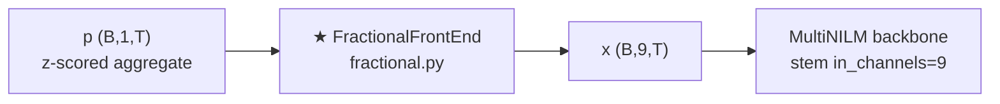

# Fractional Calculus Front-End (`fractional.py`) — Implementation Note

**Status:** Implemented and trainable via `multinilm_fractional`  
**Code:** `model/preprocess_feature/fractional.py`  
**Wrapper:** `model/MultiNILM_fractional.py`  
**Adapter / yaml:** `adapters/multinilm_fractional.py`, `config/models/multinilm_fractional.yaml`  
**Paper basis:** Schirmer & Mporas (IEEE OAJPE 2022), Eq. (4)–(5) Grünwald–Letnikov (GL)

Related design doc: `multinilm_schirmer_invariance_upgrade.md` (§2.4–2.5).

---

## 1. Where it sits in the pipeline

The dataloader is unchanged: it still yields a **single** aggregate channel after fixed z-score. The fractional block sits **after** that tensor and **before** the MultiNILM stem.

```text
CSV / Dataset
    → z-score (μ_agg=400, σ_agg=500)     # experiment yaml
    → p : (B, 1, T)                        # or (B, T) reshaped
    → ★ FractionalFrontEnd                 # fractional.py
    → x : (B, 9, T)                        # raw + 8 GL orders
    → MultiNILM (input_channels=9)
         stem → widen → TCN → heads
    → (power, state) per appliance
```



**Important:** Baseline `MultiNILM.py` is **not** modified. Only the wrapper `MultiNILMFractional` inserts the front-end.

---

## 2. How it connects to the model (call chain)

| Step | File | Role |
|------|------|------|
| 1 | `main.py` | `--model multinilm_fractional` |
| 2 | `adapters/multinilm_fractional.py` | Merges top-level yaml `fractional:` into `architecture`, calls builder |
| 3 | `model/MultiNILM_fractional.py` | Builds `FractionalFrontEnd` + `MultiNILM(..., input_channels=C)` |
| 4 | `fractional.py` | Math + `FractionalFrontEnd.forward` |
| 5 | `MultiNILM.py` | Unchanged TCN/heads; first conv sees **9** input channels |

### Forward (wrapper)

```python
# MultiNILMFractional.forward
x_c = self.frontend(self._to_b1t(x))   # (B,1,T) → (B,9,T)
return self.backbone(x_c, return_domain_features=...)
```

- `self.input_channels = 1` on the wrapper (what the dataloader provides).
- `self.feature_channels = 9` (= `FractionalFrontEnd.out_channels`).
- Backbone `input_channels` must equal `frontend.out_channels` (asserted in `__init__`).

### Yaml knobs (`multinilm_fractional.yaml`)

```yaml
fractional:
  enabled: true
  k: 8                 # number of α orders
  include_raw: true    # channel 0 = raw p̃
  memory: 256          # truncation J for GL
  channel_normalize: mean_std
```

Parsed by `parse_fractional_architecture` (and/or merged by the adapter).

---

## 3. Math — how we do fractional differentiation

### 3.0 Intuition (why fractional?)

An ordinary first difference

\[
\Delta p_{\mathrm{agg}}[t] = p_{\mathrm{agg}}[t] - p_{\mathrm{agg}}[t-1]
\]

is a sharp **edge detector**: fridge ON → a spike; flat ON → near zero.  
A fractional order \(\alpha \in (0,1]\) is a **soft, long-memory difference**:

- \(\alpha = 1\): classical first difference (local, sharp).
- \(0 < \alpha < 1\): still emphasizes changes, but mixes many past samples with slowly decaying weights → smoother “transient signature”.
- Several \(\alpha\) together = several timescales of the same edge.

Schirmer’s claim for NILM: appliance on/off timing differs across houses; multi-order \(D^\alpha p_{\mathrm{agg}}\) gives the network shift-tolerant temporal views of the **same** aggregate.

---

### 3.1 Symbols (paper vs our code)

We follow Schirmer & Mporas (IEEE OAJPE 2022), Eq. (4)–(5). Mapping:

| Paper symbol | Meaning | Our code / yaml |
|--------------|---------|-----------------|
| \(p_{\mathrm{agg}}(t)\) | aggregated household power | dataloader column `aggregate`, then z-scored; tensor `(B,1,T)` |
| \(\alpha\) | fractional order | each entry in `alphas` / `k: 8` grid |
| \(K\) | number of fractional orders | `fractional.k` (default 8) → \(\alpha_1,\ldots,\alpha_K\) |
| \({}_{t_0}D_t^\alpha\) | GL derivative on interval \([t_0,t]\) | `fractional_derivative` / `FractionalFrontEnd` |
| \(h\) | step width (sample spacing) | `h` (default **1** sample) |
| \(k=(t-t_0)/h\) | how many steps from interval start | continuous-time bookkeeping in Eq. (4) |
| \(\lfloor k\rfloor\) | upper limit of the sum in Eq. (4) | see **memory \(J\)** below |
| \(\dbinom{\alpha}{j}\) | generalized binomial (Eq. 5, via \(\Gamma\)) | built inside `gl_binomial_weights` |
| frame \(\tau\), length \(L\) | one analysis frame of a fractional signal | our **window** length \(T\) (`input_window_length: 512`) |
| \(D^{\alpha_k} p_{\mathrm{agg}}\) | \(k\)-th fractional signal | one output channel of the front-end |

**Normalization note.** The paper writes \(p_{\mathrm{agg}}\). We apply a fixed z-score first (\(\mu{=}400\), \(\sigma{=}500\)) and then run GL on that series. Below we still write \(p_{\mathrm{agg}}\) for the **signal entering the GL filter** (already normalized in training).

---

### 3.2 What is “memory” \(J\)? (paper sum vs our truncation)

#### In the paper (Eq. 4)

\[
{}_{t_0}D_t^\alpha\, p_{\mathrm{agg}}
=
\lim_{h\to 0}
\frac{1}{h^\alpha}
\sum_{j=0}^{\lfloor k\rfloor}
(-1)^j\binom{\alpha}{j}\, p_{\mathrm{agg}}(t - jh),
\qquad
k=\frac{t-t_0}{h}.
\tag{4}
\]

Binomial weights (Eq. 5):

\[
\binom{\alpha}{j}
=
\frac{\Gamma(\alpha+1)}{\Gamma(j+1)\,\Gamma(\alpha-j+1)}.
\tag{5}
\]

**Important:** the paper does **not** introduce a symbol named \(J\).  
The sum already stops at \(\lfloor k\rfloor\): at time \(t\), you may use every past sample back to the interval start \(t_0\). So “how far back you look” is \(\lfloor (t-t_0)/h\rfloor\) samples — the full history inside \([t_0,t]\).

#### In our implementation (`memory: 256`)

For GPU training we need a **fixed-length FIR filter**. We therefore **truncate** the GL sum to a maximum look-back of \(J\) samples:

\[
\bigl(D^{\alpha}p_{\mathrm{agg}}\bigr)[t]
=
\frac{1}{h^\alpha}
\sum_{j=0}^{J}
\underbrace{(-1)^j\binom{\alpha}{j}}_{w_j^{(\alpha)}}
\,p_{\mathrm{agg}}[t-j].
\tag{GL-\(J\)}
\]

| Name | Symbol | Meaning |
|------|--------|---------|
| memory | \(J\) | max lag in samples; yaml `fractional.memory` |
| filter length | \(J+1\) | taps \(w_0,\ldots,w_J\) (includes current sample \(j=0\)) |
| default | \(J=256\) | look back at most 256 past samples (+ current) |

Relation to the paper:

\[
\text{paper: sum to }\lfloor k\rfloor
\qquad\longleftrightarrow\qquad
\text{code: sum to }\min\bigl(J,\;\lfloor k\rfloor\bigr)
\text{ (practically fixed }J\text{)}.
\]

If \(J\) is large enough that the binomial weights have already decayed, truncating barely changes the result. If \(J\) is too small, you cut useful long memory (especially for small \(\alpha\)).

With default \(h=1\), \(h^{-\alpha}=1\), so \(D^\alpha\) is just a causal FIR filter with taps \(w^{(\alpha)}\):

```text
time →   …  t−3   t−2   t−1    t
           ×w₃   ×w₂   ×w₁   ×w₀   →  sum  =  (D^α p_agg)[t]
                 ←—— look-back ≤ J ——→
```

**Do not confuse** \(J\) (filter memory) with window length \(T=512\) (how long each training crop is).  
A window has length \(T\); at each of the \(T\) time steps we still apply the same \(J{+}1\) taps.

---

### 3.3 Binomial weights — formula and recurrence

Definition (same as paper’s \((-1)^j\binom{\alpha}{j}\)):

\[
w_j^{(\alpha)} = (-1)^j\binom{\alpha}{j}.
\]

Direct Gamma evaluation works; we use the stable recurrence:

\[
w_0 = 1,
\qquad
w_j = w_{j-1}\cdot\frac{j-1-\alpha}{j}
\quad(j=1,\ldots,J).
\]

#### Code (`gl_binomial_weights`)

```python
def gl_binomial_weights(alpha: float, memory: int) -> np.ndarray:
    """
    Weights w[j] = (-1)^j * binom(α, j) for j = 0..memory.

    binom(α, j) = Γ(α+1) / (Γ(j+1) Γ(α-j+1))   # paper Eq. (5)
    Recurrence: w_0 = 1;  w_j = w_{j-1} * (j - 1 - α) / j
    """
    alpha = float(alpha)
    w = np.empty(memory + 1, dtype=np.float64)
    w[0] = 1.0
    for j in range(1, memory + 1):
        w[j] = w[j - 1] * (j - 1 - alpha) / j
    return w
```

---

### 3.4 Worked micro-examples (one α)

#### Example A — \(\alpha = 1\) (first difference)

| \(j\) | formula | \(w_j\) |
|------:|---------|--------:|
| 0 | \(1\) | \(1\) |
| 1 | \(1\cdot(1-1-1)/1 = -1\) | \(-1\) |
| \(\ge 2\) | 0 | \(0\) |

So \(w=(1,-1,0,\ldots)\) and \((D^{1}p_{\mathrm{agg}})[t]=p_{\mathrm{agg}}[t]-p_{\mathrm{agg}}[t-1]\).

```text
t:     0   1   2   3   4   5
p_agg: 0   0   0  75  75  75
D¹:    0   0   0  75   0   0     ← only the rising edge
```

#### Example B — \(\alpha = 0.5\), truncation \(J=4\)

| \(j\) | \(w_j\) |
|------:|--------:|
| 0 | \(1.0000\) |
| 1 | \(-0.5000\) |
| 2 | \(-0.1250\) |
| 3 | \(-0.0625\) |
| 4 | \(-0.0390625\) |

```text
t:      0     1     2     3      4       5
p_agg:  0     0     0    75     75      75
D^{0.5}: 0     0     0  75.0   37.5   28.125   ← softer, longer transient
```

**Takeaway:** \(\alpha=1\) = spike at the edge; smaller \(\alpha\) = longer-lived change signature.

#### Example C — NumPy convolution (one α)

```python
def fractional_derivative(signal, alpha, *, memory=None, h=1.0):
    x = np.asarray(signal, dtype=np.float64).reshape(-1)
    t_len = int(x.shape[0])
    j_max = t_len - 1 if memory is None else int(memory)
    j_max = min(j_max, t_len - 1)

    w = gl_binomial_weights(alpha, j_max)          # paper Eq. (5) via recurrence
    scale = 1.0 / (float(h) ** float(alpha))       # paper 1/h^α
    return np.convolve(x, w, mode="full")[:t_len] * scale   # Eq. (4) truncated
```

---

### 3.5 Default α grid (\(K=8\))

Paper: “Considering \(K\) fractional components \(\alpha_k\) with \(k\in\{1,\ldots,K\}\)” → signals \(D^{\alpha_k}p_{\mathrm{agg}}\). Best reported \(K=8\); exact \(\alpha\) list not given. We use a uniform grid in \((0,1]\):

\[
\alpha_{k}=\frac{k}{K},\quad k=1,\ldots,8
\quad\Rightarrow\quad
\{0.125,\ 0.25,\ 0.375,\ 0.5,\ 0.625,\ 0.75,\ 0.875,\ 1.0\}.
\]

```python
def default_schirmer_alphas(k: int = 8) -> list[float]:
    if k == 1:
        return [1.0]
    return [round((i + 1) / k, 6) for i in range(k)]
```

With `include_raw: true` we also keep \(p_{\mathrm{agg}}\) itself → **\(1+K=9\)** channels.

---

### 3.6 Channel layout

\[
x=
\begin{bmatrix}
p_{\mathrm{agg}}\\
D^{0.125}p_{\mathrm{agg}}\\
D^{0.25}p_{\mathrm{agg}}\\
\vdots\\
D^{1.0}p_{\mathrm{agg}}
\end{bmatrix}
\in\mathbb{R}^{9\times T}.
\]

| Channel \(c\) | Content (paper symbol) |
|---------------|------------------------|
| 0 | \(p_{\mathrm{agg}}\) (raw; our extra channel) |
| 1…8 | \(D^{\alpha_k}p_{\mathrm{agg}}\), \(k=1\ldots 8\) |

Batch tensor: `(B, 9, T)`.

**These 9 channels are not 9 appliances.** They are nine temporal *views* of the **same** aggregate. Appliance heads (fridge, WM, …) come later on the shared MultiNILM backbone.

### 3.7 Optional per-channel normalize

If `channel_normalize: mean_std`:

\[
x_{c,t}
\leftarrow
\frac{x_{c,t}-\bar{x}_{c}}{\sigma_{c}+\varepsilon}
\quad(c=0,\ldots,8),
\]

computed **per window** along time. This balances raw vs high-α energy before the stem.

---

## 3A. Beginner FAQ — "I thought we just differentiate 512 → 512. Why weights?"

This is the most common confusion. Short answer: **you are right about the length**; the weights **are** the differentiation formula, not an extra trick.

### Your mental model (correct on length)

You know ordinary discrete differentiation as **two-point subtract**:

\[
y[t] = p_{\mathrm{agg}}[t] - p_{\mathrm{agg}}[t-1].
\]

If the window has \(T=512\) samples, you do this at every \(t=0,\ldots,511\) and get a **new series of length 512**.

Fractional differentiation in this project does the **same kind of thing**:

\[
\underbrace{p_{\mathrm{agg}}}_{\text{length }T=512}
\;\xrightarrow{\;D^{\alpha}\;}
\underbrace{D^{\alpha}p_{\mathrm{agg}}}_{\text{still length }T=512}.
\]

Nothing in Eq. (4) turns one window into a longer or shorter time axis. Time length stays \(T\).

### Where do the "weights" suddenly come from?

Rewrite the two-point rule with coefficients:

\[
y[t]
=
\underbrace{1}_{w_0}\,p_{\mathrm{agg}}[t]
+
\underbrace{(-1)}_{w_1}\,p_{\mathrm{agg}}[t-1].
\]

So even the simple "subtract two points" already uses weights \((w_0,w_1)=(1,-1)\).  
We usually do not name them because there are only two.

The Grünwald–Letnikov formula (paper Eq. 4, truncated with memory \(J\)) is the **same idea** with more past samples:

\[
\bigl(D^{\alpha}p_{\mathrm{agg}}\bigr)[t]
=
\sum_{j=0}^{J}
w_j^{(\alpha)}\,p_{\mathrm{agg}}[t-j],
\qquad
w_j^{(\alpha)}=(-1)^j\binom{\alpha}{j}
\quad\text{(Eq. 5)}.
\]

| What you thought | What it actually is |
|------------------|---------------------|
| Differentiate = call some \(d/dt\) magic | Discrete GL **is** a weighted sum of past samples |
| Weights are a second method after differentiating | Weights **are** the coefficients inside the derivative formula |
| Why list \(w=(1,-1,0,\ldots)\)? | That **is** \(\alpha=1\) differentiation written as taps |
| Why \(J\)? | Max how far back the sum is allowed to look (`memory`) |

**How we differentiate in code:** for each time index \(t\), take \(p[t],p[t-1],\ldots,p[t-J]\), multiply by \(w_0,\ldots,w_J\), add them up → one number \(y[t]\). Repeat for all \(t\) → one length-\(T\) series.

- \(\alpha=1\): \(w=(1,-1,0,0,\ldots)\) → exactly two-point subtract (your familiar case).
- \(0<\alpha<1\): many \(w_j\) nonzero → softer difference with longer memory (still length \(T\)).

**Worked fractional example (what we actually use):** \(\alpha=0.5\), toy \(J=4\) (training uses \(J=256\)).

\[
w^{(0.5)}=(1,\ -0.5,\ -0.125,\ -0.0625,\ -0.0390625)
\quad\text{(5 = }J+1\text{ taps)}.
\]

For \(p=[0,0,0,75,75,75]\) at \(t=5\):

\[
D^{0.5}p[5]
=
1\cdot75 + (-0.5)\cdot75 + (-0.125)\cdot75 + 0 + 0
=
28.125.
\]

Full series stays length 6 (or 512 in training): \([0,0,0,75,37.5,28.125]\).  
Compare \(\alpha=1\) on the same \(p\): \([0,0,0,75,0,0]\) — spike only. Fractional keeps a decaying tail; \(J\) is how far that weighted look-back is allowed to go.

We precompute \(w\) once per \(\alpha\) (frozen, not learned) only so we can apply that sum quickly (convolution) on every window.

### Then why 9 channels if each \(\alpha\) only makes one length-512 series?

Each \(\alpha\) gives **one** series of length \(T\). We run **\(K=8\)** different orders (paper: \(K\) fractional components \(\alpha_k\)):

```text
p_agg              → length 512   (keep raw)
D^{0.125} p_agg    → length 512
D^{0.25}  p_agg    → length 512
…
D^{1.0}   p_agg    → length 512
```

Stack them as channels → shape `(B, 9, 512)`.

- **9 ≠ 9 appliances.** Same meter signal, nine temporal views.
- **Purpose (Schirmer):** on/off edges are not time-aligned across houses; multi-order fractional views are more shift-tolerant than raw power alone.

### One-sentence whole idea

Ordinary difference = weighted sum with \((1,-1)\); fractional difference = weighted sum with Eq. (5) taps; each order maps **512→512**; stacking raw + 8 orders gives **9 input channels** for MultiNILM.

---

## 3A-zh. 中文直觉说明 — 512→512，权重从哪来？

（与上一节英文 FAQ 同一套想法，方便对照。）

你的直觉对了一半：**输入 512 个点，输出也是 512 个点**。权重不是“突然多出来的东西”，而是**差分公式本身的系数**。

### 1. 你熟悉的微分：两点相减

普通一阶差分就是：

\[
y[t] = p[t] - p[t-1]
\]

对 \(t=0,1,\ldots,511\) 每个时刻算一次，得到一条新的长度 512 的序列。

可以写成：

\[
y[t]
=
\underbrace{1}_{w_0}\,p[t]
+
\underbrace{(-1)}_{w_1}\,p[t-1]
\]

所以其实已经有“权重”了：\((w_0,w_1)=(1,-1)\)。  
只是太简单，平时不叫它权重，直接说“两点相减”。

### 2. 分数阶差分（我们真正用的）：还是 512→512，但不是两点相减

训练里 **主菜不是一阶**，而是 \(0<\alpha\le 1\) 的分数阶（默认 8 个 \(\alpha\)，其中一个才是 \(\alpha=1\)）。  
长度仍然：输入 512 → 输出 512。差别只在于 **每个 \(t\) 怎么用过去的点**。

#### 什么是 \(J\)？（`memory`）

\[
(D^\alpha p)[t]
=
\sum_{j=0}^{J}
w_j\,p[t-j]
=
w_0 p[t] + w_1 p[t-1] + \cdots + w_J p[t-J]
\]

| 符号 | 含义 |
|------|------|
| \(J\) | **最多往回看几步**（yaml `fractional.memory`，训练默认 **256**） |
| \(j=0\) | 当前点 \(p[t]\) |
| \(j=J\) | 最远过去点 \(p[t-J]\) |
| 权重个数 | **\(J+1\)**（从 \(j=0\) 到 \(j=J\) 含两端） |

注意：

- \(J\) **不是**窗口长度 \(T=512\)。窗口有多长是 \(T\)；差分时每次最多用多远历史是 \(J\)。
- 真实训练：\(T=512\)，\(J=256\) → 每个 \(t\) 最多用当前 + 过去 256 个点。
- 下面例子为了好算，用很小的 \(J=4\)（只有 5 个权重）。公式和训练时一样，只是 \(J\) 更短。

#### 具体例子：\(\alpha=0.5\)，\(J=4\)（真正的分数阶，不是一阶）

用论文 Eq. (5) 递推得到权重（固定，不学习）：

\[
w^{(0.5)}
=
(w_0,w_1,w_2,w_3,w_4)
=
(1,\ -0.5,\ -0.125,\ -0.0625,\ -0.0390625).
\]

假想一段功率（冰箱在 \(t=3\) 打开）：

```text
t:     0    1    2    3    4    5
p[t]:  0    0    0   75   75   75
```

**在 \(t=5\) 怎么算 \(D^{0.5}p[5]\)？**（\(h=1\)）

\[
\begin{aligned}
D^{0.5}p[5]
&=
w_0 p[5] + w_1 p[4] + w_2 p[3] + w_3 p[2] + w_4 p[1] \\
&=
1\cdot 75
+ (-0.5)\cdot 75
+ (-0.125)\cdot 75
+ (-0.0625)\cdot 0
+ (-0.0390625)\cdot 0 \\
&=
75 - 37.5 - 9.375 \\
&=
28.125.
\end{aligned}
\]

整段算完（每个 \(t\) 都这样加权求和）仍是长度 6（训练时则是长度 512）：

```text
t:         0     1     2     3      4       5
p:         0     0     0    75     75      75
D^{0.5}:   0     0     0  75.0   37.5   28.125
```

对比如果你用 **一阶** \(\alpha=1\)（两点相减）同一段信号：

```text
D^{1}:     0     0     0    75      0       0
```

| | \(\alpha=1\)（一阶） | \(\alpha=0.5\)（分数阶） |
|--|---------------------|-------------------------|
| 用到的过去 | 基本只要 \(p[t],p[t-1]\) | \(J\) 个过去点都可能有贡献 |
| 开关后立刻 | 马上变 0 | 慢慢衰减（28.125 还在） |
| 输出长度 | 仍 = 输入长度 | 仍 = 输入长度 |

所以：**分数阶 = 还是“每个时刻算一个数”**；只是不再是简单两点相减，而是用 \(J+1\) 个固定权重做加权和。

### 3. 权重怎么来？（公式就是微分本身）

\[
w_j = (-1)^j\binom{\alpha}{j}
\quad\text{（论文 Eq. 5）},
\qquad
(D^\alpha p)[t]=\sum_{j=0}^{J} w_j\,p[t-j]
\quad\text{（Eq. 4，截断到 }J\text{）}.
\]

代码里用递推一次算好 \(w_0\ldots w_J\)，再对整段序列做卷积；**不是**神经网络再学一套权重。

**“怎么微分？”**（分数阶版）  
对每个 \(t\)：取出 \(p[t],\ldots,p[t-J]\)，乘上对应 \(w_j\)，相加 → \(y[t]\)。  
\(t=0\ldots511\) 全做一遍 → 新序列长度仍是 512。

### 4. 为什么要好几个 \(\alpha\)？为什么变 9 通道？

每个 \(\alpha\) 做一次上面的事，得到 **一条** 512：

- \(\alpha=0.125\) → 一条 512  
- \(\alpha=0.25\) → 又一条 512  
- …  
- \(\alpha=1.0\) → 又一条 512  

再保留原始 \(p\) 本身一条 512。

叠在一起：

\[
(1\text{ 通道}, 512)
\;\xrightarrow{\;K=8\text{ 次分数阶差分 + 原始\;}}\;
(9\text{ 通道}, 512)
\]

目的（Schirmer）：开关边缘在不同家庭里时间对不齐；多种 \(\alpha\) 给出不同时间尺度的“变化视图”，让后面的模型更抗时间平移。  
**9 不是 9 个电器**，是同一条总功率的 9 种时间特征。

### 5. 一句话串起来

1. 你知道的微分 = 两点相减 = 特殊权重 \((1,-1)\)。  
2. 分数阶微分 = 同样“每个 \(t\) 算一个数”，但用更多历史点 + 由 \(\alpha\) 决定的权重。  
3. 长度始终：512 → 512（每个 \(\alpha\) 一条）。  
4. 做 8 个 \(\alpha\) 再加原始 → 9 条 512 → 送进 MultiNILM。

---

## 3B. Beginner: one window from 1 channel → 9 channels

Assume you are new. Follow one training crop end-to-end.  
(Real config: \(T=512\), \(J=256\), \(K=8\). Here we use a **tiny** window \(T=6\) and \(J=4\) so every number fits on one line. The **formulas are the same**.)

### Step 0 — what the dataloader gives you

One window of household total power (already z-scored in real training; here toy watts for clarity):

```text
time index t:     0    1    2    3    4    5
p_agg[t]:         0    0    0   75   75   75
```

As a tensor this is shape **`(1, 1, 6)`** = (batch=1, channels=1, time=6).  
Still **one** channel: the meter aggregate.

### Step 1 — choose \(K=8\) fractional orders (paper)

\[
\alpha_k=\tfrac{k}{8},\quad k=1\ldots8
\quad\Rightarrow\quad
\alpha \in \{0.125,0.25,0.375,0.5,0.625,0.75,0.875,1.0\}.
\]

### Step 2 — for **each** \(\alpha\), build weights with Eq. (5) / recurrence

**What is \(J\)?**  
\(J\) = **how many past samples** you are allowed to look back (yaml `memory`).  
It is **not** the window length \(T\), and **not** the number of channels.

**Why 5 numbers when \(J=4\)?**  
The sum uses lags

\[
j = 0,1,2,\ldots,J
\]

so there are **\(J+1\)** weights (include the **current** sample \(j=0\)):

| lag \(j\) | meaning | weight |
|----------:|---------|--------|
| 0 | current time \(t\) | \(w_0\) |
| 1 | one step ago \(t-1\) | \(w_1\) |
| 2 | two steps ago \(t-2\) | \(w_2\) |
| 3 | \(t-3\) | \(w_3\) |
| 4 | farthest look-back if \(J=4\) | \(w_4\) |

Rule: **# of weights = \(J+1\)**. For \(J=4\) you get 5 taps.

Example for \(\alpha=1\) and \(J=4\):

\[
w^{(1)}=(w_0,w_1,w_2,w_3,w_4)=(1,\ -1,\ 0,\ 0,\ 0).
\]

- \(w_0=1\): multiply \(p_{\mathrm{agg}}[t]\)
- \(w_1=-1\): multiply \(p_{\mathrm{agg}}[t-1]\)
- \(w_2,w_3,w_4=0\): unused for \(\alpha=1\) (only needs \(j=0,1\))

Example for \(\alpha=0.5\) and \(J=4\):

\[
w^{(0.5)}=(1,\ -0.5,\ -0.125,\ -0.0625,\ -0.0390625).
\]

Here all five taps matter; small \(\alpha\) uses the long look-back.

(You do this once per \(\alpha_k\); in training the kernels are precomputed and frozen.)

### Step 3 — apply paper Eq. (4) truncated (our GL-\(J\)) at every time \(t\)

For a chosen \(\alpha\), at each \(t\):

\[
\bigl(D^{\alpha}p_{\mathrm{agg}}\bigr)[t]
=
\frac{1}{h^\alpha}
\sum_{j=0}^{J}
(-1)^j\binom{\alpha}{j}\,
p_{\mathrm{agg}}[t-j]
\quad(h=1).
\]

Missing past samples (\(t-j<0\)) are treated as 0 (left pad).

**Worked cell — \(\alpha=1\) at \(t=3\):**

\[
D^{1}[3]
=
1\cdot p[3] + (-1)\cdot p[2]
=
75 - 0
=
75.
\]

**Worked cell — \(\alpha=0.5\) at \(t=5\):**

\[
\begin{aligned}
D^{0.5}[5]
&=
1\cdot 75
+ (-0.5)\cdot 75
+ (-0.125)\cdot 75
+ (-0.0625)\cdot 0
+ (-0.039)\cdot 0 \\
&=
28.125.
\end{aligned}
\]

Repeat for **all** \(t=0\ldots5\) and for **all eight** \(\alpha_k\).  
You get eight length-\(T\) series: \(D^{\alpha_1}p_{\mathrm{agg}},\ldots,D^{\alpha_8}p_{\mathrm{agg}}\).

### Step 4 — stack raw + 8 fractional signals → 9 channels

\[
x[c, t]
=
\begin{cases}
p_{\mathrm{agg}}[t] & c=0 \\
\bigl(D^{\alpha_c}p_{\mathrm{agg}}\bigr)[t] & c=1\ldots8
\end{cases}
\]

Toy sketch (only showing raw + \(\alpha{=}0.5\) + \(\alpha{=}1\) for space):

```text
channel \ t     0      1      2      3       4        5
─────────────────────────────────────────────────────────
c=0  p_agg      0      0      0     75      75       75
c=?  D^{0.5}    0      0      0   75.0    37.5    28.125
c=?  D^{1}      0      0      0     75       0        0
… plus the other six α channels …
```

Full tensor shape: **`(1, 9, 6)`** — still one window, but **nine feature channels**.

Optional: per-channel mean/std normalize over \(t\) (`channel_normalize: mean_std`).

### Step 5 — enter MultiNILM

```text
x : (B, 9, T)  →  multi-scale stem (in_channels=9)  →  TCN  →  appliance heads
```

The stem’s first convolutions mix the 9 views over a short time neighborhood; later heads predict fridge / dishwasher / … power and ON/OFF.  
Nothing in this step “creates appliances”; appliances are **outputs**, fractional channels are **inputs**.

### Mini diagram

```text
  meter aggregate window
         │
         │  shape (B, 1, T)     ← 1 channel
         ▼
  ┌──────────────────────────────┐
  │ FractionalFrontEnd           │
  │  for k=1..K=8:               │
  │    w ← Eq.(5) recurrence     │
  │    D^{α_k} ← Eq.(4) sum_j    │  look-back ≤ J (memory)
  │  stack [p_agg; D^{α_1}; …]   │
  └──────────────────────────────┘
         │
         │  shape (B, 9, T)     ← 9 channels (raw + K)
         ▼
     MultiNILM backbone
```

### Real training sizes (our yaml)

| Quantity | Symbol | Value |
|----------|--------|-------|
| window length | \(T\) / paper-like frame \(L\) | `input_window_length: 512` |
| GL truncation | \(J\) | `fractional.memory: 256` |
| # fractional orders | \(K\) | `fractional.k: 8` |
| # model input channels | \(1+K\) if raw | `architecture.input_channels: 9` |

So in production: **`(B,1,512)` → FractionalFrontEnd → `(B,9,512)` → MultiNILM**.

---

## 4. Code map inside `fractional.py`

### 4.1 Core

| Function | Role |
|----------|------|
| `gl_binomial_weights(alpha, memory)` | Builds \(w[0..J]\) via recurrence |
| `default_schirmer_alphas(k)` | α grid for Schirmer-style \(K\) |

### 4.2 NumPy API (offline / unit checks)

| Function | I/O |
|----------|-----|
| `fractional_derivative` | `(T,)` → `(T,)` one α; uses `np.convolve(x, w)[:T] * h^{-α}` |
| `fractional_stack` | stack raw? + all α → `(C, T)` |
| `*_batch` | same for `(B, T)` → `(B, C, T)` |

### 4.3 PyTorch API — `FractionalFrontEnd`

**Constructor**

1. Resolve `alphas`, `include_raw`, `memory` (\(J\)), `h`, `channel_normalize`.
2. Set `out_channels = (1 if include_raw else 0) + len(alphas)` (default **9**).
3. For each α: `w = gl_binomial_weights(...) * h^{-α}`, then **`w_conv = w[::-1]`**, stack into buffer `gl_weight` of shape `(K, 1, J+1)`.

**Why flip?**  
PyTorch `F.conv1d` implements cross-correlation. Causal GL / NumPy `convolve` need \(y[t]=\sum_j w[j]\,x[t-j]\). Storing the flipped kernel makes GPU conv match NumPy GL.

Weights are **`register_buffer`** (fixed, not learned). Gradients still flow through the filtered activations into MultiNILM.

**Forward**

```text
x (B,1,T)  [force single channel if needed]
  ├─ if include_raw: keep x
  └─ if alphas:
        left-pad by J
        expand to K channels
        grouped conv1d(gl_weight) → (B,K,T)
  concat → (B, 9, T)
  optional mean/std over time per channel
  return out
```

Grouped conv (`groups=K`) applies one GL filter per α independently.

### 4.4 Config helper

`parse_fractional_architecture(architecture)` reads the `fractional:` dict and returns `(enabled, alphas, include_raw, memory, h)`.

---

## 5. After the front-end: multi-scale stem with 9 inputs

Structure of `MultiScaleWaveformStem` is unchanged; only `in_channels` becomes 9:

```text
x (B,9,T)
  ├─ Conv1d(9→16, k=3) ─┐
  ├─ Conv1d(9→16, k=5) ─┼─ concat (B,48,T)
  └─ Conv1d(9→16, k=9) ─┘
           ↓
     1×1 fuse → (B,32,T) + skip
           ↓
     widen 32→64→128 → TCN (B,128,T)
```

Each stem tap mixes **all nine** fractional/raw channels over a local time window (short kernels for sharp edges, longer for wide shoulders). Then the usual MultiNILM path continues (DA hooks, per-appliance heads, gate + off_norm).

Shape summary:

| Stage | Shape |
|-------|--------|
| Aggregate | `(B, 1, T)` |
| FractionalFrontEnd | `(B, 9, T)` |
| Multi-scale stem | `(B, 32, T)` |
| Staged widen | `(B, 128, T)` |
| TCN | `(B, 128, T)` |
| Heads | power/state `(B, T, num_appliances)` |

---

## 6. Train command

```powershell
Set-Location D:\Raymond\high_low_freq_NILM\multi_appliances_NILM

C:\Users\PC\anaconda3\envs\nilm\python.exe main.py `
  --mode train_evaluate `
  --model multinilm_fractional `
  --model-config config/models/multinilm_fractional.yaml `
  --experiment config/experiment_ukdale.yaml
```

---

## 7. One-sentence summary

**`fractional.py` implements fixed Grünwald–Letnikov filters (paper Eq. 4–5) with truncation memory \(J\); `FractionalFrontEnd` maps `(B,1,T)` → `(B,9,T)` (\(p_{\mathrm{agg}}\) + \(K{=}8\) orders \(D^{\alpha_k}p_{\mathrm{agg}}\)); `MultiNILMFractional` feeds that into MultiNILM with `input_channels=9`.**
