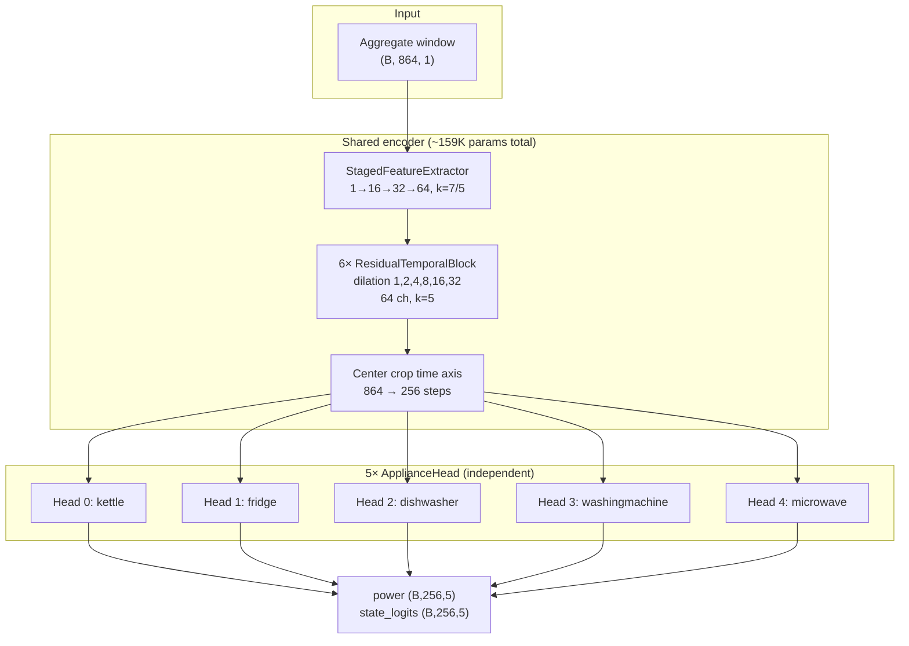
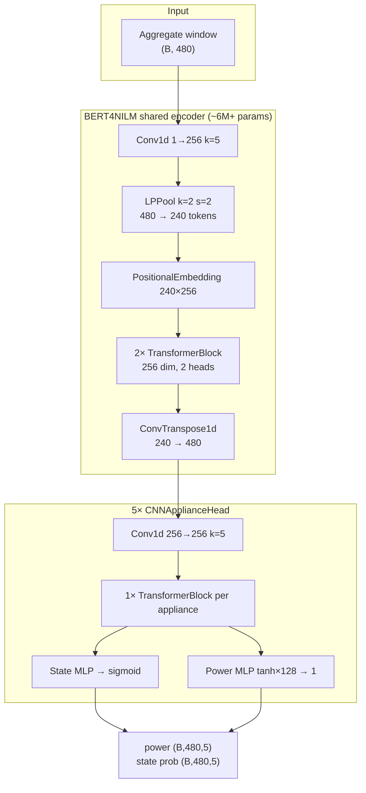

# UK-DALE Model Comparison Notes

This document summarizes differences between:

1. **Our `transfer_multi_appliance` implementation** vs the original baseline in `NILM_model/baseline/transfer_learning_multi-appliance`
2. **Our `multinilm` vs `transfer_multi_appliance`** on the shared UK-DALE cross-house pipeline

Configs referenced:

- Experiment: `config/experiment_ukdale.yaml`
- Transfer: `config/models/transfer_multi_appliance.yaml`
- MultiNILM: `config/models/multinilm.yaml`

---

## 1. Shared UK-DALE experiment (both models)

| Item | Setting |
|------|---------|
| Split | Train: House 1 + House 5 (3 weeks each); Val: last 1 week each; **Test: House 2 (cross-house)** |
| Data format | Pre-split CSV + online sliding windows (`adapters/dataloader.py`) |
| Normalization | Z-score from baseline `Arguments.ukdale_params_appliance` |
| ON thresholds (W) | kettle 40, fridge 50, dishwasher 30, washingmachine 30, microwave 100 |
| Test post-processing | `<5 W → 0` + per-appliance `max_on_power` clip (from baseline `Arguments.py`) |
| Appliance order in yaml | kettle, fridge, dishwasher, washingmachine, microwave |

**Note:** Baseline author order is `kettle, microwave, fridge, dishwasher, washingmachine`. Our experiment yaml uses a different channel order, so per-appliance metrics and pretrained weight loading are **not directly comparable** to the author checkpoint without reordering.

---

## 2. `transfer_multi_appliance` vs author baseline

### 2.1 Aligned (same or equivalent)

| Component | Author baseline | Our implementation |
|-----------|-----------------|-------------------|
| Architecture | BERT4NILM (256, 2 layers, 2 heads) + 5× CNN appliance heads | `model/TransferNILM.py` — same structure (~7.83M params) |
| Input | 480-point aggregate mains | 480-point aggregate (`input_window_length: 480`) |
| Training targets | Full 480-step power + state | `training_targets: full_input` |
| Window stride (effective) | `create_dataset.py` uses `chunk_size=240` | `input_stride: 240`, `eval_stride: 240` |
| Loss | Global `MSE(power) + BCE(sigmoid state)` | `model/TransferNILM_loss.py` |
| Batch / LR / epochs | 32 / 1e-4 / 100 | Same |
| Weight decay | 0 | 0 |
| LR scheduler | Off by default (`enable_lr_schedule=False`) | `scheduler: none` |
| Early stopping patience | 60 | 60 |
| Dtype | float64 (`DoubleTensor`) | `tensor_dtype: float64` |
| Checkpoint | `normalized_MAE − F1` (lower is better) | `checkpoint_monitor: val_mae_minus_f1`, `checkpoint_mae_space: normalized` |
| Val metric aggregation | Per-batch MAE/F1, then mean over batches | Same (`runner.py` batch-mean validation) |
| F1 prediction | `state ≥ 0.5` | `pred_on_source: state_head` |
| Test MAE/SAE | Denorm + `<5W→0` + `max_on_power` clip | `evaluation/power_postprocess.py` + `experiment_ukdale.yaml` |

**Training-side conclusion:** Encoder, loss, window length, effective stride (240), hyperparameters, checkpoint rule, and test post-processing are **closely aligned** with the author code. The **power-head forward** is intentionally modified (see §2.1.1).

### 2.1.1 Intentionally modified (power head OFF behavior)

| Component | Author baseline | Our implementation |
|-----------|-----------------|-------------------|
| Power when state gate is low | `y = linear(tanh(x)) × sigmoid(state)` | `y = g × raw + (1 − g) × off_norm`, with `off_norm = −mean/std` per appliance |

Author multiply-gate at `g → 0` yields normalized **0**, which denorms to the appliance **mean (W)** — visible as OFF spikes on waveforms. OFF-norm blend fixes z-score consistency (same fix as MultiNILM; see `docs/multinilm_off_norm_gate.md`). **Retrain** Transfer after this change; author `best_acc_model.pth` weights remain loadable in principle but predictions will differ at OFF timesteps.

### 2.2 Still different (experiment / pipeline)

| Item | Author baseline | Our repo |
|------|-----------------|----------|
| Data storage | Fixed `.npy` windows | CSV + online sliding windows |
| Train/val/test split | H1+H2+H5 merged → random **80/10/10 window** shuffle | **Cross-house** CSV split |
| Shuffle | Once when building `.npy`; `DataLoader(shuffle=False)` | `train_shuffle: true` (shuffle every epoch) |
| Preprocessing before norm | 6 s resample; `<5 W → 0` on raw watts | Not applied in CSV prep; clip only at **evaluation** |
| `Arguments.window_stride=120` | Defined but **unused** in training code | N/A (we use 240 from `create_dataset.py`) |
| Appliance order | microwave at index 1 | fridge at index 1 |
| Load author `best_acc_model.pth` | — | Not compatible without reordering heads |

**Overall conclusion:** Same algorithm and training protocol, **different evaluation protocol and data split**. Results should **not** be claimed as a exact reproduction of published baseline numbers on UK-DALE.

---

## 3. `multinilm` vs `transfer_multi_appliance` (our two models)

Both use the same `experiment_ukdale.yaml` but different model yaml files.

### 3.1 Architecture & capacity

| | MultiNILM | Transfer multi-appliance |
|---|-----------|--------------------------|
| Backbone | Staged CNN (16→32→64) + 6 TCN blocks | BERT4NILM + Transformer encoder |
| Head | Shared backbone, per-appliance heads | Shared encoder, per-appliance CNN+Transformer heads |
| ~Parameters | ~159K | ~7.83M |
| Output gating | `power = raw × sigmoid(state_logits)` | `power = tanh(linear) × sigmoid(state)` |

### 3.2 Windowing & supervision

| | MultiNILM | Transfer |
|---|-----------|----------|
| Input length | 864 | 480 |
| Output length | 256 (center) | 480 (full sequence) |
| Alignment | center | end |
| Train stride | 16 (heavy overlap) | 240 |
| Eval stride | 256 (non-overlapping) | 240 (50% overlap) |
| Training targets | `output_window` (center 256 only) | `full_input` (all 480 steps) |

MultiNILM supervises a **shorter central segment** from a **longer** input window. Transfer supervises the **entire** output sequence.

### 3.3 Loss & ON/OFF handling

| | MultiNILM | Transfer |
|---|-----------|----------|
| Power loss | MSE, **summed over appliances** | MSE, **global mean** |
| State loss | BCEWithLogits, summed over appliances | BCE on sigmoid probs, global mean |
| State weight | `lambda_state: 1`, `pos_weight: auto` | Fixed 1:1 with power (no pos_weight) |
| Pred ON for metrics | `pred_on_source: combined` (state OR power threshold) | `state_head` only |

### 3.4 Training hyperparameters

| | MultiNILM | Transfer |
|---|-----------|----------|
| weight_decay | 0.0001 | 0 |
| scheduler | ReduceLROnPlateau | none |
| early_stop_patience | 15 | 60 |
| gradient_clip | 1.0 | 0 |
| train_shuffle | default true | true |
| tensor_dtype | float32 (default) | float64 |
| checkpoint | val_mae_minus_f1 (normalized) | same |

### 3.5 Why Transfer often scores higher on the same split

1. **~50× more parameters** and Transformer capacity for multi-appliance disaggregation.
2. **Full-sequence supervision** (480 steps) vs center 256 of 864.
3. **Coarser train stride** (240) vs stride 16 — MultiNILM sees many highly redundant overlapping windows.
4. **Early stopping at 15 epochs** may stop MultiNILM before convergence.
5. **Cross-house test (House 2)** is hard; larger models with explicit state heads tend to retain more F1 on val (though both can drop on test).

MultiNILM is better positioned as a **lightweight** baseline under the same split, not as a capacity-matched competitor to TransferNILM without architecture and yaml changes.

---

## 4. Architecture deep dive

This section explains **what each model actually computes**, why capacity differs, and which design choices matter for UK-DALE multi-appliance NILM.

### 4.1 MultiNILM — data flow (`model/MultiNILM.py`)

**Design goal:** One shared temporal encoder on aggregate power, then **separate lightweight heads** per appliance (seq2point-style).



**Per-block detail:**

| Stage | Module | Shape change | Role |
|-------|--------|--------------|------|
| 1 | `StagedFeatureExtractor` | `(B,1,864) → (B,64,864)` | Local waveform → feature maps; gradual widening like classic seq2point |
| 2 | `temporal_encoder` (6 TCN blocks) | `(B,64,864) → (B,64,864)` | Dilated conv captures multi-scale ON/OFF patterns; **same length** (non-causal padding) |
| 3 | `_align_output_time` | `(B,64,864) → (B,64,256)` | **Center crop** — only middle 256 timesteps are decoded |
| 4 | `ApplianceHead` × A | `(B,64,256) → power + logits` | 1×1 conv decoders; `power = raw × sigmoid(logits)` |

**Each `ApplianceHead` contains:**

- `feature_refine`: Conv1d 64→64, BN, GELU, Dropout
- `power_head`: Conv1d 64→1
- `state_head`: Conv1d 64→1
- Gating: `power = power_raw * sigmoid(state_logits)` (gradients still flow to logits via BCEWithLogits)

**Receptive field (approximate):**

- Stem k=7 + 6 dilated blocks (k=5, dilation 1…32) → effective context **hundreds of timesteps** on the 864-length input.
- After center crop, outputs at step *t* mainly use context **around the center 256 region**, not the full 864 uniformly for supervision.

**Strengths:**

- Simple, fast, easy to debug
- Per-appliance heads reduce direct parameter competition
- TCN + dilation is a proven NILM pattern (seq2point family)

**Weaknesses (vs Transfer on hard splits):**

- **Hidden width 64** — limited representational capacity
- **No attention** — all time steps mixed only via fixed conv kernels
- **Center 256 supervision** — edges of the 864 window are encoded but **not trained** on power/state labels
- **Head is shallow** — one 1×1 conv per task; no per-appliance temporal reasoning

---

### 4.2 TransferNILM — data flow (`model/TransferNILM.py`)

**Design goal:** Strong **shared representation** (BERT-style encoder with Transformer), then **deeper per-appliance heads** (Conv + mini-Transformer + MLP).



**Encoder (BERT4NILM):**

| Step | Operation | Length | Notes |
|------|-----------|--------|-------|
| Conv1d | 1 → 256 channels | 480 | Local embedding |
| LPPool | norm-2 pool, stride 2 | **480 → 240** | Compress time before Transformer |
| + Positional emb | 240 tokens × 256 | 240 | Same bug as author: adds fixed positions |
| 2× Transformer | self-attention | 240 | **Global mixing** across the window |
| ConvTranspose | upsample | **240 → 480** | Restore full resolution for heads |

**Each `CNNApplianceHead`:**

| Step | Operation | Purpose |
|------|-----------|---------|
| Conv1d 256→256 | Local refine on encoder features | Per-appliance spatial filtering |
| 1× TransformerBlock | Self-attention over 480 steps | **Appliance-specific temporal reasoning** |
| State branch | Linear 256→128→1 + sigmoid | ON/OFF probability |
| Power branch | tanh(Linear) × state | Bounded power, gated by ON state |

**Strengths:**

- **256-dim** features throughout (4× wider than MultiNILM)
- **Two Transformer stages** (shared + per head) → better long-range dependency modeling
- **Full 480-step supervision** aligns with encoder output length
- **~7.83M parameters** — can fit house-specific patterns on val

**Weaknesses / costs:**

- Heavy compute and memory (especially float64 training)
- Still **non-causal** (uses future context) — fine for offline NILM
- Cross-house generalization can still collapse on rare appliances (kettle OK, dishwasher poor)

---

### 4.3 Side-by-side architecture comparison

| Dimension | MultiNILM | TransferNILM |
|-----------|-----------|--------------|
| **Paradigm** | CNN/TCN seq2point | BERT4NILM + CNN/Transformer heads |
| **Feature width** | 64 | 256 |
| **Global context** | Dilated conv only | Transformer self-attention (×3 effective) |
| **Shared vs per-app** | Shared TCN + thin 1×1 heads | Shared BERT + **thick** per-app head |
| **Input / output length** | 864 → 256 (center) | 480 → 480 (full) |
| **State output** | Raw **logits** (BCEWithLogits) | **Sigmoid probs** (BCE) |
| **Power output** | Unbounded raw × sigmoid(state) | tanh(MLP) × sigmoid(state) |
| **Parameters** | ~159K | ~7.83M |
| **Inductive bias** | Local + multi-scale conv | Local conv + **attention** |

**Why Transfer wins on val F1 (typical):**

1. More parameters → can memorize house 1+5 ON patterns.
2. Attention separates overlapping appliance signatures better than 64-ch TCN alone.
3. Full-sequence loss gives **2× more supervised timesteps** per window (480 vs 256).
4. Per-appliance Transformer head adapts to each load type (kettle spike vs fridge cycle).

---

## 5. Where to improve MultiNILM

Improvements are grouped by **effort vs impact**. Start with config/YAML before rewriting the model.

### 5.1 Quick wins (yaml / training only — no code change)

| Change | File | Expected effect |
|--------|------|-----------------|
| `pred_on_source: state_head` | `multinilm.yaml` | Cleaner F1 metric; matches Transfer evaluation |
| `early_stop_patience: 60` | `multinilm.yaml` | Avoid stopping before convergence |
| `scheduler: none`, `weight_decay: 0` | `multinilm.yaml` | Match Transfer training recipe |
| `input_stride: 240` (not 16) | `multinilm.yaml` | Less redundant samples; better generalization |
| `lambda_state: 2–5` sweep | `multinilm.yaml` | Stronger ON/OFF learning for rare events |
| GPU + optional AMP | environment | Faster iteration; enables larger batches |

### 5.2 Window / supervision (yaml — high impact)

Current setup trains only **256 center labels** from **864 inputs**. Transfer trains **all 480** labels.

**Option A — align with Transfer (recommended for fair comparison):**

```yaml
windowing:
  input_window_length: 480
  output_window_length: 480
  output_alignment: end
  input_stride: 240
  eval_stride: 240
  training_targets: full_input
```

Requires `MultiNILM` to set `output_length: 480` via yaml (already supported in `build_model`).

**Option B — keep long context but supervise more:**

```yaml
windowing:
  input_window_length: 864
  output_window_length: 480      # was 256
  output_alignment: center
  input_stride: 240               # was 16
  training_targets: output_window
```

More supervised timesteps without shortening input context.

### 5.3 Capacity scaling (yaml — medium effort, high impact)

MultiNILM capacity scales mainly with `hidden_channels`, `channel_schedule`, and `num_blocks`.

| Config | ~Params (order of) | Suggestion |
|--------|-------------------|------------|
| Current `[16,32,64]`, 64 ch, 6 blocks | ~159K | Baseline lightweight |
| `[32,64,128]`, 128 ch, 8 blocks | ~600K–1M | **First scale-up to try** |
| `[64,128,256]`, 256 ch, 8 blocks | ~2–4M | Closer to Transfer width; needs GPU |

Example yaml:

```yaml
architecture:
  channel_schedule: [32, 64, 128]
  hidden_channels: 128
  num_blocks: 8
  dropout: 0.1
```

### 5.4 Architecture code changes (higher effort)

If yaml scaling is not enough, consider these **targeted** code improvements in `model/MultiNILM.py`:

| Idea | Rationale | Difficulty |
|------|-----------|------------|
| **Deeper `ApplianceHead`** | Replace single 1×1 conv with 2–3 layer conv/MLP (like Transfer head lite) | Low |
| **Lightweight attention** | Add 1 Transformer or SE block **after TCN** before heads | Medium |
| **Multi-scale TCN branches** | Parallel dilated paths + concat (Inception-style) | Medium |
| **Full-length decode** | Skip center crop when `output_length == input_length`; use all timesteps | Low (config + forward path) |
| **Causal mode (optional)** | Left-padding only for streaming deployment | Medium |
| **Loss mean vs sum** | Normalize per-appliance loss by A to match Transfer scale | Low (`MultiNILM_loss.py`) |
| **Power bound** | `tanh` on power branch like Transfer | Low |

**Not recommended as first step:** copying full BERT4NILM into MultiNILM — that becomes a third model, not an improved MultiNILM.

### 5.5 Problem-specific bottlenecks (UK-DALE cross-house)

| Symptom | Likely cause | Fix direction |
|---------|--------------|---------------|
| Val F1 OK, test F1 ~0 | Domain shift H1/H5 → H2 | Expected; report cross-house honestly; data aug or more houses |
| kettle OK, dishwasher/washer ~0 | Rare/long cycles; small model | ↑ `lambda_state`, ↑ capacity, longer output window |
| High train F1, low val F1 | Overfit stride-16 windows | stride 240, dropout, early stop 60 |
| MAE good, F1 bad | Checkpoint previously MAE-only | Already fixed: `val_mae_minus_f1` |
| Fridge oscillation wrong | Continuous load vs spike heads | Wider features or longer TCN context |

### 5.6 Suggested experiment roadmap for MultiNILM

```text
Phase 1 (config):  state_head + patience 60 + stride 240 + lambda_state sweep
Phase 2 (window):  480/480 full_input OR 864/480 center
Phase 3 (capacity): hidden 128, schedule [32,64,128], 8 blocks
Phase 4 (code):    deeper ApplianceHead OR post-TCN attention (if Phase 3 plateaus)
```

Compare against Transfer on **same** `experiment_ukdale.yaml` using val/test F1, MAE, and parameter count.

---

## 6. Suggested MultiNILM improvements (config-only summary)

Priority changes in `config/models/multinilm.yaml` for fairer comparison:

1. `evaluation.pred_on_source: state_head`
2. `training.early_stop_patience: 60`, `scheduler: none`, `weight_decay: 0`
3. Window: e.g. `480/480`, `input_stride: 240`, `training_targets: full_input` — or at least `input_stride: 240` and larger `output_window_length`
4. Capacity: e.g. `channel_schedule: [32, 64, 128]`, `hidden_channels: 128`, `num_blocks: 8`
5. `loss.lambda_state: 2`–`5` (small sweep) for rare ON events on cross-house data

See **Section 5** for full architecture rationale and code-level options.

---

## 7. Quick reference diagram

```text
Author baseline                    Our transfer_multi_appliance
─────────────────                  ──────────────────────────────
.npy windows                       CSV sliding windows
random 80/10/10 split              cross-house H1+H5 / H2 test
stride 240 offline                 stride 240 online
BERT4NILM + 5 heads        ≈       TransferNILM.py
MAE−F1 checkpoint          ≈       val_mae_minus_f1 (normalized)
test clip                  ≈       power_postprocess (yaml)

Our multinilm                      vs Transfer on same experiment
─────────────────                  ────────────────────────────────
864→256 center, stride 16          480→480 full, stride 240
~159K TCN                          ~7.8M BERT+Transformer
combined pred_on                   state_head
per-appliance loss sum             global loss mean
```

---

## 8. File map

| Topic | Location |
|-------|----------|
| Transfer model | `model/TransferNILM.py`, `adapters/transfer_multi_appliance.py` |
| MultiNILM model | `model/MultiNILM.py`, `adapters/multinilm.py` |
| Sliding windows | `adapters/dataloader.py` |
| Checkpoint / val aggregation | `runner.py` |
| Test power clip | `evaluation/power_postprocess.py`, `evaluation/metrics.py` |
| UK-DALE split script | `scripts/prepare_ukdale_crosshouse_split.py` |
| Author baseline | `NILM_model/baseline/transfer_learning_multi-appliance/` |

---

*Last updated: added architecture deep dive (Section 4), MultiNILM improvement roadmap (Section 5), stride-240 transfer alignment, batch-mean validation, power post-processing.*
