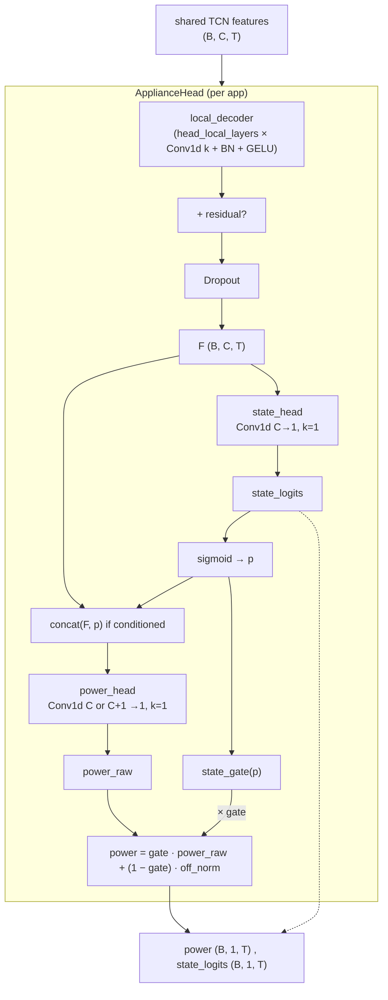

# MultiNILM appliance head form

Source: `model/MultiNILM.py` → class `ApplianceHead`  
Used by: baseline MultiNILM and `MultiNILM_fractional` (same backbone heads).

---

## One-line summary

Each appliance has **one shared body** + **state 1×1 first**, then **power 1×1** (optionally on `concat(F, p)`), then **SGN gate** blends power with `off_norm`.

Default (`power_conditioned_on_state: false`): two independent 1×1 readouts from `F`.  
Enabled (`true`): classification informs regression as an extra input channel (MTL style-a lite).

---

## Form (ASCII) — `power_conditioned_on_state: true`

```text
                    shared TCN features
                         (B, C, T)
                            │
                            ▼
              ┌─────────────────────────────┐
              │     ApplianceHead (per app) │
              │                             │
              │  local_decoder              │
              │  (head_local_layers ×       │
              │   Conv1d k + BN + GELU)     │
              │           │                 │
              │           + residual?       │
              │           │                 │
              │        Dropout              │
              │           │                 │
              │           F  (B, C, T)      │
              │           │                 │
              │           ▼                 │
              │      state_head             │
              │      Conv1d C→1, k=1        │
              │           │                 │
              │      state_logits           │
              │           │                 │
              │      sigmoid → p            │
              │          / \                │
              │         /   \               │
              │        ▼     ▼              │
              │  concat(F,p)  state_gate(p) │
              │        │                    │
              │   power_head                │
              │   Conv1d (C+1)→1, k=1       │
              │        │                    │
              │   power_raw                 │
              │        │                    │
              │        └───× gate ──┘       │
              │              │              │
              │   power = gate·power_raw    │
              │         + (1-gate)·off_norm │
              └──────────────┬──────────────┘
                             │
                    power (B,1,T) , state_logits (B,1,T)
```

With `power_conditioned_on_state: false`, `power_head` is `Conv1d C→1` on `F` alone (parallel to `state_head`); gate still uses `p`.

---

## Mermaid



---

## Multi-appliance layout

```text
shared TCN output
        │
        ├─► ApplianceHead_0 (kettle)         → power_0, state_0
        ├─► ApplianceHead_1 (fridge)         → power_1, state_1
        ├─► …                                → …
        └─► ApplianceHead_{A-1} (microwave)  → power_{A-1}, state_{A-1}

optional: CrossApplianceDistill between encode_features() of all heads
          (mix F_k before power_head / state_head)
```

With `cross_appliance.enabled: true` (fractional yaml):

```text
F_k = encode_features(shared)     # per head body
F_k^dist = F_k + α · Mix(F_1..F_A)
power_k, state_k = decode_from_features(F_k^dist)
```

---

## YAML knobs (`architecture`)

| Key | Role |
|-----|------|
| `head_local_layers` | Depth of body Conv stack (0 → legacy 1×1 only) |
| `head_kernel_size` | Odd kernel for local temporal shape (default 3) |
| `head_use_residual` | Add shared features back onto body output |
| `power_conditioned_on_state` | If true, `concat(F, p)` → power 1×1 (style-a lite) |
| `gate_mode` | `soft` / `hard` / `soft_train_hard_eval` |
| `gate_threshold` | Hard gate threshold (e.g. 0.5) |
| `dropout` | On features `F` before the 1×1 heads |

---

## Outputs and losses

| Output | Shape (per app, before cat) | Loss |
|--------|----------------------------|------|
| `power` | `(B, 1, T)` gated | MSE vs `y` (after all apps stacked) |
| `state_logits` | `(B, 1, T)` ungated | BCEWithLogits vs `z` |

Final model stack: `(B, T, A)` for both power and state.

With soft gate training, power MSE also backprops into the state path (and into `p` when conditioned).

---

## What this is / is not

| Is | Is not |
|----|--------|
| Shared body, state then power readouts | One linear layer emitting class+power together |
| Optional `p` as power-head input channel | Power head fed by `p` alone (no `F`) |
| SGN: state **gates** power | Independent power ignored by state |
| Per-appliance specialization | One shared Conv out with A channels only |
