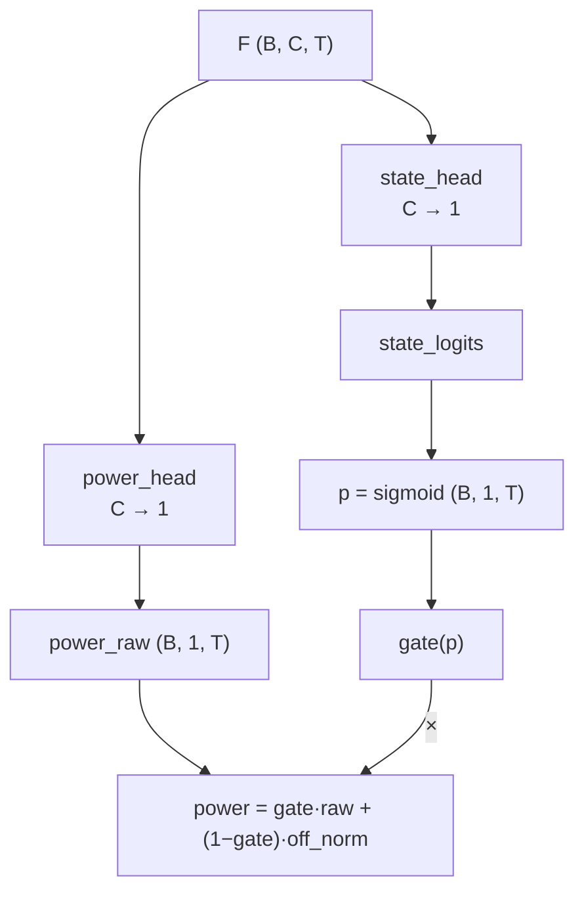
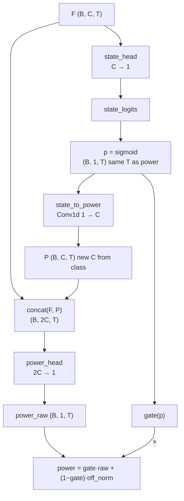

# MultiNILM appliance head form

Source: `model/MultiNILM.py` → class `ApplianceHead`  
Used by: baseline MultiNILM and `MultiNILM_fractional` (same backbone heads).

---

## One-line summary

Each appliance has **one shared body** + **state 1×1 first**, then (optional) **expand `p` → C channels** and **concat with `F`** into power, then **SGN gate** (same `p`, same length `T` as power).

Default (`power_conditioned_on_state: false`): two independent 1×1 readouts from `F`.  
Enabled (`true`): `p (B,1,T)` → `Conv1d(1→C)` → `P (B,C,T)` → `concat(F,P)=(B,2C,T)` → power.

`p`, gate, and power all share the **same time length `T`** (same as regression).

---

## What changed (state → power)

Only the **final decode** inside `ApplianceHead`. Shared TCN body, local decoder, residual, dropout, CrossApplianceDistill, and SGN gate formula are unchanged.

### Before — parallel heads (`power_conditioned_on_state: false`)

```text
                    shared TCN features
                         (B, C, T)
                            │
                            ▼
              ┌──────────────────────────────────────┐
              │          ApplianceHead (per app)     │
              │                                      │
              │   local_decoder → +res? → Dropout    │
              │                  │                   │
              │                  F  (B, C, T)        │
              │                 / \                  │
              │                /   \                 │
              │               ▼     ▼                │
              │        power_head   state_head       │
              │        Conv1d       Conv1d           │
              │        C → 1        C → 1            │
              │           │            │             │
              │      power_raw    state_logits       │
              │           │            │             │
              │           │       sigmoid → p        │
              │           │       (B, 1, T)          │
              │           │            │             │
              │           │      state_gate(p)       │
              │           │            │             │
              │           └──── × gate ─┘            │
              │                  │                   │
              │   power = gate·power_raw             │
              │         + (1−gate)·off_norm          │
              └──────────────────┬───────────────────┘
                                 │
                      power , state_logits
```

State only multiplies power (gate). Power Conv never sees class features.

### Weak try (dropped) — concat raw `p` as 1 channel

```text
concat(F, p) → (B, C+1, T)   # C≈128 → p is ~1/129 — too weak
```

### After — expand class to C, then concat (`power_conditioned_on_state: true`)

```text
                    shared TCN features
                         (B, C, T)
                            │
                            ▼
              ┌──────────────────────────────────────┐
              │          ApplianceHead (per app)     │
              │                                      │
              │   local_decoder → +res? → Dropout    │
              │                  │                   │
              │                  F  (B, C, T)        │
              │                  │                   │
              │                  ▼                   │
              │             state_head               │
              │             Conv1d C → 1             │
              │                  │                   │
              │             state_logits             │
              │                  │                   │
              │             sigmoid → p              │
              │             (B, 1, T)  ← same T as power
              │                /   \                 │
              │               /     \                │
              │              ▼       ▼               │
              │     state_to_power   state_gate(p)   │
              │     Conv1d 1 → C          │          │
              │              │            │          │
              │         P (B, C, T)       │          │
              │         “new 128”         │          │
              │              │            │          │
              │      concat(F, P)         │          │
              │      (B, 2C, T)           │          │
              │              │            │          │
              │         power_head        │          │
              │         Conv1d 2C → 1     │          │
              │              │            │          │
              │         power_raw         │          │
              │         (B, 1, T)         │          │
              │              │            │          │
              │              └──── × gate ─┘         │
              │                    │                 │
              │   power = gate·power_raw             │
              │         + (1−gate)·off_norm          │
              │         (B, 1, T)                    │
              └────────────────────┬─────────────────┘
                                   │
                        power , state_logits
```

`p`, `P`, `power_raw`, gate, and final `power` are all length **`T`** (aligned with regression).

### Side-by-side (decode only)

```text
  BEFORE                         AFTER (current)
  ──────                         ───────────────

       F                              F
      / \                             │
     /   \                            ▼
    ▼     ▼                      state_head
 power   state                        │
  head    head                        ▼
    │      │                     logits → p (B,1,T)
    │      ▼                         / \
    │   sigmoid                     /   \
    │      │                       ▼     ▼
    │      p               state_to_power  gate(p)
    │      │               (1→C) → P
    │   gate(p)                    │
    │      │                 concat(F, P)
    ▼      ▼                 (B, 2C, T)
   × ────────                      │
    │                         power_head (2C→1)
    ▼                              │
  power                       power_raw (B,1,T)
                                   │
                              × gate(p)  ← same p, same T
                                   │
                                 power
```

### Mermaid — before



### Mermaid — after



### Code / config touch list

| File | Change |
|------|--------|
| `model/MultiNILM.py` | `state_to_power` `1→C`; `power_head` `2C→1`; gate still on `p` |
| `model/MultiNILM.py` | Config / `MultiNILM` / adapters pass `power_conditioned_on_state` |
| `config/models/multinilm_fractional.yaml` | `architecture.power_conditioned_on_state: true` |

Other model yamls leave the flag unset → **false** (old parallel heads).

### Intent

Classification and features enter power on **equal channel count** (`C` + `C`). Gate still uses the raw ON prob `p` (same length as regression). Not “power from `p` alone.”

---

## Multi-appliance layout

```text
shared TCN output
        │
        ├─► ApplianceHead_0 (kettle)         → power_0, state_0
        ├─► ApplianceHead_1 (fridge)         → power_1, state_1
        ├─► …                                → …
        └─► ApplianceHead_{A-1} (microwave)  → power_{A-1}, state_{A-1}

optional: CrossApplianceDistill between encode_features() of all heads
          (mix F_k before power_head / state_head)
```

With `cross_appliance.enabled: true` (fractional yaml):

```text
F_k = encode_features(shared)     # per head body
F_k^dist = F_k + α · Mix(F_1..F_A)
power_k, state_k = decode_from_features(F_k^dist)
```

---

## YAML knobs (`architecture`)

| Key | Role |
|-----|------|
| `head_local_layers` | Depth of body Conv stack (0 → legacy 1×1 only) |
| `head_kernel_size` | Odd kernel for local temporal shape (default 3) |
| `head_use_residual` | Add shared features back onto body output |
| `power_conditioned_on_state` | If true: `p→P(C ch)` then `concat(F,P)` → power `2C→1` |
| `gate_mode` | `soft` / `hard` / `soft_train_hard_eval` |
| `gate_threshold` | Hard gate threshold (e.g. 0.5) |
| `dropout` | On features `F` before the 1×1 heads |

---

## Outputs and losses

| Output | Shape (per app, before cat) | Loss |
|--------|----------------------------|------|
| `power` | `(B, 1, T)` gated | MSE vs `y` (after all apps stacked) |
| `state_logits` | `(B, 1, T)` ungated | BCEWithLogits vs `z` |

Final model stack: `(B, T, A)` for both power and state.

With soft gate training, power MSE also backprops into the state path (and into `p` when conditioned).

---

## What this is / is not

| Is | Is not |
|----|--------|
| Shared body, state then expand-to-C + concat into power | One linear layer emitting class+power together |
| Class map `P` same channel count as `F` | Raw `p` as a single drowned channel (`C+1`) |
| SGN: state **gates** power (same `p`, same `T`) | Independent power ignored by state |
| Per-appliance specialization | One shared Conv out with A channels only |
