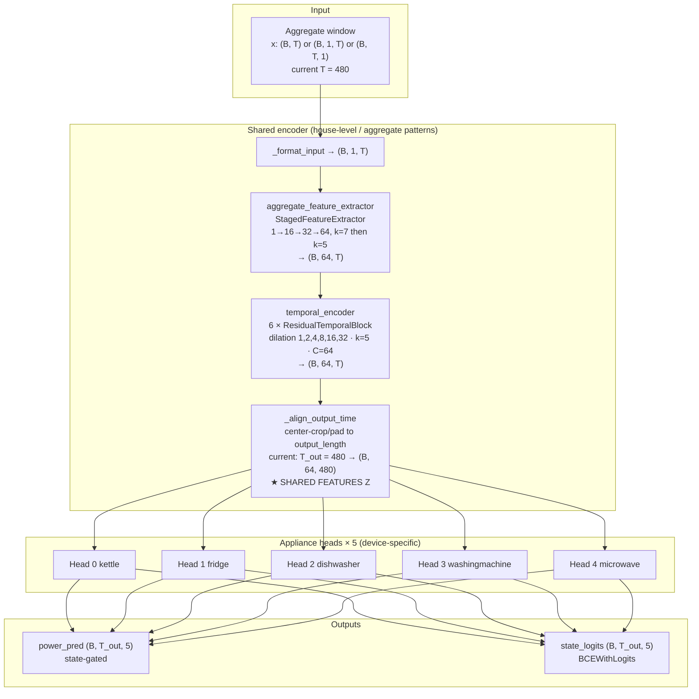

# MultiNILM Architecture (current) + Domain-Adaptation Hook

Source of truth: `model/MultiNILM.py`  
Current UK-DALE config: `config/models/multinilm.yaml`

This note draws the **latest** architecture and explains **where / how to modify** it for CORAL (or MMD) domain alignment on **shared features** (aggregate complexity shift), without redesigning the whole network.

---

## 1. Current architecture (from code + yaml)

### Config snapshot (`multinilm.yaml`)

| Setting | Value |
|---------|-------|
| Input / output window | **480 / 480** (`training_targets: auto` → `full_input`) |
| Stride | train/eval **240** |
| `channel_schedule` | `[16, 32, 64]` |
| `hidden_channels` | 64 |
| `num_blocks` | **6** (dilations 1,2,4,8,16,32) |
| `gate_mode` | soft |
| Appliances | 5 (kettle, fridge, dishwasher, washingmachine, microwave) |

### Mermaid diagram



### ASCII (same as your figure, updated to 480/480)

```text
                    MultiNILM  (current yaml)

        Aggregate window
        (B, 480) → format → (B, 1, 480)
                    │
                    ▼
        ┌─────────────────────────────────────────┐
        │  Shared encoder                         │
        │                                         │
        │  StagedFeatureExtractor                 │
        │    1 → 16 → 32 → 64   (k=7, k=5, k=5) │
        │              │                          │
        │              ▼                          │
        │  6× ResidualTemporalBlock               │
        │    dilations 1,2,4,8,16,32  C=64 k=5    │
        │              │                          │
        │              ▼                          │
        │  _align_output_time → (B, 64, 480)      │
        │         ★ shared_features Z             │
        └─────────────────────────────────────────┘
                    │
        ┌───────────┼───────────┬───────────┬───────────┐
        ▼           ▼           ▼           ▼           ▼
     Head0       Head1       Head2       Head3       Head4
     kettle      fridge    dishwasher  washmach    microwave
        │           │           │           │           │
        │   each: feature_refine → power_head + state_head
        │         soft/hard gate + off_norm blend
        └───────────┴───────────┴───────────┴───────────┘
                    │
                    ▼
        power (B, 480, 5)    state_logits (B, 480, 5)
```

### One `ApplianceHead` (unchanged)

```text
shared_features (B, 64, T_out)
    → feature_refine (1×1 Conv + BN + GELU + Dropout)
    → power_raw (1×1) , state_logits (1×1)
    → gate = soft/hard(sigmoid(state))
    → power = gate * power_raw + (1-gate) * off_norm
```

### Forward today (`MultiNILM.forward`)

```text
return power_pred, state_logits
```

`shared_features` (`output_features` in code) is computed but **not returned**.

---

## 2. Where to collect features for CORAL / MMD

For **aggregate complexity shift** (house more/less active), align **shared** features only:

| Location in diagram | Variable in code | Use for domain loss? |
|---------------------|------------------|----------------------|
| After `StagedFeatureExtractor` | `features` mid-forward | Optional ablation (shallower) |
| After `temporal_encoder` | `features` | Good |
| **After `_align_output_time`** | **`output_features`** | **★ Recommended (Z)** |
| Inside each `ApplianceHead` | after `feature_refine` | Later / weak only |
| Final `power_pred` | watts | **No** (fights appliance rating shift) |

**Recommended hook:**

```text
Z = output_features    # (B, 64, T_out) after center-crop/align
```

Pool time before CORAL (simple):

```text
z_vec = Z.mean(dim=-1)   # (B, 64)
L_CORAL(z_vec_S, z_vec_T)
```

This is the MultiNILM analogue of Lin et al. computing MMD/CORAL on **fc layer features**, not on raw watts.

---

## 3. How to modify (minimal — preferred)

### Goal

Keep architecture blocks the same; only expose `Z` so training can add:

$$
\mathcal{L} = \mathcal{L}_{\mathrm{NILM}}(S) + \lambda\,\mathcal{L}_{\mathrm{CORAL}}(Z_S, Z_T)
$$

### Step A — collect features by **named layer** (implemented)

Like Lin et al. choosing fc6–fc8, MultiNILM selects hooks by **name** in yaml:

```yaml
architecture:
  domain_feature_layers: [aligned]   # default ★
  # domain_feature_layers: [temporal_3, temporal_5, aligned]  # multi-layer like paper
```

| Name | Where | Shape |
|------|-------|-------|
| `stem` | after `aggregate_feature_extractor` | `(B, C, T_in)` |
| `temporal_i` | after residual block `i` | `(B, C, T_in)` |
| `temporal` | after full `temporal_encoder` | `(B, C, T_in)` |
| **`aligned`** | after `_align_output_time` | `(B, C, T_out)` ★ |

Usage:

```python
power, state, feats = model(x, return_domain_features=True)
Z = feats["aligned"]                 # (B, 64, T_out)
z_vec = pool_domain_feature_map(Z)   # (B, 64) for CORAL/MMD
```

Normal training unchanged:

```python
power, state = model(x)
```

List allowed names: `model.available_domain_feature_layers()`.

### Step B — training loop: two forwards (same weights)

```text
power_S, state_S, feats_S = model(X_S, return_domain_features=True)
power_T, state_T, feats_T = model(X_T, return_domain_features=True)

# Paper sums domain loss over selected layers:
L_domain = sum(coral(pool(feats_S[k]), pool(feats_T[k])) for k in feats_S)
L = L_NILM(S) + lambda_domain * L_domain
```

### Step C — do **not** need

- Extra fc6–fc8 stack “to look like Lin”
- Dual networks (one for source, one for target)
- CORAL on raw aggregate series as the training loss

### Optional later (not required now)

```text
output_features → small domain_proj (1×1) → Z_domain → CORAL
                ↘ appliance_heads (still use output_features)
```

Only if you want domain alignment slightly decoupled from heads.

---

## 4. Mapping to Lin et al.

| Lin TLN | MultiNILM |
|---------|-----------|
| Shared TCN | `aggregate_feature_extractor` + `temporal_encoder` |
| fc6–fc8 features for MMD/CORAL | **`output_features` (shared Z)** |
| Single-appliance MSE | Multi-appliance power + state (`MultiNILM_loss`) |
| Target unlabeled mains | Same idea: H2 aggregate only |

---

## 5. Modification checklist

| # | File | Change |
|---|------|--------|
| 1 | `model/MultiNILM.py` | `return_domain_features` + `domain_feature_layers` (**done**) |
| 2 | `model/MultiNILM_loss.py` | `coral_loss` / `mmd_rbf_loss` / `domain_adaptation_loss` + `lambda_domain` (**done**) |
| 3 | `runner.py` / adapter DA step | Dual-loader train + `target_batch` → `domain_feats_S/T` (**done**) |
| 4 | `config/models/multinilm.yaml` | `domain_adaptation.enabled` + `loss.lambda_domain > 0` |
| 5 | Docs / experiments | Ablation: baseline vs +CORAL on H2 test |

---

## 6. Bottom line

- **Latest architecture** = staged CNN → 6 dilated residual blocks → time align → 5 gated heads (power + state).  
- **For domain shift on aggregate complexity:** collect **`output_features` after `_align_output_time`**.  
- **Preferred modify:** expose that tensor from `forward`; **do not** rebuild the encoder.  
- Train with **same Θ**, source + target forwards, CORAL on pooled shared features + existing multi-appliance loss on source only.
