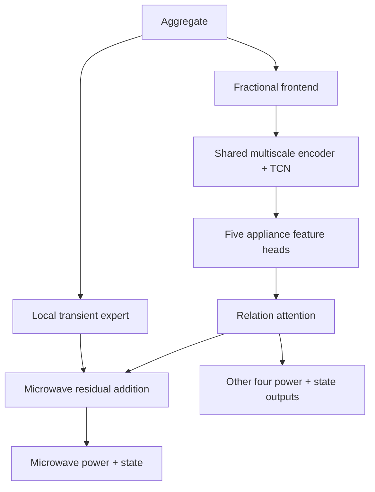
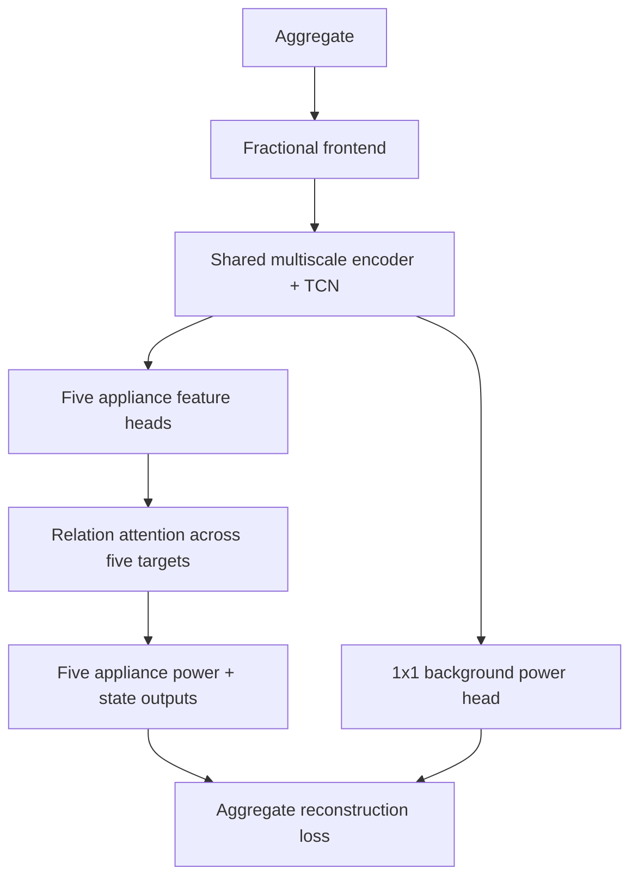

# MultiNILM background-head experiment

## Decision

The microwave-only residual adapter is removed from the active experiment. It
reduced microwave AP and increased high-background false positives. The new
experiment returns to the relational five-appliance baseline and adds only one
auxiliary output: unobserved household/background power.

Experiment ID:

```yaml
background_swap_8w_relation_background_head
```

## Why this change is needed

The failed adapter treated short aggregate-power changes as microwave evidence.
This is not reliable at 8 s resolution because unobserved household loads can
look almost identical to the target appliances.

Evidence from the previous experiment:

| Observation | Result |
|---|---:|
| REFIT fridge false-positive samples with no other target appliance ON | 95.7% |
| Median residual power during REFIT fridge false positives | 222 W |
| Median aggregate change during those false positives | 1.2 W/sample |
| Median oracle candidate power for true REFIT microwave ON | 1.62 kW |
| Median oracle candidate power for false REFIT microwave ON | 1.44 kW |
| Validation microwave AP: baseline / failed adapter | 0.436 / 0.385 |

The fridge failure is mainly a stable unobserved load, not a missing transient
feature. The microwave failure is an unobserved high-power load whose amplitude
overlaps the real microwave. A local edge detector therefore cannot solve the
underlying ambiguity.

The residual target is sufficiently usable in the current dataset. Only
0.21--0.49% of samples have `aggregate - sum(target appliances) < 0`; these
small alignment/meter inconsistencies are clipped to zero.

## Architecture before: failed microwave adapter



Problem: the local feature was added after appliance encoding and relation
attention without a learned feature-space projection. More fundamentally, the
local branch reacted to unknown-load edges as though they were microwave edges.

## Architecture after: supervised background head



Important boundaries:

- The background output is not a sixth reported appliance.
- It has no ON/OFF classifier.
- It does not participate in relation attention.
- It is used during training to compete for power that does not belong to the
  five target appliances.
- Evaluation outputs and the five-appliance metrics are unchanged.

## Targets and equations

Let aggregate power be `x(t)` and the five true target powers be `y_i(t)`.
The supervised background target is

\[
b(t)=\max\left(0,\;x(t)-\sum_{i=1}^{5}y_i(t)\right).
\]

The model predicts five appliance powers `y_hat_i(t)` and background `b_hat(t)`.
The two new losses are

\[
L_{\mathrm{bg}}=
\operatorname{SmoothL1}\left(\hat b,b\right),
\]

\[
L_{\mathrm{rec}}=
\operatorname{SmoothL1}\left(
x,\hat b+\sum_{i=1}^{5}\hat y_i
\right).
\]

Both are evaluated in aggregate-normalized units after the physical sum is
formed in watts. The total loss is

\[
L_{\mathrm{total}}=
L_{\mathrm{NILM}}
+0.10L_{\mathrm{bg}}
+0.05L_{\mathrm{rec}}.
\]

`L_NILM` and all existing appliance loss settings are unchanged, so this is a
single interpretable architecture/loss ablation. The two auxiliary terms are
outside the existing dynamic power/state balancing.

## What changed in code

- `model/MultiNILM.py`
  - removed the active microwave-only residual route;
  - added an optional one-layer background head from shared context features;
  - retained the five appliance heads and relation attention;
  - kept the normal `(power, state_logits)` model return interface.
- `model/MultiNILM_loss.py`
  - constructs the background target directly from each training batch;
  - correctly converts appliance-specific normalized outputs to watts before
    reconstruction;
  - adds weighted SmoothL1 background and reconstruction losses.
- `evaluation/plots.py`
  - shows background and reconstruction losses in the fourth loss panel.
- Existing model YAML
  - uses the new experiment ID and enables only the background head;
  - no new model configuration file was created.

## How to judge this experiment

Do not judge it only from total validation loss. Compare against
`background_swap_8w` using:

1. fridge and microwave validation AP;
2. fridge FPR in the 200--400 W and 400--800 W residual-background bins;
3. microwave FPR in the `>=800 W` bin;
4. fridge OFF-MAE and microwave ON-MAE;
5. target-focused REFIT 20 and UK-DALE 2 waveforms;
6. `train/val_loss_background` and `train/val_loss_reconstruction` in
   `loss_detail.csv`.

The experiment succeeds only if the background losses learn while fridge and
microwave false positives decrease without a material drop in their AP.

## Training command

Run from the `multi_appliances_NILM` directory:

```powershell
& "C:\Users\Raymond Tie\anaconda3\python.exe" main.py `
  --mode train_evaluate `
  --model multinilm_fractional `
  --experiment config/experiment_mixed_ukdale_refit_8w.yaml `
  --model-config config/models/multinilm_fractional_relational_background_swap.yaml
```

## Research basis

This implementation is a small project-specific ablation, not a faithful copy
of another architecture. It follows the physical NILM decomposition
`aggregate = modelled appliances + unobserved residual`. Conv-NILM-Net also
formulates NILM as multi-source separation with an additive residual/noise term.
Recent residual-aware multi-appliance work explicitly argues that forcing only
the selected appliances to reconstruct aggregate power is incorrect when
unobserved loads exist, and instead combines a residual branch with aggregate
reconstruction.

- Conv-NILM-Net: https://arxiv.org/abs/2208.02173
- RAPC-Net: https://www.mdpi.com/2076-3417/16/17/8866
