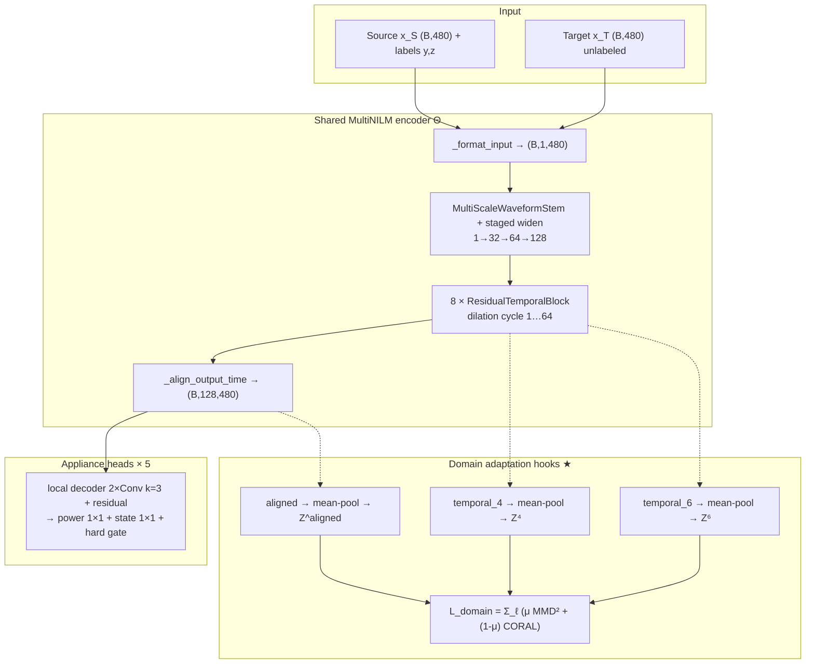
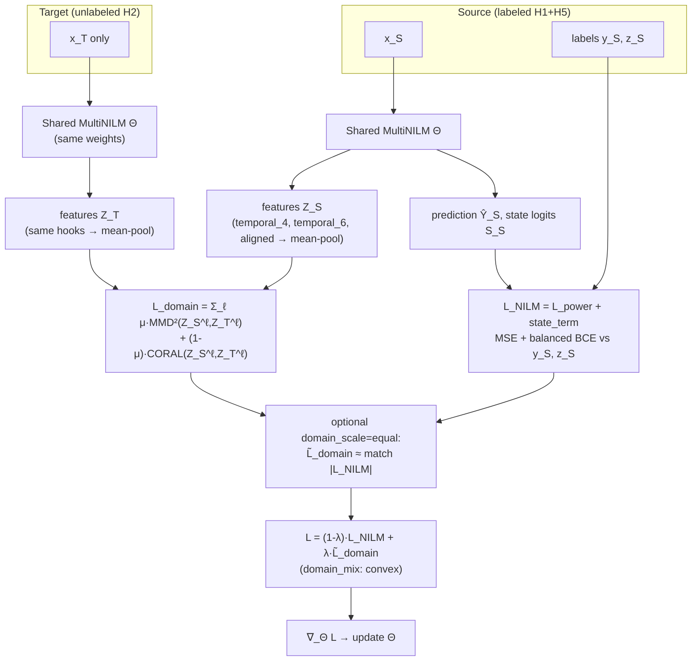

# MultiNILM Domain Adaptation — Method, Architecture, Training

This document describes **our** unsupervised cross-house domain adaptation (DA) setup for MultiNILM: the method, the network layer-by-layer, **where** DA features are taken, and the **training process with formulas**.

| Item | Location |
|------|----------|
| Model | `model/MultiNILM.py` |
| Loss / CORAL / MMD | `model/MultiNILM_loss.py` |
| Dual-batch step | `adapters/multinilm.py` |
| Train loop (target loader) | `runner.py` |
| Config | `config/models/multinilm.yaml` |
| Paper reference | Lin et al., *Deep Domain Adaptation for NILM…*, IEEE TSG 2022 |

**Status note:** DA can be toggled in yaml. Both must be on for DA to run:

- `domain_adaptation.enabled: true`
- `loss.lambda_domain > 0`

(When documenting experiments, record the yaml values used for that run.)

---

## 1. What method we use for domain adaptation

### 1.1 High-level idea (Lin-style unsupervised DA)

- **Source domain \(S\)**: labeled houses (UK-DALE **H1 + H5** train split).  
  Supervision uses aggregate \(x_S\) **and** appliance power/state labels \((y_S, z_S)\).
- **Target domain \(T\)**: unlabeled house (UK-DALE **H2** test aggregates by default).  
  Only aggregate \(x_T\) is used; **appliance labels are ignored**.
- **Shared weights \(\Theta\)**: one MultiNILM encoder+heads for both domains.
- **Goal**: learn features that still disaggregate on source, but look statistically similar on source and target so the model transfers to H2 **without target labels**.

This is **transductive / unsupervised DA** on the target split: training *sees* target aggregates (no labels), then evaluation uses the same house’s labeled test metrics.

### 1.2 Domain losses: MMD + CORAL (method `both`)

After selecting feature maps at one or more layers, we **mean-pool over time**:

\[
Z = \mathrm{mean}_{t}\, F(\cdot) \in \mathbb{R}^{B \times D}
\quad\text{(code: }(B,C,T)\rightarrow(B,C)\text{)}
\]

**CORAL** (second-order / covariance alignment), Lin Eqs. 7–9:

\[
C_S = \frac{1}{n_s-1}\Big(Z_S^\top Z_S - \frac{(Z_S^\top\mathbf{1})(\mathbf{1}^\top Z_S)}{n_s}\Big),\quad
C_T \text{ similarly}
\]

\[
\mathcal{L}_{\mathrm{CORAL}} = \frac{1}{4D^2}\,\|C_S - C_T\|_F^2
\]

**RBF-MMD²** (distribution alignment in RKHS), Lin-style:

\[
k(u,v)=\exp\!\Big(-\frac{\|u-v\|^2}{2\sigma^2}\Big)
\]

\[
\mathrm{MMD}^2
=
\mathbb{E}[k(z_S,z_S')]
+
\mathbb{E}[k(z_T,z_T')]
-
2\,\mathbb{E}[k(z_S,z_T)]
\]

\(\sigma\): median pairwise distance heuristic on \([Z_S;Z_T]\) (no gradient through \(\sigma\)).

**Per-layer domain term** (Lin Eq. 12, `domain_method: both`, \(\mu=0.4\)):

\[
\mathcal{L}_\ell
=
\mu\cdot\mathrm{MMD}^2(Z_S^\ell,Z_T^\ell)
+
(1-\mu)\cdot\mathcal{L}_{\mathrm{CORAL}}(Z_S^\ell,Z_T^\ell)
\]

**Total domain loss** (sum over selected hooks):

\[
\mathcal{L}_{\mathrm{domain}}
=
\sum_{\ell \in \mathcal{L}_{\mathrm{hooks}}}
\mathcal{L}_\ell
\]

Default hooks in yaml:

\[
\mathcal{L}_{\mathrm{hooks}}
=
\{\texttt{temporal\_4},\;\texttt{temporal\_6},\;\texttt{aligned}\}
\]

(Analogy to paper FC6–FC8: late shared layers near the head — **not** identical FC layers.)

---

## 2. Our MultiNILM architecture (current yaml)

### 2.1 Config snapshot (`config/models/multinilm.yaml`)

| Setting | Value |
|---------|-------|
| Window | input/output **480**, stride **240**, `full_input` |
| Channels | `channel_schedule: [32, 64, 128]`, `hidden_channels: 128` |
| Stem | multi-scale `detail_kernels: [3,5,9]`, `detail_branch_channels: 16` |
| TCN | `num_blocks: 8`, `kernel_size: 5`, `max_dilation: 64`, `dropout: 0.15` |
| Gate | `gate_mode: hard` (STE in train) |
| Heads | `head_local_layers: 2`, `head_kernel_size: 3`, residual |
| Appliances | 5: kettle, fridge, dishwasher, washingmachine, microwave |
| Params (typical) | ~**1.21M** |

### 2.2 End-to-end diagram



---

## 3. Architecture layer by layer

Shapes below assume batch size \(B\), window \(T=480\), hidden \(C=128\), appliances \(A=5\).

### Layer 0 — Input format (`_format_input`)

| | |
|--|--|
| In | \((B,T)\) or \((B,1,T)\) or \((B,T,1)\) |
| Out | \((B, 1, T)\) |
| Role | Conv1d layout |

### Layer 1 — Multi-scale stem (`MultiScaleWaveformStem`)

| | |
|--|--|
| Branches | Conv1d \(1\to 16\) with \(k\in\{3,5,9\}\) + BN + GELU each |
| Fuse | concat → Conv1d \(48\to 32\) (1×1) + BN + GELU |
| Skip | \(1\to 32\) if needed |
| Out | \((B, 32, T)\) |
| Role | Capture short edges / multi-scale waveform detail |

**DA hook name:** `stem` (optional; **not** in default yaml list).

### Layer 2 — Staged widen (`StagedFeatureExtractor` on rest of schedule)

With multi-scale stem already producing 32 channels, remaining schedule is `[64, 128]`:

| Stage | Op | Out shape |
|-------|-----|-----------|
| 32→64 | Conv1d \(k=5\) + BN + GELU | \((B,64,T)\) |
| 64→128 | Conv1d \(k=5\) + BN + GELU | \((B,128,T)\) |

### Layer 3 — Temporal encoder (`temporal_encoder`)

**8 × `ResidualTemporalBlock`**, channels \(C=128\), kernel \(k=5\), dropout 0.15.

Dilations **cycle** \(1,2,4,\ldots,\texttt{max\_dilation}(=64)\):

| Block index | Hook name | Typical dilation |
|-------------|-----------|------------------|
| 0 | `temporal_0` | 1 |
| 1 | `temporal_1` | 2 |
| 2 | `temporal_2` | 4 |
| 3 | `temporal_3` | 8 |
| 4 | `temporal_4` | 16 ★ DA |
| 5 | `temporal_5` | 32 |
| 6 | `temporal_6` | 64 ★ DA |
| 7 | `temporal_7` | 1 (cycle restart) |

Each block: dilated Conv → BN → GELU → dropout → dilated Conv → BN → residual (+ optional 1×1).

**DA hook names:** `temporal_i`, or `temporal` = last block output.

### Layer 4 — Time align (`_align_output_time`)

| | |
|--|--|
| In / Out | \((B, 128, T_{\mathrm{out}})\) with \(T_{\mathrm{out}}=480\) (full window) |
| Role | Crop/pad so features match label length |

**DA hook name:** `aligned` ★ (pre-head shared features \(Z\)).

### Layer 5 — Per-appliance heads × 5 (`ApplianceHead`)

For each appliance \(i=1\ldots A\):

1. **Local decoder**: \(2\times\) (Conv1d \(k=3\) + BN + GELU), same \(C=128\)
2. **Residual**: add shared `aligned` features
3. **Dropout**
4. **Power head**: Conv1d \(128\to 1\) (1×1) → raw power
5. **State head**: Conv1d \(128\to 1\) (1×1) → logits
6. **Hard gate** (STE in train):  
   \(g = \mathbf{1}[\sigma(s) \ge 0.5]\),  
   \(\hat{y} = g\cdot y_{\mathrm{raw}} + (1-g)\cdot y_{\mathrm{off}}\)  
   with \(y_{\mathrm{off}} = -\mathrm{mean}/\mathrm{std}\) (normalized 0 W)

**Heads are not used for DA** — only shared encoder hooks.

### Layer 6 — Stack outputs

\[
\hat{Y},\; S_{\mathrm{logits}} \in \mathbb{R}^{B \times T_{\mathrm{out}} \times A}
\]

---

## 4. Where domain adaptation is applied

### 4.1 Feature locations (default)

| Hook | Where in network | Shape before pool | After mean-pool |
|------|------------------|-------------------|-----------------|
| `temporal_4` | After TCN block 4 | \((B,128,T)\) | \((B,128)\) |
| `temporal_6` | After TCN block 6 | \((B,128,T)\) | \((B,128)\) |
| `aligned` | After time align, **before heads** | \((B,128,480)\) | \((B,128)\) |

Configured by:

```yaml
architecture:
  domain_feature_layers: [temporal_4, temporal_6, aligned]
```

Optional hooks (code supports): `stem`, `temporal`, `temporal_0` … `temporal_7`.

### 4.2 What is **not** aligned

- Appliance head internals / power & state outputs  
- Target labels (never used in \(\mathcal{L}_{\mathrm{NILM}}\) for \(T\))

### 4.3 Important limitation

Mean-pooling over time **discards event timing**. Alignment matches **channel-average** statistics. This often helps continuous loads (e.g. fridge) more than sparse events (kettle / dishwasher).

---

## 5. Training process for domain adaptation

### 5.0 Complete training pipeline (slide-ready)

Your partial diagram stops at \(\hat{Y}_S,Z_S\) and \(Z_T\). The full training step is:



**ASCII (for PowerPoint):**

```text
Training Procedure (one step)

  Source x_S ──┐
               │   network (same Θ)
               ├──────────────────►  Ŷ_S , S_S , Z_S
  labels y_S,z_S ─────────────────►       │         │
                                          │         │
                                          ▼         │
                               L_NILM(Ŷ_S,S_S; y_S,z_S)
                                          │         │
  Target x_T ──┐                          │         │
               │   network (same Θ)       │         │
               └──────────────────►  Z_T ─┘         │
                                      │             │
                                      ▼             │
                         L_domain(Z_S, Z_T)  ◄──────┘
                                      │
                                      ▼
              L = (1-λ) L_NILM + λ L̃_domain     (λ = lambda_domain)
                                      │
                                      ▼
                              backprop → update Θ

  Notes:
  - Target has NO label loss (unsupervised DA).
  - Z = mean-pool of hooked maps (default: temporal_4, temporal_6, aligned).
  - Val / checkpoint: L_NILM only on source val (no L_domain).
```

### 5.1 Data flow each training step

1. Sample **source** batch \((x_S, y_S, z_S)\) from train loader (H1+H5).  
2. Sample **target** batch \(x_T\) from target loader (`domain_adaptation.target_split`, default `test` = H2).  
   Target \(y_T,z_T\) are **discarded**.  
3. Dual forward, **shared \(\Theta\)**:

\[
\hat{Y}_S,\; S_S,\; \{F_S^\ell\}
=
f_\Theta(x_S)
\quad\text{(return\_domain\_features=True)}
\]

\[
\{\,F_T^\ell\,\}
=
f_\Theta(x_T)
\quad\text{(predictions unused for loss)}
\]

4. Build supervised NILM loss on source only; domain loss on pooled \(\{Z_S^\ell, Z_T^\ell\}\).  
5. Backprop total \(L\) through **both** forwards (encoder sees source labels + domain alignment).  
6. **Validation**: source-style val split only — **no DA term**, no target batch.  
7. Checkpoint: still `val_mae_minus_f1` on **source** validation (not target F1).

### 5.2 Supervised NILM loss (source)

Per appliance \(i\), then sum:

\[
\mathcal{L}_{\mathrm{power}} = \sum_{i=1}^{A} \mathrm{MSE}_i(\hat{Y}_S, y_S)
\]

\[
\mathcal{L}_{\mathrm{state}} = \sum_{i=1}^{A} \mathrm{BCEWithLogits}_i(S_S, z_S)
\quad\text{(optional }pos\_weight\text{)}
\]

With `task_balance: equal`:

\[
\mathrm{state\_term}
=
\lambda_{\mathrm{state}}\cdot
\mathcal{L}_{\mathrm{state}}\cdot
\frac{\mathcal{L}_{\mathrm{power}}}{\mathcal{L}_{\mathrm{state}}}\Big|_{\mathrm{stop\text{-}grad}}
\]

\[
\mathcal{L}_{\mathrm{NILM}}
=
\mathcal{L}_{\mathrm{power}} + \mathrm{state\_term}
\]

(\(\lambda_{\mathrm{state}}=1\) ⇒ power and state contribute equal magnitude.)

### 5.3 Domain term scaling (`domain_scale`)

Raw \(\mathcal{L}_{\mathrm{domain}}\) is often \(\ll \mathcal{L}_{\mathrm{NILM}}\) (CORAL’s \(1/(4D^2)\), etc.).

**`domain_scale: none`:** use raw \(\mathcal{L}_{\mathrm{domain}}\).

**`domain_scale: equal`:** rescale to NILM magnitude (stop-grad on the ratio):

\[
\mathcal{L}_{\mathrm{domain}}^{\mathrm{scaled}}
=
\mathcal{L}_{\mathrm{domain}}\cdot
\frac{\mathcal{L}_{\mathrm{NILM}}}{\mathcal{L}_{\mathrm{domain}}}\Big|_{\mathrm{stop\text{-}grad}}
\]

In code this is `loss_domain_term`.

### 5.4 Total training objective (`domain_mix`)

Let \(\lambda = \lambda_{\mathrm{domain}}\) and \(\tilde{\mathcal{L}}_{\mathrm{domain}}\) = scaled or raw domain term.

**Convex (Lin total loss, `domain_mix: convex`):**

\[
L
=
(1-\lambda)\,\mathcal{L}_{\mathrm{NILM}}
+
\lambda\,\tilde{\mathcal{L}}_{\mathrm{domain}}
\]

**Additive (legacy, `domain_mix: additive`):**

\[
L
=
\mathcal{L}_{\mathrm{NILM}}
+
\lambda\,\tilde{\mathcal{L}}_{\mathrm{domain}}
\]

Typical paper-like setting we used in DA runs: \(\lambda=0.6\), \(\mu=0.4\), `both`, multi-layer hooks, `domain_scale: equal`.

### 5.5 Pseudocode

```text
for epoch in 1..E:
  for (x_S, y_S, z_S) in train_loader:          # labeled H1+H5
      x_T = next(target_loader)[0]              # unlabeled H2 aggregates only

      Yhat_S, S_S, feats_S = model(x_S, return_domain_features=True)
      _,      _,   feats_T = model(x_T, return_domain_features=True)

      L_NILM   = supervised_nilm(Yhat_S, S_S, y_S, z_S)
      L_domain = sum_over_hooks μ·MMD² + (1-μ)·CORAL  (mean-pooled feats)
      L_dom_term = scale(L_domain, L_NILM) if domain_scale==equal else L_domain

      if domain_mix == convex:
          L = (1-λ)*L_NILM + λ*L_dom_term
      else:
          L = L_NILM + λ*L_dom_term

      L.backward(); optimizer.step()

  validate on val split with L_NILM only (no DA)
  maybe save best.pt by val_mae_minus_f1
```

### 5.6 Enable / disable checklist

| Knob | DA ON | DA OFF (clean baseline) |
|------|-------|-------------------------|
| `domain_adaptation.enabled` | `true` | `false` |
| `loss.lambda_domain` | e.g. `0.6` | `0` |
| Target loader | built from `target_split` | not used |
| Val / checkpoint | still source val | same |

---

## 6. Relation to Lin et al. (what matches / what differs)

| Aspect | Lin et al. (TSG 2022) | Ours |
|--------|----------------------|------|
| Unlabeled target mains | Yes | Yes (H2 aggregates) |
| Domain loss | μ MMD² + (1−μ) CORAL | Same (`both`, μ=0.4) |
| Total mix | \((1-\lambda)L_R + \lambda L_{\mathrm{domain}}\) | `domain_mix: convex` |
| Feature layers | FC6–FC8 on their TCN | `temporal_4`, `temporal_6`, `aligned` |
| Task | Typically **single-appliance** power | **Multi-appliance** power + state (5 heads) |
| Feature vector | Their FC vectors | Mean-pool over time of maps |
| Extra | — | `task_balance: equal`, optional `domain_scale: equal` |

---

## 7. Code map (quick)

| Step | File / symbol |
|------|----------------|
| Collect hooks | `MultiNILM.forward(..., return_domain_features=True)` |
| Mean-pool | `pool_domain_feature_map` / `_as_feature_matrix` |
| CORAL / MMD / sum layers | `coral_loss`, `mmd_rbf_loss`, `domain_adaptation_loss` |
| Mix + scale | `MultiNILMLoss.forward` |
| Dual batch | `MultiNILMAdapter.step(..., target_batch=...)` |
| Cycle target loader | `runner.py` training loop when DA active |

---

*Generated from the current MultiNILM + DA implementation. If yaml architecture changes, update §2–§4 to match `config/models/multinilm.yaml` and `model/MultiNILM.py`.*
