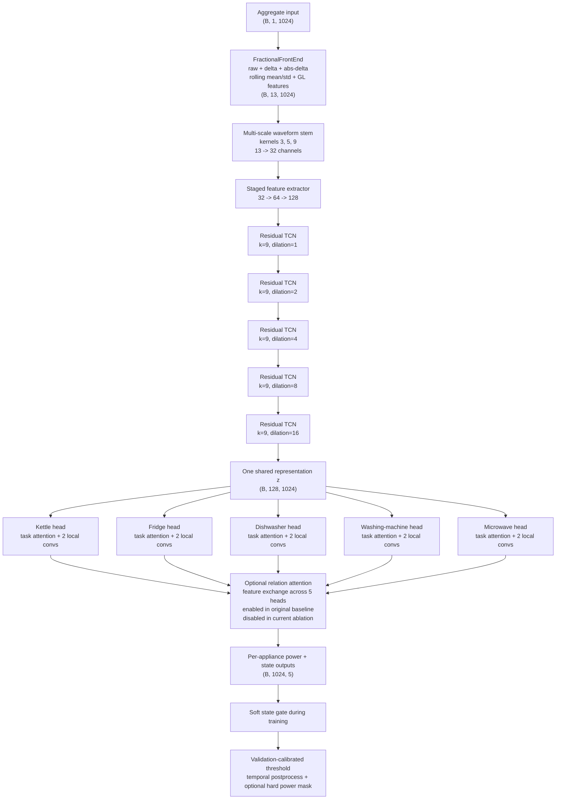
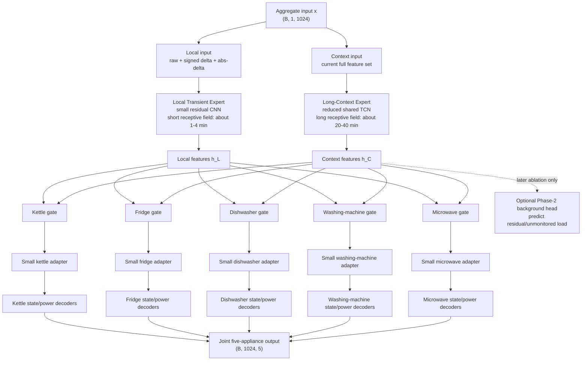
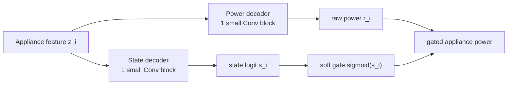
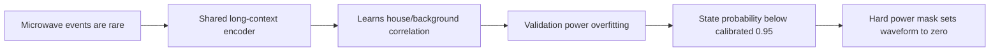
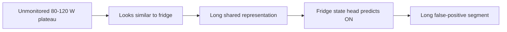

# MultiNILM 下一阶段架构设计：当前模型与建议模型对比

> **文档状态：设计提案，尚未实现。**  
> 当前正在运行的实验是 `background_swap_8w_no_relation`：它只关闭了 cross-appliance relation attention，其他设置保持不变。本文提出的 dual-expert、private adapter、split decoder 和 background head 都必须在该实验完成后按阶段验证，不能一次全部加入。

## 1. 执行摘要

当前 MultiNILM 使用一个强共享编码器同时服务五种时间和功率特性差异很大的电器。所有电器先经过相同的 fractional frontend、multiscale stem 和长感受野 TCN，之后才进入 appliance-specific heads。原始 baseline 还会通过 relation attention 再次交换不同电器的特征。

现有结果显示：

- microwave 的训练功率损失持续下降，但 validation power loss 后期明显上升，说明功率回归出现过拟合；
- microwave 的 background-swap 实验显著降低高背景 false-positive rate，但 recall 会受到高校准阈值和 hard power masking 影响；
- fridge 在高背景区域仍有非常高的 false-positive rate，说明模型会把未监测负载的低功率平台解释成 fridge；
- 在同一个 checkpoint 中，microwave 主导 power loss，而 fridge 主导 state loss，多个目标通过同一个 shared encoder 和动态 loss balance 互相影响；
- 五种电器需要的时间尺度不同：microwave 依赖分钟级局部边缘，fridge 依赖启动边缘和周期上下文，dishwasher 与 washing machine 需要更长的过程信息。

因此，建议的核心不是继续增加普通 attention，而是采用：

> **两个共享时间专家（local transient expert + long-context expert），每个电器使用自己的 gate 选择专家，再通过轻量 appliance-private adapter 和分离的 state/power decoder 输出结果。**

该设计仍然是一个 joint multi-appliance model：输入一次 aggregate，同时输出五个电器。它不会退化成五个独立模型。

---

## 2. 当前实验状态必须区分清楚

| 状态 | Relation attention | Background swap | 说明 |
|---|---:|---:|---|
| 原始 background-swap baseline | 开启 | 开启 | 已有结果，fridge/microwave 仍存在失败 |
| 当前运行：`background_swap_8w_no_relation` | **关闭** | 开启 | 单变量消融，用于判断跨电器特征交换是否有害 |
| 本文 proposed architecture | 关闭 | 开启 | 尚未实现；必须等待 no-relation 结果后分阶段测试 |

当前 no-relation 实验非常重要，因为它回答：

\[
\text{当前失败是否主要来自 cross-appliance relation attention？}
\]

如果直接加入新架构，就无法区分改善来自删除 relation attention，还是来自新模块。

---

## 3. Before：当前 MultiNILM 架构

### 3.1 当前数据流



### 3.2 当前架构的关键特点

1. **Raw aggregate 已经存在，但没有独立 bypass。**  
   Raw signal 是 13 个 frontend channels 中的一个。进入 frontend 和 shared encoder 后，所有 heads 只能访问统一表示 \(z\)，无法直接访问一个独立的局部 raw representation。

2. **所有电器共享相同的时间编码。**  
   Microwave 的短事件和 washing machine 的长过程必须通过相同的五层 TCN 表示。

3. **State 和 power 几乎共享完整的 appliance feature。**  
   每个 appliance head 在同一个 local feature 上仅使用两个最终的 \(1\times1\) convolutions 分别产生 power 和 state。

4. **原始 baseline 再次混合 appliance features。**  
   Relation attention 在同一时间点对五个 appliance heads 做信息交换。这可以学习有用关系，也可能学习训练房屋特有的 appliance co-occurrence。

5. **后处理能够改变最终波形。**  
   当 `apply_to_power: true` 时，校准后的 binary state 会再次把 power prediction 乘为零。因此“最终波形完全漏掉”不一定代表 raw state probability 和 soft power 都没有响应。

---

## 4. 为什么当前结构可能不适合 fridge 与 microwave

### 4.1 Appliance temporal heterogeneity

五个电器不是五个高度相似的任务。

| 电器 | 主要判别信息 | 当前风险 |
|---|---|---|
| Microwave | 突然上升、短平台、突然下降，通常持续几分钟 | 长上下文容易学习背景或房屋模式；稀有事件容易被多数 OFF 样本淹没 |
| Fridge | 低功率启动边缘、平台、周期性 ON/OFF | 未监测负载可能产生几乎相同的低功率平台 |
| Kettle | 高功率、短时、边缘明显 | 相对容易，可能主导某些短时特征 |
| Dishwasher | 长过程、多阶段 | 需要长上下文 |
| Washing machine | 长过程、多状态、功率变化复杂 | 需要长上下文和独立过程表示 |

单一 shared representation 必须同时满足互相矛盾的要求：既保留 microwave 的快速边缘，又压制背景尖峰；既识别 fridge 的低功率平台，又不能把相似背景判为 fridge。

### 4.2 Shared-gradient negative transfer

令五个电器的损失为 \(L_i\)，shared encoder 参数为 \(\theta_s\)，则 shared update 来自：

\[
g_{\mathrm{shared}}
=
\sum_{i=1}^{5}
\nabla_{\theta_s}L_i
\]

如果 microwave power gradient 和 fridge state gradient 指向相反方向：

\[
\nabla L_{\mathrm{microwave}}
\cdot
\nabla L_{\mathrm{fridge}} < 0,
\]

一个任务的更新会损害另一个任务。这属于 multi-task gradient interference。PCGrad 的原始论文正是针对此类冲突梯度提出投影方法，但在本项目中，优先改变 feature routing 比立即加入复杂优化器更容易解释和消融。

### 4.3 Background ambiguity is not solved by more derived features

当前 features 大部分由同一个 active-power aggregate 派生：

\[
\phi(x)=
[x,\Delta x,|\Delta x|,
\operatorname{rollingMean}(x),
\operatorname{rollingStd}(x),
\operatorname{GL}(x)].
\]

它们可以改变表示方式，但不能增加新的物理观测。当 background 中存在与 fridge 相似的 80--120 W 平台时，更多 rolling/fractional channels 不一定能够解决可辨识性问题。

### 4.4 One global temporal route encourages shortcuts

当前长感受野允许模型利用：

- 房屋特有的 base load；
- 其他电器的共现；
- 特定时间段的背景纹理；
- 训练房屋中的周期规律。

这些信息可以降低 training loss，但可能不是目标 appliance 的可迁移 waveform signature。

---

## 5. After：建议的 Dual-Expert Multi-Appliance 架构

### 5.1 总体结构



### 5.2 Local Transient Expert

建议输入：

\[
x_{\mathrm{local}}
=
[x_{\mathrm{raw}},\Delta x,|\Delta x|].
\]

建议初始结构：

- 32 channels；
- 3 个 residual Conv1D blocks；
- kernel size 5；
- dilations \(1,2,4\)；
- GroupNorm 或当前已经验证稳定的 normalization；
- 不加入 self-attention；
- 不使用非常长的 receptive field。

目的不是独立完成 disaggregation，而是保存局部边缘、短平台和快速幅值变化。该路径最可能帮助 microwave，同时也保留 fridge compressor 的启动/关闭边缘。

### 5.3 Long-Context Expert

Long-context expert 可以复用当前 TCN 思路，但应作为“上下文专家”，而不是唯一的信息路径：

\[
h_C=E_C(\phi(x)).
\]

它负责：

- fridge 的周期上下文；
- dishwasher/washing machine 的长过程；
- 判断一个短脉冲是否处在复杂 background 中；
- 提供整体 aggregate context。

第一版不建议增加深度。可以先复用当前 shared TCN，确保新实验只测试 dual routing，而不是同时测试更大的模型。

### 5.4 Appliance-specific gates

对 appliance \(i\)，gate 根据两个 expert 的 features 产生逐时间权重：

\[
[g_{i,L}(t),g_{i,C}(t)]
=
\operatorname{softmax}
\left(
G_i([h_L(t),h_C(t)])
\right),
\]

\[
z_i(t)
=
g_{i,L}(t)h_L(t)
+
g_{i,C}(t)h_C(t).
\]

约束为：

\[
g_{i,L}(t)+g_{i,C}(t)=1.
\]

Gate 不是在五个电器之间交换信息，而是让每个电器决定当前时间更应依赖 local 还是 context expert。

预期但不应人工强制的行为：

- microwave 在真实短事件附近提高 \(g_{\mathrm{microwave},L}\)；
- fridge 在稳定周期中提高 context 权重，在启动边缘提高 local 权重；
- dishwasher/washing machine 更多使用 context expert。

该思想与 Multi-gate Mixture-of-Experts 相近：共享多个 experts，但为每个任务学习独立 gate，以处理不同任务相关性。

### 5.5 Lightweight appliance-private adapters

Gate fusion 后使用一个很小的 appliance-specific residual adapter：

\[
\tilde z_i
=
z_i+alpha_i A_i(z_i),
\]

其中：

- \(A_i\) 为一个小型 Conv1D residual block；
- \(\alpha_i\) 为可学习 scalar 或 channel-wise scale；
- \(\alpha_i\) 初始为 0，使模型训练开始时近似 shared model；
- adapter 不与其他 appliances 交换 features。

这给不同电器有限的专用容量，但主要参数仍由两个 experts 共享，因此依然是 multi-appliance model，不是五个 single-appliance networks 的拼接。

### 5.6 Separate state and power decoders

当前结果出现 state ranking 与 power waveform 不同步，因此建议 fusion 后先共享一个很小的 appliance representation，再分成两条轻量路径：



数学形式：

\[
s_i=D_i^{\mathrm{state}}(\tilde z_i),
\qquad
r_i=D_i^{\mathrm{power}}(\tilde z_i),
\]

\[
\hat y_i
=
\sigma(s_i)r_i
+
(1-\sigma(s_i))y_{i,\mathrm{off}}.
\]

State decoder 学习 ON/OFF discrimination；power decoder 学习 ON-state amplitude 与 waveform。两者仍通过 gate 和共同 feature 相互关联，但不会在最后一层之前完全共享所有参数。

---

## 6. Optional Phase 2：Residual-background auxiliary head

该模块只应在 dual-expert 模型仍无法降低 fridge high-background FPR 时测试。

### 6.1 训练目标

理论 residual background 为：

\[
y_{\mathrm{bg}}(t)
=
x(t)-\sum_{i=1}^{5}y_i(t).
\]

增加一个辅助 background head：

\[
\hat y_{\mathrm{bg}}=H_{\mathrm{bg}}(h_C),
\]

\[
L_{\mathrm{bg}}
=
\operatorname{Huber}
(\hat y_{\mathrm{bg}},y_{\mathrm{bg}}).
\]

总体损失增加：

\[
L_{\mathrm{total}}
=
L_{\mathrm{appliances}}
+
\lambda_{\mathrm{bg}}L_{\mathrm{bg}},
\qquad
\lambda_{\mathrm{bg}}\in\{0.05,0.1\}.
\]

### 6.2 为什么可能帮助 fridge

当前模型只能把 aggregate 解释为五个目标电器。当出现未监测的 80--120 W 平台时，fridge 是最相似的输出，模型容易错误吸收该功率。

Background head 给模型一个明确的 nuisance/output channel：

\[
\text{fridge-like plateau}
\rightarrow
\text{fridge or residual background},
\]

而不是默认只能选择某个 monitored appliance。

### 6.3 风险

- Aggregate 与 submeters 可能不同步，使 residual 暂时为负；
- 部分 submeters 缺失或测量误差会污染 background target；
- 不能简单把所有负 residual clip 为 0 后假设标签完全正确；
- 应使用 validity mask、robust Huber loss，并报告 residual target 的负值比例；
- 该模块不能与 dual expert 在同一实验中首次加入。

---

## 7. Before 与 After 直接对比

| 维度 | Before：当前模型 | After：建议模型 | 设计目的 |
|---|---|---|---|
| 输入路径 | 所有 features 进入同一 shared encoder | raw/delta local path + full-feature context path | 分离快速边缘与长时上下文 |
| Shared representation | 一个统一 \(z\) | 两个 shared experts | 避免一种时间表示服务所有电器 |
| Appliance routing | 每个 head 都收到相同 \(z\) | 每个 appliance 独立选择 expert 权重 | 适应 heterogeneous appliances |
| Appliance-specific capacity | head 中两个 local conv blocks | gate + small residual adapter | 减少 shared-gradient negative transfer |
| Cross-appliance interaction | 原始 baseline 使用 relation attention | 默认不做 head-to-head feature exchange | 降低 house-specific co-occurrence shortcut |
| State/power separation | 最终仅用两个 \(1\times1\) heads 区分 | 各自一个轻量 decoder | 缓解 state 与 waveform 目标冲突 |
| Background representation | 没有显式 background output | 可选 auxiliary residual head | 给未监测负载独立解释位置 |
| Multi-appliance novelty | 一次输入、五个输出 | 仍然一次输入、五个输出 | 完整保留 joint multi-appliance setting |
| 参数规模 | 约 1.376M | 预计小幅增加，具体需实现后统计 | 避免五套完整 encoder |

---

## 8. 该设计如何针对 microwave

### 当前失败链



### 建议模型的对应机制

- local expert 保留 sharp ON/OFF edges；
- appliance gate 允许 microwave 在事件附近减少对 long context 的依赖；
- private adapter 给稀有 microwave waveform 少量专用容量；
- state/power split 避免 state ranking 改善但 power regression 恶化；
- evaluation 必须同时显示 raw probability、soft power 和 hard-masked power；
- architecture 仍需配合 event-balanced sampling 与 microwave hard negatives，网络结构本身不能创造缺失的训练事件。

---

## 9. 该设计如何针对 fridge

### 当前失败链



### 建议模型的对应机制

- local expert 检查启动和关闭边缘，而不只看平台幅值；
- context expert 检查 fridge 周期和更长上下文；
- fridge gate 动态结合边缘与周期信息；
- private adapter 减少 microwave/dishwasher gradients 对 fridge representation 的影响；
- 如果仍失败，background head 为未监测平台提供单独输出；
- fridge hard-negative sampling 仍然必要，因为架构只有在看到困难负样本后才能学习 rejection boundary。

重要限制：如果两个负载在 active-power aggregate 上完全相同，没有额外 reactive power、高频信号或其他传感器时，任何 architecture 都无法保证完全区分。本文设计目标是减少可避免的 shortcut 和 negative transfer，而不是声称解决信息论上的不可辨识性。

---

## 10. 分阶段实验计划

### Stage A：完成当前 no-relation ablation

实验 ID：

```text
background_swap_8w_no_relation
```

唯一变化：

```yaml
cross_appliance:
  enabled: false
```

决定：

| 结果 | 解释 | 下一步 |
|---|---|---|
| Fridge 与 microwave 都改善 | relation attention 存在负迁移/shortcut | 永久使用 no-relation baseline |
| Microwave 改善、fridge 不变 | 共现关系主要伤害 microwave；fridge 仍是背景辨识问题 | 进入 dual expert，再考虑 background head |
| Fridge 改善、microwave 不变 | fridge 受到跨电器污染；microwave 主要是稀有事件/阈值 | 进入 dual expert并改善 sampling |
| 两者都无改善 | 问题更可能在 shared temporal representation、loss/sampling 或可辨识性 | 进入 Stage B，但不宣称 relation attention 有害 |
| 明显变差 | relation attention 提供有用信息 | 后续可以研究受控 residual relation，但不要恢复原始无限制结构并同时加入新模块 |

### Stage B：只加入 dual experts 与 appliance gates

建议实验 ID：

```text
background_swap_8w_dual_expert
```

保持：

- background swap 不变；
- loss 不变；
- activation 不变；
- postprocessing 不变；
- 不加入 private adapter；
- 不加入 background head；
- 不拆分 state/power decoder。

这一阶段只回答：

\[
\text{appliance-specific temporal routing 是否优于一个 shared temporal path？}
\]

### Stage C：加入 lightweight private adapters

建议实验 ID：

```text
background_swap_8w_dual_expert_adapters
```

只在 Stage B 有改善但仍存在 appliance-specific failure 时进行。

### Stage D：拆分 state/power decoders

建议实验 ID：

```text
background_swap_8w_dual_expert_split_heads
```

只在 AP/state 改善但 waveform/power regression 仍恶化时进行。

### Stage E：加入 background auxiliary head

建议实验 ID：

```text
background_swap_8w_dual_expert_bg_head
```

只在 fridge high-background FPR 仍然很高时进行。

---

## 11. 成功判据

不能只根据 overall validation loss 判断 architecture 是否成功。

### Microwave

- validation 与 held-out house AP；
- event recall；
- precision；
- high-background FPR；
- ON-event power MAE；
- soft-power waveform；
- hard-mask 前后事件保留率。

### Fridge

- high-background FPR，尤其是 \([200,400)\)、\([400,800)\)、\(\ge 800\) W bins；
- OFF 区域平台误报持续时间；
- AP 和 calibrated F1；
- true-ON recall，确保降低 FPR 不是通过全部预测 OFF；
- power MAE 与 energy ratio。

### Overall multi-appliance quality

- 每个 appliance 分别报告，而不是只给 pooled overall；
- house-macro 指标；
- worst-house 指标；
- 两个 seeds；
- 参数数量和推理成本；
- gate 使用情况：每个 appliance 的 local/context 权重分布。

建议把“成功”定义为：

1. fridge high-background FPR 显著下降，同时 recall 没有不可接受的下降；
2. microwave AP 或 event recall 提升，同时 FPR 不反弹；
3. dishwasher、washing machine 和 kettle 不出现明显负迁移；
4. 结果至少由两个 seeds 支持；
5. 改善不能只来自 threshold 改变。

---

## 12. 建议记录的额外诊断

### 12.1 Gate visualization

对每个 appliance 保存：

\[
g_{i,L}(t),\qquad g_{i,C}(t).
\]

将它们与 aggregate、true power、predicted power 一起画图。这样可以检验模型是否真的按设计使用专家，而不是所有 appliances 都固定选择同一个 expert。

### 12.2 Shared-gradient cosine similarity

在少量训练 batches 上记录 appliance losses 对 shared experts 的梯度：

\[
\cos(g_i,g_j)
=
\frac{g_i^Tg_j}
{\|g_i\|\|g_j\|}.
\]

- 正值：两个任务当前更新方向一致；
- 接近 0：关系较弱；
- 负值：存在直接 gradient conflict。

重点观察：

- microwave power vs fridge state；
- microwave vs dishwasher/washing machine；
- fridge vs kettle。

该诊断可以为论文中“为什么需要 appliance-specific routing”提供直接证据。

### 12.3 Raw/soft/hard output separation

每次 evaluation 同时保存：

1. raw state probability；
2. raw power branch output；
3. soft-gated power；
4. calibrated binary state；
5. hard-masked final power。

否则无法区分 architecture failure 与 threshold/postprocessing failure。

---

## 13. 实现影响范围

如果 Stage B 获准实现，主要修改应集中在：

- `model/MultiNILM.py`
  - 增加 local transient expert；
  - 将当前 temporal encoder 作为 context expert；
  - 增加 per-appliance two-expert gates；
  - 保持现有 output tensor shape `(B, T, A)`；
- model YAML
  - 增加 `dual_expert.enabled`；
  - local expert channels/kernel/dilations；
  - gate configuration；
- tests
  - tensor shapes；
  - gate weights sum to one；
  - backward gradients；
  - old configuration fallback；
  - checkpoint compatibility error message。

第一版不应同时修改 dataloader、loss、threshold 和 evaluation semantics。这样才能把性能变化归因于 architecture。

旧 checkpoint 与新架构预计不兼容，因此必须从头训练，并使用新的 experiment ID。

---

## 14. 风险与停止条件

| 风险 | 表现 | 处理 |
|---|---|---|
| Gate collapse | 所有 appliances 始终选择同一 expert | 检查初始化、entropy；先诊断，不立即增加正则 |
| Local expert 学习背景尖峰 | Microwave FPR 上升 | 增加 microwave hard negatives，不直接扩大模型 |
| Context expert 继续记忆房屋 | Train/validation gap 不下降 | 减少 context capacity或改善 validation/sampling |
| Private adapters 过拟合 | Train improvement、test deterioration | 缩小 adapter或移除 |
| Background target 污染 | Background loss 不稳定、负 residual 多 | 使用 mask/Huber；必要时放弃 background head |
| 其他电器性能下降 | Overall 看似改善但 DW/WM collapse | 使用 per-appliance acceptance criteria |

如果 dual-expert 在两个 seeds 上不能改善 fridge/microwave，或者只通过牺牲其他 appliances 获得提升，就不应继续加入 adapters 和 background head。此时优先检查 sampling、labels、threshold transfer 和输入可辨识性。

---

## 15. 论文层面的潜在贡献表述

如果消融支持该设计，可以将方法描述为：

> A background-robust multi-appliance NILM architecture that combines shared multi-scale temporal experts with appliance-specific routing. The model preserves joint disaggregation efficiency while reducing negative transfer between appliances with heterogeneous temporal characteristics.

该贡献需要以下证据支持：

1. shared single-path baseline；
2. no-relation baseline；
3. dual-expert routing；
4. dual expert + private adapters；
5. 可选 background head；
6. gate visualization；
7. per-appliance、per-house 和 high-background results；
8. 参数量与推理成本。

不要在实验完成前声称该架构已经解决 negative transfer。当前只能说：现有结果支持这一假设，仍需 controlled ablation 验证。

---

## 16. 参考依据

1. Ma et al., **Modeling Task Relationships in Multi-task Learning with Multi-gate Mixture-of-Experts**, KDD 2018. Shared experts + task-specific gates 用于学习不同任务关系：  
   <https://research.google/pubs/modeling-task-relationships-in-multi-task-learning-with-multi-gate-mixture-of-experts/>

2. Xiong et al., **MATNilm: Multi-appliance-task Non-intrusive Load Monitoring with Limited Labeled Data**, IEEE Transactions on Industrial Informatics / arXiv 2023. 使用 multi-appliance framework 与 appliance 内的 hierarchical regression/classification split：  
   <https://arxiv.org/abs/2307.14778>

3. Yu et al., **Gradient Surgery for Multi-Task Learning**, NeurIPS 2020. 分析 multi-task gradient interference 并提出 PCGrad：  
   <https://proceedings.neurips.cc/paper/2020/hash/3fe78a8acf5fda99de95303940a2420c-Abstract.html>

---

## 17. 最终建议

当前不要立即实现整套 After architecture。正确顺序是：

1. 等待 `background_swap_8w_no_relation`；
2. 根据结果决定 relation attention 是否永久移除；
3. 只实现 dual local/context experts + appliance gates；
4. 验证后才加入 private adapters；
5. 只有 state 与 power 明确解耦失败时才 split decoders；
6. 只有 fridge background false positives 仍然严重时才加入 background head。

推荐的第一版核心保持简单：

\[
\boxed{
z_i(t)
=
g_{i,L}(t)E_L(x,\Delta x)
+
g_{i,C}(t)E_C(\phi(x))
}
\]

它直接解决“所有电器被迫使用同一时间表示”的结构问题，同时保持单模型、单输入、五电器联合输出的 multi-appliance novelty。
