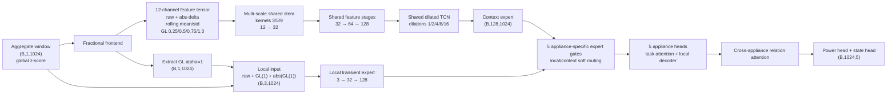

# MultiNILM 特征如何注入模型

本文档说明当前 `multinilm_k4.yaml` 中，aggregate、fractional features 和
`alpha=1` 特征如何进入 MultiNILM。这里描述的是**当前实际代码路径**，不是建议中的
概念模型。

## 1. 一句话结论

当前实现已经采用以下简单规则：

> shared encoder 不再额外加入 signed delta；使用 `GL(alpha=1)` 作为 signed delta。

但是，同一条 `GL(alpha=1)` 会走两条不同的网络路径：

1. 它和其他输入特征一起进入 **shared/context encoder**；
2. 它被单独取出，与 raw aggregate 和它的绝对值一起进入 **local transient expert**。

这不是把特征注入到模型的每一层。特征只在模型入口分流两次，之后各层处理的是已经
学习出来的 hidden features。

---

## 2. 从原始数据到模型输入

原始 aggregate power 为：

\[
x_t^{W}\quad [\mathrm{W}].
\]

DataLoader 首先使用**训练集**统计量进行一次全局 z-score：

\[
x_t=\frac{x_t^{W}-\mu_{\mathrm{agg}}}{\sigma_{\mathrm{agg}}}.
\]

因此，模型收到的 `raw_input` 已经不是 watt，而是 normalized aggregate：

```text
raw CSV aggregate (W)
        │
        ▼
training-set z-score
        │
        ▼
raw_input: (B, 1, 1024)
```

当前配置为 `fractional.channel_normalize: none`，所以 fractional frontend 不会再对
每个窗口、每个 feature 做第二次标准化。这保留了不同房屋和不同背景功率之间的幅度信息。

---

## 3. Fractional frontend 生成哪些特征

当前配置为：

```yaml
fractional:
  k: 4
  include_raw: true
  include_abs_delta: true
  include_rolling_mean: true
  include_rolling_std: true
  rolling_windows: [8, 23, 45]
  memory: 24
  channel_normalize: none
```

`k: 4` 生成四个 GL fractional channels：

\[
\alpha\in\{0.25,0.50,0.75,1.00\}.
\]

GL 特征的计算为：

\[
D^\alpha x_t
=\frac{1}{h^\alpha}\sum_{j=0}^{M}w_j^{(\alpha)}x_{t-j},
\qquad
w_0^{(\alpha)}=1,
\qquad
w_j^{(\alpha)}=w_{j-1}^{(\alpha)}\frac{j-1-\alpha}{j},
\]

其中当前 `h=1`、`M=24`。

当 \(\alpha=1\) 时：

\[
w_0=1,\qquad w_1=-1,\qquad w_{j\geq2}=0,
\]

所以除窗口第一个位置以外：

\[
D^1x_t=x_t-x_{t-1}=\Delta x_t.
\]

因此，`GL(alpha=1)` 可以替代独立的 signed delta。

### 窗口第一个样本的细小差别

代码对 GL convolution 使用左侧 zero padding，所以：

\[
D^1x_0=x_0.
\]

旧式显式 delta 通常定义为：

\[
\Delta x_0=0.
\]

两者仅在每个 1024-sample window 的第一个位置不同。这个边界差异应该记录，但它通常
不足以单独解释大幅性能变化。

### 实际输出的 12 个 channels

| 顺序 | 特征 | Channels | 主要信息 |
|---:|---|---:|---|
| 1 | raw aggregate | 1 | 总功率水平、steady-state、背景幅度 |
| 2 | absolute delta | 1 | 变化强度，不区分上升/下降 |
| 3–5 | rolling mean，窗口 8/23/45 | 3 | 短、中、长时间局部基线 |
| 6–8 | rolling std，窗口 8/23/45 | 3 | 不同时间尺度的波动和噪声强度 |
| 9–12 | GL(0.25/0.5/0.75/1.0) | 4 | 长短记忆变化；GL(1.0) 是 signed delta |
| | **总计** | **12** | `(B, 12, 1024)` |

这里的 `absolute delta` 是直接由 raw input 计算的 \(|x_t-x_{t-1}|\)。它和
`|GL(alpha=1)|` 除第一个样本外基本等价，但 shared encoder 目前仍保留这个单独 channel。

---

## 4. 特征实际在哪里注入



图中的关键点是：

- **全部 12 个 features** 只一起注入 shared/context path 的入口；
- local path 不接收全部 12 个 features；它只接收 `raw + GL(1) + |GL(1)|`；
- appliance heads 不再直接接收 raw、delta 或 fractional channels；
- relation attention 也不直接接收原始 features，它接收五个 appliance head 已经编码后的
  128-channel hidden features。

---

## 5. Shared/context path

12-channel frontend 输出首先进入 multi-scale stem：

```text
(B, 12, 1024)
   ├── Conv1d kernel=3,  12 → 16
   ├── Conv1d kernel=5,  12 → 16
   └── Conv1d kernel=9,  12 → 16
              │ concatenate
              ▼
          (B, 48, 1024)
              │ 1×1 fuse + skip
              ▼
          (B, 32, 1024)
              │ Conv stages
              ▼
          (B, 64, 1024)
              ▼
          (B, 128, 1024)
              │ dilated TCN
              ▼
     context_features: (B, 128, 1024)
```

这里没有为不同输入 feature 建立独立 tower。所有 feature channels 从第一个 convolution
开始就被联合加权：

\[
h_{c,t}=\sum_{f=1}^{12}\sum_\tau
W_{c,f,\tau}F_{f,t-\tau}.
\]

也就是说，网络可以学习使用或忽略某个 feature，但进入 stem 后，已经不能再把某个
hidden channel 简单称为 “k=1 channel” 或 “rolling-mean channel”。

### IBN 在哪里使用

IBN 用在 shared stem 和 feature stages 的 learned feature maps 上，而不是直接修改
raw aggregate 或 GL 公式。大致为：

```text
input features → Conv1d → IBN → ReLU
```

后面的 dilated TCN 使用 BatchNorm。

---

## 6. Local transient expert

local expert 使用的输入严格为：

\[
L_t=[x_t,\ D^1x_t,\ |D^1x_t|].
\]

对应代码逻辑：

```python
local_input = cat([raw_aggregate, alpha_one, abs(alpha_one)], dim=channel)
```

它不接收 GL(0.25/0.5/0.75)、rolling mean 或 rolling std。它的职责是保留：

- 上升和下降边缘的方向；
- 边缘强度；
- edge 前后的短平台；
- microwave、kettle 等短事件的局部形状。

local expert 的输出为：

\[
E_L\in\mathbb{R}^{B\times128\times1024}.
\]

shared encoder 的 context output 为：

\[
E_C\in\mathbb{R}^{B\times128\times1024}.
\]

两条路径维度相同，但网络参数不共享。

---

## 7. 每个 appliance 怎样选择 local/context information

五个 appliance 各有一个独立 gate。对 appliance \(i\)：

\[
[g_{i,L}(t),g_{i,C}(t)]
=\operatorname{softmax}\left(
G_i([E_L(t),E_C(t)])
\right),
\]

\[
Z_i(t)=g_{i,L}(t)E_L(t)+g_{i,C}(t)E_C(t),
\qquad g_{i,L}(t)+g_{i,C}(t)=1.
\]

所以 `GL(alpha=1)` 对最终输出有两种影响：

1. **间接 context 影响**：它是 12 个 shared input channels 之一；
2. **直接 local 影响**：它是 local expert 的三个输入之一。

它没有被复制到每一个 appliance head。五个 appliance 看到的是 gate 融合后的
`Z_i`，不是原始 `GL(alpha=1)`。

gate 初始 local 权重为 0.1，context 权重为 0.9。训练后，每个 appliance、每个时间点
都可以得到不同的 routing weight。

---

## 8. Appliance heads 和 relation attention

每个 appliance 的 fused feature `Z_i` 依次经过：

```text
Z_i
 │
 ├─ task attention：对 128 个 hidden channels 重新加权
 │
 ├─ two local Conv1d blocks + residual
 │
 ▼
appliance feature F_i
```

然后五个 appliance features 进入 relation attention。在每一个时间点，模型在 appliance
维度上计算 attention：

\[
\operatorname{Attention}_{i\leftarrow j}(t)
=\operatorname{softmax}_j\left(
\frac{Q_i(t)K_j(t)^T}{\sqrt d}
\right).
\]

它建模的是 appliance 之间的关系，不会重新读取 raw aggregate 或 GL features。

最后，每个 appliance 使用两个 `1x1 Conv1d` 输出：

- raw power prediction \(R_i(t)\)；
- state logit \(s_i(t)\)，并得到 \(p_i(t)=\sigma(s_i(t))\)。

当前 `gate_mode: soft`：

\[
\hat y_i(t)
=p_i(t)R_i(t)+(1-p_i(t))y_{off,i}.
\]

这里的 state gate 和前面的 expert gate 是两个不同概念：

| Gate | 选择什么 | 发生位置 |
|---|---|---|
| Expert gate | local expert vs context expert | appliance head 之前 |
| State/power gate | ON power vs normalized 0 W | 最终 power output |

---

## 9. 三种容易混淆的 “delta”

| 名称 | 是否是模型输入 | 当前状态 | 含义 |
|---|---|---|---|
| Explicit signed delta feature | 是 | **已删除** | 原本的 \(x_t-x_{t-1}\) input channel |
| `GL(alpha=1)` feature | 是 | **保留** | 当前代替 signed delta，同时进入 shared 和 local path |
| Absolute delta feature | 是 | **保留** | \(|x_t-x_{t-1}|\)，进入 shared path |
| Power delta loss | 否 | **保留，weight=0.15** | 比较预测 appliance power 与真实 power 的时间差分 |

特别注意：`power_delta_weight` 属于 loss function。它只在输出后计算训练误差，不会生成
任何 encoder input feature。因此，删除 signed-delta input 并不等于删除 delta loss。

---

## 10. 当前结构是否真的简单

从“signed delta 是否重复”这个局部问题看，当前规则是简单的：

```text
signed change = GL(alpha=1)
```

但整个输入仍然有一定重复：

```text
shared path:
GL(alpha=1)  ≈ signed delta
abs-delta    ≈ abs(GL(alpha=1))

local path:
GL(alpha=1)
abs(GL(alpha=1))
```

这种重复不一定是错误。shared path 和 local path 是不同的 expert，可以对同一物理证据
学习不同 filters。真正需要通过 ablation 回答的问题是：

> 把 edge evidence 同时给 context expert 和 local expert，是否比只给 local expert更好？

不能仅凭公式相等就假定删掉其中一条路径不会影响性能，因为删除 shared input channel 会：

- 改变 multi-scale stem 第一层的参数结构；
- 改变 context feature distribution；
- 改变 expert gate 比较的两组 features；
- 使旧 checkpoint 不再结构兼容；
- 即使 seed 相同，也会改变后续随机初始化序列。

因此合理的实验应该一次只改变一个 routing 决定。

---

## 11. 建议保持的清晰定义

当前代码和配置可以用下面四句话准确描述：

1. aggregate 在 DataLoader 中使用训练集统计量做全局 z-score；
2. frontend 生成 12 channels，`GL(alpha=1)` 替代 explicit signed delta；
3. 12 channels 共同进入 shared/context encoder；
4. `raw + GL(alpha=1) + |GL(alpha=1)|` 单独进入 local expert，之后每个 appliance 使用
   自己的 gate 融合 local 和 context features。

这比说“features 被用在每一个地方”更准确。输入 features 只在网络入口注入；后面的
task attention、relation attention、power head 和 state head 都处理 learned hidden
representations，而不是再次注入 handcrafted features。

## 12. 对应实现位置

- Feature construction：`model/MultiNILM.py` 中的 `FractionalFrontEnd`；
- Local feature injection：`LocalTransientExpert.forward`；
- Shared/context encoding 与 expert routing：`MultiNILM.forward`；
- Frontend 到 backbone 的连接：`MultiNILMFractional.forward`；
- 当前参数：`config/models/multinilm_k4.yaml`；
- DataLoader z-score：`data/dataloader.py` 中的 `NormalizationStats`。

