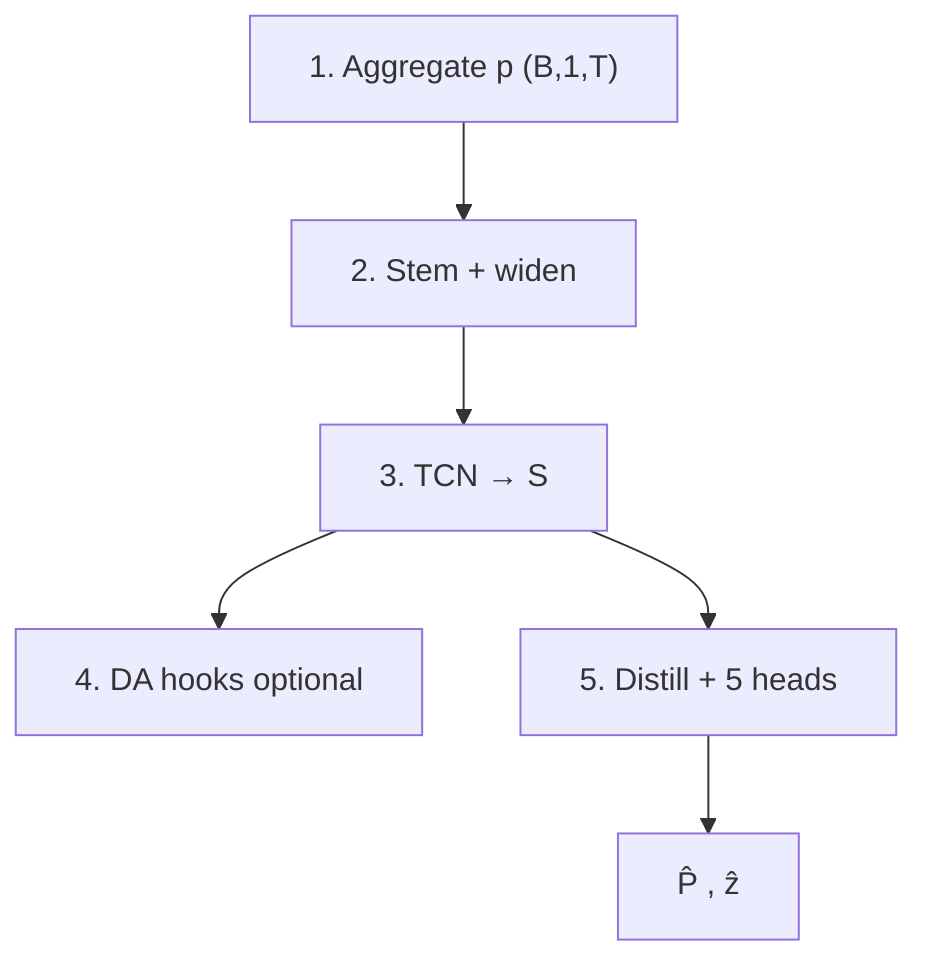
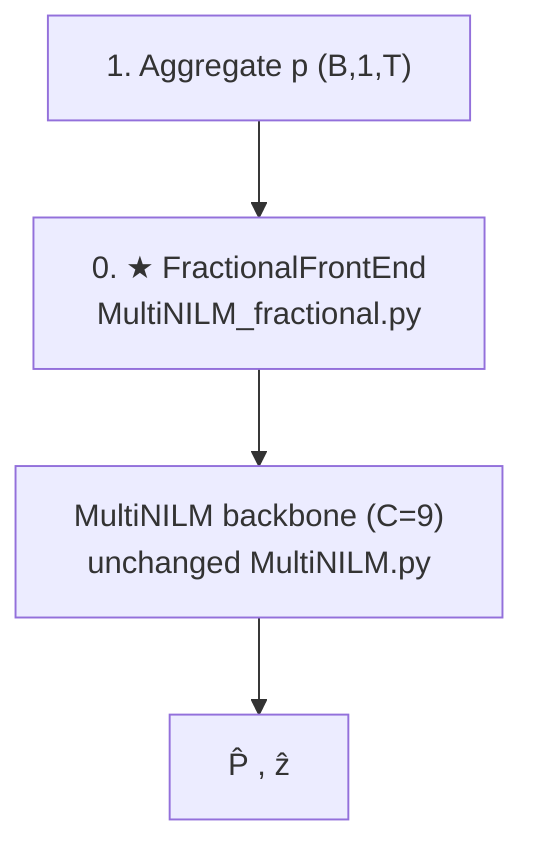
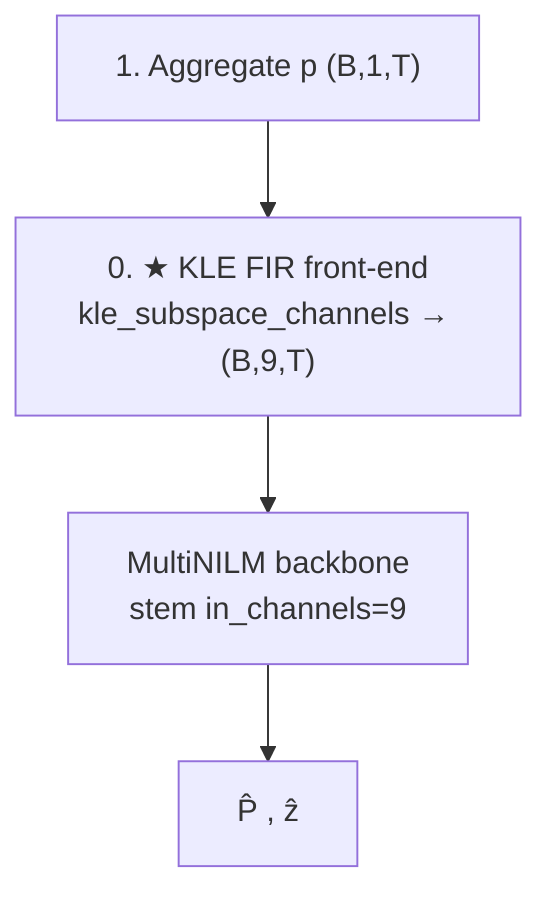

# MultiNILM 架构变更：Before / After（Fractional & KLE）

**状态核对日期：** 2026-08-03  
**目的：** 说明相对原 MultiNILM 的前后结构，以及**现在能不能直接跑**。

相关代码：
- `model/MultiNILM.py` — 可选分数阶前端
- `model/MultiNILM_kle.py` — KLE → 9 通道包装
- `model/preprocess_feature/fractional.py` — GL（NumPy + Torch 已合并）
- `model/preprocess_feature/kle.py` — KLE / 子空间通道
- `config/models/multinilm_kle.yaml` — KLE 变体配置

---

## Symbols

| Symbol | Meaning |
|--------|---------|
| \(p\) | dataloader 归一化后的 aggregate，`(B,T)` 或 `(B,1,T)` |
| \(C\) | stem 输入通道数（BEFORE=1；AFTER 常为 9） |
| `S` | TCN 共享特征 |
| \(\hat{P}_k, \hat{z}_k\) | 电器 \(k\) 的功率与状态 logits |

---

## 1. BEFORE — 原 MultiNILM

与改前端之前相同：`input_channels=1`，无分数阶 / 无 KLE 展开。

### 1.1 Block list

| # | Block | Detail |
|---|--------|--------|
| 1 | Input | `(B, 1, T)` aggregate（固定 mean/std） |
| 2 | Stem | Multi-scale → widen `32→64→128` |
| 3 | TCN | 8× residual |
| 4 | Distill + heads | PAD-lite + gate/off_norm |
| 5 | DA（可选） | pool → MMD+CORAL |

### 1.2 Diagram (before)



### 1.3 Data flow (before)

```text
p (B,1,T) → stem → TCN → heads → (P̂, ẑ)
```

---

## 2. AFTER-A — `MultiNILM_fractional.py`（独立文件，不改 baseline）

**不变：** `MultiNILM.py` 保持纯 baseline；dataloader 仍 1 通道。  
**新增：** `MultiNILMFractional` = `FractionalFrontEnd` + MultiNILM backbone（`input_channels=C`）。

默认：`include_raw=True` + `k=8` → **C = 9**。

### 2.1 Diagram (after-A)



### 2.2 入口

```text
python main.py --model multinilm_fractional --model-config config/models/multinilm_fractional.yaml
```

---

## 3. AFTER-B — MultiNILM_kle（新文件 + 新 model_name）

**不变：** dataloader 1D。  
**新增：** `kle_subspace_channels`（`kle.py`）→ raw + 8 个 FIR 子空间通道 → **C=9** → 原 MultiNILM backbone。

### 3.1 Diagram (after-B)



### 3.2 入口

```text
--model multinilm_kle --model-config config/models/multinilm_kle.yaml
```

---

## 4. BEFORE vs AFTER 对照

| 项 | BEFORE | AFTER-A Fractional | AFTER-B KLE |
|----|--------|--------------------|-------------|
| 模型文件 | `MultiNILM.py` | **`MultiNILM_fractional.py`**（baseline 不动） | `MultiNILM_kle.py` |
| dataloader | 1D | 1D | 1D |
| stem 输入 | C=1 | C=9（默认） | C=9 |
| 前端实现 | 无 | Torch GL conv | NumPy ACM+FIR（CPU） |
| yaml | `multinilm.yaml` | `multinilm_fractional.yaml` | `multinilm_kle.yaml` |
| `main.MODELS` | `multinilm` | `multinilm_fractional` | `multinilm_kle` |

```text
BEFORE:   p ──► MultiNILM(C=1)
AFTER-A:  p ──► ★Frac ──► MultiNILM(C=9)     # 独立 wrapper
AFTER-B:  p ──► ★KLE ──► MultiNILM(C=9)     # 独立 wrapper
```

---

## 5. 能否已经跑？— 核对结果

| 路径 | 代码 forward | 注册 | yaml | 可直接 `train`？ |
|------|--------------|------|------|------------------|
| **BEFORE** `multinilm` | ✅ | ✅ | ✅ | **✅**（baseline 已恢复，无 fractional 侵入） |
| **AFTER-A** `multinilm_fractional` | ✅ | ✅ | ✅ | **✅ 可启动** |
| **AFTER-B** `multinilm_kle` | ✅ | ✅ | ✅ | **✅ 可启动**（CPU KLE 较慢） |

### 5.1 命令

```text
# baseline
python main.py --model multinilm --model-config config/models/multinilm.yaml

# fractional C=9
python main.py --model multinilm_fractional --model-config config/models/multinilm_fractional.yaml

# KLE C=9
python main.py --model multinilm_kle --model-config config/models/multinilm_kle.yaml

# fractional + KLE spectrogram matrix (Conv2d) + FiLM + DA
python main.py --model multinilm_schirmer --model-config config/models/multinilm_schirmer.yaml
```

### 5.2 AFTER-C — `MultiNILM_schirmer.py`（分数阶 + KLE 矩阵）

```text
p → FractionalFrontEnd → (B,9,T)
  → schirmer_kle_maps → A,Φ (B,N,K)  ← 2D matrix
  → Conv2d encoder → FiLM on 9 channels
  → MultiNILM backbone (unchanged)
```

| 路径 | forward | 注册 | yaml | 可启动 train？ |
|------|---------|------|------|----------------|
| `multinilm_schirmer` | ✅ | ✅ | ✅（DA on） | ✅（KLE 谱图 CPU 很慢，batch=16） |
---

## 6. `preprocess_feature` 组件清单（合并后）

```text
fractional.py
  1. Core     gl_binomial_weights, default_schirmer_alphas
  2. NumPy    fractional_derivative / stack (+ batch)
  3. Torch    FractionalFrontEnd, parse_fractional_architecture

kle.py
  ACM / eig / mag-phase / normalize_spectrum
  kle_subspace_channels (+ batch)   ← MultiNILM_kle 用

schirmer_frontend.py
  fractional_channels_for_tcn / schirmer_kle_maps（谱图路径，可选）
```

已删除：`fractional_torch.py`（并入 `fractional.py`）。

---

## 7. 一句话

- **架构：** dataloader 仍 1D；AFTER 只在模型入口扩成 **9 通道** 再进原 TCN。  
- **能跑：** 原 `multinilm` ✅；`multinilm_kle` ✅ 可启动（注意 CPU KLE 慢）；分数阶要 **先写 yaml** 才算打开。  
- **完整 UK-DALE 训练效果：** 尚未用本机长跑验证，只保证 forward / 注册 / 配置链路通。
