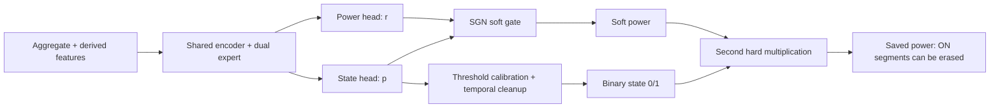
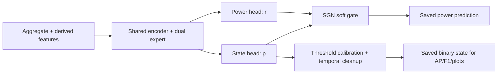

# MultiNILM：local-contrast 复盘与 soft-power 修复

## 结论

`k4_alpha1_local_contrast` **暂不作为保留模型**。它提高了部分 AP/F1，但没有可靠改善功率波形，REFIT fridge 的能量过估计反而更明显。由于目前只有它的 13 通道 checkpoint，代码暂时保留 local-contrast 兼容路径，只用于零重训的 soft-vs-hard power evaluation。

本轮发现的更直接问题不是“模型还不够复杂”，而是功率在推理时被门控了两次：

1. 模型内部已经用状态概率对回归功率做 SGN soft gate；
2. evaluation 又用校准后的 0/1 状态把功率乘一次。

第二次 hard gate 是一个不可逆的二元否决器。只要状态概率短暂低于阈值，回归分支即使预测了合理功率，最终保存的功率也会直接变成 0 W。这正好对应图中的断层、漏掉 ON 段和不连续波形。

---

## 1. local contrast 为什么没有解决问题

local contrast 试图计算当前 aggregate 相对近期背景的异常程度：

\[
c_t=\operatorname{clip}\left(
\frac{x_t-\operatorname{EMA}(x)_t}
{\operatorname{EMA}(|x-\operatorname{EMA}(x)|)_t+\epsilon},-C,C
\right).
\]

它能突出边缘，因此可能改善 ON/OFF 排序和 AP；但它不能回答“这个边缘属于哪一个电器”或“ON 后的完整功率形状是多少”。在高背景或多电器同时运行时，未知负载的边缘同样会被增强。归一化还会放大局部低幅噪声，再通过 shared encoder 同时影响五个电器任务。

结果表现为：分类可能更敏感，但回归仍会平滑、错配或漏掉内部阶段。washing machine 和 dishwasher 本身包含多个功率阶段，一个 binary ON 标签也不能表达其阶段和瞬态幅值。

### 保存结果的事实

| Test | Appliance | Tower AP/F1 | Local contrast AP/F1 | Local contrast energy ratio |
|---|---|---:|---:|---:|
| UK-DALE 2 | fridge | 0.970 / 0.902 | 0.975 / 0.917 | 0.931 |
| UK-DALE 2 | microwave | 0.746 / 0.677 | 0.797 / 0.747 | 1.011 |
| REFIT 20 | fridge | 0.731 / 0.721 | 0.737 / 0.717 | **1.391** |
| REFIT 20 | microwave | 0.454 / 0.509 | 0.542 / 0.572 | **1.317** |

所以 `validation_test_comparison.png` 看起来更好，并不等于波形恢复正确。AP/F1 只评价状态排序/二分类，不评价功率形状、内部阶段、瞬态峰值和能量守恒。

图中还要区分颜色：蓝线是 ground truth，红线是 prediction。washing machine 的一些很高、很窄的蓝色尖峰是真实瞬态；模型的问题是红线没有恢复这些阶段，或者在状态被判 OFF 时整段被清零。

---

## 2. 真正找到的 pipeline 问题：double gating

### 修改前

模型的 power head 输出原始回归值 \(r_{i,t}\)，state head 输出 logit \(s_{i,t}\)：

\[
p_{i,t}=\sigma(s_{i,t}).
\]

模型内部已经产生 soft-gated power：

\[
\hat y^{soft}_{i,t}
=p_{i,t}r_{i,t}+(1-p_{i,t})y^{off}_i.
\]

但 evaluation 又进行阈值校准和 temporal post-processing：

\[
z^{cal}_{i,t}=\operatorname{PostProcess}
\left(\mathbb{1}[p_{i,t}\geq\theta_i]\right),
\]

然后再次执行：

\[
\boxed{\hat y^{old}_{i,t}=z^{cal}_{i,t}\hat y^{soft}_{i,t}}.
\]

当 \(z^{cal}=0\) 时，无论回归值是否正确，最终功率都被强制变成 0。



### 修改后

分类仍然帮助回归，但只通过训练时的 shared features、BCE 和模型内部的 differentiable soft gate；校准后的 binary state 只用于 detection metrics 和图中的 ON/OFF shading：

\[
\boxed{\hat y^{new}_{i,t}=\hat y^{soft}_{i,t}},
\qquad
\hat z_{i,t}=z^{cal}_{i,t}.
\]



这不是取消 state-to-regression interaction。soft gate 仍然存在，而且可微；只是删除 evaluation 中第二次、不可微的 hard veto。

---

## 3. hard gate 实际删除了多少真实 ON 样本

下面从现有 `predictions.npz` 重新计算：在 CSV 标记为真实 ON 的样本中，最终保存功率恰好为 0 W 的比例。

| Run / test | fridge | dishwasher | washing machine | microwave |
|---|---:|---:|---:|---:|
| Tower / UK-DALE 2 | 7.53% | 4.25% | 14.21% | **36.92%** |
| Tower / REFIT 20 | 18.62% | 12.84% | 18.55% | **45.23%** |
| Local contrast / UK-DALE 2 | 5.63% | 3.43% | 12.65% | **21.40%** |
| Local contrast / REFIT 20 | **19.35%** | 14.84% | **23.37%** | **34.48%** |

local contrast 改善了一些分类概率，所以部分比例下降；但它没有消除 hard gate 的结构性风险。在 REFIT 中，fridge、washing machine 和 microwave 仍有大量真实 ON 点被最终处理清零。

---

## 4. 已做的代码与配置修改

只修改现有文件，没有再建立新 config：

1. `model/MultiNILM.py`
   - 保留可选的 local-contrast 计算，使现有 13 通道 checkpoint 能严格加载；
   - 这只是 checkpoint 兼容路径，不代表 local contrast 已被接受为最终贡献；
   - dual expert、task attention、relation attention、multiscale stem、IBN 和 TCN 保持不变。

2. `config/models/multinilm_k4.yaml`
   - `experiment_id: k4_alpha1_local_contrast_ramp_gate`；
   - `evaluation.state_calibration.power_gate.mode: ramp`；
   - `ramp_width: 0.20`，只在校准阈值下方 0.20 的概率区间渐变；
   - 保持原训练使用的 local-contrast 参数，使输入仍为 13 通道；
   - 训练 loss、background swap、window、optimizer 和 checkpoint 规则保持不变。

3. `tests/test_background_swap_and_metrics.py`
   - 同时验证 `none`、`hard` 和 `ramp` 三种功率门控；
   - 示例中 70 W 的不确定样本分别保留为 70 W、0 W 和 35 W。

4. `tests/test_multinilm_dual_expert.py`
   - 删除已经废弃的 local-contrast 测试。

---

## 5. 为什么先用现有 local-contrast checkpoint evaluate

当前可用 checkpoint 来自 `k4_alpha1_local_contrast`，第一层权重有 13 个输入通道。为了形成干净的因果实验，evaluation 必须保持完全相同的 13 通道结构，只改变最终 power 是否再次乘 binary state：

```text
相同权重 + 相同数据 + 相同 state threshold
唯一差异：最终 power 是否再乘 binary state
```

如果现在直接重新训练，权重随机性会与 gate 改动混在一起，无法判断波形改善来自哪里。

在训练机器上先运行：

```powershell
cd "D:\Raymond\high_low_freq_NILM\multi_appliances_NILM"

python main.py `
  --mode evaluate `
  --model multinilm_fractional `
  --experiment config/experiment_mixed_ukdale_refit_8w.yaml `
  --model-config config/models/multinilm_k4.yaml `
  --checkpoint "runs\k4_alpha1_local_contrast\multinilm_fractional\best.pt" `
  --run-dir "runs\k4_alpha1_local_contrast_soft_power\multinilm_fractional"
```

先不要运行 `train_evaluate`。这个 evaluate 通常远快于重新训练，而且直接回答 double gate 是否造成波形断层。完成诊断后，如果决定最终删除 local contrast，才需要训练新的 12 通道模型，因为 13 通道 checkpoint 不能直接加载到 12 通道 stem。

---

## 6. 如何判断这一步成功

预计 AP、F1 和 binary state shading 基本不变，因为状态概率、threshold 和 temporal cleanup 都没变。真正要比较的是：

1. fridge/microwave 的真实 ON 区间是否不再突然变成 0 W；
2. ON-MAE、energy ratio 和事件内部 waveform 是否改善；
3. OFF-MAE、false-positive energy 是否明显上升；
4. washing machine/dishwasher 的内部阶段是否保留得更连续；
5. UK-DALE 2 和 REFIT 20 是否方向一致。

判断规则：

- 如果 ON 波形明显恢复，而 OFF false energy 只小幅增加：保留 soft-power 输出；
- 如果 ON 波形恢复但 fridge 的 OFF false energy 大幅增加：下一步只在 validation 上比较每个 appliance 的 `soft` 与 `hard` 输出策略，不设计新 backbone；
- 如果去掉第二次 hard gate 后波形仍然错误：问题才主要位于表示学习/多任务梯度，而不是 post-processing。

---

## 7. 后续深度学习实验的正确顺序

不要立即增加第三个 expert 或新 attention。建议按证据推进：

1. **先完成 soft-vs-hard evaluation ablation**：零训练成本，隔离当前最明确的 pipeline 问题。
2. **记录 shared encoder 的 per-task gradient cosine**：判断 fridge state、microwave power 等任务是否真的梯度冲突。
3. 只有确认持续负 cosine 后，才比较 PCGrad 或固定的 per-appliance loss normalization；loss 数值大小本身不等于梯度支配。
4. 对 washing machine/dishwasher，如果主要问题是 ON 内部多阶段，应该研究 multi-state/phase target，而不是继续依赖一个 binary label 去决定完整幅值。
5. 任何新方法都必须同时报告 AP/F1、ON/OFF MAE、energy ratio、false-positive energy、真实 ON 中的近零预测率和事件波形。

---

## 8. 与论文的关系

- [SGN, AAAI 2019](https://ojs.aaai.org/index.php/AAAI/article/download/3908/3786)：使用分类概率对回归输出做 soft gate；论文也指出，当分类输出饱和到 0 时，回归分支会失去梯度。我们的旧 pipeline 在 soft gate 后又添加 hard veto，使这个风险更严重。
- [PCGrad, NeurIPS 2020](https://proceedings.neurips.cc/paper_files/paper/2020/hash/3fe78a8acf5fda99de95303940a2420c-Abstract.html)：只有在测得任务梯度冲突后，才适合考虑 gradient surgery。
- [GradNorm, ICML 2018](https://proceedings.mlr.press/v80/chen18a.html)：多任务平衡应关注训练速度与梯度，而不只是 loss 数值比例。
- [Cross-stitch Networks, CVPR 2016](https://openaccess.thecvf.com/content_cvpr_2016/html/Misra_Cross-Stitch_Networks_for_CVPR_2016_paper.html)：共享与 task-specific 表示需要被显式控制；这支持“先测梯度/共享冲突，再改共享结构”。
- [Differentiable mixture consistency, 2018](https://arxiv.org/abs/1811.08521)：若未来处理多个电器输出的物理一致性，应优先考虑可微的 mixture-consistency constraint，而不是离散 hard clipping。

当前结论不是“已经彻底解决 NILM”。本轮修复的是一个可证明、可复现实验的 pipeline 错误；下一步结果将决定是否有必要进入真正的 architecture/gradient 修改。

---

## 9. Hard/soft 实验结果与 calibrated ramp gate

同一 checkpoint 的成对比较证明：取消 hard gate 后，真实事件内部的 waveform NRMSE、correlation 和 energy error 普遍改善，但全时间轴 MAE 变差 15%–37%。原因是 soft power 修复了真实事件中的断层，也把 OFF 区间的残余功率全部保留下来。因此最终不采用全局 `hard` 或全局 `none`，而测试一个中间门控。

令校准阈值为 \(\theta_i\)，ramp 宽度为 \(w=0.20\)，下限为：

\[
\ell_i=\max(0,\theta_i-w).
\]

在相同 temporal cleanup 下得到正式 ON mask \(z_i\) 和 lower-threshold support mask \(z_i^{low}\)。功率门控为：

\[
g_{i,t}=
\begin{cases}
1, & z_{i,t}=1,\\
z^{low}_{i,t}\,\operatorname{clip}
\left(\dfrac{p_{i,t}-\ell_i}{\theta_i-\ell_i},0,1\right),
& z_{i,t}=0\text{ and }p_{i,t}<\theta_i,\\
0, & \text{otherwise}.
\end{cases}
\]

最终输出：

\[
\hat y^{ramp}_{i,t}=g_{i,t}\hat y^{soft}_{i,t}.
\]

这样 calibrated ON 区间保持完整，明显 OFF 区间仍然为 0；只有阈值附近、并且通过 lower-threshold temporal support 的点被部分保留。它不会改变 state AP/F1，也不需要重新训练。

运行命令：

```powershell
python main.py `
  --mode evaluate `
  --model multinilm_fractional `
  --experiment config/experiment_mixed_ukdale_refit_8w.yaml `
  --model-config config/models/multinilm_k4.yaml `
  --checkpoint "runs\k4_alpha1_local_contrast\multinilm_fractional\best.pt" `
  --run-dir "runs\k4_alpha1_local_contrast_ramp_gate\multinilm_fractional"
```

这是 evaluation ablation，不要使用 `train_evaluate`。判断时同时比较全局 MAE/OFF-MAE，以及 event NRMSE、correlation 和 energy error；只改善其中一侧不算成功。
