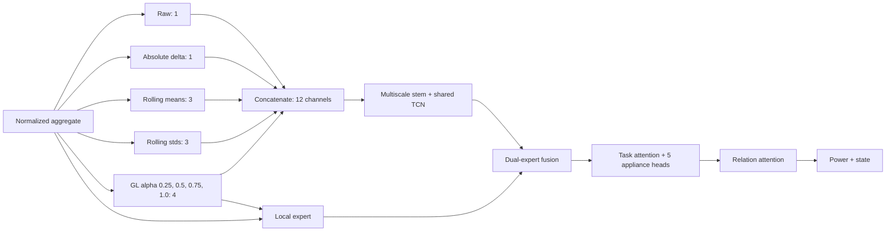
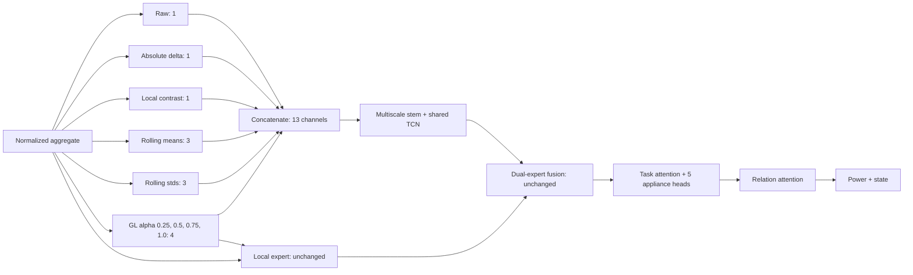

# MultiNILM local-contrast 输入实验

## 1. 这次改了什么

这次没有增加新的 attention、expert、loss 或数据增强。修改集中在输入端：

1. 在 `FractionalFrontEnd` 新增一个可关闭的 **local-contrast 通道**；
2. 在现有 `config/models/multinilm_k4.yaml` 中启用它；
3. 把上一轮消融关闭的 task attention 恢复为 `enabled: true`；
4. 将实验名改为 `k4_alpha1_local_contrast`；
5. 增加数值范围、因果性、常量输入和通道数测试。

没有修改：

- relation attention；
- dual expert 及其 local expert 输入；
- multiscale stem、IBN 和 TCN；
- power/state loss 及动态 task balance；
- background swap；
- threshold calibration 与 temporal post-processing。

因此，正确的比较对象应是 **启用 task attention 的 relation dual-expert 基线**。不要把本次结果只与 `k4_alpha1_no_task_attention` 比较，因为那样会同时包含“恢复 task attention”的差异。

## 2. 为什么做这个实验

目前 fridge 和 microwave 的失败与 aggregate 背景有关：同样的目标电器变化，在较大的背景负载或背景波动中只占很小比例。原始 aggregate 保留绝对功率，但模型必须自己学会同时处理：

- 背景基线从低功率变成高功率；
- 不同房屋具有不同的背景波动幅度；
- fridge 的约 100 W 变化可能叠加在数百或数千瓦 aggregate 上；
- microwave 的短事件可能与未知电器的尖峰混淆。

local contrast 不尝试直接预测电器，而是额外告诉模型：**当前变化相对于最近背景波动有多明显**。原始 aggregate 仍保留，所以模型不会失去绝对功率信息。

## 3. 计算公式

令标准化后的 aggregate 为 \(x_t\)。首先用长度为 \(S\) 的因果指数权重计算局部背景：

\[
m_t=\sum_{j=0}^{S-1}w_jx_{t-j},
\qquad
\sum_jw_j=1,
\]

其中越新的样本权重越大。然后计算局部残差和局部变化尺度：

\[
u_t=x_t-m_t,
\]

\[
s_t=\sum_{j=0}^{S-1}w_j|u_{t-j}|.
\]

最终 local contrast 为：

\[
c_t=\operatorname{clip}\left(
\frac{u_t}{(s_t+\epsilon)^\alpha},-C,C
\right).
\]

当前参数为：

| 参数 | 数值 | 含义 |
|---|---:|---|
| \(S\) | 45 samples | 8 s 采样下覆盖最近 360 s |
| \(\alpha\) | 1.0 | 用局部尺度直接归一化 |
| \(\epsilon\) | 0.05 | 防止安静背景中的微小噪声被无限放大 |
| \(C\) | 5.0 | 限制极端尖峰的幅值 |

模型输入是 z-score aggregate。由于 \(\alpha=1\)，平移量在 \(x_t-m_t\) 中被抵消，功率尺度也会在分子和分母中抵消。训练 aggregate 标准差为 906.14 W，因此 `epsilon: 0.05` 等价于约 45.3 W 的物理噪声底：

\[
0.05\times906.14\approx45.3\text{ W}.
\]

## 4. 前后结构

### 修改前：共享路径 12 个输入通道



### 修改后：共享路径增加 1 个 local-contrast 通道



local contrast 只进入 shared encoder。local expert 仍使用：

```text
raw aggregate + GL(alpha=1) + |GL(alpha=1)|
```

这样可以测试新增共享观测是否有用，而不同时改变 dual-expert 的设计。

local-contrast 滤波器本身是固定计算，没有可学习参数。由于 multiscale stem
需要接收第 13 个输入通道，它的三个卷积分支共增加 272 个连接权重；相对于
整个模型，这一变化很小。

## 5. 代码和配置位置

- 实现：`model/MultiNILM.py` 中的 `FractionalFrontEnd`；
- 配置：`config/models/multinilm_k4.yaml`；
- 测试：`tests/test_multinilm_dual_expert.py`。

配置文件没有另建副本。local contrast 默认关闭，因此未启用该字段的旧配置保持原有行为。

注意：启用后 shared stem 的输入由 12 通道变成 13 通道，旧 checkpoint 的第一层形状不匹配。本实验必须从头训练，不能把旧权重当作严格续训。

## 6. 训练命令

在您的 `(nilm)` 环境和项目目录中运行：

```powershell
cd "D:\Raymond\high_low_freq_NILM\multi_appliances_NILM"

python main.py `
  --mode train_evaluate `
  --model multinilm_fractional `
  --experiment config/experiment_mixed_ukdale_refit_8w.yaml `
  --model-config config/models/multinilm_k4.yaml
```

运行新增测试：

```powershell
python -m unittest tests.test_multinilm_dual_expert
```

## 7. 怎样判断它是否真的有效

不要只看总 validation loss，也不要只看 ON-MAE。至少比较相同 seed 下的：

1. fridge 和 microwave 的 AP、event F1、ON-MAE；
2. false events/hour 和 OFF false-positive energy；
3. 按局部背景或 \(\Delta\mathrm{SNR}\) 分组后的指标；
4. 高背景、强波动片段中的真实/预测 waveform；
5. kettle、dishwasher、washing machine 是否明显退化。

成功条件不是 train loss 继续下降，而是：

- validation/test 的 fridge 与 microwave 在低 \(\Delta\mathrm{SNR}\) 组稳定改善；
- false positives 没有明显上升；
-其他电器没有明显退化；
-至少两个 seed 给出一致方向。

如果 local contrast 只让训练 loss 更低，却不能改善以上指标，应删除该通道，而不是继续增加其复杂度。若低 \(\Delta\mathrm{SNR}\) 下仍失败，下一步才考虑 shared residual refinement；不要同时加入新的 loss 或 attention。
