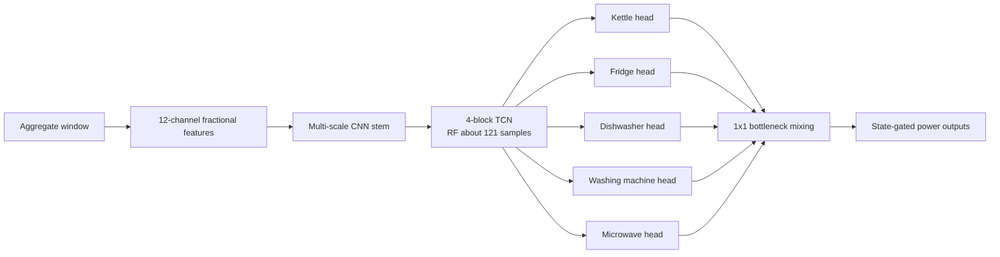
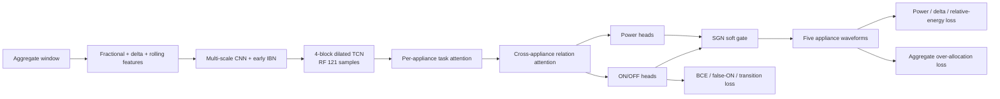
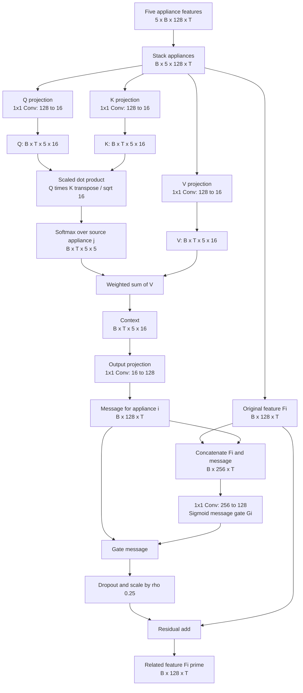
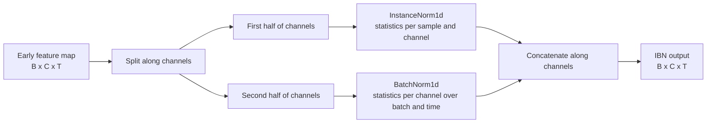
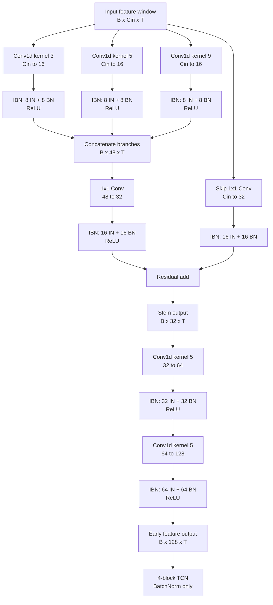

# MultiNILM Relational Physics Design Notes

## Executive Summary

`precision_guard` has reduced indiscriminate predictions, but the remaining errors cannot be solved by a single threshold. The model simultaneously exhibits cross-domain scale shift, cross-appliance confusion, inaccurate event boundaries, and insufficient physical power constraints. The new experiment addresses these four problems separately.

New configuration: `config/models/multinilm_fractional_relational.yaml`

## Diagnosis of the Current Results

The following values were calculated from `extra_feature_precision_guard/multinilm_fractional/test_predictions.npz`:

| Item | Result | Interpretation |
|---|---:|---|
| Test macro F1 | 0.641 | Overall performance is better than the previous version |
| Microwave F1 | 0.301 | P=0.227 and R=0.449; substantial confusion remains |
| REFIT H20 predicted/true target-appliance energy | 1.288 | Clear overprediction on REFIT |
| UK-DALE H2 predicted/true target-appliance energy | 0.604 | Clear underprediction on UK-DALE |
| True target-appliance energy/aggregate energy | 0.293 | About 71% of aggregate energy belongs to unmodelled appliances and background load |
| Proportion where `sum(pred) > aggregate` | 0.276% | Physical over-allocation is not the dominant error, but it should still be prevented |

Therefore, the model must not enforce `sum(predicted appliances) = aggregate`. The five target appliances do not cover the complete household load. The correct constraint is

$$
\sum_{i=1}^{A}\hat P_i(t) \leq X(t) + \epsilon,
$$

while allowing

$$
P_{other}(t) = \max\left(X(t)-\sum_i \hat P_i(t),0\right)
$$

to remain as unknown load.

Another confirmed problem comes from post-processing. One sample represents 6 seconds, and approximately 33.3% of the true microwave events in the test set are shorter than 10 samples. The old setting `min_on_samples: 10` removed predictions for these short events; the new configuration reduces it to 3.

## Architecture Before the Changes



The old cross-appliance mixing concatenated all head features and applied a fixed `1x1` mixing operation. It allowed information exchange, but it could not decide which appliance should be trusted at the current timestep or explicitly suppress irrelevant messages.

## Architecture After the Changes



## 1. TCN Temporal Context

Each residual block contains one dilated convolution. The kernel size is 9 and the dilation sequence is

$$
[1,2,4,8].
$$

The receptive field of the shared backbone is

$$
R = 1 + (k-1)\sum_l d_l
  = 1 + 8(1+2+4+8)
  = 121.
$$

At a 6-second sampling interval, this receptive field covers approximately 12.1 minutes. This low-depth TCN is the active ablation setting in `multinilm_fractional_relational.yaml`.

## 2. Task-specific feature attention

Each appliance first produces its own soft mask over the shared features:

$$
M_i = \sigma(A_i(F_{shared})),
$$

$$
F_i = D_i(F_{shared}\odot M_i).
$$

The exact structure of one appliance head is:

```mermaid
flowchart LR
    S[Shared TCN feature<br/>B x 128 x T] --> C1[1x1 Conv<br/>128 to 32]
    C1 --> R1[ReLU]
    R1 --> C2[1x1 Conv<br/>32 to 128]
    C2 --> SIG[Sigmoid mask Mi<br/>B x 128 x T]

    S --> MUL[Element-wise multiply]
    SIG --> MUL
    MUL --> A[Attended feature<br/>B x 128 x T]

    A --> D1[3x1 Conv<br/>128 to 128]
    D1 --> N1[BatchNorm + ReLU]
    N1 --> D2[3x1 Conv<br/>128 to 128]
    D2 --> N2[BatchNorm + ReLU]

    A --> ADD[Residual add]
    N2 --> ADD
    ADD --> DROP[Dropout]
    DROP --> FI[Appliance feature Fi<br/>B x 128 x T]
```



This module is repeated independently for kettle, refrigerator, dishwasher, washing machine, and microwave. The mask uses `Sigmoid`, not `Softmax`, so multiple feature channels can be emphasized simultaneously at each timestep.

| Task-attention item | Current value |
|---|---:|
| Shared feature channels | 128 |
| Reduction ratio | 4 |
| Attention bottleneck channels | 32 |
| Local decoder layers | 2 |
| Local decoder kernel | 3 |
| Output shape per appliance | $B\times128\times T$ |

The microwave head can emphasize short, high-power pulses, while the refrigerator head can emphasize low-power periodic patterns. This idea is based on [MTAN: End-To-End Multi-Task Learning With Attention](https://openaccess.thecvf.com/content_CVPR_2019/html/Liu_End-To-End_Multi-Task_Learning_With_Attention_CVPR_2019_paper.html).

## 3. Cross-appliance relation attention

At each timestep, the five appliance heads are treated as five tokens:

$$
\alpha_{ij}(t)=\operatorname{softmax}_j\left(
\frac{q_i(t)^T k_j(t)}{\sqrt d}
\right),
$$

$$
C_i(t)=\sum_j \alpha_{ij}(t)v_j(t),
$$

$$
F'_i=F_i+\rho\,G_i\odot W_o C_i.
$$

The current relation-attention structure is:



Attention is computed independently at each timestep. Its attention matrix is only $5\times5$, because the tokens are appliances rather than the full temporal sequence.

| Relation-attention item | Current value |
|---|---:|
| Appliance tokens | 5 |
| Input/output channels | 128 |
| Query/key/value channels | 16 |
| Attention matrix per timestep | $5\times5$ |
| Residual message scale $\rho$ | 0.25 |
| Output shape per appliance | $B\times128\times T$ |

`G_i` is a learned message gate. When a high-power event occurs, the model can compare the evidence from the kettle, dishwasher, washing machine, and microwave heads instead of making five completely independent decisions.

This design is a lightweight 1D adaptation of the appliance/time correlation attention in [MATNilm](https://arxiv.org/abs/2307.14778) and attention-guided message passing in [PAD-Net](https://openaccess.thecvf.com/content_cvpr_2018/papers/Xu_PAD-Net_Multi-Tasks_Guided_CVPR_2018_paper.pdf). Temporal relationships are handled by the TCN, while attention is computed only among the five appliances. This avoids expensive global $O(T^2)$ attention over 2,048 timesteps.

## 4. State Gate and Event-Boundary Loss

The final power prediction retains the SGN structure:

$$
\hat P_i(t)=\hat R_i(t)\cdot\sigma(s_i(t)).
$$

This follows [Subtask Gated Networks for NILM](https://ojs.aaai.org/index.php/AAAI/article/view/3908).

In addition, the probability that two adjacent Bernoulli states differ is defined as

$$
b_i(t)=p_i(t-1)(1-p_i(t))+(1-p_i(t-1))p_i(t).
$$

The true event boundary is

$$
b_i^*(t)=|z_i(t)-z_i(t-1)|.
$$

The transition loss averages BCE separately over true-boundary and non-boundary positions. This prevents the large number of stable OFF samples from overwhelming the small number of ON/OFF edges. It directly trains when an appliance should switch on and off, so it targets waveform width, fragmentation, and boundary delay rather than only average power.

## 5. Energy and Aggregate Physical Constraints

### 5.1 Relative-energy loss

Let $b$ denote the batch index, $i$ the appliance index, and $T$ the window length. The implementation first converts normalized power back to non-negative watts and then calculates the relative energy error for every window and appliance:

$$
L_{E,i}=\frac{1}{B}\sum_b
\frac{\left|\sum_t\hat P_{b,t,i}-\sum_tP_{b,t,i}\right|}
{\sum_tP_{b,t,i}+T P_{floor}}.
$$

The current setting is `P_floor=10 W`. It has two purposes:

1. It prevents division by zero when the true window is entirely OFF.
2. False power in an all-OFF window still produces a loss. For example, if the mean prediction is 10 W, the predicted total is approximately $10T$ and the relative-energy term is approximately 1.

Strictly, energy should multiply each watt-sample by the fixed 6-second sampling interval. However, the numerator and denominator would both be multiplied by the same constant, so this dimensionless ratio is unchanged.

The implementation sums over the five appliances rather than dividing by the appliance count:

$$
L_E=\sum_{i=1}^{A}L_{E,i}.
$$

Relative-energy loss checks only the total amount within a window, not when the event occurs. Two waveforms with completely different temporal positions but identical total energy can still obtain $L_E=0$. It therefore cannot replace pointwise MSE, state loss, or transition loss.

### 5.2 Aggregate consistency loss

The aggregate uses a one-sided constraint:

$$
L_{agg}=\operatorname{mean}_{b,t}\left[
\frac{\operatorname{ReLU}(\sum_i\hat P_{b,t,i}-X_{b,t}-\epsilon)}{S_{agg}}
\right]^2.
$$

The current settings are:

```yaml
aggregate_tolerance_watts: 30
aggregate_loss_scale_watts: 1000
aggregate_consistency_weight: 1.0
```

Consequently, a penalty is produced only when the sum of the five predicted appliances exceeds `aggregate + 30 W`. For an aggregate value of 500 W:

| Sum of five appliance predictions | Excess | Per-timestep constraint value |
|---:|---:|---:|
| 450 W | 0 W | 0 |
| 520 W | 0 W | 0 |
| 800 W | 270 W | $(270/1000)^2=0.0729$ |

This loss does not force the five target appliances to explain unknown load because the true aggregate also contains lighting, televisions, and other unmodelled appliances. The correct relationship is

$$
\sum_i\hat P_i(t)\le X(t)+\epsilon,
$$

rather than $\sum_i\hat P_i(t)=X(t)$. Related non-negativity and sum-constraint ideas appear in [Non-Intrusive Energy Disaggregation Using NMF With Sum-to-k Constraint](https://www.ornl.gov/publication/non-intrusive-energy-disaggregation-using-non-negative-matrix-factorization-sum-k).

## 6. Early IBN

### 6.1 Purpose

IBN means **Instance-Batch Normalization**. It was introduced by [IBN-Net: Two at Once - Enhancing Learning and Generalization Capacities via IBN-Net](https://openaccess.thecvf.com/content_ECCV_2018/html/Xingang_Pan_Two_at_Once_ECCV_2018_paper.html). The central idea is that a network needs two different kinds of information:

1. **Domain-invariant information.** Some features should be insensitive to the style of an individual house, such as its background load, sensor scale, voltage condition, typical appliance mixture, or dataset-specific distribution.
2. **Domain-discriminative information.** NILM still needs amplitude-sensitive evidence. For example, a 100 W refrigerator event and a 2,500 W kettle event should not become indistinguishable after normalization.

Using InstanceNorm on every channel can improve invariance but remove too much amplitude information. Using BatchNorm on every channel keeps population-level amplitude differences, but the learned features can remain strongly coupled to the source houses. IBN keeps both paths by assigning part of the channels to InstanceNorm and the remaining channels to BatchNorm.

The purpose in this model is therefore:

> Reduce early feature dependence on UK-DALE/REFIT house style without discarding all absolute-power evidence needed for appliance identification and waveform regression.

IBN is not a domain-adaptation loss. It does not compare source and target samples, and it does not require target-house labels. It changes how intermediate feature maps are normalized during an ordinary forward pass.

### 6.2 Mathematical operation



Let an early convolutional feature map be

$$
X\in\mathbb{R}^{B\times C\times T},
$$

where $B$ is batch size, $C$ is feature-channel count, and $T$ is the temporal length. The implementation divides $X$ along the channel dimension:

$$
X_{IN}=X[:,0:C_{IN},:],\qquad
X_{BN}=X[:,C_{IN}:C,:],
$$

with

$$
C_{IN}=\left\lfloor\frac{C}{2}\right\rfloor,\qquad
C_{BN}=C-C_{IN}.
$$

For the InstanceNorm half, the mean and variance are calculated separately for every sample $n$ and channel $c$ over that sample's time axis:

$$
\mu^{IN}_{n,c}=\frac{1}{T}\sum_{t=1}^{T}X_{n,c,t},
$$

$$
(\sigma^{IN}_{n,c})^2
=\frac{1}{T}\sum_{t=1}^{T}
\left(X_{n,c,t}-\mu^{IN}_{n,c}\right)^2.
$$

The normalized output is

$$
\operatorname{IN}(X_{n,c,t})
=\gamma^{IN}_c
\frac{X_{n,c,t}-\mu^{IN}_{n,c}}
{\sqrt{(\sigma^{IN}_{n,c})^2+\epsilon}}
+\beta^{IN}_c.
$$

Because each window uses its own statistics, this path suppresses window-specific offset and scale in the learned convolutional channel. The trainable $\gamma^{IN}$ and $\beta^{IN}$ parameters still allow the network to restore a useful range after normalization.

For the BatchNorm half, statistics are shared over the batch and temporal positions:

$$
\mu^{BN}_{c}=\frac{1}{BT}\sum_{n=1}^{B}\sum_{t=1}^{T}X_{n,c,t},
$$

$$
(\sigma^{BN}_{c})^2
=\frac{1}{BT}\sum_{n=1}^{B}\sum_{t=1}^{T}
\left(X_{n,c,t}-\mu^{BN}_{c}\right)^2,
$$

$$
\operatorname{BN}(X_{n,c,t})
=\gamma^{BN}_c
\frac{X_{n,c,t}-\mu^{BN}_{c}}
{\sqrt{(\sigma^{BN}_{c})^2+\epsilon}}
+\beta^{BN}_c.
$$

BatchNorm uses running statistics during evaluation. Since all windows are normalized relative to shared population statistics rather than their own statistics, differences between low- and high-amplitude windows remain available to the model more strongly than in the InstanceNorm path.

The final IBN output concatenates both channel groups in their original order:

$$
\operatorname{IBN}(X)
=\operatorname{Concat}_{channel}
\left(\operatorname{IN}(X_{IN}),\operatorname{BN}(X_{BN})\right).
$$

IBN does not add or average the two outputs. The total channel count and temporal length remain unchanged:

$$
(B,C,T)\rightarrow(B,C,T).
$$

### 6.3 Exact implementation in MultiNILM

The implementation is `IBN1d` in `model/MultiNILM.py`. It uses:

```python
self.instance_channels = channels // 2
self.batch_channels = channels - self.instance_channels
self.instance_norm = nn.InstanceNorm1d(
    self.instance_channels,
    affine=True,
)
self.batch_norm = nn.BatchNorm1d(self.batch_channels)
```

The forward pass is conceptually:

```python
x_instance, x_batch = torch.split(
    x,
    [self.instance_channels, self.batch_channels],
    dim=1,
)
x = torch.cat(
    [self.instance_norm(x_instance), self.batch_norm(x_batch)],
    dim=1,
)
```

PyTorch defaults are used: both normalizers use $\epsilon=10^{-5}$; BatchNorm tracks running statistics with momentum 0.1; InstanceNorm has trainable affine parameters and does not track running statistics. Consequently, the IN branch remains sample-specific during both training and evaluation, while the BN branch uses learned running statistics at evaluation time.

The relational configuration enables IBN with:

```yaml
architecture:
  stem_norm_type: ibn
  temporal_norm_type: batch
  head_norm_type: batch
```

`stem_norm_type: ibn` is passed to every normalization layer in the early multi-scale feature extractor. With the current configuration, the exact path is:

| Front-end location | Convolution output | IBN split |
|---|---:|---:|
| Detail branch, kernel 3 | 16 channels | 8 IN + 8 BN |
| Detail branch, kernel 5 | 16 channels | 8 IN + 8 BN |
| Detail branch, kernel 9 | 16 channels | 8 IN + 8 BN |
| Multi-scale branch fusion | 32 channels | 16 IN + 16 BN |
| Stem skip projection, when required | 32 channels | 16 IN + 16 BN |
| Staged convolution 32 -> 64 | 64 channels | 32 IN + 32 BN |
| Staged convolution 64 -> 128 | 128 channels | 64 IN + 64 BN |

The complete early-IBN feature extractor can be used as the following implementation reference:



Within each detail branch and staged layer, the operation order is `Conv1d -> IBN1d -> ReLU`. The three detail branches are concatenated, projected by a `1x1 Conv1d`, normalized by IBN, and activated. The stem skip path is also projected and normalized when its channel dimension does not already match 32. The normalized main and skip paths are then added.

Therefore, IBN is applied to learned early feature maps, **not directly to the raw aggregate watts or the target appliance power**. The model's input feature construction and target normalization are unchanged.

After the front end, all four residual TCN blocks use BatchNorm because `temporal_norm_type: batch`. The appliance-specific local decoders also use BatchNorm because `head_norm_type: batch`. The resulting normalization flow is:

```text
aggregate/features
    -> multi-scale early CNN: IBN
    -> shared residual TCN: BatchNorm
    -> task-specific appliance heads: BatchNorm
    -> power and state outputs
```

### 6.4 Why IBN is used only in the early extractor

Early convolutional layers mainly describe local waveform appearance: baseline changes, slopes, short pulses, local variation, and frequency-like patterns. These are useful but can also encode dataset or house style. Applying IN to half of these channels encourages the shared encoder to represent a pulse by its relative local pattern rather than only by the source house's absolute distribution.

Deeper TCN and appliance-head features have a different role. They must represent appliance identity, event duration, long-range context, and power magnitude. Applying InstanceNorm throughout those layers could normalize away information such as:

- whether an event is approximately 100 W or 2,000 W;
- whether a predicted ON section has the correct consumption level;
- whether the long-duration waveform preserves its energy;
- whether several appliance predictions exceed the aggregate power.

For this reason, the current design follows the early-IBN principle: improve invariance near the input, then retain BatchNorm in the semantic and regression layers.

### 6.5 Expected benefit and limitations

The expected benefit is a smaller cross-house or cross-dataset performance gap, especially when the target house has a different background-load distribution. IBN may help the model recognize similar local appliance patterns even when their surrounding aggregate signal differs.

However, IBN cannot solve every transfer problem:

- It does not align label distributions or appliance usage frequency.
- It cannot create target-domain waveform patterns missing from training.
- It does not correct wrong ON/OFF thresholds or event post-processing.
- It may hurt amplitude-sensitive regression if too many channels use IN.
- It does not guarantee that REFIT and UK-DALE have compatible appliance definitions.

The 50/50 split is a conservative fixed design inherited from the IBN idea. It is not guaranteed to be optimal for NILM. A future experiment could expose the IN ratio as a hyperparameter, but that should be tested separately after the on/off IBN ablation.

### 6.6 Correct ablation procedure

IBN can be disabled without changing the rest of the architecture:

```yaml
architecture:
  stem_norm_type: batch
  temporal_norm_type: batch
  head_norm_type: batch
```

For a valid ablation, keep the same seed, train/validation/test files, feature configuration, TCN depth, losses, sampler, optimizer, and post-processing thresholds. Change only `stem_norm_type` and use a different `experiment_id` so checkpoints are not overwritten.

The comparison should report more than overall MAE. At minimum, compare:

1. Per-appliance test MAE, SAE, sample F1, and event F1.
2. Validation-to-test F1 and MAE gaps.
3. UK-DALE and REFIT results separately.
4. False-ON and missed-event counts for each appliance.
5. Predicted/true energy ratio and waveform examples.

Do not resume a BatchNorm-only run from an IBN checkpoint, or an IBN run from a BatchNorm-only checkpoint. Their normalization modules have different parameter and running-statistic structures, so the ablation should train each variant from a fresh initialization.

## 7. Complete Loss: Exact Correspondence With the Current Code

### 7.1 State-Gated Power Before the Loss

Each appliance head outputs a raw power regression $\hat R_i$ and a state logit $s_i$:

$$
p_i=\sigma(s_i).
$$

The current setting is `gate_mode: soft`, so the prediction passed to the power loss in normalized target space is

$$
\hat y_i=p_i\hat R_i+(1-p_i)y_{off,i},
$$

Here, $y_{off,i}$ is the normalized value corresponding to `0 W` for appliance $i$. After inverse normalization to watts, this is equivalent to applying $p_i$ as a soft gate to the raw watt prediction. Consequently, gradients from the power loss update both the regression head and, through $p_i$, the state head.

### 7.2 Per-Appliance Pointwise Power Loss

Define the normalized power error as

$$
e_{b,t,i}=\hat y_{b,t,i}-y_{b,t,i},
$$

Let the CSV state label be $z_{b,t,i}\in\{0,1\}$. The base MSE covers all timesteps:

$$
L_{MSE,i}=\operatorname{mean}_{b,t}(e_{b,t,i}^2).
$$

ON-MSE is calculated only over true ON samples:

$$
L_{on,i}=
\frac{\sum_{b,t}z_{b,t,i}e_{b,t,i}^2}
{\max(\sum_{b,t}z_{b,t,i},1)}.
$$

OFF-MSE is calculated only over true OFF samples:

$$
L_{off,i}=
\frac{\sum_{b,t}(1-z_{b,t,i})e_{b,t,i}^2}
{\max(\sum_{b,t}(1-z_{b,t,i}),1)}.
$$

`ON-MSE` and `OFF-MSE` do not replace the base MSE. They provide additional emphasis on the ON waveform and OFF-state false power on top of the all-timestep MSE.

The normalized power differences between adjacent timesteps are

$$
\Delta\hat y_{b,t,i}=\hat y_{b,t,i}-\hat y_{b,t-1,i},
$$

$$
\Delta y_{b,t,i}=y_{b,t,i}-y_{b,t-1,i}.
$$

With `power_delta_on_only: true`, the delta loss is calculated only when at least one of two adjacent samples is ON:

$$
m^{\Delta}_{b,t,i}=\max(z_{b,t,i},z_{b,t-1,i}),
$$

$$
L_{\Delta,i}=
\frac{\sum_{b,t}m^{\Delta}_{b,t,i}\,
(\Delta\hat y_{b,t,i}-\Delta y_{b,t,i})^2}
{\max(\sum_{b,t}m^{\Delta}_{b,t,i},1)}.
$$

After adding the relative-energy term from Section 5, the complete power loss for each appliance is

$$
L_{power,i}=L_{MSE,i}
+1.0L_{on,i}
+0.5L_{off,i}
+0.15L_{\Delta,i}
+0.25L_{E,i}.
$$

The five appliance losses are summed directly:

$$
L_{power}=\sum_{i=1}^{A}L_{power,i}.
$$

MSE, ON/OFF-MSE, and delta loss are calculated in normalized target space. Relative-energy loss is calculated after inverse normalization to watts. The legacy `power_energy_weight` is currently `0.0` and does not contribute to the final loss.

### 7.3 Per-Appliance State Loss

The base state loss uses `BCEWithLogitsLoss`:

$$
L_{BCE,i}=\operatorname{BCEWithLogits}(s_i,z_i;w_i^+).
$$

The positive-class weight is calculated automatically from the training-set ON rate:

$$
w_i^+=\min\left(\frac{1-r_i}{r_i},12\right),
$$

Here, $r_i$ is the training ON rate for appliance $i$, and `12` comes from `pos_weight_cap: 12`. This increases the importance of rare ON samples while preventing an extremely rare appliance from producing unbounded positive-class pressure.

The false-positive penalty suppresses high ON probability only at true OFF positions:

$$
L_{FP,i}=
\frac{\sum_{b,t}(1-z_{b,t,i})p_{b,t,i}^{2}}
{\max(\sum_{b,t}(1-z_{b,t,i}),1)}.
$$

The transition probability and true boundary are respectively

$$
q_{b,t,i}=p_{b,t-1,i}(1-p_{b,t,i})
+(1-p_{b,t-1,i})p_{b,t,i},
$$

$$
q^*_{b,t,i}=|z_{b,t,i}-z_{b,t-1,i}|.
$$

The implementation averages negative log-likelihood separately over true-boundary and non-boundary positions and gives each group half of the transition loss. This prevents the large number of stable OFF samples from overwhelming the small number of start/stop edges. The complete state loss for each appliance is

$$
L_{state,i}=L_{BCE,i}+1.0L_{FP,i}+0.20L_{transition,i},
$$

$$
L_{state}=\sum_{i=1}^{A}L_{state,i}.
$$

### 7.4 Dynamic Power/State Balancing

Raw power MSE and state BCE have different numerical scales. Therefore, with `task_balance: equal`, the implementation does not directly calculate $L_{power}+0.8L_{state}$. It first constructs a dynamic scale that does not participate in backpropagation:

$$
s_{balance}=\operatorname{stopgrad}\left(
\frac{L_{power}}{\max(L_{state},10^{-8})}
\right).
$$

The state contribution that actually enters the total loss is

$$
L_{state\_term}=0.8L_{state}s_{balance}.
$$

Therefore, the forward values usually satisfy

$$
L_{state\_term}\approx0.8L_{power},
$$

However, gradients still flow from $L_{state}$ into the state head. `stopgrad` allows the ratio to act only as a magnitude ruler and prevents the model from reducing the loss by manipulating the ratio itself.

### 7.5 Current Final Training Objective

The current setting is `lambda_domain: 0.0`, so domain adaptation does not contribute. The actual optimization objective is therefore

$$
\boxed{
L_{NILM}
=L_{power}
+0.8L_{state}\operatorname{stopgrad}\left(
\frac{L_{power}}{\max(L_{state},10^{-8})}
\right)
+1.0L_{agg}
}
$$

The corresponding configuration is

```yaml
loss:
  task_balance: equal
  lambda_state: 0.8
  pos_weight: auto
  pos_weight_cap: 12

  state_fp_weight: 1.0
  state_transition_weight: 0.20

  power_on_weight: 1.0
  power_off_weight: 0.5
  power_delta_weight: 0.15
  power_delta_on_only: true
  power_energy_weight: 0.0
  power_energy_relative_weight: 0.25
  energy_floor_watts: 10

  aggregate_consistency_weight: 1.0
  aggregate_tolerance_watts: 30
  aggregate_loss_scale_watts: 1000
```

### 7.6 Correspondence Between Training Logs and the Formula

| Log key | Meaning | Is the weight already applied? |
|---|---|---|
| `loss_power` | Sum of the complete power losses for five appliances, including ON/OFF, delta, and relative-energy terms | Yes |
| `loss_state` | Sum of the complete raw state losses for five appliances, including FP and transition terms | Subterm weights are applied, but dynamic balancing is not |
| `loss_state_term` | Balanced state contribution actually added to $L_{NILM}$ | Yes |
| `loss_energy_relative` | Sum of the raw relative-energy losses for five appliances | No; it has not yet been multiplied by 0.25 |
| `loss_state_transition` | Sum of the raw transition losses for five appliances | No; it has not yet been multiplied by 0.20 |
| `loss_aggregate_consistency` | Raw one-sided aggregate loss | No; it has not yet been multiplied by the aggregate weight |
| `loss_aggregate_term` | Aggregate contribution actually added to the total loss | Yes |

Therefore, the current non-DA total loss should be reconstructed as

$$
L_{NILM}=\texttt{loss\_power}
+\texttt{loss\_state\_term}
+\texttt{loss\_aggregate\_term},
$$

Do not add `loss_state`, `loss_energy_relative`, or `loss_state_transition` again, because doing so would double-count terms already included in the weighted contributions.

## How to Determine Whether the New Method Is Actually Better

Do not examine only overall MAE. At minimum, compare all of the following:

1. Precision, recall, sample F1, and event F1 for every appliance.
2. ON-period MAE, mean OFF-state false power, and event-duration error.
3. Predicted/true energy ratio for every appliance.
4. UK-DALE H2 and REFIT H20 separately, to determine whether overprediction in one domain and underprediction in the other have been reduced.
5. The proportion where `sum(pred) > aggregate` and the mean excess power.
6. Focused and 10x-context waveforms for the same true events.

This is an evidence-based experimental design, but one training run is not guaranteed to optimize every appliance simultaneously. The most important ablation order is relational attention, transition loss, and IBN. Disable them one at a time to identify the source of each improvement.
