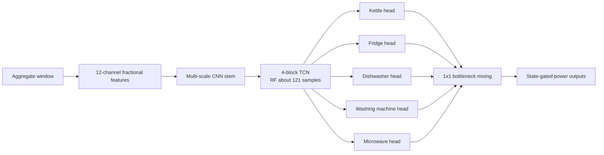
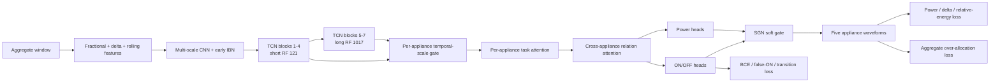

# MultiNILM Relational Physics 设计说明

## 一句话结论

`precision_guard` 已经减少了盲目预测，但剩余问题不是一个 threshold 可以解决：模型同时存在跨域尺度偏移、跨电器混淆、事件边界不准，以及缺少物理功率约束。新实验把这四类问题分开处理。

新配置：`config/models/multinilm_fractional_relational.yaml`

## 当前结果诊断

从 `extra_feature_precision_guard/multinilm_fractional/test_predictions.npz` 计算得到：

| 项目 | 结果 | 含义 |
|---|---:|---|
| Test macro F1 | 0.641 | 整体已比前一版好 |
| Microwave F1 | 0.301 | P=0.227，R=0.449，仍有明显混淆 |
| REFIT H20 预测/真实目标电器能量 | 1.288 | REFIT 明显过预测 |
| UK-DALE H2 预测/真实目标电器能量 | 0.604 | UK-DALE 明显少预测 |
| 真实目标电器能量/aggregate | 0.293 | aggregate 中约 71% 是未建模电器和背景功率 |
| `sum(pred) > aggregate` 比例 | 0.276% | 物理超额不是主要错误，但仍应被禁止 |

因此不能强制 `sum(predicted appliances) = aggregate`。五个目标电器并不覆盖全屋负载。正确约束是：

$$
\sum_{i=1}^{A}\hat P_i(t) \leq X(t) + \epsilon,
$$

同时允许

$$
P_{other}(t) = \max\left(X(t)-\sum_i \hat P_i(t),0\right)
$$

保留为未知负载。

另一个确定的问题来自 post-processing。一个采样点是 6 秒，测试集中约 33.3% 的真实 microwave 事件短于 10 个点。旧配置 `min_on_samples: 10` 会删除这些短事件的预测，新配置改为 3。

## 改造前



旧的 cross-appliance mixing 会把所有 head feature concatenate 后做固定的 `1x1` 混合。它可以交换信息，但不知道在当前时刻应该听哪一个电器，也不能明确抑制不相关信息。

## 改造后



## 1. 更长的 TCN 时间范围

当前 residual block 每层有一个 dilated convolution。kernel size 为 9，dilation 为

$$
[1,2,4,8,16,32,64].
$$

主干 receptive field 是

$$
R = 1 + (k-1)\sum_l d_l
  = 1 + 8(1+2+4+8+16+32+64)
  = 1017.
$$

在 6 秒采样下约为 101.7 分钟。旧的 4-block TCN 只有 121 点，约 12.1 分钟，无法完整观察很多 dishwasher 或 washing-machine cycle。

### 1.1 Task-adaptive short/long temporal fusion

4-block ablation 显示 microwave 的 test F1 提升到约 0.48，但 washing-machine F1 明显下降。这说明五个电器共享单一 receptive field 会产生 temporal-scale conflict。新模型不复制第二套 TCN，而是在同一次 7-block forward 中保留两个 feature map：

$$
F_S=\operatorname{TCN}_{1:4}(F_{stem}),\qquad RF_S=121,
$$

$$
F_L=\operatorname{TCN}_{5:7}(F_S),\qquad RF_L=1017.
$$

对每个电器 $i$，使用独立的轻量 `1x1 Conv -> ReLU -> 1x1 Conv -> Sigmoid` 产生逐时刻 long-context gate：

$$
g_i(t)=\sigma\left(G_i([F_S(t),F_L(t)])\right).
$$

融合使用稳定的 interpolation form：

$$
F_i^{scale}(t)=F_S(t)+g_i(t)(F_L(t)-F_S(t)).
$$

因此 $g_i(t)=0$ 时完全使用 short feature，$g_i(t)=1$ 时完全使用 long feature。`gate_init=0.5` 令所有电器从等比例融合开始，而不是预先硬编码 microwave 或 washing machine 应该使用哪一种尺度。

Scale gate 只在时间尺度之间选择，并对所有 feature channels 使用同一个逐时刻权重。后续 task attention 再负责 channel selection，所以两者职责不同：

```text
temporal scale gate : short context vs long context
task attention      : which feature channels matter to this appliance
relation attention  : which other appliance messages matter now
```

每个 batch 都会计算 `temporal_long_gate_<appliance>`，表示该电器在全部 timestep 上的平均 $g_i$。epoch history 同时保存 `train_temporal_long_gate_<appliance>` 和 `val_temporal_long_gate_<appliance>`。接近 0 表示偏向 short feature，接近 1 表示偏向 long feature。这些值用于解释模型是否真正学到 appliance-specific temporal scale，不能单独作为性能指标。

这个设计结合了三类已有思路：[MMoE](https://dl.acm.org/doi/10.1145/3219819.3220007) 使用 task-specific gate 处理多任务之间对 shared experts 的不同需求；[InceptionTime](https://arxiv.org/abs/1909.04939) 说明多时间尺度特征对 time-series classification 有效；NILM 中的 [multi-scale residual network](https://arxiv.org/abs/2009.12355) 也使用多尺度时域特征。本实现的不同点是：不为每个电器复制完整 encoder，而是共享一次 7-block TCN 计算，只学习轻量的 per-appliance scale gate。

## 2. Task-specific feature attention

每个电器先对 shared feature 产生自己的 soft mask：

$$
M_i = \sigma(A_i(F_{shared})),
$$

$$
F_i = D_i(F_{shared}\odot M_i).
$$

Microwave head 可以强调短、高功率脉冲；fridge head 可以强调低功率、周期性的模式。这个思路来自 [MTAN: End-To-End Multi-Task Learning With Attention](https://openaccess.thecvf.com/content_CVPR_2019/html/Liu_End-To-End_Multi-Task_Learning_With_Attention_CVPR_2019_paper.html)。

## 3. Cross-appliance relation attention

在每一个时间点，把五个 appliance head 当成五个 token：

$$
\alpha_{ij}(t)=\operatorname{softmax}_j\left(
\frac{q_i(t)^T k_j(t)}{\sqrt d}
\right),
$$

$$
C_i(t)=\sum_j \alpha_{ij}(t)v_j(t),
$$

$$
F'_i=F_i+\rho\,G_i\odot W_o C_i.
$$

`G_i` 是 learned message gate。模型可以在一个高功率事件发生时比较 kettle、dishwasher、washing machine 与 microwave 的证据，而不是五个 head 完全独立判断。

该设计是对 [MATNilm](https://arxiv.org/abs/2307.14778) 的 appliance/time correlation attention，以及 [PAD-Net](https://openaccess.thecvf.com/content_cvpr_2018/papers/Xu_PAD-Net_Multi-Tasks_Guided_CVPR_2018_paper.pdf) attention-guided message passing 的轻量 1D 改写。时间关系由 TCN 处理，attention 只在五个电器之间计算，避免对 2048 个时间点做昂贵的全局 $O(T^2)$ attention。

## 4. State gate 与 event-boundary loss

最终功率仍保留 SGN 结构：

$$
\hat P_i(t)=\hat R_i(t)\cdot\sigma(s_i(t)).
$$

它对应 [Subtask Gated Networks for NILM](https://ojs.aaai.org/index.php/AAAI/article/view/3908)。

此外，两个相邻 Bernoulli state 不同的概率定义为

$$
b_i(t)=p_i(t-1)(1-p_i(t))+(1-p_i(t-1))p_i(t).
$$

真实边界为

$$
b_i^*(t)=|z_i(t)-z_i(t-1)|.
$$

transition loss 分别平均真实边界和非边界的 BCE，避免大量稳定 OFF 点淹没少量 ON/OFF edge。它直接训练“何时开”和“何时关”，所以针对的是 waveform width、碎片和延迟，不只是平均功率。

## 5. 能量与 aggregate 物理约束

### 5.1 Relative-energy loss

设 batch index 为 $b$，电器 index 为 $i$，窗口长度为 $T$。代码先把 normalized power 转回非负 watts，然后计算每个窗口、每个电器的相对能量误差：

$$
L_{E,i}=\frac{1}{B}\sum_b
\frac{\left|\sum_t\hat P_{b,t,i}-\sum_tP_{b,t,i}\right|}
{\sum_tP_{b,t,i}+T P_{floor}}.
$$

当前 `P_floor=10 W`。它有两个作用：

1. 当真实窗口全 OFF 时避免分母为零。
2. 全 OFF 窗口中的 false power 仍然产生 loss。例如预测平均为 10 W，则预测总量约为 $10T$，相对能量项约为 1。

由于采样间隔固定为 6 秒，严格能量应把 watt-samples 乘以 6 秒；但分子和分母都会乘相同常数，因此该无量纲比例不变。

代码最后对五个电器求和，而不是除以电器数：

$$
L_E=\sum_{i=1}^{A}L_{E,i}.
$$

Relative-energy loss 只检查窗口总量，不检查事件发生位置。两个时间位置完全不同、但总能量相同的 waveform 仍可能得到 $L_E=0$，因此它不能替代 pointwise MSE、state 或 transition loss。

### 5.2 Aggregate consistency loss

Aggregate 只使用单边约束：

$$
L_{agg}=\operatorname{mean}_{b,t}\left[
\frac{\operatorname{ReLU}(\sum_i\hat P_{b,t,i}-X_{b,t}-\epsilon)}{S_{agg}}
\right]^2.
$$

当前设置为：

```yaml
aggregate_tolerance_watts: 30
aggregate_loss_scale_watts: 1000
aggregate_consistency_weight: 1.0
```

因此只有当五个预测电器之和超过 `aggregate + 30 W` 时才产生惩罚。若 aggregate 为 500 W：

| 五个电器预测之和 | Excess | 单点约束值 |
|---:|---:|---:|
| 450 W | 0 W | 0 |
| 520 W | 0 W | 0 |
| 800 W | 270 W | $(270/1000)^2=0.0729$ |

它不会强迫五个目标电器解释未知负载，因为真实 aggregate 还包含灯、电视和其他未建模电器。正确的关系是

$$
\sum_i\hat P_i(t)\le X(t)+\epsilon,
$$

而不是 $\sum_i\hat P_i(t)=X(t)$。非负与 sum constraint 的思想也可见 [Non-Intrusive Energy Disaggregation Using NMF With Sum-to-k Constraint](https://www.ornl.gov/publication/non-intrusive-energy-disaggregation-using-non-negative-matrix-factorization-sum-k)。

## 6. Early IBN

新模型只在前端使用 IBN：一半 channel 使用 InstanceNorm 学较少依赖 house style 的特征，另一半保留 BatchNorm 以保存绝对功率信息。后面的 TCN 和 appliance head 仍用 BatchNorm。依据来自 [IBN-Net](https://openaccess.thecvf.com/content_ECCV_2018/html/Xingang_Pan_Two_at_Once_ECCV_2018_paper.html)。

## 7. 总 loss：与当前代码完全对应

### 7.1 Loss 之前的 state-gated power

每个 appliance head 输出 raw power regression $\hat R_i$ 和 state logit $s_i$：

$$
p_i=\sigma(s_i).
$$

当前 `gate_mode: soft`，所以在 normalized target space 中送入 power loss 的预测为

$$
\hat y_i=p_i\hat R_i+(1-p_i)y_{off,i},
$$

其中 $y_{off,i}$ 是 `0 W` 在该电器 normalization 下对应的值。反归一化到 watts 后等价于用 $p_i$ 对 raw watt prediction 做 soft gate。这样 power loss 的梯度不仅更新 regression head，也会通过 $p_i$ 更新 state head。

### 7.2 每个电器的 pointwise power loss

设 normalized power error 为

$$
e_{b,t,i}=\hat y_{b,t,i}-y_{b,t,i},
$$

CSV state label 为 $z_{b,t,i}\in\{0,1\}$。基础 MSE 覆盖所有 timestep：

$$
L_{MSE,i}=\operatorname{mean}_{b,t}(e_{b,t,i}^2).
$$

ON-MSE 只在真实 ON 样本中计算：

$$
L_{on,i}=
\frac{\sum_{b,t}z_{b,t,i}e_{b,t,i}^2}
{\max(\sum_{b,t}z_{b,t,i},1)}.
$$

OFF-MSE 只在真实 OFF 样本中计算：

$$
L_{off,i}=
\frac{\sum_{b,t}(1-z_{b,t,i})e_{b,t,i}^2}
{\max(\sum_{b,t}(1-z_{b,t,i}),1)}.
$$

注意 `ON-MSE` 和 `OFF-MSE` 不是取代基础 MSE；它们是在全时段 MSE 之上额外加强 ON waveform 和 OFF false power。

相邻 timestep 的 normalized power difference 为

$$
\Delta\hat y_{b,t,i}=\hat y_{b,t,i}-\hat y_{b,t-1,i},
$$

$$
\Delta y_{b,t,i}=y_{b,t,i}-y_{b,t-1,i}.
$$

当前 `power_delta_on_only: true`，所以 delta loss 只在两个相邻点至少一个为 ON 时计算：

$$
m^{\Delta}_{b,t,i}=\max(z_{b,t,i},z_{b,t-1,i}),
$$

$$
L_{\Delta,i}=
\frac{\sum_{b,t}m^{\Delta}_{b,t,i}\,
(\Delta\hat y_{b,t,i}-\Delta y_{b,t,i})^2}
{\max(\sum_{b,t}m^{\Delta}_{b,t,i},1)}.
$$

加入第 5 节的 relative-energy term 后，每个电器的完整 power loss 是

$$
L_{power,i}=L_{MSE,i}
+1.0L_{on,i}
+0.5L_{off,i}
+0.15L_{\Delta,i}
+0.25L_{E,i}.
$$

五个电器直接求和：

$$
L_{power}=\sum_{i=1}^{A}L_{power,i}.
$$

其中 MSE、ON/OFF-MSE 和 delta loss 在 normalized target space 计算；relative-energy loss 先反归一化到 watts 再计算。旧的 `power_energy_weight` 当前为 `0.0`，不参与最终 loss。

### 7.3 每个电器的 state loss

基础 state loss 使用 `BCEWithLogitsLoss`：

$$
L_{BCE,i}=\operatorname{BCEWithLogits}(s_i,z_i;w_i^+).
$$

正类权重由训练集 ON rate 自动计算：

$$
w_i^+=\min\left(\frac{1-r_i}{r_i},12\right),
$$

其中 $r_i$ 是电器 $i$ 的训练 ON rate，`12` 来自 `pos_weight_cap: 12`。它提高 rare ON 样本的重要性，但避免极稀有电器产生无限大的 ON 压力。

False-positive penalty 只在真实 OFF 位置惩罚高 ON probability：

$$
L_{FP,i}=
\frac{\sum_{b,t}(1-z_{b,t,i})p_{b,t,i}^{2}}
{\max(\sum_{b,t}(1-z_{b,t,i}),1)}.
$$

Transition probability 和真实边界分别为

$$
q_{b,t,i}=p_{b,t-1,i}(1-p_{b,t,i})
+(1-p_{b,t-1,i})p_{b,t,i},
$$

$$
q^*_{b,t,i}=|z_{b,t,i}-z_{b,t-1,i}|.
$$

代码分别平均真实 boundary 和 non-boundary 的 negative log-likelihood，再各占一半，防止大量稳定 OFF 点淹没少量 start/stop edge。每个电器的完整 state loss 是

$$
L_{state,i}=L_{BCE,i}+1.0L_{FP,i}+0.20L_{transition,i},
$$

$$
L_{state}=\sum_{i=1}^{A}L_{state,i}.
$$

### 7.4 Power/state 动态 balance

Power MSE 与 state BCE 的原始数值尺度不同，所以当前 `task_balance: equal` 不直接计算 $L_{power}+0.8L_{state}$。代码先构造一个不参与反向传播的动态尺度：

$$
s_{balance}=\operatorname{stopgrad}\left(
\frac{L_{power}}{\max(L_{state},10^{-8})}
\right).
$$

真正进入总 loss 的 state contribution 是

$$
L_{state\_term}=0.8L_{state}s_{balance}.
$$

因此 forward 数值上通常有

$$
L_{state\_term}\approx0.8L_{power},
$$

但梯度仍从 $L_{state}$ 流入 state head。`stopgrad` 只让该比例充当 magnitude ruler，不让模型通过修改比例本身投机降低 loss。

### 7.5 当前最终训练目标

当前 `lambda_domain: 0.0`，domain adaptation 没有参与。因此实际优化目标是

$$
\boxed{
L_{NILM}
=L_{power}
+0.8L_{state}\operatorname{stopgrad}\left(
\frac{L_{power}}{\max(L_{state},10^{-8})}
\right)
+1.0L_{agg}
}
$$

对应配置为：

```yaml
loss:
  task_balance: equal
  lambda_state: 0.8
  pos_weight: auto
  pos_weight_cap: 12

  state_fp_weight: 1.0
  state_transition_weight: 0.20

  power_on_weight: 1.0
  power_off_weight: 0.5
  power_delta_weight: 0.15
  power_delta_on_only: true
  power_energy_weight: 0.0
  power_energy_relative_weight: 0.25
  energy_floor_watts: 10

  aggregate_consistency_weight: 1.0
  aggregate_tolerance_watts: 30
  aggregate_loss_scale_watts: 1000
```

### 7.6 训练日志如何对应公式

| Log key | 含义 | 是否已乘权重 |
|---|---|---|
| `loss_power` | 五个电器完整 power loss 之和，已经包含 ON/OFF、delta、relative energy | 是 |
| `loss_state` | 五个电器完整 raw state loss 之和，已经包含 FP 和 transition | 子项权重已乘，但尚未做动态 balance |
| `loss_state_term` | 真正加入 $L_{NILM}$ 的 balanced state contribution | 是 |
| `loss_energy_relative` | 五个电器原始 relative-energy loss 之和 | 否，尚未乘 0.25 |
| `loss_state_transition` | 五个电器原始 transition loss 之和 | 否，尚未乘 0.20 |
| `loss_aggregate_consistency` | 原始单边 aggregate loss | 否，尚未乘 aggregate weight |
| `loss_aggregate_term` | 真正加入总 loss 的 aggregate contribution | 是 |

因此重建当前非 DA 总 loss 时，应使用

$$
L_{NILM}=\texttt{loss\_power}
+\texttt{loss\_state\_term}
+\texttt{loss\_aggregate\_term},
$$

不能把 `loss_state`、`loss_energy_relative` 或 `loss_state_transition` 再直接相加，否则会重复计算。

## 如何判断新方法是否真的更好

不要只看 overall MAE。至少同时比较：

1. 每个电器的 precision、recall、sample F1 和 event F1。
2. ON-period MAE、OFF false-power mean、event duration error。
3. 每个电器的 predicted/true energy ratio。
4. UK-DALE H2 与 REFIT H20 分开报告，检查一个域过预测、另一个域少预测的问题是否缩小。
5. `sum(pred) > aggregate` 的比例与平均超额功率。
6. 相同真实事件的 focused waveform 与 10x context waveform。

这版是有依据的实验设计，不保证一次训练就对所有电器同时达到最优。最重要的消融顺序是：relational attention、transition loss、IBN，逐项关掉确认收益来源。
