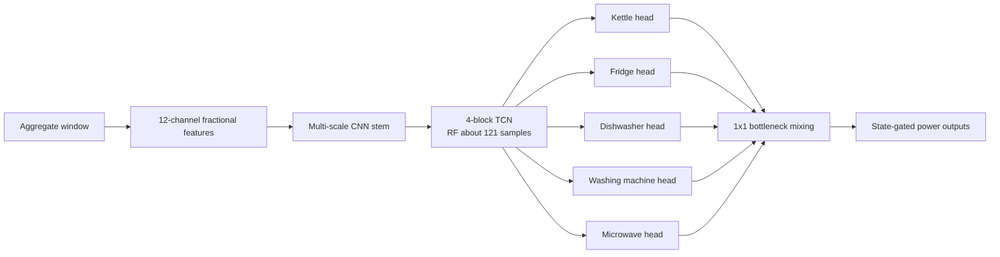
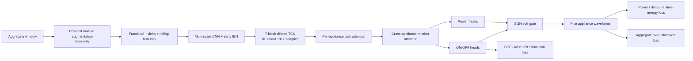

# MultiNILM Relational Physics 设计说明

## 一句话结论

`precision_guard` 已经减少了盲目预测，但剩余问题不是一个 threshold 可以解决：模型同时存在跨域尺度偏移、跨电器混淆、事件边界不准，以及缺少物理功率约束。新实验把这四类问题分开处理。

新配置：`config/models/multinilm_fractional_relational.yaml`

## 当前结果诊断

从 `extra_feature_precision_guard/multinilm_fractional/test_predictions.npz` 计算得到：

| 项目 | 结果 | 含义 |
|---|---:|---|
| Test macro F1 | 0.641 | 整体已比前一版好 |
| Microwave F1 | 0.301 | P=0.227，R=0.449，仍有明显混淆 |
| REFIT H20 预测/真实目标电器能量 | 1.288 | REFIT 明显过预测 |
| UK-DALE H2 预测/真实目标电器能量 | 0.604 | UK-DALE 明显少预测 |
| 真实目标电器能量/aggregate | 0.293 | aggregate 中约 71% 是未建模电器和背景功率 |
| `sum(pred) > aggregate` 比例 | 0.276% | 物理超额不是主要错误，但仍应被禁止 |

因此不能强制 `sum(predicted appliances) = aggregate`。五个目标电器并不覆盖全屋负载。正确约束是：

$$
\sum_{i=1}^{A}\hat P_i(t) \leq X(t) + \epsilon,
$$

同时允许

$$
P_{other}(t) = \max\left(X(t)-\sum_i \hat P_i(t),0\right)
$$

保留为未知负载。

另一个确定的问题来自 post-processing。一个采样点是 6 秒，测试集中约 33.3% 的真实 microwave 事件短于 10 个点。旧配置 `min_on_samples: 10` 会删除这些短事件的预测，新配置改为 3。

## 改造前

旧的 cross-appliance mixing 会把所有 head feature concatenate 后做固定的 `1x1` 混合。它可以交换信息，但不知道在当前时刻应该听哪一个电器，也不能明确抑制不相关信息。

## 改造后

## 1. 更长的 TCN 时间范围

当前 residual block 每层有一个 dilated convolution。kernel size 为 9，dilation 为

$$
[1,2,4,8,16,32,64].
$$

主干 receptive field 是

$$
R = 1 + (k-1)\sum_l d_l
  = 1 + 8(1+2+4+8+16+32+64)
  = 1017.
$$

在 6 秒采样下约为 101.7 分钟。旧的 4-block TCN 只有 121 点，约 12.1 分钟，无法完整观察很多 dishwasher 或 washing-machine cycle。

## 2. Task-specific feature attention

每个电器先对 shared feature 产生自己的 soft mask：

$$
M_i = \sigma(A_i(F_{shared})),
$$

$$
F_i = D_i(F_{shared}\odot M_i).
$$

Microwave head 可以强调短、高功率脉冲；fridge head 可以强调低功率、周期性的模式。这个思路来自 [MTAN: End-To-End Multi-Task Learning With Attention](https://openaccess.thecvf.com/content_CVPR_2019/html/Liu_End-To-End_Multi-Task_Learning_With_Attention_CVPR_2019_paper.html)。

## 3. Cross-appliance relation attention

在每一个时间点，把五个 appliance head 当成五个 token：

$$
\alpha_{ij}(t)=\operatorname{softmax}_j\left(
\frac{q_i(t)^T k_j(t)}{\sqrt d}
\right),
$$

$$
C_i(t)=\sum_j \alpha_{ij}(t)v_j(t),
$$

$$
F'_i=F_i+\rho\,G_i\odot W_o C_i.
$$

`G_i` 是 learned message gate。模型可以在一个高功率事件发生时比较 kettle、dishwasher、washing machine 与 microwave 的证据，而不是五个 head 完全独立判断。

该设计是对 [MATNilm](https://arxiv.org/abs/2307.14778) 的 appliance/time correlation attention，以及 [PAD-Net](https://openaccess.thecvf.com/content_cvpr_2018/papers/Xu_PAD-Net_Multi-Tasks_Guided_CVPR_2018_paper.pdf) attention-guided message passing 的轻量 1D 改写。时间关系由 TCN 处理，attention 只在五个电器之间计算，避免对 2048 个时间点做昂贵的全局 $O(T^2)$ attention。

## 4. State gate 与 event-boundary loss

最终功率仍保留 SGN 结构：

$$
\hat P_i(t)=\hat R_i(t)\cdot\sigma(s_i(t)).
$$

它对应 [Subtask Gated Networks for NILM](https://ojs.aaai.org/index.php/AAAI/article/view/3908)。

此外，两个相邻 Bernoulli state 不同的概率定义为

$$
b_i(t)=p_i(t-1)(1-p_i(t))+(1-p_i(t-1))p_i(t).
$$

真实边界为

$$
b_i^*(t)=|z_i(t)-z_i(t-1)|.
$$

transition loss 分别平均真实边界和非边界的 BCE，避免大量稳定 OFF 点淹没少量 ON/OFF edge。它直接训练“何时开”和“何时关”，所以针对的是 waveform width、碎片和延迟，不只是平均功率。

## 5. 能量与 aggregate 物理约束

每个窗口、每个电器的相对能量误差为

$$
L_E=\frac{1}{A}\sum_i
\frac{|\sum_t\hat P_i(t)-\sum_tP_i(t)|}
{\sum_tP_i(t)+T P_{floor}}.
$$

`P_floor=10 W` 防止全 OFF 窗口分母为零，同时让 false power 仍受惩罚。

Aggregate 只使用单边约束：

$$
L_{agg}=\operatorname{mean}_t\left[
\frac{\operatorname{ReLU}(\sum_i\hat P_i(t)-X(t)-\epsilon)}{1000}
\right]^2.
$$

它不会强迫五个目标电器解释未知负载。非负与 sum constraint 的思想也可见 [Non-Intrusive Energy Disaggregation Using NMF With Sum-to-k Constraint](https://www.ornl.gov/publication/non-intrusive-energy-disaggregation-using-non-negative-matrix-factorization-sum-k)。

## 6. 跨域 mixture augmentation

先从真实 aggregate 中分离未建模残差：

$$
R(t)=\max(X(t)-\sum_iP_i(t),0).
$$

对每个 appliance profile 使用一个窗口内恒定的随机 gain $g_i$，对 residual 使用 $g_R$：

$$
P'_i(t)=g_iP_i(t),
$$

$$
X'(t)=g_RR(t)+\sum_iP'_i(t).
$$

这样 amplitude 会变化，但 ON/OFF、event width 与 waveform shape 不被破坏，而且输入与 label 仍满足物理关系。它是对 MATNilm sample augmentation 思想的保守实现，专门针对当前 UK-DALE/REFIT 的 amplitude shift。

## 7. Early IBN

新模型只在前端使用 IBN：一半 channel 使用 InstanceNorm 学较少依赖 house style 的特征，另一半保留 BatchNorm 以保存绝对功率信息。后面的 TCN 和 appliance head 仍用 BatchNorm。依据来自 [IBN-Net](https://openaccess.thecvf.com/content_ECCV_2018/html/Xingang_Pan_Two_at_Once_ECCV_2018_paper.html)。

## 总 loss

$$
L_{power}=L_{MSE}+\lambda_{on}L_{on}+\lambda_{off}L_{off}
+\lambda_{\Delta}L_{\Delta}+\lambda_E L_E,
$$

$$
L_{state}=L_{BCE}+\lambda_{FP}L_{FP}
+\lambda_{transition}L_{transition},
$$

$$
L=L_{power}+\operatorname{balance}(L_{state})
+\lambda_{agg}L_{agg}.
$$

## 如何判断新方法是否真的更好

不要只看 overall MAE。至少同时比较：

1. 每个电器的 precision、recall、sample F1 和 event F1。
2. ON-period MAE、OFF false-power mean、event duration error。
3. 每个电器的 predicted/true energy ratio。
4. UK-DALE H2 与 REFIT H20 分开报告，检查一个域过预测、另一个域少预测的问题是否缩小。
5. `sum(pred) > aggregate` 的比例与平均超额功率。
6. 相同真实事件的 focused waveform 与 10x context waveform。

这版是有依据的实验设计，不保证一次训练就对所有电器同时达到最优。最重要的消融顺序是：relational attention、transition loss、augmentation、IBN，逐项关掉确认收益来源。
