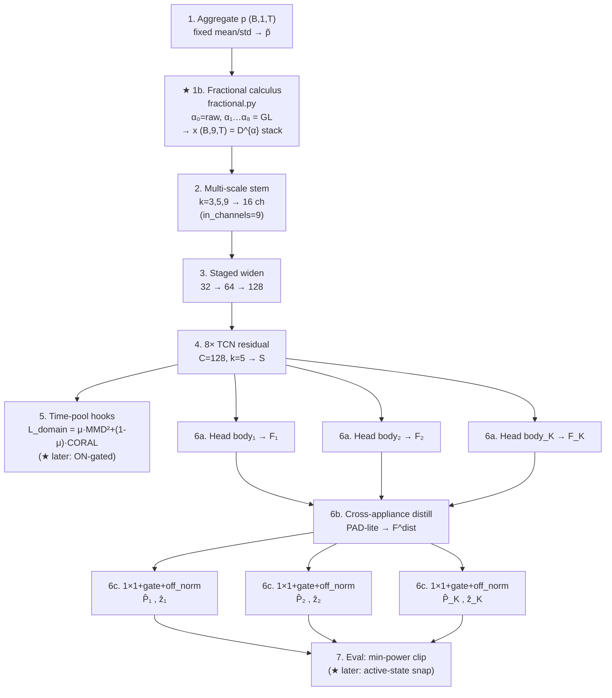
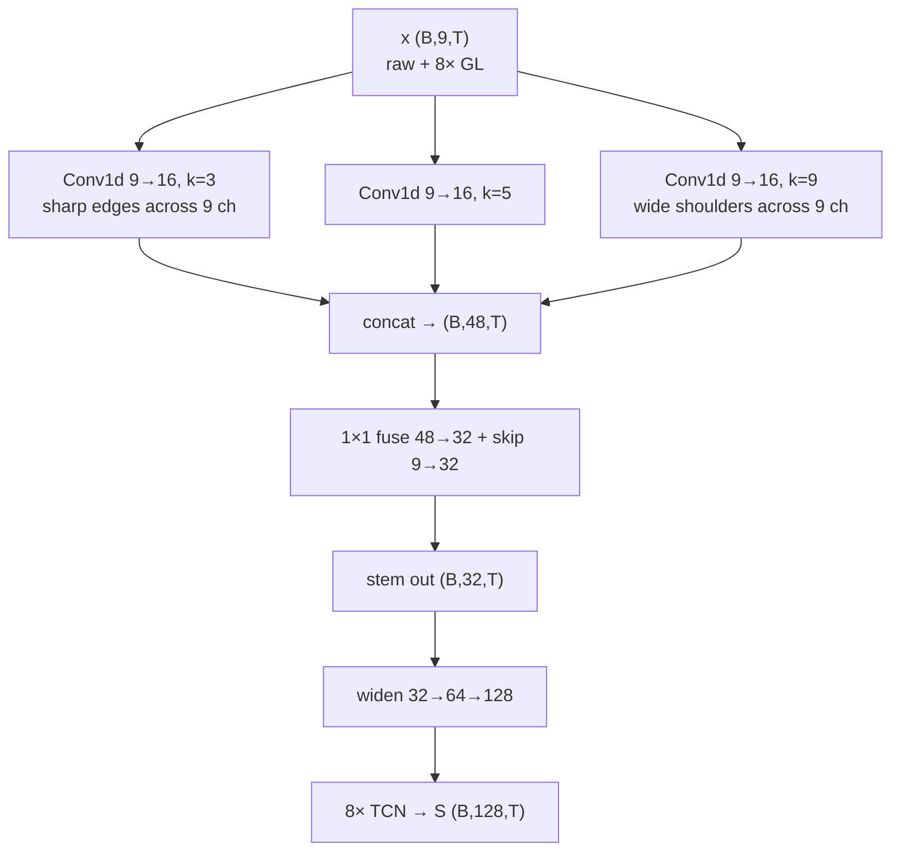
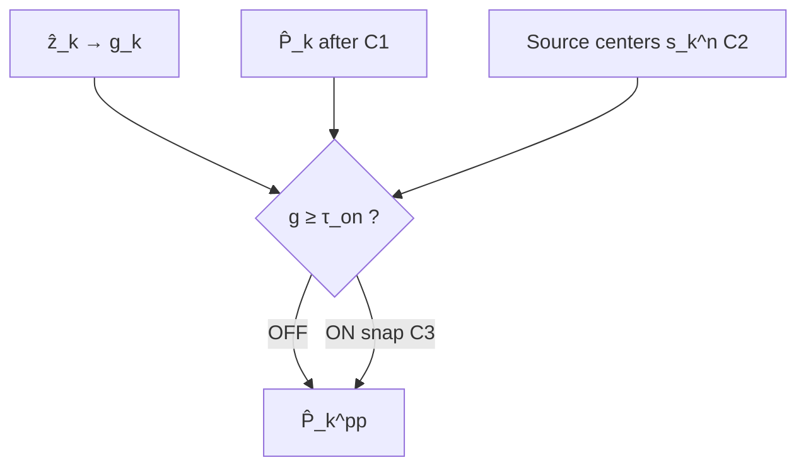

# MultiNILM + Schirmer Invariance Upgrade (Before / After)

**状态：** 设计文档（推荐落地路径）  
**想法：** **保持现有 MultiNILM 骨干**，只在三个位置挂 Schirmer 物理点的**轻量集成块**（尺度、时间、活跃态）。  
**不做 / 已放弃：** 在线 fractional×KLE 谱图 + FiLM 的 `multinilm_schirmer`（计算极重，H2 相对 `multinilm_fractional` 无可靠增益；代码已移除）。

相关：`schirmer2022_device_time_invariant_features.md`、`multinilm_fractional_kle_architecture.md`、`config/models/multinilm.yaml`、`config/models/multinilm_fractional.yaml`。

---

## Symbols

| Symbol | Meaning |
|--------|---------|
| \(p\) | 原始 / 已 z-score 的 aggregate 功率窗，`(B,1,T)` |
| \(x\) | 进 stem 的多通道输入 `(B, C_{\mathrm{in}}, T)` |
| \(D^{\alpha}p\) | Grünwald–Letnikov 分数阶导数（阶 \(\alpha\)） |
| `S` | Shared TCN features `(B, C_S, T)`，现默认 \(C_S=128\) |
| \(E^{(\ell)}\) | 第 \(\ell\) 层 DA hook 特征（`temporal_*` / `aligned`） |
| \(F_k\) / \(F_k^{\mathrm{dist}}\) | 电器 \(k\) 的 head / distill 特征 |
| \(\hat{z}_k\) | ON/OFF logits；\(g_k=\sigma(\hat{z}_k)\) 或 hard gate |
| \(\hat{P}_k\) | gate + off_norm 后的功率（归一化空间） |
| \(\hat{P}_k^{\mathrm{pp}}\) | ★ 活跃态后处理后的功率 |
| \(L_{\mathrm{NILM}}\) | 功率 MSE + 平衡 BCE |
| \(L_{\mathrm{domain}}\) | \(\mu\cdot\mathrm{MMD}^2+(1-\mu)\cdot\mathrm{CORAL}\)（AFTER：ON-gated） |

---

## 0. 集成块总览（挂在哪里）

三个 ★ 集成块**不改** stem / TCN / distill / 1×1 head 内部结构，只插在接口上：

| ID | 集成块 | 挂载位置（相对 MultiNILM） | 代码落点（建议） | Schirmer 对应点 |
|----|--------|---------------------------|------------------|-----------------|
| **A** | **Fractional calculus**（+ 尺度） | **dataloader 之后、stem 之前** | `preprocess_feature/fractional.py` → `MultiNILM_fractional` | ① 尺度 + ② 时间 |
| **B** | ON-gated / EGC DA | **TCN/aligned 特征 → pool → \(L_{\mathrm{domain}}\)** | `MultiNILM_loss` + runner DA 特征 | ③ 活跃态（表征对齐） |
| **C** | Active-state PP | **gate+off_norm 之后、metrics/保存之前** | eval 后处理 / `power_postprocess` 扩展 | ③ 活跃态（输出） |

```text
                    ┌──── ★ A: Fractional calculus (fractional.py) ────┐
p (B,1,T) ────────►│  GL multi-α + raw → x (B,9,T)                     │
                    └──────────────────┬───────────────────────────────┘
                                       ▼
                    ┌──────── Unchanged MultiNILM backbone ────────────┐
                    │  stem(C_in=9) → widen → TCN → S                  │
                    │         │                                        │
                    │         ├─► ★ B: ON-gated pool → L_domain        │
                    │         ▼                                        │
                    │  heads → distill → gate+off_norm                 │
                    │              → (P̂_k, ẑ_k)                         │
                    └──────────────────┬───────────────────────────────┘
                                       ▼
                    ┌──────── ★ C: Active-state PP ────────────────────┐
                    │  ON snap to source centers → P̂_k^pp              │
                    └──────────────────────────────────────────────────┘
```

**已实现可跑：** ★ A = **Fractional calculus**（`fractional.py` / `multinilm_fractional`，C=9）。  
**待实现：** B（ON-gated）、C（活跃中心 snap）。

---

## 1. BEFORE — 你贴的 MultiNILM 架构图是否正确？

**是的，正确。** 第一张图就是本仓库 **BEFORE = `MultiNILM` / `multinilm.yaml`**（无分数阶、无 KLE）：

| 图中节点 | 对应代码 / 含义 | 是否匹配 |
|----------|-----------------|----------|
| 1. Aggregate \(p\) `(B,1,T)` + fixed mean/std | dataloader z-score | ✅ |
| 2. Multi-scale stem \(k=3,5,9\) → 16 ch | `MultiScaleWaveformStem` | ✅ |
| 3. Staged widen \(32\to64\to128\) | `StagedFeatureExtractor` | ✅ |
| 4. \(8\times\) TCN residual \(C=128,k=5\) → \(S\) | `temporal_encoder` | ✅ |
| 5. Time-pool DA：\(\mu\) MMD + \((1-\mu)\) CORAL | `domain_feature_layers` + loss | ✅（mostly ungated） |
| 6a. Head body\(_k\) → \(F_k\) | per-appliance local decoder | ✅ |
| 6b. Cross-appliance distill PAD-lite → \(F^{\mathrm{dist}}\) | `CrossApplianceDistill` | ✅ |
| 6c. \(1\times1\) + gate + off_norm → \(\hat{P}_k,\hat{z}_k\) | `ApplianceHead` | ✅ |
| 7. Eval optional min-power clip | `power_postprocess` | ✅ |

与 **Schirmer 论文 Figure 2**（第二张图）对比：BEFORE **没有** 红圈里的 Fractional calculus / Framing / KLE / Norm；回归器用的是 **1D MultiNILM**，不是论文的 2D CNN on \(A,\Phi\)。

### 1.1 Diagram (before) — 与你贴图同构


### 1.2 Data flow (before)

```text
p → mean/std → stem → widen → TCN(S)
                                 ↓
                            pool → L_domain
                                 ↓
              HeadBody_k → F_k → Distill → F^dist → gate+off_norm → (P̂_k, ẑ_k)
                                                              ↓
                                                     eval min-power clip?
```

**跨屋弱点：** 无 Schirmer 红圈里的 fractional（时间）/ KLE（尺度）/ 活跃态后处理；DA 易被 OFF 主导。

---

## 2. AFTER — 同 MultiNILM 骨干 + Schirmer 红圈「Fractional calculus」

对照论文 **Figure 2** 左半（Smart meter → **Fractional calculus** → …）：

| 论文 Figure 2 | 我们 AFTER（推荐） |
|-----------|-------------------|
| Smart meter \(p_{\mathrm{agg}}\) | 同：aggregate \(p\) |
| **Fractional calculus** → \(D^{\alpha_k}p\) | ★ **接入**（`fractional.py`），输出 9 通道 |
| Framing → KLE → Norm → Regression CNN | **不做**（已试点过重且无 H2 增益） |
| Post-processing | 可选 ★ C 活跃态 snap（待做） |
| — | 保留 MultiNILM stem–TCN–heads–DA |

即：只把论文红圈里的 **Fractional calculus** 接到 MultiNILM 输入；后面仍用你 BEFORE 图里的 2–7。

### 2.1 Diagram (after) — 与 BEFORE 同画风



### 2.2 Side-by-side with Schirmer Figure 2

```text
Schirmer Fig. 2 (paper):
  p_agg → [Fractional] → Framing → KLE∥ → Norm → 2D CNN Regression → Post → P̂
              ▲ red circle

Our AFTER (MultiNILM):
  p_agg → [Fractional] → MultiNILM(stem→TCN→heads) → (optional Post) → P̂
              ▲ same block, thesis math below
              ✗ no Framing / KLE / spectrogram CNN
```

### 2.3 Data flow (after)

```text
p → mean/std → ★ Fractional calculus → x(B,9,T)
                         ↓
              stem(9) → widen → TCN(S)
                         ↓
                    pool → L_domain
                         ↓
      HeadBody → Distill → gate+off_norm → (P̂_k, ẑ_k) → eval PP
```

**已实现：** ★ Fractional 节点 = `multinilm_fractional`。  
**待做：** DA ON-gate、活跃态 snap（§3.2–3.3）。

---

## 2.4 ★ Fractional calculus — 数值如何算（论文式推导）

对应 Schirmer Fig. 2 红圈 + 正文 Eq. (4)–(5)。实现：`model/preprocess_feature/fractional.py`。

### Step 0 — Aggregate（与 BEFORE 相同）

瓦特 → 固定 z-score（源 / 目标同一套）：

\[
\tilde{p}[t]
=
\frac{p_{\mathrm{agg}}^{\mathrm{(W)}}[t] - \mu_{\mathrm{agg}}}{\sigma_{\mathrm{agg}}},
\quad
\mu_{\mathrm{agg}}=400,\ \sigma_{\mathrm{agg}}=500
\tag{1}
\]

张量形状：`(B, 1, T)`（如 \(T=512\)）。

### Step 1 — Grünwald–Letnikov 定义（论文 Eq. 4）

连续形式（区间 \([t_0,t]\)，步长 \(h\to 0\)）：

\[
{}_{t_0}D_t^{\alpha}\, p(t)
=
\lim_{h\to 0}
\frac{1}{h^{\alpha}}
\sum_{j=0}^{\lfloor (t-t_0)/h \rfloor}
(-1)^j \binom{\alpha}{j}\, p(t-jh)
\tag{2}
\]

二项式系数（论文 Eq. 5，Gamma）：

\[
\binom{\alpha}{j}
=
\frac{\Gamma(\alpha+1)}{\Gamma(j+1)\,\Gamma(\alpha-j+1)}
\tag{3}
\]

### Step 2 — 离散实现（\(h=1\)，截断记忆 \(J\)）

\[
\bigl(D^{\alpha}\tilde{p}\bigr)[t]
=
\sum_{j=0}^{J}
w_j^{(\alpha)}\, \tilde{p}[t-j],
\qquad
w_j^{(\alpha)}=(-1)^j\binom{\alpha}{j}
\tag{4}
\]

权重递推（`gl_binomial_weights`，避免逐次 Gamma）：

\[
w_0^{(\alpha)}=1,
\qquad
w_j^{(\alpha)}
=
w_{j-1}^{(\alpha)}\cdot\frac{j-1-\alpha}{j}
\quad(j=1,\ldots,J)
\tag{5}
\]

默认 \(J=256\)（yaml `fractional.memory`）。\(t-j<1\) 时该项为 0（左端零填充 / causal conv）。

**特殊情形：** \(\alpha=1\) 时 \(w=(1,-1,0,\ldots)\)，即

\[
(D^{1}\tilde{p})[t] \approx \tilde{p}[t]-\tilde{p}[t-1]
\]

（一阶差分 / 边缘）。\(0<\alpha<1\) 为带长记忆衰减的分数阶差分。

### Step 3 — 多阶 \(\alpha\)（论文 \(K=8\)）

论文优化 \(K=8\)，未公开精确 \(\alpha\) 列表。本仓库默认均匀网格（`default_schirmer_alphas`）：

\[
\alpha_k = \frac{k}{K},\quad k=1,\ldots,8
\;\Rightarrow\;
\{0.125,\ 0.25,\ 0.375,\ 0.5,\ 0.625,\ 0.75,\ 0.875,\ 1.0\}
\tag{6}
\]

对每个 \(\alpha_k\) 独立算一条长度 \(T\) 的序列 \(D^{\alpha_k}\tilde{p}\)。

### Step 4 — 通道堆叠（进 MultiNILM 的 \(x\)）

与 Fig. 2 中 \(\alpha_0,\alpha_1,\ldots\) 多线输出一致；我们另加 **raw** 作为 \(\alpha_0\) 通道：

\[
x
=
\begin{bmatrix}
x_{0,:}\\
x_{1,:}\\
\vdots\\
x_{8,:}
\end{bmatrix}
=
\begin{bmatrix}
\tilde{p}\\
D^{0.125}\tilde{p}\\
D^{0.25}\tilde{p}\\
\vdots\\
D^{1.0}\tilde{p}
\end{bmatrix}
\in\mathbb{R}^{9\times T}
\tag{7}
\]

| \(c\) | 通道内容 | 符号（对齐 Fig. 2） |
|------|----------|---------------------|
| 0 | raw | \(\alpha_0\): \(p_{\mathrm{agg}}\)（归一化后） |
| 1 | GL \(\alpha=0.125\) | \(D^{\alpha_1}p_{\mathrm{agg}}\) |
| 2 | \(0.25\) | \(D^{\alpha_2}p_{\mathrm{agg}}\) |
| … | … | … |
| 8 | \(1.0\) | \(D^{\alpha_8}p_{\mathrm{agg}}\) |

Batch 形状：`(B, 9, T)` → stem `in_channels=9`。

### Step 5 — 可选通道标准化

\[
x_{c,t}
\leftarrow
\frac{x_{c,t}-\bar{x}_c}{\sigma_c+\varepsilon},
\quad c=0,\ldots,8
\tag{8}
\]

（`channel_normalize: mean_std`）使高 α 高频通道与 raw 能量同量级。

### Step 6 — 之后（与 BEFORE 相同，不是论文 KLE）

```text
x (B,9,T)
  → Multi-scale stem → widen → TCN → S
  → heads / distill / gate → P̂_k, ẑ_k
```

论文下一步是 Framing → **KLE** → \(A_k,\Phi_k\) → Norm → Regression；**本 AFTER 在 Fractional 之后改接 MultiNILM，不再算 KLE。**

### 数值玩具例子（单点直觉）

设 \(\tilde{p}=[\ldots,0,0,0,1,1,1,\ldots]\)（归一化空间的阶跃），\(J\) 足够大：

- \(D^{1}\tilde{p}\)：主要在跳变处出现尖峰（差分）。  
- \(D^{0.5}\tilde{p}\)：尖峰更“拖尾”，依赖更长历史。  
- 堆 8 个 α + raw → stem 同时看到 **电平** 与 **多尺度边缘**，减轻跨屋时间错位（Schirmer §II-B）。

### Torch 实现要点

`FractionalFrontEnd`：对每个 α 用长度 \(J+1\) 的因果 `conv1d`；因 PyTorch 是相关而非卷积，核相对 NumPy `convolve` **翻转**（已与 `fractional_derivative` 对齐）。

---

## 2.5 Multi-scale stem 是什么？变成 9 通道后怎么工作？

### 直觉（为什么叫 multi-scale）

功率波形同时有：
- **窄事件**：kettle / microwave 的陡升陡降 → 需要 **短** 卷积核看尖峰；
- **宽肩膀**：fridge / dishwasher 的缓升、平台 → 需要 **长** 卷积核看轮廓。

**Multi-scale stem**（`MultiScaleWaveformStem`）用 **三路并行** `Conv1d`，核长不同，再拼起来，让网络一开始就同时看到细边沿和粗形状——不是把时间下采样成多分辨率金字塔，而是 **同一长度 \(T\) 上、不同感受野**。

默认（yaml）：

| 分支 | kernel | 看什么 |
|------|--------|--------|
| branch 0 | \(k=3\) | 尖边、小抖动 |
| branch 1 | \(k=5\) | 中等 ON/OFF 肩 |
| branch 2 | \(k=9\) | 更宽的平台 / 缓变 |

每路输出 `detail_branch_channels=16` 个通道 → 三路拼接 48 维 → \(1\times1\) 融合成 **32** 维，再加 **1×1 skip**（残差）。

### BEFORE：\(C_{\mathrm{in}}=1\)

```text
x: (B, 1, T)     ← 只有归一化 aggregate
        │
        ├─ Conv1d(1→16, k=3) ─┐
        ├─ Conv1d(1→16, k=5) ─┼─ concat → (B, 48, T)
        └─ Conv1d(1→16, k=9) ─┘
                    ↓
            Conv1d(48→32, k=1) + skip(1→32)
                    ↓
            stem out: (B, 32, T)
                    ↓
            staged widen: 32→64→128
                    ↓
            TCN: (B, 128, T) = S
```

每一路卷积都是：

\[
y^{(k)}_{b,c',t}
=
\sum_{c=0}^{0}\sum_{\tau=-(k-1)/2}^{(k-1)/2}
W^{(k)}_{c',c,\tau}\, x_{b,c,t+\tau}
\quad(c\ \text{只有 raw 一路})
\tag{S1}
\]

### AFTER：\(C_{\mathrm{in}}=9\)（Fractional 之后）— **结构不变，只是 in_channels 变大**

Fractional 给出：

\[
x\in\mathbb{R}^{B\times 9\times T}
=
\big[\,\tilde{p},\ D^{0.125}\tilde{p},\ \ldots,\ D^{1}\tilde{p}\,\big]
\]

**Stem 公式同一套**，只是输入通道从 1 变成 9：

\[
y^{(k)}_{b,c',t}
=
\sum_{c=0}^{8}\sum_{\tau}
W^{(k)}_{c',c,\tau}\, x_{b,c,t+\tau}
\tag{S2}
\]

含义：每个时间位置、每个输出通道 \(c'\)，是对 **9 个物理通道在局部时间窗内的加权混合**：

- \(c=0\)（raw）：绝对功率电平；
- \(c=1..8\)（各 α）：多尺度“边缘 / 记忆”形状。

短核 \(k=3\) 更盯 **某一 α 上的尖峰怎么和 raw 一起跳**；长核 \(k=9\) 更盯 **整段肩部在多个 α 上是否同形**。



### 通道数一路怎么变（AFTER 一张表）

| 阶段 | 形状 | 说明 |
|------|------|------|
| Aggregate | `(B, 1, T)` | 原始 / z-score 功率 |
| ★ Fractional calculus | `(B, 9, T)` | raw + 8 个 \(D^{\alpha}\) |
| Multi-scale stem | `(B, 32, T)` | 3 核并行 → fuse；**时间长度 T 不变** |
| Staged widen | `(B, 64, T)` → `(B, 128, T)` | `channel_schedule` 后半 |
| TCN | `(B, 128, T)` | 共享时序特征 \(S\) |
| Heads | `(B, T, K)` 功率/状态 | 每电器一条 |

注意：  
- **9 → 32** 发生在 stem（学“怎么混合 9 路物理通道”）；  
- **不是** 把 9 路当成 9 个电器；电器数 \(K=5\) 仍在 **head** 上；  
- Fractional 的 9 是 **同一 aggregate 的 9 种时间描述**，stem 负责把它们融进统一特征图。

### 和「变宽」的差别

| | Multi-scale stem | Staged widen |
|--|------------------|--------------|
| 在做什么 | 同一 \(T\) 上 **多种核长** 看形状 | **通道数** 32→64→128 加深 |
| 输入通道 | \(C_{\mathrm{in}}=1\) 或 \(9\) | stem 输出的 32 |
| 时间维 | 保持 \(T\) | 保持 \(T\) |

### 代码位置

- `model/MultiNILM.py` → `MultiScaleWaveformStem`  
- `use_multiscale_stem: true`，`detail_kernels: [3,5,9]`，`detail_branch_channels: 16`  
- fractional 时 `build_multinilm_fractional` 把 `input_channels=9` 传进 stem

---

## 3. ★ 其余集成块（B / C）

> Fractional calculus 的完整推导见 **§2.4**（对齐 Schirmer Fig. 2 红圈）。

### 3.2 ★ B — ON-gated / EGC domain loss（表征侧）

**挂载：** 在 `return_domain_features=True` 取出的 \(E^{(\ell)}_S, E^{(\ell)}_T\) 上，**先按时间加权再 pool**，再算 MMD/CORAL。

#### 未门控（BEFORE）

对层 \(\ell\)，时间平均：

\[
u^{(\ell)} = \frac{1}{T}\sum_{t=1}^{T} E^{(\ell)}_{:,t}
\tag{B1}
\]

\[
L_{\mathrm{domain}}
=
\mu\,\mathrm{MMD}^2(u_S,u_T)
+
(1-\mu)\,\mathrm{CORAL}(u_S,u_T)
\tag{B2}
\]

凸组合目标（`domain_mix: convex`）：

\[
L = (1-\lambda)\,L_{\mathrm{NILM}} + \lambda\,L_{\mathrm{domain}}^{\mathrm{(scaled)}}
\tag{B3}
\]

#### ★ ON-gated（AFTER）

用源域 GT 或预测置信度构造权重 \(w_{k,t}\in[0,1]\)（电器 \(k\)、时间 \(t\)）：

\[
w_{k,t}^{\mathrm{(src)}}
=
\begin{cases}
z_{k,t}^{\mathrm{GT}} & \text{source（有标签）} \\
\mathbb{1}\!\left[\sigma(\hat{z}_{k,t}) \ge \tau\right] & \text{target（伪标签 / 阈值）}
\end{cases}
\tag{B4}
\]

共享编码器上的标量时间权重（可对电器取 max / 均值）：

\[
w_t = \max_k w_{k,t}
\quad\text{或}\quad
w_t = \tfrac{1}{K}\sum_k w_{k,t}
\tag{B5}
\]

加权 pool（EGC 风格：先 \(\sqrt{w}\) 再特征加权，避免二次归一踩坑）：

\[
u^{(\ell)}
=
\frac{\sum_{t=1}^{T} \sqrt{w_t}\, E^{(\ell)}_{:,t}}
     {\sum_{t=1}^{T} \sqrt{w_t} + \varepsilon}
\tag{B6}
\]

再代入 (B2)。**物理含义：** 少用 OFF 帧对齐 —— 对应 Schirmer「用户占空比不是设备指纹」。

#### 与现有 yaml 的关系

| 开关 | 现状 | AFTER |
|------|------|-------|
| `domain_adaptation.enabled` | 可开 | 保留 |
| `domain_scale: equal` | 易放大不稳定 \(L_{\mathrm{domain}}\) | 优先试 `none` + 较小 \(\lambda\) |
| ON-gate | **无** | ★ 新增 B4–B6 |

---

### 3.3 ★ C — Active-state post-process（输出侧）

**挂载：** 网络已输出 \(\hat{P}_k, g_k\) 之后；只改 **评估 / 导出** 功率，训练损失仍可用 \(\hat{P}_k\)（或对 snap 截断反传，首版建议 **eval-only**）。

#### Gate + off_norm（已有，不变）

归一化空间 off 目标 \(y_{\mathrm{off},k} = -\mu_k/\sigma_k\)（对应 0 W）：

\[
\hat{P}_{k,t}
=
g_{k,t}\,\hat{P}^{\mathrm{raw}}_{k,t}
+
(1-g_{k,t})\, y_{\mathrm{off},k}
\tag{C1}
\]

#### ★ 活跃中心 snap（Schirmer FCM / k-means 轻量版）

在 **源域** ON 功率上估计电器 \(k\) 的活跃中心集合 \(\{s_k^{(n)}\}_{n=1}^{N_k}\)（瓦特或归一化空间，需一致）：

\[
s_k^{(n)} = \text{\(k\)-means / FCM center on source } \{ P_k : z_k=1 \}
\tag{C2}
\]

推理时（仅当判定为 ON）：

\[
\hat{P}_{k,t}^{\mathrm{pp}}
=
\begin{cases}
y_{\mathrm{off},k} & g_{k,t} < \tau_{\mathrm{on}} \\[4pt]
s_k^{(n^\star)} &
g_{k,t}\ge\tau_{\mathrm{on}},\ 
n^\star=\arg\min_n \lvert \mathrm{denorm}(\hat{P}_{k,t}) - s_k^{(n)} \rvert
\end{cases}
\tag{C3}
\]

可选：仅当 \(\lvert \mathrm{denorm}(\hat{P})-s^{(n^\star)}\rvert > \delta_k\) 才 snap，避免过度量化。

**与 off_norm：** OFF 仍走 (C1)；snap **只动 ON**。



---

## 4. BEFORE vs AFTER（对照）

| 项 | BEFORE | AFTER |
|----|--------|-------|
| 输入 | `(B,1,T)` 固定 mean/std | ★ A：尺度 + \(\Delta\)/GL |
| 骨干 | stem–TCN–distill–gate | **Same** |
| DA | 全时段 pool MMD+CORAL | ★ B：ON-gated / EGC |
| 输出 | gate + 可选 min-W clip | ★ C：+ 活跃中心 snap |
| 在线 KLE+FiLM | 曾试点，已移除 | **不做**（太重且无 H2 增益） |

```text
BEFORE:  p ──norm──► Backbone ──DA(all)──► Heads ──clip?──► out
AFTER:   p ──★A───► Backbone ──★B(ON)──► Heads ──★C───► out
              (same TCN + distill + off_norm gate)
```

---

## 5. 分阶段落地（与集成块对应）

| Phase | 打开哪块 | 公式 / 节点 | 状态 |
|-------|----------|-------------|------|
| 0 | 诊断 loss 曲线 / H2 分电器 | — | 进行中 |
| 1 | ★ B ON-gated DA + ★ C Active PP | B4–B6, C2–C3 | **待做** |
| 2 | ★ A 稳健尺度审计 | A1 | 可选 |
| 3 | ★ A `[p, Δp]` | A3–A4 | 可选轻量 |
| 4 | ★ A fractional C=9 | A5–A6 | **已有** `multinilm_fractional` |
| 5 | 在线 KLE 谱图 + FiLM | — | **已放弃** |

每阶段单独 yaml / flag；失败变体不进论文主表。

---

## 6. 与失败试点的关系

| 试点 | 做法 | 结果 | 对本设计的含义 |
|------|------|------|----------------|
| `multinilm_fractional` | 仅 ★A（GL） | 可训；H2 macro F1≈0.59 | A 可保留作基线 |
| `multinilm_schirmer` | A + 在线 KLE + FiLM | ~8h/次；Test≈fractional | **不要**把谱图塞进 FiLM 当“伪 Schirmer” |
| 本升级文档 | A（轻）+ **B** + **C** | 待实现 | 对准 Schirmer 的 ③，避开重 KLE |

---

## 7. 一句话

**BEFORE = 今天的 MultiNILM。**  
**AFTER = 同一骨干 + 三个挂载点：**  
**★A Fractional calculus（`fractional.py`，FC1–FC5，9 通道）→ ★B ON-gated DA（B4–B6）→ ★C 活跃态 snap（C2–C3）。**  
用 Schirmer 的物理问题，不用 Schirmer 的整机 2D 频谱 CNN。
