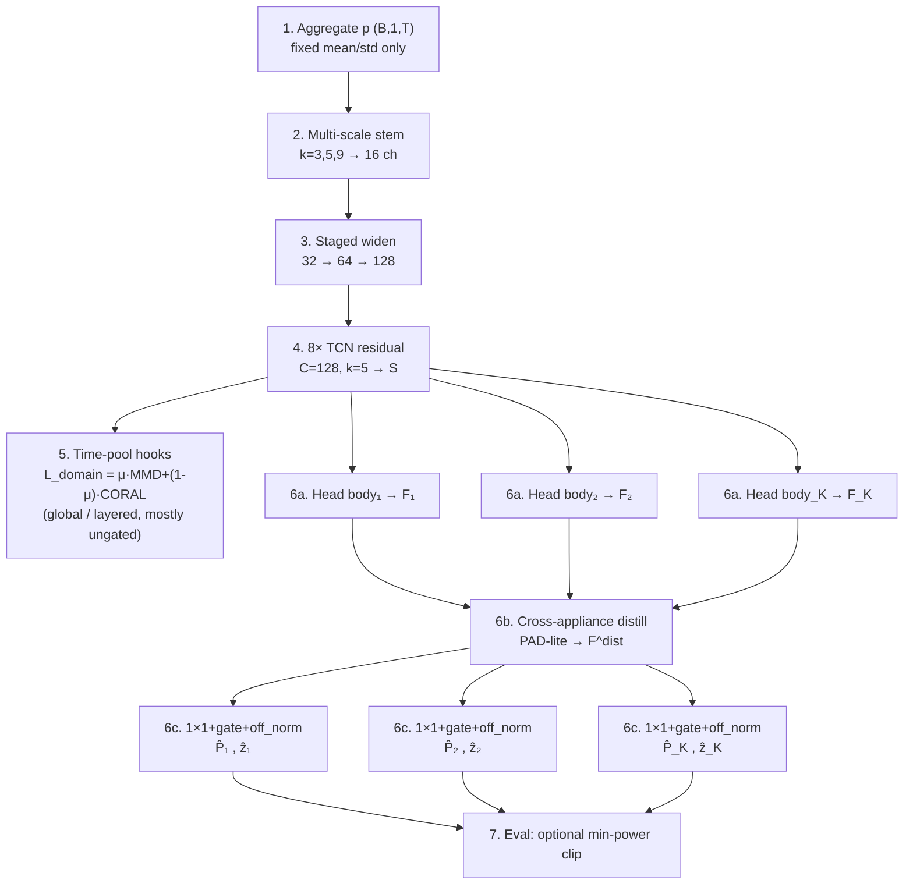
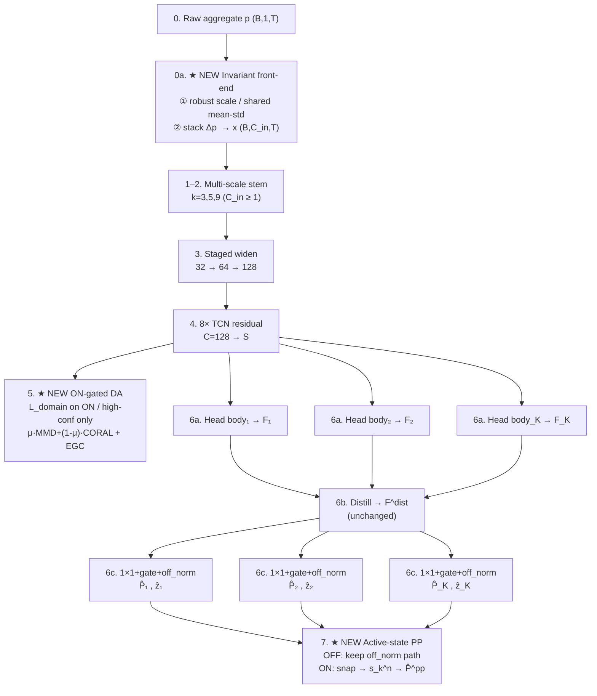
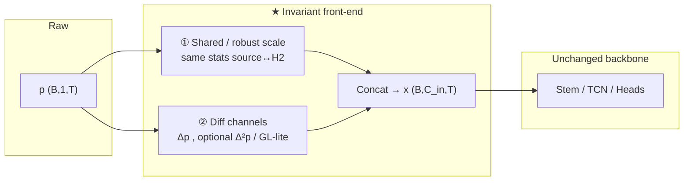
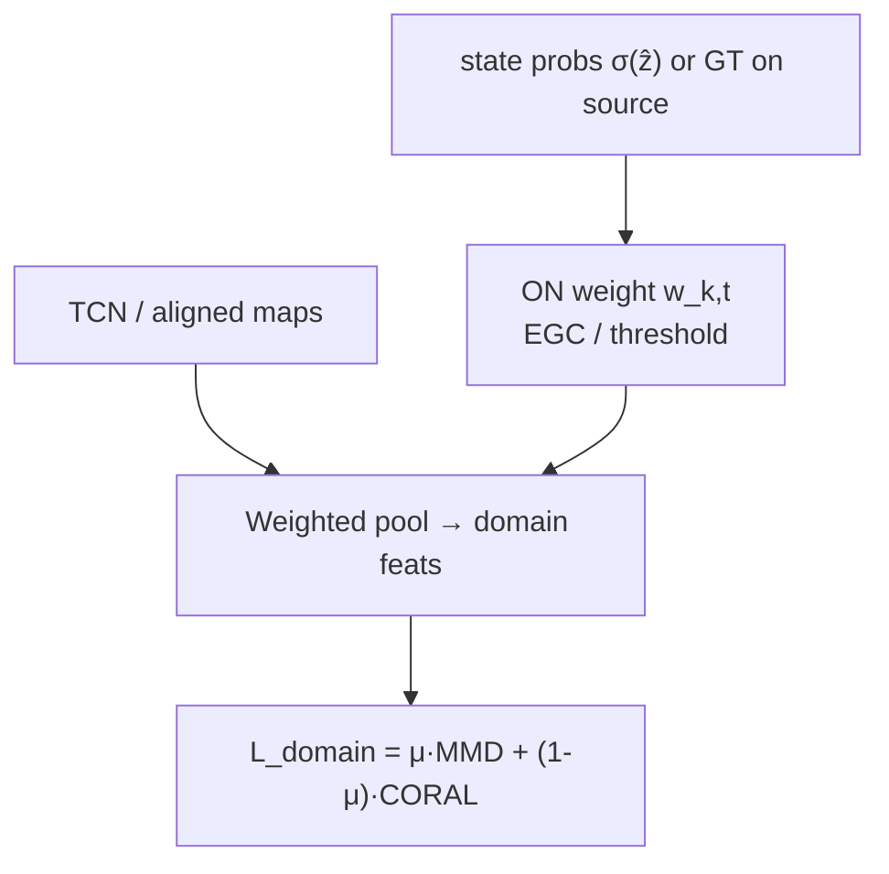
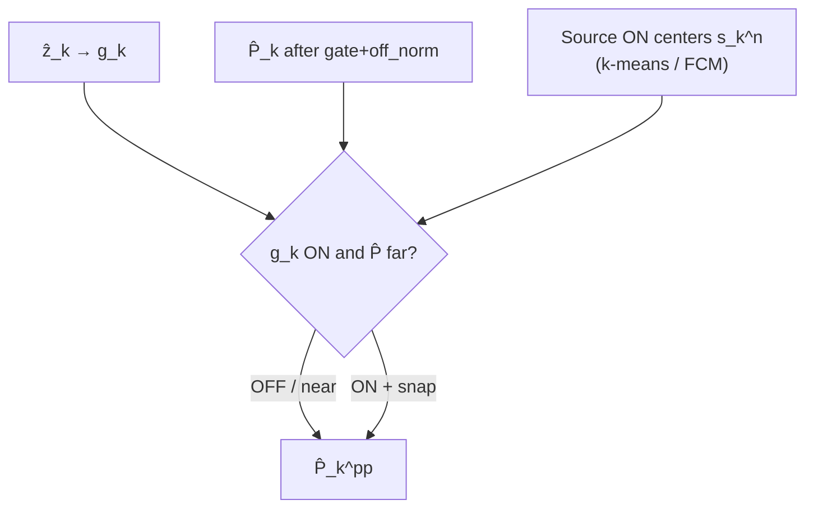

# MultiNILM + Schirmer Invariance Upgrade (Before / After)

**状态：** 设计文档（尚未实现）  
**想法：** **保持现有 MultiNILM 骨干**，在输入侧 / DA 门控 / 输出后处理加 Schirmer 三点的**轻量版**（尺度、时间、活跃态）。  
**不做：** 完整 fractional + KLE + 2D-CNN。

相关：`schirmer2022_device_time_invariant_features.md`、`MATUDA_ARCHITECTURE_UPGRADE.md`、`multinilm.yaml`。

---

## Symbols

| Symbol | Meaning |
|--------|---------|
| \(p\) | 原始 aggregate 功率窗 |
| \(x\) | 进网络的输入特征 `(B, C_in, T)`；BEFORE 时 \(C_{\mathrm{in}}=1\) |
| `S` | Shared TCN features `(B, 128, T)` |
| `E` / aligned | Pre-head 共享表征（DA hook 用） |
| `F_k` | Head body 特征 `(B, C, T)` |
| `F_k^dist` | Cross-appliance distill 后特征 |
| \(\hat{z}_k\) | ON/OFF logits |
| \(\hat{P}_k\) | Gate + off_norm 后的功率（归一化空间） |
| \(\hat{P}_k^{\mathrm{pp}}\) | ★ AFTER：活跃态后处理后的功率 |
| \(L_{\mathrm{domain}}\) | MMD+CORAL；AFTER 优先 ON-gated |

---

## 1. BEFORE — 当前 MultiNILM

与 `multinilm.yaml` / `MultiNILM.py` 今天一致（含 PAD-lite distill、global/layered DA、off_norm gate）。

### 1.1 Block list

| # | Block | Detail |
|---|--------|--------|
| 1 | Input | Aggregate `(B, 1, T)`，`T=600`；固定 mean/std 归一化 |
| 2 | Stem | Multi-scale `k=3,5,9` → 16 ch → 拼到 32 |
| 3 | Widen | `32 → 64 → 128` |
| 4 | TCN | `8×` residual，`C=128`，`k=5` → `S` |
| 5 | DA hooks | `temporal_4` / `temporal_6` / `aligned` 上 time-pool → MMD+CORAL（**未**强制 ON-gate） |
| 6a | Head body | 每电器 local residual → `F_k` |
| 6b | Distill | PAD-lite：`F → F^dist`（`cross_appliance.enabled: true`） |
| 6c | Final 1×1 + gate | \(\hat{z}_k\)，\(\hat{P}_k = g\cdot\hat{P}_{\mathrm{raw}}+(1-g)\cdot\mathrm{off\_norm}\) |
| 7 | Eval 后处理 | 可选 `power_postprocess` 小功率清零（非 FCM 活跃中心） |

### 1.2 Complete diagram (before)



### 1.3 Data flow (before)

```text
p → mean/std → stem → widen → TCN(S)
                                 ↓
                            pool → L_domain   (mostly all timesteps)
                                 ↓
                    HeadBody_k → F_k → Distill → F_k^dist
                                                 ↓
                                    1×1+gate+off_norm → (P̂_k, ẑ_k)
                                                 ↓
                                    eval min-power clip (optional)
```

**跨屋弱点：** 输入只有原始归一化功率；DA 易被大量 OFF 主导；无活跃态功率中心约束 → H2 易掉。

---

## 2. AFTER — 同骨干 + Schirmer 轻量三钩子

**结构原则：** stem / widen / TCN / distill / gate **不变**。  
**新增三块：**

| Schirmer 点 | AFTER 落点 | 标记 |
|-------------|------------|------|
| ① 尺度 | 输入稳健尺度（可选） | ★ NEW A |
| ② 时间 | 差分（可选半阶）通道 | ★ NEW A |
| ③ 活跃态 | ON-gated DA + 活跃态 snap | ★ NEW B / C |

### 2.1 Block list

| # | Block | vs BEFORE |
|---|--------|-----------|
| 0a | ★ NEW **Invariant front-end** | 稳健尺度（①）+ `[p, Δp, …]`（②）→ `x`，`C_in≥1` |
| 1–4 | stem → widen → TCN | **Same**（stem 支持 `input_channels>1`） |
| 5 | DA on pooled hooks | **改：** ★ NEW **ON-gated / EGC** \(L_{\mathrm{domain}}\)（③） |
| 6a–6c | Head body → distill → gate+off_norm | **Same** |
| 7 | ★ NEW **Active-state post-process** | ON 时 snap 到源域活跃中心；OFF 保持 off_norm（③） |

### 2.2 Complete diagram (after)



### 2.3 Data flow (after) — one line

```text
p → ★scale+Δchannels → x → stem → widen → TCN(S)
                                              ↓
                               ★ ON-gated pool → L_domain
                                              ↓
                         HeadBody → F → Distill → F^dist → gate+off_norm
                                                              ↓
                                                    ★ active snap → (P̂^pp, ẑ)
```

骨干与 BEFORE 相同；**新件只有：Invariant front-end、ON-gated DA、Active-state PP。**

### 2.4 Where predictions live

```text
x              = 输入特征（可含 Δp）
F_k / F_k^dist = 特征（无瓦数）
(P̂_k, ẑ_k)     = gate 后功率 + 状态     ← 网络输出
(P̂_k^pp, ẑ_k)  = ONLY 最终对外功率      ← 活跃态后处理之后
```

---

## 3. ★ NEW blocks（细节）

### 3.1 Invariant front-end（① + ②）



**默认消融：** `C_in=1` 仅审计归一化；再开 `C_in=2` 的 `[p, Δp]`。不上完整 KLE。

### 3.2 ON-gated DA（③ in latent space）



**要点：** 少用 OFF 帧对齐 —— 对应 Schirmer「状态概率由用户决定、不对齐 inactive」。

### 3.3 Active-state post-process（③ at output）



**与 off_norm 关系：** OFF 仍靠 gate→off_norm→0W；snap **只动 ON**。

---

## 4. BEFORE vs AFTER（对照）

| 项 | BEFORE | AFTER |
|----|--------|-------|
| 输入 | `(B,1,T)` 固定 mean/std | ★ 稳健尺度 + 可选差分通道 |
| 骨干 | stem–TCN–distill–gate | **Same** |
| DA | 多层 MMD+CORAL，易含 OFF | ★ ON-gated / EGC |
| 输出 | gate + 可选 min-power clip | ★ + 活跃态中心 snap |
| Schirmer 完整 KLE/GL | 无 | **仍不做** |

```text
BEFORE:  p ──norm──► Backbone ──DA(all)──► Heads ──clip?──► out
AFTER:   p ──★inv──► Backbone ──★DA(ON)──► Heads ──★snap──► out
              (same TCN + distill + off_norm gate)
```

---

## 5. 分阶段落地（与图对应）

| Phase | 打开哪块 | 图中节点 |
|-------|----------|----------|
| 0 | 诊断 only | — |
| 1 | ★ ON-gated DA + ★ Active PP | 5 + 7 |
| 2 | ★ 稳健尺度 | 0a ① |
| 3 | ★ `[p, Δp]` | 0a ② |
| 4 | 完整 KLE / GL | **不做** |

每阶段 yaml flag 消融；失败变体不进论文主表。

---

## 6. 一句话

**BEFORE = 今天的 MultiNILM。**  
**AFTER = 同一架构 + 输入不变性钩子 + ON-gated DA + 活跃态后处理**；用 Schirmer 的物理问题，不用 Schirmer 的 2D 频谱整机。
