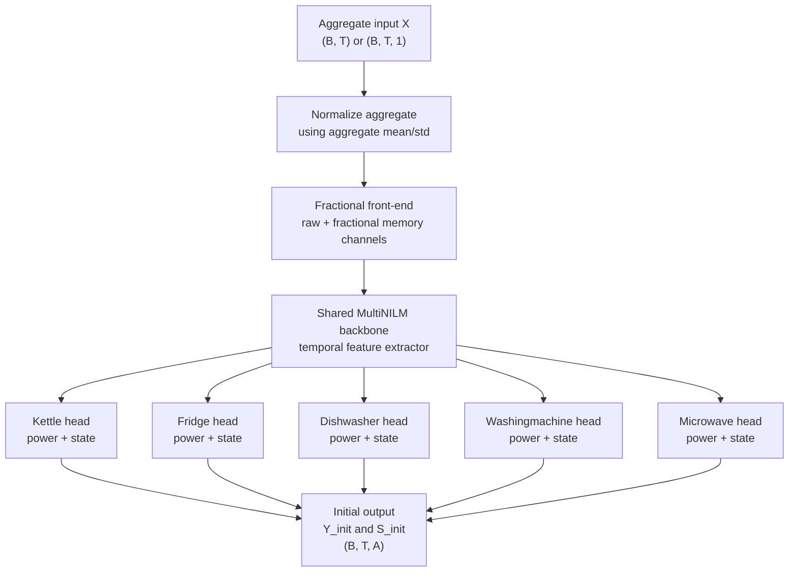
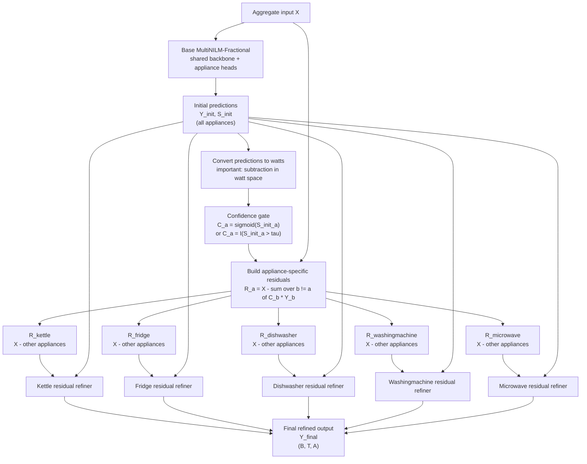

# NNAN Iterative Subtraction Explanation

This note explains the NNAN equations for sequential multi-appliance NILM:

```math
X'_i(k)
=
X[k-M-1:k]
-
\sum_{j=1}^{i}
\hat{Y}_{j-1}[k-M-1:k]
\tag{11}
```

where:

```math
\hat{Y}_0 = \mathbf{0} \in \mathbb{R}^{M \times 1}
```

and the appliance ordering score is:

```math
score = use\_rate \times ACWO
\tag{12}
```

with:

```math
use\_rate
=
\frac{\sum_{i=1}^{L} I(X[i] > thr)}{L}
\tag{13}
```

and:

```math
ACWO
=
\frac{1}{|A|}
\sum_{i \in A} X[i],
\qquad
A = \{i \mid X[i] > 0\}
\tag{14}
```

## Main Idea

NNAN is a **sequential multi-appliance disaggregation** method.

Instead of predicting all appliances from the original aggregate at the same time, it predicts appliances one by one:

```text
aggregate signal
  -> predict appliance 1
  -> subtract appliance 1
  -> predict appliance 2 from remaining signal
  -> subtract appliance 2
  -> continue
```

The purpose is to reveal weaker appliances after stronger or more frequent appliances have been removed.

This is useful in NILM because high-power appliances can hide low-power appliances such as fridge, freezer, or small cyclic loads.

## Equation (11): Residual Input for Stage `i`

The equation:

```math
X'_i(k)
=
X[k-M-1:k]
-
\sum_{j=1}^{i}
\hat{Y}_{j-1}[k-M-1:k]
```

means:

> At stage `i`, the input is the original aggregate window minus the appliances already predicted by previous stages.

## Symbol Meaning

| Symbol | Meaning |
|---|---|
| `X` | original aggregate power signal |
| `k` | current time index |
| `M` | sliding window length |
| `X[k-M-1:k]` | aggregate window ending at time `k` |
| `i` | current disaggregation stage |
| `N` | total number of appliances to disaggregate |
| `Y_hat_j` | predicted power of appliance/stage `j` |
| `X'_i(k)` | residual input window for stage `i` |

The paper defines:

```math
\hat{Y}_0 = \mathbf{0}
```

This means before any appliance is predicted, nothing is subtracted.

So at the first stage:

```math
X'_1(k)
=
X[k-M-1:k] - \hat{Y}_0[k-M-1:k]
```

Since:

```math
\hat{Y}_0 = 0
```

then:

```math
X'_1(k) = X[k-M-1:k]
```

The first model sees the original aggregate.

At the second stage:

```math
X'_2(k)
=
X[k-M-1:k] - \hat{Y}_1[k-M-1:k]
```

The second model sees the aggregate after appliance 1 has been removed.

At the third stage:

```math
X'_3(k)
=
X[k-M-1:k]
-
\hat{Y}_1[k-M-1:k]
-
\hat{Y}_2[k-M-1:k]
```

The third model sees the remaining residual after appliances 1 and 2 have been removed.

## Simple Example

Assume the aggregate contains:

```text
aggregate = kettle + microwave + fridge + unknown/background
```

If NNAN chooses this order:

```text
1. kettle
2. microwave
3. fridge
```

then:

```math
X'_1 = X
```

```math
\hat{Y}_1 = f_1(X'_1)
```

```math
X'_2 = X - \hat{Y}_1
```

```math
\hat{Y}_2 = f_2(X'_2)
```

```math
X'_3 = X - \hat{Y}_1 - \hat{Y}_2
```

```math
\hat{Y}_3 = f_3(X'_3)
```

So fridge is predicted after large appliances are removed.

This can make fridge easier to detect because the residual signal is cleaner.

## Why Appliance Order Matters

The subtraction method depends on the order.

If a high-power appliance is predicted early, its large contribution is removed from the aggregate. This can expose smaller appliances later.

But if the early prediction is wrong, the error can propagate:

```text
wrong kettle prediction
  -> wrong residual
  -> microwave/fridge model receives distorted input
```

So NNAN needs a rule to decide the order of appliances.

That is why the paper defines:

```math
score = use\_rate \times ACWO
```

## Equation (13): Use Rate

```math
use\_rate
=
\frac{\sum_{i=1}^{L} I(X[i] > thr)}{L}
```

This measures how frequently an appliance is ON.

| Term | Meaning |
|---|---|
| `L` | length of the full signal |
| `X[i]` | appliance power at sample `i` |
| `thr` | small threshold, fixed to `5 W` in the paper |
| `I(X[i] > thr)` | equals `1` if appliance is ON, otherwise `0` |

So:

```math
use\_rate
=
\frac{\text{number of ON samples}}{\text{number of all samples}}
```

Example:

```text
total samples = 10000
ON samples    = 2500
```

Then:

```math
use\_rate = \frac{2500}{10000} = 0.25
```

The appliance is ON for 25 percent of the time.

## Equation (14): ACWO

ACWO means:

```text
Average Consumption While ON
```

The paper defines:

```math
ACWO
=
\frac{1}{|A|}
\sum_{i \in A} X[i],
\qquad
A = \{i \mid X[i] > 0\}
```

This is the average power when the appliance is active.

In practical NILM, this is often interpreted as:

```math
ACWO
\approx
\frac{\sum_{\text{ON samples}} appliance\_power}
{\text{number of ON samples}}
```

Example:

```text
ON samples: 100 W, 120 W, 110 W
```

Then:

```math
ACWO
=
\frac{100 + 120 + 110}{3}
=
110 W
```

## Equation (12): Appliance Score

```math
score = use\_rate \times ACWO
```

This score is high when an appliance is:

1. frequently used
2. high power when ON

So it favors appliances that strongly affect the aggregate signal.

Example:

| Appliance | use_rate | ACWO | score |
|---|---:|---:|---:|
| fridge | 0.40 | 100 W | 40 |
| kettle | 0.01 | 2500 W | 25 |
| microwave | 0.03 | 1000 W | 30 |

In this example:

```text
fridge score    = 0.40 x 100  = 40
kettle score    = 0.01 x 2500 = 25
microwave score = 0.03 x 1000 = 30
```

The order would be:

```text
fridge -> microwave -> kettle
```

But depending on the dataset, high-power appliances can still rank high because their ACWO is large.

## Why This Helps Low-Power Appliances

In mixed-domain NILM, appliance signals can change across datasets:

```text
UK-DALE fridge may not have exactly the same amplitude or duration as REFIT fridge.
Kettle and microwave can dominate the aggregate.
Small fridge changes can be hidden under larger appliances.
```

NNAN tries to solve this by progressively simplifying the aggregate:

```text
original aggregate
  -> remove strong/frequent appliance
  -> residual becomes cleaner
  -> next appliance becomes easier
```

For your MultiNILM-Frac model, the useful idea is not necessarily to replace the whole model with NNAN. A better adaptation is:

```text
MultiNILM-Fractional first predicts all appliances.
Then build one residual view for each appliance.
Then use each residual view to refine that appliance.
```

For example:

```math
r_a(t)
=
X(t)
-
\sum_{b \ne a}
\hat{s}_b(t)\hat{Y}_b(t)
```

where:

| Symbol | Meaning |
|---|---|
| `X(t)` | aggregate power |
| `a` | appliance being refined |
| `b` | other appliance being subtracted |
| `Y_hat_b(t)` | predicted power of another appliance |
| `s_hat_b(t)` | predicted ON probability or ON mask of another appliance |
| `r_a(t)` | residual signal for appliance `a` refinement |

Then each appliance refinement head can use:

```math
[X(t),\ r_a(t),\ \hat{Y}_a(t),\ \hat{s}_a(t)]
```

as input.

## MultiNILM Before Residual Refinement

This is the current MultiNILM-Fractional structure. The model sees the aggregate once, extracts shared features, and predicts all appliances in parallel.



### Before Formula

```math
(\hat{Y}^{init}, \hat{S}^{init}) = F_\theta(X)
```

where:

| Symbol | Meaning |
|---|---|
| `F_theta` | current MultiNILM-Fractional model |
| `X` | aggregate input |
| `Y_init` | first-stage appliance power prediction |
| `S_init` | first-stage appliance ON/OFF state prediction |

The important property is:

```text
all appliances share one backbone and are predicted at the same time
```

## MultiNILM After All-Appliance Residual Refinement

The residual version keeps the original parallel MultiNILM prediction, then adds a second refinement stage for every appliance.



### After Formula

For each appliance `a`:

```math
R_a(t)
=
X(t)
-
\beta
\sum_{b \ne a}
C_b(t)\hat{Y}^{init}_b(t)
```

Then:

```math
Z_a(t)
=
\left[
X(t),
R_a(t),
\hat{Y}^{init}_a(t),
\hat{S}^{init}_a(t)
\right]
```

```math
\hat{Y}^{final}_a(t)
=
G_{\phi_a}(Z_a(t))
```

where:

| Symbol | Meaning |
|---|---|
| `R_a(t)` | residual view for appliance `a` |
| `beta` | soft subtraction strength, usually `0.5` to `1.0` |
| `C_b(t)` | confidence gate for appliance `b` |
| `Y_init_b(t)` | first-stage predicted power for appliance `b` |
| `Z_a(t)` | refinement input for appliance `a` |
| `G_phi_a` | residual refiner for appliance `a` |
| `Y_final_a(t)` | final refined prediction for appliance `a` |

## Example Residuals for Five Appliances

```math
R_\text{kettle}
=
X
-
(
C_\text{fridge}\hat{Y}_\text{fridge}
+
C_\text{dishwasher}\hat{Y}_\text{dishwasher}
+
C_\text{washingmachine}\hat{Y}_\text{washingmachine}
+
C_\text{microwave}\hat{Y}_\text{microwave}
)
```

```math
R_\text{fridge}
=
X
-
(
C_\text{kettle}\hat{Y}_\text{kettle}
+
C_\text{dishwasher}\hat{Y}_\text{dishwasher}
+
C_\text{washingmachine}\hat{Y}_\text{washingmachine}
+
C_\text{microwave}\hat{Y}_\text{microwave}
)
```

The same idea is repeated for dishwasher, washingmachine, and microwave.

The logic is:

```text
when refining one appliance, subtract the other appliances, but keep the target appliance inside the residual
```

## Why This Fits MultiNILM Better Than Full NNAN

Full NNAN is sequential:

```text
predict appliance 1 -> subtract -> predict appliance 2 -> subtract -> ...
```

That creates strong order dependence. If appliance 1 is wrong, every later appliance receives a damaged residual.

The proposed MultiNILM version is parallel first, residual second:

```text
predict all appliances together -> build residual views -> refine all appliances
```

This keeps the strength of MultiNILM:

```text
shared representation + all-appliance context
```

while adding the useful NNAN idea:

```text
each appliance receives a cleaner residual view
```

## Important Implementation Rule

Do not subtract normalized aggregate and normalized appliance predictions directly.

Wrong:

```math
R_a = X_{norm} - \sum_{b \ne a}\hat{Y}_{b,norm}
```

Correct:

```math
X_{watts}
=
X_{norm}\sigma_X + \mu_X
```

```math
\hat{Y}_{b,watts}
=
\hat{Y}_{b,norm}\sigma_b + \mu_b
```

```math
R_{a,watts}
=
X_{watts}
-
\sum_{b \ne a}
C_b\hat{Y}_{b,watts}
```

Then convert the residual back to aggregate-normalized space before feeding it into the refiner:

```math
R_{a,norm}
=
\frac{R_{a,watts} - \mu_X}{\sigma_X}
```

This matters because the aggregate and each appliance use different normalization statistics.

## Difference From MultiNILM

NNAN:

```text
sequential multi-appliance prediction
one stage/sub-network per appliance
subtract previous predictions
```

MultiNILM:

```text
parallel multi-appliance prediction
shared backbone
one head per appliance
predict all appliances at the same time
```

So NNAN is still a multi-appliance method, but its multi-appliance design is **cascade/sequential**, while MultiNILM is **parallel/shared-backbone**.

## Main Risk

The biggest risk is error propagation.

If an early stage overestimates an appliance:

```math
X'_2 = X - \hat{Y}_1
```

then the residual becomes too small.

If an early stage underestimates an appliance, leftover power remains and may be mistaken as another appliance.

So for MultiNILM, a safer version is:

```math
r(t)
=
X(t)
-
\beta
\sum_a \hat{s}_a(t)\hat{Y}_a(t)
```

where:

```math
0 < \beta \le 1
```

`beta` is a soft subtraction factor, for example:

```text
beta = 0.7 or 0.8
```

This reduces the chance that early wrong predictions destroy the residual.

## Short Summary

Equation (11) defines the residual input for each stage:

```text
current input = aggregate window - previously predicted appliance windows
```

Equations (12)-(14) define the appliance ordering rule:

```text
score = how often appliance is ON x average power while ON
```

The method is useful because it removes dominant appliances first and can reveal weaker appliances later. For MultiNILM-Fractional, the best use is as a **residual refinement idea**, especially for fridge or other low-power long-duration appliances.
