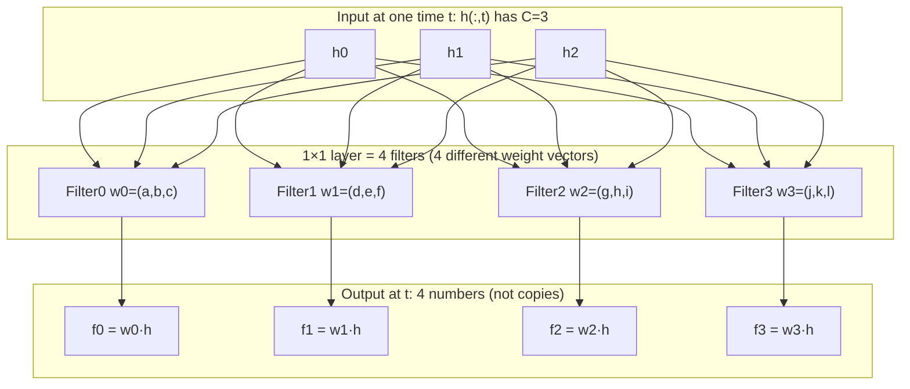
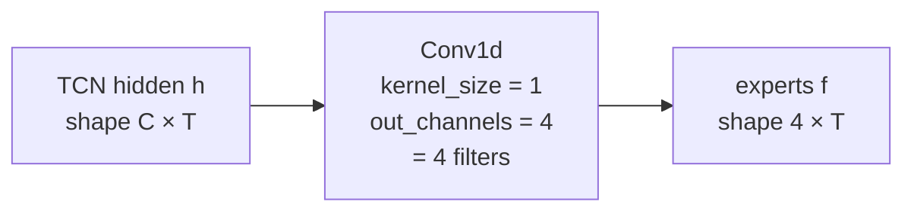
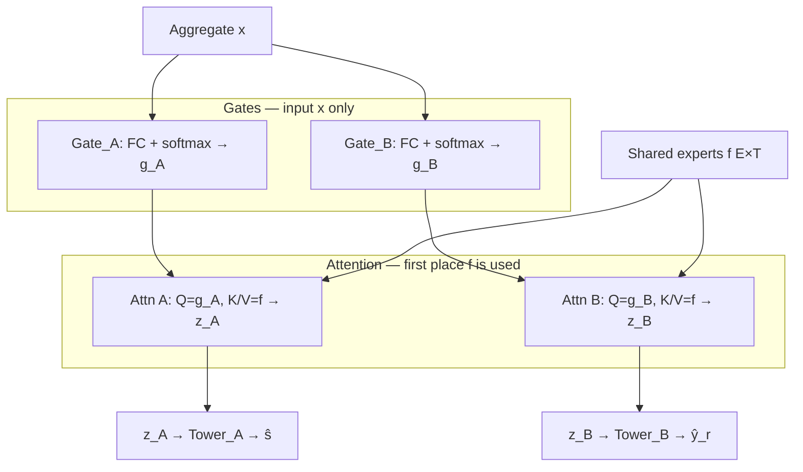

# SAMNet architecture notes (Section B)

Paper: *SAMNet: Toward Latency-Free Non-Intrusive Load Monitoring via Multi-Task Deep Learning* (IEEE TSG, 2022).

This note explains **§B Network Architecture** (Fig. 3): the four blocks and how they connect for joint **state detection** + **energy disaggregation**.

---

## Goal of the architecture

Build a **latency-free** NILM model that does two related tasks at once:

1. **State detection** — is the appliance ON/OFF at each time?
2. **Energy disaggregation** — what is its power \(y(t)\)?

Instead of two independent nets, SAMNet uses **multi-task sharing** (inspired by **MMoE**: Multi-gate Mixture-of-Experts) so the two tasks share low-level features but keep task-specific heads.

---

## Four parts (Fig. 3)

| Symbol | Name | Role |
|--------|------|------|
| \(F(x,\theta_f)\) | **Experts learner** | Shared bottom: extract \(E\) “expert” feature streams from aggregate \(x\) |
| \(G(x,\theta_g)\) | **Gate** | Per-task scores from **aggregate \(x\)** (not from \(f\)); then attention fuses with experts \(f\) |
| \(H(\cdot,\theta_h)\) | **Tower** | Task-specific head → \(\hat s\) (state) or \(\hat y_r\) (raw power) |
| \(C(x,w)\) / \(C(y)\) | **Automatic ON/OFF marking** | Turn continuous appliance power \(y\) into soft state labels for training (no hand threshold \(\tau\)) |

High-level data flow:

```text
              aggregate window x
                 │         │
        ┌────────┘         └────────┐
        ▼                           ▼
┌───────────────────┐      Gate_A / Gate_B
│ Experts F (dilated│      (FC+softmax on x)
│ TCN shared bottom)│             │
└─────────┬─────────┘             ▼
          │                  g_A , g_B
          ▼                       │
     f ∈ R^{E×T}                  │
          │                       │
          └──────────┬────────────┘
                     ▼
           Attention (Eq. 8): Q=g_j, K/V=f
                     │
              ┌──────┴──────┐
              ▼             ▼
            z_A           z_B
              │             │
           Tower_A       Tower_B
              │             │
              ▼             ▼
            ŝ = σ(·)     ŷ_r
              │             │
              └──────┬──────┘
                     ▼
              ŷ_out = ŷ_r ⊙ ŝ     (SGN-style product; Eq. 15)
```

**Important:** Gate \(G\) reads **\(x\)**, not expert features \(f\). \(f\) enters only at the attention fusion after \(g_j\) is computed.

---

## 1) Experts learner \(F\) — detailed explanation

Paper quote (paraphrased): because state detection and energy disaggregation are strongly correlated, SAMNet first uses **shared layers**. A **dilated TCN** produces expert features

\[
f = F(x,\theta_f),\qquad f \in \mathbb{R}^{E \times T}
\]

where \(E\) is the number of experts and \(T\) is the time length of the window.

### What goes in?

| | |
|--|--|
| **Input \(x\)** | **1D aggregate (mains) power** over a sliding window, length \(T\) (paper uses \(T=600\)) |
| **Not** | Appliance labels, not separate per-appliance waveforms at this stage |

So yes: Experts Learner receives the **household total / aggregate power sequence** (1D time series), same role as your MultiNILM backbone input (before heads).

### What the fuck is an “expert”? (plain English)

**“Expert” here is marketing jargon from Mixture-of-Experts papers. It is NOT a separate little brain.**

| You might think                         | What it actually is                                                   |
| -----------------------------------------| -----------------------------------------------------------------------|
| 4 different models that each specialize | **4 output channels** of the **same** dilated TCN                     |
| Magical different networks              | Same weights, same input \(x\); last layer just has **\(E\) filters** |
| Classification + regression heads       | **No** — still only features                                          |

So for \(E=4\):

```text
x (1 × T)  →  Dilated TCN stack  →  1×1 conv with 4 filters  →  f (4 × T)
```

#### How can \(1\times1\) become 4? What is a filter?

**`kernel_size=1`** only means: **do not mix left/right time neighbors**.  
At each time \(t\), look only at the feature vector **at that same \(t\)**.

It does **not** mean “only 1 output”.  
**How many outputs = how many filters = `out_channels`.**

**Filter** = one learnable weight vector (length = input channel count \(C\)).  
Dot with \(h(:,t)\) → one number for that expert at time \(t\).

Example at one time \(t\) (draw \(C=3\) hidden channels → 4 experts):



Over the whole window:



```python
# h: (batch, C, T)
f = nn.Conv1d(in_channels=C, out_channels=4, kernel_size=1)(h)
# f: (batch, 4, T)
```

| Word | Meaning here |
|------|----------------|
| **1×1 / k=1** | no time mixing in this layer |
| **filter** | one weight vector → one output channel |
| **4 filters** | 4 channels = 4 “experts” |
| **same input \(h\)** | yes shared; **different \(w\)** → different values |

**Is it “just a TCN stack”?**  
Roughly **yes**: one shared dilated TCN, last proj to \(E\) channels. “Experts” = those channels; gates later soft-weight them for state vs power.

```text
NOT:  [TCN_A][TCN_B][TCN_C][TCN_D]  four separate models
YES:  [one dilated TCN] --f (E channels)--+--> attention with g_j --> Tower
                           aggregate x ----+--> Gate (g_j only; no f in)
```

---

### Does Experts Learner output regression and classification?

**No.**

| Stage | Output | Classification? | Regression? |
|-------|--------|-----------------|-------------|
| **Experts \(F\)** | \(f \in \mathbb{R}^{E\times T}\) shared features | ❌ | ❌ |
| Gate + Tower A | \(\hat s\) | ✅ ON/OFF probs | ❌ |
| Gate + Tower B | \(\hat y_r\) | ❌ | ✅ raw power |
| After product | \(\hat y_{\mathrm{out}}=\hat y_r\odot\hat s\) | — | ✅ gated power |

Experts Learner is only the **shared feature extractor**.  
Classification and regression happen **later**, in **two towers**. Each tower gets \(z_j\) from attention that mixes that task’s \(g_j\) (from \(x\)) with the shared \(f\).

### Why dilated TCN instead of FC (vs classic MMoE)?

- Classic **MMoE** often uses **fully connected** experts → each time step (or pooled vector) mixed independently; weak long-range temporal view unless you add RNN.
- **SAMNet** uses **dilated TCN** so each expert can **see a long history** with causal/dilated receptive field, and train **in parallel** (unlike sequential RNNs).
- Shared bottom + gating also aims at **lower multi-task cost** than two full separate nets, with sparsity in how gates use experts.

### One-sentence takeaway

**Experts Learner = 1 shared dilated TCN on 1D aggregate power → \(E\) (e.g. 4) expert feature maps over time; it does *not* emit class/reg outputs — those come from Gate+Tower after this block.**

---

## 2) Gate \(G\) — detailed explanation

Experts produce shared features \(f \in \mathbb{R}^{E\times T}\) (e.g. 4 channels).  
**Gate’s job:** for each task, produce scores \(g_j\) that later mix those experts — **without feeding \(f\) into the gate network**.

### Critical: Gate input is \(x\), not \(f\)

| Step | Input | Output | Uses expert \(f\)? |
|------|-------|--------|---------------------|
| **Eq. (7) Gate** \(G\) | aggregate **\(x\)** | \(g_j \in \mathbb{R}^{E\times T}\) | **No** |
| **Eq. (8) Attention** | \(g_j\) + **\(f\)** | \(z_j\) | **Yes** (as K/V) |

```text
x ──► Gate (FC+softmax) ──► g_j ──┐
                                   ├── attention ──► z_j
f (experts) ───────────────────────┘
```

Do **not** draw \(f \to\) Gate. Paper writes \(g_j = G(x,\theta_g^j)\).

### Why two gates?

Two tasks:

| \(j\) | Task | Gate |
|-------|------|------|
| \(A\) | state detection (ON/OFF) | \(G_A\) |
| \(B\) | energy disaggregation (power) | \(G_B\) |

State and power may need **different** mixtures of the same experts  
(e.g. state cares about “jump edges”; power cares about “level”).  
So **two gates, two sets of parameters** — flexible multi-task sharing (MMoE idea).

### Step 1 — Gate scores from \(x\) (Eq. 7)

\[
g_j = G(x,\theta_g^j),\qquad g_j \in \mathbb{R}^{E\times T}
\]

Paper: gate = **FC + softmax** over the **expert dimension** (output size \(E\) per time), **driven by aggregate \(x\)**.

At each time \(t\), for task \(j\):

\[
g_j(1,t)+g_j(2,t)+\cdots+g_j(E,t)=1
\]

So \(g_j(:,t)\) is a **probability distribution over \(E\) experts** at time \(t\):  
“for this task, how much weight on expert 0,1,2,3?” — decided from \(x\), not from looking at \(f\).

```text
              x
         ┌────┴────┐
         ▼         ▼
      Gate_A    Gate_B     ← different θ; input = x only
         │         │
         ▼         ▼
        g_A       g_B       ← each is E×T, softmax over E experts per t
```

### Step 2 — Fuse \(g_j\) with experts \(f\) via attention (Eq. 8)

**Only here** does \(f\) enter. Naive MMoE would do a weighted sum of experts with \(g\); SAMNet uses **scaled dot-product attention**:

| Attention role | What they use |
|----------------|---------------|
| **Query \(Q\)** | gate \(g_j\) (after \(W_Q\)) — scores from \(x\) |
| **Key \(K\)** | experts \(f\) (after \(W_K\)) |
| **Value \(V\)** | experts \(f\) (no \(W_V\) in the paper formula) |

\[
z_j = \mathrm{softmax}\!\left(\frac{(g_j W_Q)\,(f W_K)^\top}{\sqrt{d_k}}\right) f
\]

- Softmax → attention weights; multiply onto \(f\) → task-specific \(z_j \in \mathbb{R}^{E\times T}\).  
- \(\sqrt{d_k}\): standard scale so softmax does not saturate.  
- Attention lets the fusion see the **whole sequence** when combining \(g_j\) with \(f\).



### What Gate does **not** do

| Gate (Eq. 7) does | Gate does **not** |
|-------------------|-------------------|
| Map **\(x \to g_j\)** (FC+softmax) | Take expert features \(f\) as input |
| Output soft weights over \(E\) experts | Output final ON/OFF or watts |
| Feed \(g_j\) into attention with \(f\) | Replace the Experts TCN |

Final class/reg still come from **Towers** on \(z_A,z_B\), then \(\hat y_{\mathrm{out}}=\hat y_r\odot\hat s\).

### One-sentence takeaway

**Gate = \(x\to g_j\) (FC+softmax; no \(f\)); then attention mixes \(g_j\) with expert \(f\) into \(z_j\) for the tower — still features, not the final prediction.**

---

## 3) Tower \(H\)

- **Why:** After sharing + gating, each task still needs its own predictor.
- **What:** Small **two-layer FC towers**:

\[
\hat s = \sigma\!\big(H_A(z_A,\theta_h^A)\big)
\qquad
\hat y_r = H_B(z_B,\theta_h^B)
\]

- \(\hat s(t) \in (0,1)\): predicted ON probability  
- \(\hat y_r(t)\): unconstrained (or regression) power before state gating  

---

## 4) Automatic ON/OFF marking \(C\)

**Problem they criticize:** Many multi-task NILM papers build state labels by **hand threshold** on appliance power \(y\):

\[
s(t)=\mathbf{1}\{y(t)>\tau\}
\]

Different \(\tau\) → different labels → brittle.

**Their \(C\):** map power to a **soft** ON probability with sigmoid (and a small offset \(\epsilon\) to ignore tiny noise):

\[
P(s(t)=\mathrm{on}\mid y(t)) = \sigma(y(t)-\epsilon)
\]

That soft label is used as supervision for the state tower (instead of a hard arbitrary watt threshold).  
(\(C(x,w)\) in the intro naming is this automatic marking path from appliance power; in the equations it is written as \(\sigma(y-\epsilon)\).)

---

## How the two tasks combine at the output

Same idea as **SGN** (subtask gated network):

\[
\hat y_{\mathrm{out}} = \hat y_r \odot \hat s
\]

- If \(\hat s\approx 0\) (OFF), final power is forced near 0.  
- If \(\hat s\approx 1\) (ON), final power ≈ regression head.

**Loss** (Section C, for context):

\[
L = \lambda L_c + L_r
\]

- \(L_c\): BCE between automatic/soft state labels and \(\hat s\)  
- \(L_r\): MSE between true \(y\) and **gated** \(\hat y_{\mathrm{out}}=\hat y_r\odot\hat s\)

So gradients couple classification and regression through the product gate.

---

## One-sentence summary

**SAMNet = dilated-TCN mixture-of-experts (shared) + per-task attention gates + two towers (state & power) + soft auto state labels from \(y\), with final power = regression ⊙ state — multi-task sharing for latency-free NILM, not a separate UDA module.**

---

## Relation to our MultiNILM (quick)

| SAMNet | MultiNILM (typical) |
|--------|---------------------|
| Shared dilated experts \(F\) | Shared stem + TCN backbone |
| Per-task gate + attention | Soft/hard state gate on power head (SGN-like) |
| Towers \(H_A,H_B\) | Per-appliance `state_head` + `power_head` |
| Soft \(\sigma(y-\epsilon)\) labels | Usually **hard threshold** from experiment yaml |
| Multi-task BCE+MSE on gated power | Same family of losses |

Useful ideas to steal: **attention-gated experts**, **soft auto state labels** (less brittle than fixed \(\tau\)), keep **\(\hat y\odot\hat s\)** coupling. Cross-dataset “transfer” in the paper is still **train then test**, not unsupervised DA.
