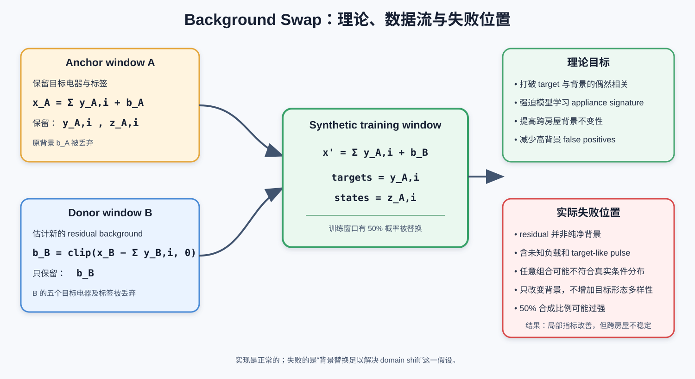

# MultiNILM 复杂度清单与逐步简化方案

# English PPT Summary


## Slide 1 — Why Is MultiNILM Too Complicated?

The system combines too many mechanisms at the same time:

- **Input:** 13 handcrafted channels from raw, delta, rolling and fractional features.
- **Architecture:** multiscale CNN, IBN, dilated TCN, task attention, relation attention and five appliance heads.
- **Output:** separate power/state predictions with a soft state-power gate.
- **Training:** seven active loss components, dynamic task balancing and random/background mixing.
- **Inference:** threshold calibration, temporal filtering, a second hard power gate and power clipping.

## Slide 2 — Why Is This a Problem?

- Several components perform overlapping functions.
- Multiple changes cannot be attributed to one clear cause.
- Dynamic loss balancing makes the effective state weight change continuously.
- Soft gating during training and hard gating during evaluation modify power twice.
- Better final metrics may come from postprocessing rather than genuine model learning.
- Failed additions—dual expert, background head and hard-negative mining—made the code larger without stable cross-house gains.

## Slide 3 — Current Evidence

- Training loss keeps falling while validation performance plateaus: the model still overfits the training distribution.
- Fridge and microwave remain sensitive to unseen background patterns.
- Background swap gives some local FPR improvements but is inconsistent across REFIT 20 and UK-DALE 2.
- Removing all auxiliary losses at once damaged waveform quality, so simplification must be performed one component at a time.

## Slide 4 — What Should We Do Next?

1. **Audit postprocessing without retraining:** remove temporal filtering, hard power gating and calibration one at a time.
2. **Return to the relation baseline:** keep dual expert, background head, hard-negative mining and smoothing disabled.
3. **Simplify the loss one term at a time:** relative energy → delta → OFF-MSE → FP penalty; remove ON-MSE last.
4. **Simplify input features:** rolling std → rolling mean → fractional channels → absolute delta → delta.
5. **Simplify the architecture:** task attention → one local head block → IBN → multiscale stem → fewer TCN blocks.
6. **Test relation attention last**, because it is the main multi-appliance interaction and previously helped microwave performance.

## Slide 5 — Target Minimal Model

```text
Raw aggregate
    → Simple convolution stem
    → Shared dilated TCN
    → Five appliance-specific power/state heads
    → Relation attention only if ablation proves it useful
    → One clearly defined power/state gate
```

Use a compact objective:

$$
L=\sum_i\left(L_{MSE,i}+\lambda_{ON}L_{ON,i}+\lambda_{state}L_{BCE,i}\right).
$$

**Immediate next experiment:** evaluate the existing best checkpoint with postprocessing progressively disabled. This requires no retraining and reveals how much performance comes from the model itself.

---

## 1. 结论

当前 MultiNILM 同时叠加了输入特征、复杂网络结构、多项损失、数据增强和推理后处理。问题不只是参数多，而是多个组件同时影响相同目标，使实验结果难以解释。

必须区分两个配置：

- `multinilm_fractional_relational.yaml`：默认 relation 模型。
- `multinilm_fractional_relational_background_swap.yaml`：包含 dual expert、background swap 和 hard-negative 的复杂实验模型。

其中 dual expert、background head、hard-negative 和 state smoothing 并不是默认 relation 模型全部开启的功能。

## 2. 当前完整流水线

```text
Aggregate power
    ↓
Z-score normalization
    ↓
1024-point windows, stride 512
    ↓
Random full mix / background swap
    ↓
13-channel handcrafted features
    ↓
Multiscale convolution stem
    ↓
IBN + staged CNN: 32 → 64 → 128
    ↓
5-block dilated TCN
    ↓
[optional] Dual expert
    ↓
Five appliance-specific task-attention heads
    ↓
Cross-appliance relation attention
    ↓
Power head + State head
    ↓
Soft power/state gate
    ↓
Multiple losses + dynamic task balancing
    ↓
Overlap reconstruction
    ↓
Threshold calibration
    ↓
Minimum-ON filtering + gap merging
    ↓
Hard state mask applied to power
    ↓
5 W cutoff + power clipping
```

## 3. 数据和输入处理

| 组件 | 默认 relation | 最新复杂实验 |
|---|---:|---:|
| 8 秒采样 | 开 | 开 |
| CSV ON/OFF 标签 | 开 | 开 |
| Aggregate z-score | 开 | 开 |
| 每个电器单独进行 power z-score | 开 | 开 |
| 输入和输出长度 1024 | 开 | 开 |
| Stride 512 | 开 | 开 |
| Full random mix，概率 0.5 | 开 | 关 |
| Background swap，概率 0.5 | 关 | 开 |

注意：默认配置的 `experiment_id` 是 `background_swap_8w_1`，但实际配置为 `random_mix.mode: full`。实验名称与实际增强方法不一致。

## 4. Fractional frontend

原始单通道 aggregate 被扩展为 13 个输入通道：

| 特征 | 通道数 |
|---|---:|
| Raw aggregate | 1 |
| 一阶差分 | 1 |
| 绝对差分 | 1 |
| Rolling mean：8、23、45 | 3 |
| Rolling standard deviation：8、23、45 | 3 |
| GL fractional derivatives | 4 |
| 总计 | **13** |

这些特征之间存在明显重叠：

- Delta 和 fractional derivative 都描述时间变化。
- Rolling mean 与卷积网络的低频特征提取重叠。
- Rolling std、absolute delta 都描述局部变化强度。
- Multiscale stem 又重复进行多尺度特征提取。

## 5. 网络结构

| 组件 | 默认 relation | 最新复杂实验 |
|---|---:|---:|
| Multiscale stem，kernel 3/5/9 | 开 | 开 |
| Staged CNN：32→64→128 | 开 | 开 |
| Stem IBN | 开 | 开 |
| Temporal BatchNorm | 开 | 开 |
| ReLU | 开 | 开 |
| Dropout 0.25 | 开 | 开 |
| 5-block dilated TCN | 开 | 开 |
| Dilations 1/2/4/8/16 | 开 | 开 |
| 每个电器两个 local Conv blocks | 开 | 开 |
| Local residual connection | 开 | 开 |
| Task attention | 开 | 开 |
| Relation attention | 开 | 开 |
| Dual expert | 关 | 开 |
| Background head | 关 | 关 |
| 每个电器 Power head | 开 | 开 |
| 每个电器 State head | 开 | 开 |
| Soft power/state gate | 开 | 开 |

代码中还存在若干当前未使用的分支：

- Cross-appliance bottleneck 模式；
- hard gate；
- soft-train/hard-eval gate；
- ungated power 模式；
- background head；
- dual expert。

## 6. 当前损失函数

功率损失为：

$$
L_{power}=\sum_i\left[
L_{MSE,i}
+L_{ON,i}
+0.5L_{OFF,i}
+0.15L_{\Delta,i}
+0.25L_{energy,i}
\right].
$$

状态损失为：

$$
L_{state}=\sum_i\left[
L_{BCE,i}^{pos\ weight}+L_{FP,i}
\right].
$$

动态平衡后的训练目标为：

$$
L=L_{power}+0.8L_{state}
\operatorname{stopgrad}\left(\frac{L_{power}}{L_{state}}\right).
$$

当前实际启用的组成包括：

1. 普通 power MSE；
2. ON-only MSE；
3. OFF-only MSE；
4. Delta MSE；
5. Relative energy loss；
6. Pos-weighted BCE；
7. False-positive penalty；
8. Dynamic task balance。

默认 relation 模型关闭了以下损失：

- State smoothing；
- Hard-negative loss；
- Background loss；
- Aggregate reconstruction loss。

动态平衡导致：

$$
L_{state\ term}=0.8L_{power},
$$

所以日志中的：

$$
L_{NILM}=1.8L_{power}.
$$

因此，`L_NILM` 曲线主要反映 power loss，不能单独用于判断 state head 是否仍在学习。

## 7. 训练策略

当前还包含：

- Adam optimizer；
- weight decay；
- dropout；
- gradient clipping；
- ReduceLROnPlateau；
- `MAE + (1-AP)` composite checkpoint score；
- early stopping；
- minimum training epochs；
- random mix 或 background swap。

Checkpoint、scheduler 和 early stopping 都依赖 composite score。因此，被保存为 best 的模型不一定是 microwave AP 最高或 fridge 高背景 FPR 最低的模型。

## 8. 推理和后处理

当前预测不是模型输出后直接计算指标，而是经过以下步骤：

1. Overlap-window averaging；
2. 在 validation 上为每个电器搜索最佳 state threshold；
3. Threshold 搜索目标为 F1；
4. 删除过短的 ON period；
5. 合并间隔较短的 ON period；
6. 使用处理后的 binary state mask 再次裁剪 power；
7. 小于 5 W 的功率设为零；
8. 负功率设为零；
9. 使用每个电器的最大功率上限 clipping。

当前 temporal postprocessing 参数：

| Appliance | 最短 ON | 合并间隔 |
|---|---:|---:|
| Kettle | 12 s | 0 s |
| Fridge | 120 s | 240 s |
| Dishwasher | 960 s | 1800 s |
| Washing machine | 960 s | 960 s |
| Microwave | 8 s | 16 s |

特别注意：功率被 gate 两次。

模型内部：

$$
\hat y=p_{ON}\hat y_{raw}.
$$

推理阶段：

$$
\hat y_{final}=\hat z_{calibrated}\hat y.
$$

第一次是 soft gate，第二次是 calibrated hard gate。

## 9. 建议的逐项删减顺序

### 阶段 0：清理失败或未启用的分支

这些组件不在默认 relation 模型中运行，移除它们不会改变默认模型输出：

1. Background head；
2. Background/reconstruction loss；
3. Dual expert；
4. Hard-negative mining；
5. State smoothing；
6. 未使用的 cross-appliance bottleneck 模式。

已有实验没有为这些组件提供稳定的正面证据。

### 阶段 1：先检查后处理，不重新训练

使用同一个 checkpoint：

| 实验 | 唯一改变 |
|---|---|
| P0 | 当前完整后处理 |
| P1 | 关闭 min-ON 和 merge-gap |
| P2 | 在 P1 基础上关闭 `apply_to_power` |
| P3 | 在 P2 基础上关闭 5 W cutoff 和 power clipping |
| P4 | 使用固定 0.5 threshold，不进行 threshold calibration |

判断方法：

- AP 应保持不变；如果 AP 改变，说明 evaluation pipeline 存在问题。
- F1 的变化表示 calibration 和 temporal filtering 的贡献。
- MAE 的变化表示 hard power gate 的贡献。
- Waveform 用于观察模型本身是否真正预测正确。

### 阶段 2：简化损失

不要一次删除所有辅助损失。建议逐项删除：

1. Relative-energy loss；
2. Delta loss；
3. OFF-MSE；
4. FP loss；
5. 最后才删除 ON-MSE。

ON-MSE 最后处理，因为之前的实验已经显示，删除它会降低 waveform quality 和 ON-MAE。

Dynamic task balance 必须作为独立实验。固定权重不能直接继续使用 `lambda_state: 0.8`。可从已有日志估计：

$$
\lambda_{fixed}=\operatorname{median}\left(
0.8\frac{L_{power}}{L_{state}}
\right).
$$

### 阶段 3：简化输入特征

逐项关闭：

1. Rolling std；
2. Rolling mean；
3. Fractional derivatives；
4. Absolute delta；
5. Delta。

最终得到 raw aggregate only，用实验确定这些人工特征是否真的有贡献。

### 阶段 4：简化网络结构

建议顺序：

1. 关闭 task attention；
2. 每个 appliance 的 local blocks 从两个减为一个；
3. IBN 改为普通 BatchNorm；
4. 关闭 multiscale stem；
5. TCN blocks 从五个减为三个；
6. 最后才测试关闭 relation attention。

Relation attention 最后删除，因为已有 no-relation 实验显示 microwave 和高背景表现下降。它也是目前最符合 multi-appliance interaction 创新点的组件。

### 阶段 5：比较数据增强

只比较三个清晰版本：

1. No augmentation；
2. Full random mix；
3. Background swap。

三个实验必须使用相同 architecture、loss、seed、训练集和 evaluation protocol。

## 10. 建议保留的最小 MultiNILM

```text
Raw aggregate
    ↓
Simple convolution stem
    ↓
Shared dilated TCN
    ↓
Five appliance-specific heads
    ↓
Relation attention（仅在消融证明有效时保留）
    ↓
Power + state outputs
    ↓
Soft gate
```

初始核心损失建议为：

$$
L=\sum_i\left[
L_{MSE,i}
+\lambda_{ON}L_{ON,i}
+\lambda_{state}L_{BCE,i}
\right].
$$

该版本仍然是 multi-appliance、同时预测 power 和 state，但比当前系统容易解释和复现。

## 11. 下一步

第一步不应该重新训练，而应该使用现有 checkpoint 完成 P0–P4 后处理消融。它首先回答：

> 当前性能究竟来自模型学习，还是来自 threshold calibration、temporal filtering 和二次 power gating？

确定后处理贡献以后，再开始一次只删除一个训练组件。

---

# Background Swap 专题：PPT 式说明

## Slide 1 — 它要解决什么问题？

NILM 的 aggregate 可以写成：

$$
x(t)=\sum_{i=1}^{A} y_i(t)+b(t),
$$

其中：

- $x(t)$ 是家庭总功率；
- $y_i(t)$ 是第 $i$ 个目标电器；
- $b(t)$ 是未建模电器、测量误差和其他 residual background。

在真实训练数据里，目标电器与背景不是独立的。例如某个训练房屋的 fridge 经常在特定基础负载下启动，模型可能学习：

> “看到这个背景形状，就预测 fridge ON。”

而不是学习真正的 fridge 启动边缘和稳定运行功率。这是 background shortcut 或 spurious correlation。

Background swap 的目标是打破这种偶然关系，让相同的目标电器波形出现在不同背景之上。

## Slide 2 — 核心概念图



核心操作是：

$$
x'_A(t)=\sum_i y_{A,i}(t)+b_B(t).
$$

目标 power 和 state labels 仍来自 anchor window A：

$$
y'_i(t)=y_{A,i}(t),\qquad z'_i(t)=z_{A,i}(t).
$$

只有背景从 window B 取得。

## Slide 3 — Background 是如何计算的？

代码没有真实的 background submeter，因此使用 residual：

$$
b(t)=\max\left(x(t)-\sum_i y_i(t),0\right).
$$

`max(·,0)` 或 `clip(..., 0, None)` 用于处理 aggregate 小于 submeter sum 的情况。这种情况可能来自时间错位、测量误差或不同传感器的采样差异。

代码流程：

1. 从 anchor window A 取得五个目标电器和 labels；
2. 随机选择 donor window B；
3. 计算或读取 B 的 residual background；
4. 丢弃 A 的原背景；
5. 计算 `sum(target appliances from A) + background from B`；
6. 使用训练集 normalization statistics 重新标准化 synthetic aggregate；
7. 保持 A 的 power targets 和 ON/OFF labels 不变。

实现位置：

- `multi_appliances_NILM/data/dataloader.py`，`_background_swap_window()`；
- 只在 training split 使用；
- validation 和 test 的 mixing probability 强制为零。

## Slide 4 — 训练时多久执行一次？

实际保存的配置为：

```yaml
training:
  random_mix:
    enabled: true
    mode: background_swap
    prob: 0.5
```

因此每次 `__getitem__` 读取训练 window 时：

- 50% 概率保留真实 window；
- 50% 概率生成 background-swapped window；
- 每个 epoch 可以得到不同的随机组合；
- synthetic windows 不会预先保存到 dataset 文件。

## Slide 5 — 与 Full Random Mix 的区别

| 项目 | Background swap | Full random mix |
|---|---|---|
| 五个目标电器 | 全部保留自同一个 anchor window | 每个电器独立从不同 window 抽取 |
| Background | 从另一个 donor window 抽取 | 独立从另一个 window 抽取 |
| 原有电器共现关系 | 保留 | 打破 |
| 主要目标 | 背景不变性 | 背景和电器共现关系同时去相关 |
| 合成强度 | 较保守 | 更强 |

Background swap 只处理 target-background correlation；full random mix 同时处理 appliance-appliance correlation。

## Slide 6 — 理论上为什么可能有效？

希望模型满足：

$$
f\left(\sum_i y_i+b_A\right)
\approx
f\left(\sum_i y_i+b_B\right).
$$

也就是说，当目标电器保持不变、背景改变时，输出也应保持不变。

从机器学习角度，它相当于：

- nuisance-variable augmentation；
- 打破背景 shortcut；
- 扩大训练输入分布；
- 对 background/domain shift 进行正则化；
- 迫使模型更加依赖目标电器自身的局部与时间特征。

## Slide 7 — 这个理论依赖哪些假设？

Background swap 只有在以下假设大致成立时才可靠：

1. Aggregate 满足近似线性相加；
2. 五个目标 submeter 与 aggregate 时间同步；
3. Residual 主要代表真正的非目标背景；
4. Donor background 不包含错误的目标电器能量；
5. Anchor appliances 与 donor background 的组合在真实家庭中合理；
6. Synthetic aggregate 不会严重偏离真实训练分布；
7. 模型失败主要来自背景，而不是 target signature 本身变化。

当前项目不能完全满足这些假设。

## Slide 8 — 实验结果保存在哪里？

真正的 background-swap 结果目录：

`C:\Users\Raymond Tie\Desktop\PhD\Code\multi-domain NILM\high_low_freq_NILM\background_swap_8w\multinilm_fractional`

关键文件：

- `config_merged.yaml`：证明实际使用 `mode: background_swap`；
- `history.csv`：训练和验证历史；
- `validation_metrics.csv`：最终 validation 指标；
- `comparisons/test_scenarios_metrics.csv`：REFIT 20 和 UK-DALE 2 指标；
- `metrics_by_epoch/`：不同 epoch 的测试结果；
- `test/refit_house20/`：REFIT 20 波形和指标；
- `test/ukdale_house2/`：UK-DALE 2 波形和指标。

用于比较的 full-random-mix 结果目录：

`C:\Users\Raymond Tie\Desktop\PhD\Code\multi-domain NILM\high_low_freq_NILM\background_swap_8w_1\multinilm_fractional`

注意：这个目录名虽然包含 `background_swap`，其 `config_merged.yaml` 实际记录的是 `mode: full`。

## Slide 9 — Overall 定量结果

| Split | Metric | Background swap | Full random mix | 判断 |
|---|---:|---:|---:|---|
| Validation | MAE | 14.535 | 15.289 | Swap 较好 |
| Validation | AP | 0.783 | 0.776 | Swap 略好 |
| Validation | F1 | 0.729 | 0.721 | Swap 略好 |
| Validation | FPR | 0.0525 | 0.0618 | Swap 较好 |
| REFIT 20 | MAE | 10.969 | 10.729 | Swap 较差 |
| REFIT 20 | AP | 0.687 | 0.721 | Swap 较差 |
| REFIT 20 | F1 | 0.647 | 0.705 | Swap 明显较差 |
| UK-DALE 2 | MAE | 7.183 | 6.917 | Swap 较差 |
| UK-DALE 2 | AP | 0.937 | 0.922 | Swap 较好 |
| UK-DALE 2 | F1 | 0.850 | 0.854 | 基本相同 |

结果不是全面失败，也不是稳定成功：validation 有小幅改善，但跨房屋测试结果不一致。

## Slide 10 — Fridge 和 Microwave 结果

| Test | Appliance | Metric | Background swap | Full mix | 变化 |
|---|---|---:|---:|---:|---|
| REFIT 20 | Fridge | AP | 0.745 | 0.721 | 改善 |
| REFIT 20 | Fridge | FPR | 0.374 | 0.433 | 改善 |
| REFIT 20 | Fridge | F1 | 0.699 | 0.712 | 略差 |
| REFIT 20 | Microwave | AP | 0.488 | 0.498 | 略差 |
| REFIT 20 | Microwave | F1 | 0.518 | 0.529 | 略差 |
| UK-DALE 2 | Fridge | AP | 0.968 | 0.975 | 略差 |
| UK-DALE 2 | Fridge | FPR | 0.094 | 0.107 | 改善 |
| UK-DALE 2 | Microwave | AP | 0.792 | 0.709 | 明显改善 |
| UK-DALE 2 | Microwave | F1 | 0.674 | 0.643 | 改善 |

它确实在部分情况下减少 false positives，并明显改善 UK-DALE 2 microwave，但没有在 REFIT 20 重现同样效果，因此不能声称已经解决跨背景泛化。

REFIT 20 washing machine 的 F1 从 full mix 的 0.767 降至 background swap 的 0.506，说明它还可能损害其他电器。

## Slide 11 — 为什么它没有解决问题？

### 原因 1：Residual 不等于纯背景

$$
b=x-\sum_i y_i
$$

会混合以下内容：

- 未监测电器；
- aggregate/submeter 时间错位；
- 测量噪声；
- 漏记或不完整的目标事件；
- 与 fridge/microwave 很相似的未知负载。

因此 donor background 可能包含一个 microwave-like pulse，但 synthetic label 仍然写 microwave OFF。这会形成困难甚至错误的负样本。

### 原因 2：它制造的是数学可加，不一定是现实合理

虽然 synthetic aggregate 满足加法关系，但任意 anchor 与 donor 的组合可能破坏：

- 房屋的基础负载分布；
- 时间和occupancy关系；
- 电器之间的真实共现规律；
- 电压和房屋相关的功率尺度；
- 背景强度与目标工作状态的条件关系。

所以“物理上可以相加”不等于“统计上来自真实家庭分布”。

### 原因 3：只改变背景，没有增加 target signature 多样性

Fridge 和 microwave 的问题不完全是背景：

- 不同房屋 fridge 的启动尖峰、稳态功率和周期不同；
- microwave 事件非常短且类别严重不平衡；
- 未知负载可能与目标波形本身高度相似；
- 同一个目标在不同数据集中的幅值和边缘形态不同。

Background swap 反复使用原来的 target waveform，因此不能补充这些缺失的目标形态。

### 原因 4：50% 的合成比例可能过强

每个 epoch 约一半窗口变成 synthetic distribution。模型可能减少对真实 background shortcut 的依赖，但同时降低对真实联合分布的拟合能力。这可以解释 validation 略有改善，但 REFIT 20 部分电器下降。

### 原因 5：复杂模型和损失仍可继续记忆训练集

Background swap 只改变输入数据。它没有消除：

- 13-channel feature redundancy；
- multiscale stem；
- task attention；
- relation attention；
- 多项 power/state losses；
- dynamic task balance；
- threshold calibration 和 temporal postprocessing。

因此它不能独自解决整个系统的过拟合和不可解释性。

## Slide 12 — 为什么称为“实验目标失败”，而不是“代码失败”？

代码层面：

- 配置确实启用；
- 训练集确实按 50% 概率执行；
- 目标和 labels 保持一致；
- validation/test 没有被污染。

实验层面：

- 没有稳定改善两个测试房屋；
- 没有同时解决 fridge 和 microwave；
- 部分电器明显退化；
- 只有一个 seed；
- background-swap run 为 150 epochs，full-mix run 为 200 epochs，并非完全严格的控制实验。

所以准确结论是：

> Background swap 实现正常，并产生了一些局部收益；但“仅替换 residual background 就足以解决跨房屋背景 domain shift”这一假设没有得到实验支持。

## Slide 13 — 对当前简化工作的决定

当前不应把 background swap 作为默认核心组件。建议：

1. 简化主模型时先关闭 background swap；
2. 暂时以 full random mix 或 no augmentation 作为基线；
3. 先完成模型、损失和后处理消融；
4. 如果以后重新验证 background swap，必须保持相同 architecture、loss、seed、epoch 和 checkpoint selection；
5. 至少运行两个 seeds；
6. 主要检查 fridge/microwave AP、高背景 FPR 和 waveform，而不是只看 overall F1。

最终状态建议标记为：

**Background swap：implemented and tested, but not retained due to inconsistent cross-house gains.**
